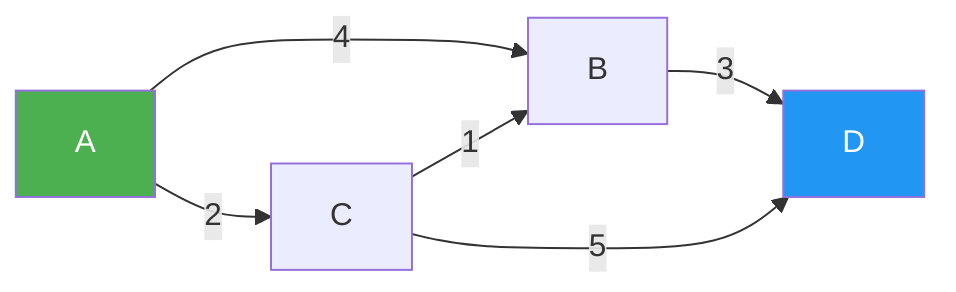
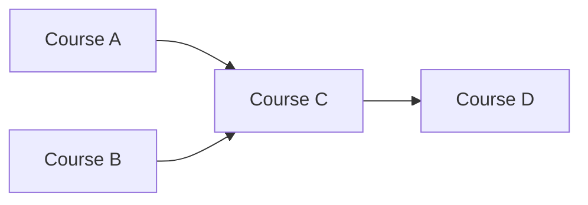
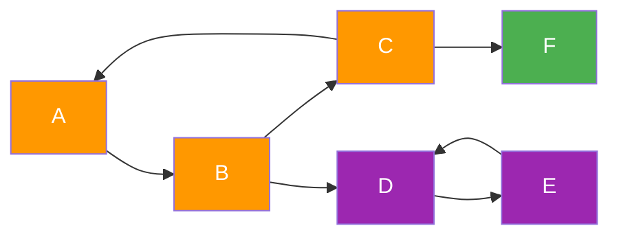

# Famous Algorithms

A curated reference of classic algorithms that appear repeatedly in technical interviews. Each entry includes time/space complexity, a multi-language template, and interview context.

---

## 1. Dijkstra's Shortest Path

**What it does:** Single-source shortest path on a graph with **non-negative** edge weights.  
**Time:** O(E log V) with a min-heap · **Space:** O(V + E)



*Shortest path A→D: A→C→B→D = 2+1+3 = 6*

=== "Python"

    ```python
    import heapq
    from collections import defaultdict
    from typing import Dict, List, Tuple

    def dijkstra(graph: Dict[int, List[Tuple[int, int]]], src: int) -> Dict[int, int]:
        dist = defaultdict(lambda: float('inf'))
        dist[src] = 0
        heap = [(0, src)]  # (distance, node)

        while heap:
            d, u = heapq.heappop(heap)
            if d > dist[u]:
                continue  # stale entry
            for v, w in graph[u]:
                if dist[u] + w < dist[v]:
                    dist[v] = dist[u] + w
                    heapq.heappush(heap, (dist[v], v))

        return dict(dist)

    # Example
    g = {0: [(1,4),(2,2)], 1: [(3,3)], 2: [(1,1),(3,5)], 3: []}
    print(dijkstra(g, 0))  # {0:0, 1:3, 2:2, 3:6}
    ```

=== "TypeScript"

    ```typescript
    function dijkstra(graph: Map<number, [number, number][]>, src: number): Map<number, number> {
        const dist = new Map<number, number>();
        // Min-heap: [distance, node]
        const heap: [number, number][] = [[0, src]];
        dist.set(src, 0);

        while (heap.length) {
            heap.sort((a, b) => a[0] - b[0]); // use a real heap in prod
            const [d, u] = heap.shift()!;
            if (d > (dist.get(u) ?? Infinity)) continue;
            for (const [v, w] of (graph.get(u) ?? [])) {
                const nd = d + w;
                if (nd < (dist.get(v) ?? Infinity)) {
                    dist.set(v, nd);
                    heap.push([nd, v]);
                }
            }
        }
        return dist;
    }
    ```

=== "Java"

    ```java
    import java.util.*;

    public class Dijkstra {
        public int[] shortestPath(int n, List<int[]>[] graph, int src) {
            int[] dist = new int[n];
            Arrays.fill(dist, Integer.MAX_VALUE);
            dist[src] = 0;
            // PriorityQueue: [distance, node]
            PriorityQueue<int[]> pq = new PriorityQueue<>(Comparator.comparingInt(a -> a[0]));
            pq.offer(new int[]{0, src});

            while (!pq.isEmpty()) {
                int[] curr = pq.poll();
                int d = curr[0], u = curr[1];
                if (d > dist[u]) continue;
                for (int[] edge : graph[u]) {
                    int v = edge[0], w = edge[1];
                    if (dist[u] + w < dist[v]) {
                        dist[v] = dist[u] + w;
                        pq.offer(new int[]{dist[v], v});
                    }
                }
            }
            return dist;
        }
    }
    ```

=== "Rust"

    ```rust
    use std::collections::BinaryHeap;
    use std::cmp::Reverse;

    pub fn dijkstra(graph: &Vec<Vec<(usize, u64)>>, src: usize) -> Vec<u64> {
        let n = graph.len();
        let mut dist = vec![u64::MAX; n];
        dist[src] = 0;
        let mut heap = BinaryHeap::new();
        heap.push(Reverse((0u64, src)));

        while let Some(Reverse((d, u))) = heap.pop() {
            if d > dist[u] { continue; }
            for &(v, w) in &graph[u] {
                let nd = dist[u].saturating_add(w);
                if nd < dist[v] {
                    dist[v] = nd;
                    heap.push(Reverse((nd, v)));
                }
            }
        }
        dist
    }
    ```

=== "C#"

    ```csharp
    using System.Collections.Generic;

    public class Dijkstra {
        public long[] ShortestPath(int n, List<(int v, int w)>[] graph, int src) {
            var dist = new long[n];
            Array.Fill(dist, long.MaxValue);
            dist[src] = 0;
            // SortedSet as a poor-man's priority queue
            var pq = new SortedSet<(long d, int u)>(Comparer<(long, int)>.Create(
                (a, b) => a.d != b.d ? a.d.CompareTo(b.d) : a.u.CompareTo(b.u)));
            pq.Add((0, src));

            while (pq.Count > 0) {
                var (d, u) = pq.Min; pq.Remove(pq.Min);
                if (d > dist[u]) continue;
                foreach (var (v, w) in graph[u]) {
                    long nd = d + w;
                    if (nd < dist[v]) { pq.Remove((dist[v], v)); dist[v] = nd; pq.Add((nd, v)); }
                }
            }
            return dist;
        }
    }
    ```

=== "Scala"

    ```scala
    import scala.collection.mutable

    def dijkstra(graph: Map[Int, List[(Int, Int)]], src: Int): Map[Int, Int] = {
      val dist = mutable.Map[Int, Int]().withDefaultValue(Int.MaxValue)
      dist(src) = 0
      // (distance, node)
      val pq = mutable.PriorityQueue[(Int, Int)]()(Ordering.by(-_._1))
      pq.enqueue((0, src))

      while (pq.nonEmpty) {
        val (d, u) = pq.dequeue()
        if (d <= dist(u))
          graph.getOrElse(u, Nil).foreach { case (v, w) =>
            val nd = d + w
            if (nd < dist(v)) { dist(v) = nd; pq.enqueue((nd, v)) }
          }
      }
      dist.toMap
    }
    ```

=== "ASM"

    ```asm
    ; Dijkstra — high-level x86-64 sketch
    ; Maintain dist[] array in memory, visited[] bitmask in register.
    ; Inner loop: for each neighbour (v, w) of u:
    ;   mov  rax, [dist_u]
    ;   add  rax, [weight_uv]      ; tentative = dist[u] + w
    ;   cmp  rax, [dist + v*8]
    ;   jge  .skip
    ;   mov  [dist + v*8], rax     ; relax
    ;   call push_heap              ; heap push (priority queue in data segment)
    ; .skip:
    ; Repeat until heap is empty (heap_size == 0).
    ```

!!! note "Interview Notes"
    - Must handle disconnected nodes (distance stays ∞)
    - Fails with negative weights — use Bellman-Ford instead
    - Common problems: [743 Network Delay Time](https://leetcode.com/problems/network-delay-time/){ target=_blank }, [1514 Path with Maximum Probability](https://leetcode.com/problems/path-with-maximum-probability/){ target=_blank }

---

## 2. Floyd-Warshall

**What it does:** All-pairs shortest path. Works with negative weights (but not negative cycles).  
**Time:** O(V³) · **Space:** O(V²)

=== "Python"

    ```python
    from typing import List

    INF = float('inf')

    def floyd_warshall(n: int, edges: List[List[int]]) -> List[List[float]]:
        dist = [[INF] * n for _ in range(n)]
        for i in range(n):
            dist[i][i] = 0
        for u, v, w in edges:
            dist[u][v] = w

        for k in range(n):          # intermediate vertex
            for i in range(n):
                for j in range(n):
                    if dist[i][k] + dist[k][j] < dist[i][j]:
                        dist[i][j] = dist[i][k] + dist[k][j]

        return dist  # dist[i][j] = shortest i→j, INF if unreachable
    ```

=== "TypeScript"

    ```typescript
    function floydWarshall(n: number, edges: [number, number, number][]): number[][] {
        const dist = Array.from({ length: n }, (_, i) =>
            Array.from({ length: n }, (_, j) => (i === j ? 0 : Infinity)));
        for (const [u, v, w] of edges) dist[u][v] = w;

        for (let k = 0; k < n; k++)
            for (let i = 0; i < n; i++)
                for (let j = 0; j < n; j++)
                    if (dist[i][k] + dist[k][j] < dist[i][j])
                        dist[i][j] = dist[i][k] + dist[k][j];

        return dist;
    }
    ```

=== "Java"

    ```java
    public int[][] floydWarshall(int n, int[][] edges) {
        int[][] dist = new int[n][n];
        for (int[] row : dist) Arrays.fill(row, Integer.MAX_VALUE / 2);
        for (int i = 0; i < n; i++) dist[i][i] = 0;
        for (int[] e : edges) dist[e[0]][e[1]] = e[2];

        for (int k = 0; k < n; k++)
            for (int i = 0; i < n; i++)
                for (int j = 0; j < n; j++)
                    dist[i][j] = Math.min(dist[i][j], dist[i][k] + dist[k][j]);

        return dist;
    }
    ```

!!! note "Interview Notes"
    - Detect negative cycles: if `dist[i][i] < 0` after the algorithm, a negative cycle exists
    - Common problems: [1334 Find the City With the Smallest Number of Neighbours](https://leetcode.com/problems/find-the-city-with-the-smallest-number-of-neighbors-at-a-threshold-distance/){ target=_blank }

---

## 3. Bellman-Ford

**What it does:** Single-source shortest path; handles **negative weights**; detects negative cycles.  
**Time:** O(VE) · **Space:** O(V)

=== "Python"

    ```python
    from typing import List, Tuple, Optional

    def bellman_ford(n: int, edges: List[Tuple[int,int,int]], src: int) -> Optional[List[float]]:
        dist = [float('inf')] * n
        dist[src] = 0

        for _ in range(n - 1):          # relax all edges n-1 times
            for u, v, w in edges:
                if dist[u] != float('inf') and dist[u] + w < dist[v]:
                    dist[v] = dist[u] + w

        # Negative-cycle detection
        for u, v, w in edges:
            if dist[u] != float('inf') and dist[u] + w < dist[v]:
                return None  # negative cycle reachable from src

        return dist
    ```

=== "TypeScript"

    ```typescript
    function bellmanFord(n: number, edges: [number,number,number][], src: number): number[] | null {
        const dist = Array(n).fill(Infinity);
        dist[src] = 0;

        for (let i = 0; i < n - 1; i++)
            for (const [u, v, w] of edges)
                if (dist[u] + w < dist[v]) dist[v] = dist[u] + w;

        for (const [u, v, w] of edges)
            if (dist[u] + w < dist[v]) return null; // negative cycle

        return dist;
    }
    ```

=== "Java"

    ```java
    public int[] bellmanFord(int n, int[][] edges, int src) {
        int[] dist = new int[n];
        Arrays.fill(dist, Integer.MAX_VALUE / 2);
        dist[src] = 0;

        for (int i = 0; i < n - 1; i++)
            for (int[] e : edges)
                if (dist[e[0]] + e[2] < dist[e[1]])
                    dist[e[1]] = dist[e[0]] + e[2];

        return dist; // add negative-cycle check for completeness
    }
    ```

!!! note "Interview Notes"
    - Used when the graph may have negative weights (Dijkstra would give wrong answers)
    - Common in currency-arbitrage problems and [743](https://leetcode.com/problems/network-delay-time/){ target=_blank } (compare approaches)

---

## 4. Topological Sort

**What it does:** Linear ordering of vertices in a DAG such that for every edge u→v, u comes before v.  
**Time:** O(V+E) · **Space:** O(V)



*Valid topological orders: A,B,C,D or B,A,C,D*

=== "Python"

    ```python
    from collections import deque
    from typing import List

    def topo_sort_kahn(n: int, edges: List[List[int]]) -> List[int]:
        """Kahn's algorithm (BFS-based)."""
        in_degree = [0] * n
        adj = [[] for _ in range(n)]
        for u, v in edges:
            adj[u].append(v)
            in_degree[v] += 1

        queue = deque(i for i in range(n) if in_degree[i] == 0)
        order = []
        while queue:
            u = queue.popleft()
            order.append(u)
            for v in adj[u]:
                in_degree[v] -= 1
                if in_degree[v] == 0:
                    queue.append(v)

        return order if len(order) == n else []  # empty list → cycle detected


    def topo_sort_dfs(n: int, edges: List[List[int]]) -> List[int]:
        """DFS post-order approach."""
        adj = [[] for _ in range(n)]
        for u, v in edges:
            adj[u].append(v)

        visited, stack = [False] * n, []

        def dfs(u: int) -> None:
            visited[u] = True
            for v in adj[u]:
                if not visited[v]:
                    dfs(v)
            stack.append(u)

        for i in range(n):
            if not visited[i]:
                dfs(i)

        return stack[::-1]
    ```

=== "TypeScript"

    ```typescript
    function topoSortKahn(n: number, edges: [number, number][]): number[] {
        const inDegree = Array(n).fill(0);
        const adj: number[][] = Array.from({ length: n }, () => []);
        for (const [u, v] of edges) { adj[u].push(v); inDegree[v]++; }

        const queue = inDegree.reduce<number[]>((q, d, i) => (d === 0 ? [...q, i] : q), []);
        const order: number[] = [];
        while (queue.length) {
            const u = queue.shift()!;
            order.push(u);
            for (const v of adj[u]) if (--inDegree[v] === 0) queue.push(v);
        }
        return order.length === n ? order : [];
    }
    ```

=== "Java"

    ```java
    public List<Integer> topoSort(int n, int[][] edges) {
        int[] inDegree = new int[n];
        List<List<Integer>> adj = new ArrayList<>();
        for (int i = 0; i < n; i++) adj.add(new ArrayList<>());
        for (int[] e : edges) { adj.get(e[0]).add(e[1]); inDegree[e[1]]++; }

        Queue<Integer> q = new LinkedList<>();
        for (int i = 0; i < n; i++) if (inDegree[i] == 0) q.offer(i);
        List<Integer> order = new ArrayList<>();
        while (!q.isEmpty()) {
            int u = q.poll(); order.add(u);
            for (int v : adj.get(u)) if (--inDegree[v] == 0) q.offer(v);
        }
        return order.size() == n ? order : Collections.emptyList();
    }
    ```

!!! note "Interview Notes"
    - Kahn's naturally detects cycles (order shorter than n)
    - Common problems: [207 Course Schedule](https://leetcode.com/problems/course-schedule/){ target=_blank }, [210 Course Schedule II](https://leetcode.com/problems/course-schedule-ii/){ target=_blank }

---

## 5. Union-Find (Disjoint Set Union)

**What it does:** Tracks connected components; supports near-O(1) union and find with path compression + union by rank.  
**Time:** O(α(n)) amortised · **Space:** O(n)

=== "Python"

    ```python
    class UnionFind:
        def __init__(self, n: int):
            self.parent = list(range(n))
            self.rank = [0] * n

        def find(self, x: int) -> int:
            if self.parent[x] != x:
                self.parent[x] = self.find(self.parent[x])  # path compression
            return self.parent[x]

        def union(self, x: int, y: int) -> bool:
            rx, ry = self.find(x), self.find(y)
            if rx == ry:
                return False  # already connected
            if self.rank[rx] < self.rank[ry]:
                rx, ry = ry, rx
            self.parent[ry] = rx
            if self.rank[rx] == self.rank[ry]:
                self.rank[rx] += 1
            return True

        def connected(self, x: int, y: int) -> bool:
            return self.find(x) == self.find(y)
    ```

=== "TypeScript"

    ```typescript
    class UnionFind {
        parent: number[];
        rank: number[];
        constructor(n: number) {
            this.parent = Array.from({ length: n }, (_, i) => i);
            this.rank = Array(n).fill(0);
        }
        find(x: number): number {
            if (this.parent[x] !== x) this.parent[x] = this.find(this.parent[x]);
            return this.parent[x];
        }
        union(x: number, y: number): boolean {
            const [rx, ry] = [this.find(x), this.find(y)];
            if (rx === ry) return false;
            if (this.rank[rx] < this.rank[ry]) { this.parent[rx] = ry; }
            else if (this.rank[rx] > this.rank[ry]) { this.parent[ry] = rx; }
            else { this.parent[ry] = rx; this.rank[rx]++; }
            return true;
        }
    }
    ```

=== "Rust"

    ```rust
    pub struct UnionFind { parent: Vec<usize>, rank: Vec<usize> }

    impl UnionFind {
        pub fn new(n: usize) -> Self {
            Self { parent: (0..n).collect(), rank: vec![0; n] }
        }
        pub fn find(&mut self, x: usize) -> usize {
            if self.parent[x] != x { self.parent[x] = self.find(self.parent[x]); }
            self.parent[x]
        }
        pub fn union(&mut self, x: usize, y: usize) -> bool {
            let (rx, ry) = (self.find(x), self.find(y));
            if rx == ry { return false; }
            match self.rank[rx].cmp(&self.rank[ry]) {
                std::cmp::Ordering::Less    => self.parent[rx] = ry,
                std::cmp::Ordering::Greater => self.parent[ry] = rx,
                std::cmp::Ordering::Equal   => { self.parent[ry] = rx; self.rank[rx] += 1; }
            }
            true
        }
    }
    ```

=== "Java"

    ```java
    class UnionFind {
        int[] parent, rank;
        UnionFind(int n) {
            parent = new int[n]; rank = new int[n];
            for (int i = 0; i < n; i++) parent[i] = i;
        }
        int find(int x) {
            if (parent[x] != x) parent[x] = find(parent[x]);
            return parent[x];
        }
        boolean union(int x, int y) {
            int rx = find(x), ry = find(y);
            if (rx == ry) return false;
            if (rank[rx] < rank[ry]) { int t = rx; rx = ry; ry = t; }
            parent[ry] = rx;
            if (rank[rx] == rank[ry]) rank[rx]++;
            return true;
        }
    }
    ```

=== "C#"

    ```csharp
    public class UnionFind {
        int[] parent, rank;
        public UnionFind(int n) {
            parent = Enumerable.Range(0, n).ToArray();
            rank = new int[n];
        }
        public int Find(int x) =>
            parent[x] == x ? x : parent[x] = Find(parent[x]);
        public bool Union(int x, int y) {
            int rx = Find(x), ry = Find(y);
            if (rx == ry) return false;
            if (rank[rx] < rank[ry]) (rx, ry) = (ry, rx);
            parent[ry] = rx;
            if (rank[rx] == rank[ry]) rank[rx]++;
            return true;
        }
    }
    ```

=== "Scala"

    ```scala
    class UnionFind(n: Int) {
      val parent: Array[Int] = Array.tabulate(n)(identity)
      val rank: Array[Int]   = Array.fill(n)(0)

      def find(x: Int): Int = {
        if (parent(x) != x) parent(x) = find(parent(x))
        parent(x)
      }

      def union(x: Int, y: Int): Boolean = {
        val (rx, ry) = (find(x), find(y))
        if (rx == ry) return false
        if (rank(rx) < rank(ry)) parent(rx) = ry
        else if (rank(rx) > rank(ry)) parent(ry) = rx
        else { parent(ry) = rx; rank(rx) += 1 }
        true
      }
    }
    ```

=== "ASM"

    ```asm
    ; Union-Find find() with path compression — x86-64
    ; rdi = pointer to parent[] array (int32), rsi = x (node index)
    ; Returns root in eax
    find:
        mov  eax, esi                    ; eax = x
        movsxd rax, dword [rdi + rax*4] ; eax = parent[x]
        cmp  eax, esi
        je   .done                       ; parent[x] == x → root found
        push rsi
        mov  esi, eax
        call find                        ; recursive find(parent[x])
        pop  rsi
        mov  [rdi + rsi*4], eax          ; path compression: parent[x] = root
    .done:
        ret
    ```

!!! note "Interview Notes"
    - Essential for Kruskal's MST and detecting cycles in undirected graphs
    - Common problems: [200 Number of Islands](https://leetcode.com/problems/number-of-islands/){ target=_blank }, [684 Redundant Connection](https://leetcode.com/problems/redundant-connection/){ target=_blank }, [1584 Min Cost to Connect All Points](https://leetcode.com/problems/min-cost-to-connect-all-points/){ target=_blank }

---

## 6. KMP String Search

**What it does:** Find all occurrences of pattern P in text T in O(n+m) time using a failure function.  
**Time:** O(n+m) · **Space:** O(m)

=== "Python"

    ```python
    from typing import List

    def build_failure(pattern: str) -> List[int]:
        """Longest proper prefix which is also suffix (LPS) table."""
        m = len(pattern)
        lps = [0] * m
        length, i = 0, 1
        while i < m:
            if pattern[i] == pattern[length]:
                length += 1
                lps[i] = length
                i += 1
            elif length:
                length = lps[length - 1]  # fall back
            else:
                lps[i] = 0
                i += 1
        return lps

    def kmp_search(text: str, pattern: str) -> List[int]:
        n, m = len(text), len(pattern)
        if m == 0:
            return []
        lps = build_failure(pattern)
        matches, j = [], 0  # j = index in pattern

        for i in range(n):
            while j > 0 and text[i] != pattern[j]:
                j = lps[j - 1]
            if text[i] == pattern[j]:
                j += 1
            if j == m:
                matches.append(i - m + 1)
                j = lps[j - 1]

        return matches
    ```

=== "TypeScript"

    ```typescript
    function kmpSearch(text: string, pattern: string): number[] {
        const n = text.length, m = pattern.length;
        if (m === 0) return [];
        const lps = buildLPS(pattern);
        const matches: number[] = [];
        let j = 0;
        for (let i = 0; i < n; i++) {
            while (j > 0 && text[i] !== pattern[j]) j = lps[j - 1];
            if (text[i] === pattern[j]) j++;
            if (j === m) { matches.push(i - m + 1); j = lps[j - 1]; }
        }
        return matches;
    }

    function buildLPS(p: string): number[] {
        const lps = Array(p.length).fill(0);
        let len = 0, i = 1;
        while (i < p.length) {
            if (p[i] === p[len]) { lps[i++] = ++len; }
            else if (len) { len = lps[len - 1]; }
            else { lps[i++] = 0; }
        }
        return lps;
    }
    ```

=== "Java"

    ```java
    public List<Integer> kmpSearch(String text, String pattern) {
        int n = text.length(), m = pattern.length();
        int[] lps = buildLPS(pattern);
        List<Integer> result = new ArrayList<>();
        int j = 0;
        for (int i = 0; i < n; i++) {
            while (j > 0 && text.charAt(i) != pattern.charAt(j)) j = lps[j - 1];
            if (text.charAt(i) == pattern.charAt(j)) j++;
            if (j == m) { result.add(i - m + 1); j = lps[j - 1]; }
        }
        return result;
    }

    private int[] buildLPS(String p) {
        int[] lps = new int[p.length()];
        int len = 0, i = 1;
        while (i < p.length()) {
            if (p.charAt(i) == p.charAt(len)) { lps[i++] = ++len; }
            else if (len > 0) { len = lps[len - 1]; }
            else { lps[i++] = 0; }
        }
        return lps;
    }
    ```

!!! note "Interview Notes"
    - Know the LPS (failure function) construction — interviewers often ask you to trace through it
    - Common problems: [28 Find the Index of the First Occurrence in a String](https://leetcode.com/problems/find-the-index-of-the-first-occurrence-in-a-string/){ target=_blank }, [459 Repeated Substring Pattern](https://leetcode.com/problems/repeated-substring-pattern/){ target=_blank }

---

## 7. Rabin-Karp Rolling Hash

**What it does:** String search using polynomial rolling hash; average O(n+m), worst O(nm).  
**Time:** O(n+m) avg · **Space:** O(1)

=== "Python"

    ```python
    def rabin_karp(text: str, pattern: str) -> list[int]:
        n, m = len(text), len(pattern)
        if m > n:
            return []

        BASE, MOD = 31, 10**9 + 7
        power = pow(BASE, m - 1, MOD)

        def char_val(c: str) -> int:
            return ord(c) - ord('a') + 1

        # Compute initial hash of pattern and first window
        p_hash = t_hash = 0
        for i in range(m):
            p_hash = (p_hash * BASE + char_val(pattern[i])) % MOD
            t_hash = (t_hash * BASE + char_val(text[i])) % MOD

        matches = []
        for i in range(n - m + 1):
            if t_hash == p_hash and text[i:i + m] == pattern:  # verify to avoid collisions
                matches.append(i)
            if i < n - m:
                t_hash = (t_hash - char_val(text[i]) * power) % MOD
                t_hash = (t_hash * BASE + char_val(text[i + m])) % MOD

        return matches
    ```

=== "TypeScript"

    ```typescript
    function rabinKarp(text: string, pattern: string): number[] {
        const [n, m] = [text.length, pattern.length];
        if (m > n) return [];
        const BASE = 31, MOD = 1_000_000_007;
        const cv = (c: string) => c.charCodeAt(0) - 96;
        const power = Array.from({ length: m }, (_, i) => i).reduce(p => p * BASE % MOD, 1);

        let pH = 0, tH = 0;
        for (let i = 0; i < m; i++) { pH = (pH * BASE + cv(pattern[i])) % MOD; tH = (tH * BASE + cv(text[i])) % MOD; }

        const matches: number[] = [];
        for (let i = 0; i <= n - m; i++) {
            if (tH === pH && text.slice(i, i + m) === pattern) matches.push(i);
            if (i < n - m) tH = ((tH - cv(text[i]) * power % MOD + MOD) * BASE + cv(text[i + m])) % MOD;
        }
        return matches;
    }
    ```

=== "Java"

    ```java
    public List<Integer> rabinKarp(String text, String pattern) {
        int n = text.length(), m = pattern.length();
        long BASE = 31, MOD = 1_000_000_007L;
        long power = 1;
        for (int i = 0; i < m - 1; i++) power = power * BASE % MOD;

        long pH = 0, tH = 0;
        for (int i = 0; i < m; i++) {
            pH = (pH * BASE + (pattern.charAt(i) - 'a' + 1)) % MOD;
            tH = (tH * BASE + (text.charAt(i)   - 'a' + 1)) % MOD;
        }

        List<Integer> res = new ArrayList<>();
        for (int i = 0; i <= n - m; i++) {
            if (tH == pH && text.substring(i, i + m).equals(pattern)) res.add(i);
            if (i < n - m)
                tH = ((tH - (text.charAt(i) - 'a' + 1) * power % MOD + MOD) * BASE
                      + (text.charAt(i + m) - 'a' + 1)) % MOD;
        }
        return res;
    }
    ```

!!! note "Interview Notes"
    - Always verify on hash match (spurious hits / collisions)
    - Useful for multi-pattern search and [1044 Longest Duplicate Substring](https://leetcode.com/problems/longest-duplicate-substring/){ target=_blank }

---

## 8. A\* Search

**What it does:** Heuristic shortest-path; extends Dijkstra with a domain-specific estimate h(n).  
**Time:** O(E log V) in practice · **Space:** O(V)

f(n) = g(n) + h(n)

- **g(n):** actual cost from start to n
- **h(n):** admissible heuristic estimate to goal (e.g., Manhattan distance)

=== "Python"

    ```python
    import heapq
    from typing import Callable, Dict, List, Optional, Tuple

    def astar(
        graph: Dict[int, List[Tuple[int, int]]],
        start: int,
        goal: int,
        heuristic: Callable[[int], float],
    ) -> Optional[List[int]]:
        # heap entries: (f, g, node, path)
        heap = [(heuristic(start), 0, start, [start])]
        visited: Dict[int, float] = {}

        while heap:
            f, g, u, path = heapq.heappop(heap)
            if u == goal:
                return path
            if u in visited and visited[u] <= g:
                continue
            visited[u] = g
            for v, w in graph.get(u, []):
                ng = g + w
                heapq.heappush(heap, (ng + heuristic(v), ng, v, path + [v]))

        return None  # no path
    ```

=== "TypeScript"

    ```typescript
    function aStar(
        graph: Map<number, [number, number][]>,
        start: number, goal: number,
        h: (n: number) => number
    ): number[] | null {
        // Min-heap by f = g + h
        const heap: [number, number, number[]][] = [[h(start), 0, [start]]];
        const visited = new Map<number, number>();

        while (heap.length) {
            heap.sort((a, b) => a[0] - b[0]);
            const [, g, path] = heap.shift()!;
            const u = path[path.length - 1];
            if (u === goal) return path;
            if ((visited.get(u) ?? Infinity) <= g) continue;
            visited.set(u, g);
            for (const [v, w] of (graph.get(u) ?? [])) {
                const ng = g + w;
                heap.push([ng + h(v), ng, [...path, v]]);
            }
        }
        return null;
    }
    ```

=== "Java"

    ```java
    public List<Integer> aStar(Map<Integer, List<int[]>> graph, int start, int goal,
                                java.util.function.IntUnaryOperator h) {
        // PQ: [f, g, node]
        PriorityQueue<int[]> pq = new PriorityQueue<>(Comparator.comparingInt(a -> a[0]));
        Map<Integer, Integer> gScore = new HashMap<>();
        Map<Integer, Integer> prev = new HashMap<>();
        gScore.put(start, 0);
        pq.offer(new int[]{h.applyAsInt(start), 0, start});

        while (!pq.isEmpty()) {
            int[] curr = pq.poll();
            int u = curr[2], g = curr[1];
            if (u == goal) return reconstructPath(prev, goal);
            if (g > gScore.getOrDefault(u, Integer.MAX_VALUE)) continue;
            for (int[] edge : graph.getOrDefault(u, List.of())) {
                int v = edge[0], ng = g + edge[1];
                if (ng < gScore.getOrDefault(v, Integer.MAX_VALUE)) {
                    gScore.put(v, ng); prev.put(v, u);
                    pq.offer(new int[]{ng + h.applyAsInt(v), ng, v});
                }
            }
        }
        return List.of();
    }

    private List<Integer> reconstructPath(Map<Integer, Integer> prev, int goal) {
        List<Integer> path = new ArrayList<>();
        for (Integer n = goal; n != null; n = prev.get(n)) path.add(0, n);
        return path;
    }
    ```

!!! note "Interview Notes"
    - Heuristic must be **admissible** (never overestimates) for optimality
    - Manhattan distance for grids, Euclidean for geometric graphs
    - Common problems: [1091 Shortest Path in Binary Matrix](https://leetcode.com/problems/shortest-path-in-binary-matrix/){ target=_blank }

---

## 9. Prim's and Kruskal's MST

**What it does:** Finds the minimum spanning tree of a weighted undirected graph.  
Prim: **O(E log V)** (grows a tree from a source) · Kruskal: **O(E log E)** (sorts edges, uses Union-Find)

=== "Python"

    ```python
    import heapq
    from typing import List, Tuple

    # --- Prim's ---
    def prim_mst(n: int, edges: List[Tuple[int, int, int]]) -> int:
        """Returns total weight of MST."""
        adj = [[] for _ in range(n)]
        for u, v, w in edges:
            adj[u].append((w, v))
            adj[v].append((w, u))

        visited = [False] * n
        heap = [(0, 0)]  # (weight, node) — start from node 0
        total = 0

        while heap:
            w, u = heapq.heappop(heap)
            if visited[u]:
                continue
            visited[u] = True
            total += w
            for cost, v in adj[u]:
                if not visited[v]:
                    heapq.heappush(heap, (cost, v))

        return total


    # --- Kruskal's ---
    def kruskal_mst(n: int, edges: List[Tuple[int, int, int]]) -> int:
        edges_sorted = sorted(edges, key=lambda e: e[2])
        uf = UnionFind(n)  # from section 5
        total = 0
        for u, v, w in edges_sorted:
            if uf.union(u, v):
                total += w
        return total
    ```

=== "TypeScript"

    ```typescript
    // Kruskal's using the UnionFind class from section 5
    function kruskalMST(n: number, edges: [number, number, number][]): number {
        edges.sort((a, b) => a[2] - b[2]);
        const uf = new UnionFind(n);
        let total = 0;
        for (const [u, v, w] of edges)
            if (uf.union(u, v)) total += w;
        return total;
    }
    ```

=== "Java"

    ```java
    // Kruskal's
    public int kruskalMST(int n, int[][] edges) {
        Arrays.sort(edges, Comparator.comparingInt(e -> e[2]));
        UnionFind uf = new UnionFind(n);
        int total = 0;
        for (int[] e : edges)
            if (uf.union(e[0], e[1])) total += e[2];
        return total;
    }
    ```

=== "Rust"

    ```rust
    pub fn kruskal_mst(n: usize, mut edges: Vec<(usize, usize, u64)>) -> u64 {
        edges.sort_by_key(|&(_, _, w)| w);
        let mut uf = UnionFind::new(n);
        edges.iter().filter_map(|&(u, v, w)| uf.union(u, v).then_some(w)).sum()
    }
    ```

=== "C#"

    ```csharp
    public int KruskalMST(int n, int[][] edges) {
        Array.Sort(edges, (a, b) => a[2].CompareTo(b[2]));
        var uf = new UnionFind(n);
        return edges.Where(e => uf.Union(e[0], e[1])).Sum(e => e[2]);
    }
    ```

=== "Scala"

    ```scala
    def kruskalMST(n: Int, edges: Seq[(Int, Int, Int)]): Int = {
      val uf = new UnionFind(n)
      edges.sortBy(_._3).foldLeft(0) { case (acc, (u, v, w)) =>
        if (uf.union(u, v)) acc + w else acc
      }
    }
    ```

=== "ASM"

    ```asm
    ; Kruskal's MST — x86-64 conceptual sketch
    ; Prerequisite: edges[] sorted by weight (call external sort or implement insertion sort)
    ; Loop over sorted edges[i] = {u, v, w}:
    ;   mov rdi, [edge_u]
    ;   call union_find_find     ; returns root in eax → save as rx
    ;   mov rdi, [edge_v]
    ;   call union_find_find     ; returns root in eax → save as ry
    ;   cmp rx, ry
    ;   je  .skip                ; same component, skip
    ;   call union_find_union    ; merge components
    ;   add [mst_total], [edge_w]; accumulate weight
    ; .skip:
    ;   add edge_ptr, EDGE_SIZE  ; advance to next edge
    ;   dec edge_count
    ;   jnz .loop
    ```

!!! note "Interview Notes"
    - Prim's is better for dense graphs; Kruskal's for sparse graphs
    - Common problems: [1584 Min Cost to Connect All Points](https://leetcode.com/problems/min-cost-to-connect-all-points/){ target=_blank }, [1135 Connecting Cities With Minimum Cost](https://leetcode.com/problems/connecting-cities-with-minimum-cost/){ target=_blank }

---

## 10. Tarjan's SCC

**What it does:** Finds all strongly connected components in a directed graph in a single DFS pass.  
**Time:** O(V+E) · **Space:** O(V)



*SCCs: {A,B,C}, {D,E}, {F}*

=== "Python"

    ```python
    from typing import List

    def tarjan_scc(n: int, edges: List[List[int]]) -> List[List[int]]:
        adj = [[] for _ in range(n)]
        for u, v in edges:
            adj[u].append(v)

        ids   = [-1] * n   # discovery id; -1 = unvisited
        low   = [0]  * n   # lowest reachable id
        on_stack = [False] * n
        stack = []
        counter = [0]
        sccs: List[List[int]] = []

        def dfs(u: int) -> None:
            ids[u] = low[u] = counter[0]
            counter[0] += 1
            stack.append(u)
            on_stack[u] = True

            for v in adj[u]:
                if ids[v] == -1:
                    dfs(v)
                    low[u] = min(low[u], low[v])
                elif on_stack[v]:
                    low[u] = min(low[u], ids[v])

            # u is the root of an SCC
            if low[u] == ids[u]:
                scc = []
                while True:
                    w = stack.pop()
                    on_stack[w] = False
                    scc.append(w)
                    if w == u:
                        break
                sccs.append(scc)

        for i in range(n):
            if ids[i] == -1:
                dfs(i)

        return sccs
    ```

=== "TypeScript"

    ```typescript
    function tarjanSCC(n: number, edges: [number, number][]): number[][] {
        const adj: number[][] = Array.from({ length: n }, () => []);
        for (const [u, v] of edges) adj[u].push(v);

        const ids = Array(n).fill(-1), low = Array(n).fill(0);
        const onStack = Array(n).fill(false);
        const stack: number[] = [];
        let counter = 0;
        const sccs: number[][] = [];

        function dfs(u: number) {
            ids[u] = low[u] = counter++;
            stack.push(u); onStack[u] = true;
            for (const v of adj[u]) {
                if (ids[v] === -1) { dfs(v); low[u] = Math.min(low[u], low[v]); }
                else if (onStack[v]) low[u] = Math.min(low[u], ids[v]);
            }
            if (low[u] === ids[u]) {
                const scc: number[] = [];
                let w: number;
                do { w = stack.pop()!; onStack[w] = false; scc.push(w); } while (w !== u);
                sccs.push(scc);
            }
        }

        for (let i = 0; i < n; i++) if (ids[i] === -1) dfs(i);
        return sccs;
    }
    ```

=== "Java"

    ```java
    public List<List<Integer>> tarjanSCC(int n, int[][] edges) {
        List<List<Integer>> adj = new ArrayList<>();
        for (int i = 0; i < n; i++) adj.add(new ArrayList<>());
        for (int[] e : edges) adj.get(e[0]).add(e[1]);

        int[] ids = new int[n], low = new int[n];
        Arrays.fill(ids, -1);
        boolean[] onStack = new boolean[n];
        Deque<Integer> stack = new ArrayDeque<>();
        int[] counter = {0};
        List<List<Integer>> sccs = new ArrayList<>();

        for (int i = 0; i < n; i++)
            if (ids[i] == -1) dfs(i, adj, ids, low, onStack, stack, counter, sccs);

        return sccs;
    }

    private void dfs(int u, List<List<Integer>> adj, int[] ids, int[] low,
                     boolean[] onStack, Deque<Integer> stack, int[] counter,
                     List<List<Integer>> sccs) {
        ids[u] = low[u] = counter[0]++;
        stack.push(u); onStack[u] = true;
        for (int v : adj.get(u)) {
            if (ids[v] == -1) { dfs(v, adj, ids, low, onStack, stack, counter, sccs); low[u] = Math.min(low[u], low[v]); }
            else if (onStack[v]) low[u] = Math.min(low[u], ids[v]);
        }
        if (low[u] == ids[u]) {
            List<Integer> scc = new ArrayList<>();
            int w;
            do { w = stack.pop(); onStack[w] = false; scc.add(w); } while (w != u);
            sccs.add(scc);
        }
    }
    ```

!!! note "Interview Notes"
    - Understand the key invariant: `low[u] == ids[u]` signals u is an SCC root
    - Also know Kosaraju's algorithm (two-pass DFS with reversed graph) as an alternative
    - Common problems: [1192 Critical Connections in a Network](https://leetcode.com/problems/critical-connections-in-a-network/){ target=_blank }

---

## Summary Table

| Algorithm | Time | Space | Handles | Key Data Structure |
|-----------|------|-------|---------|-------------------|
| Dijkstra | O(E log V) | O(V) | Non-negative weights | Min-Heap |
| Bellman-Ford | O(VE) | O(V) | Negative weights | Edge list |
| Floyd-Warshall | O(V³) | O(V²) | All-pairs, negative weights | 2D matrix |
| Topo Sort (Kahn) | O(V+E) | O(V) | DAGs | Queue + in-degree |
| Union-Find | O(α(n)) | O(n) | Connectivity, MST | Parent + rank arrays |
| KMP | O(n+m) | O(m) | Exact string match | LPS failure table |
| Rabin-Karp | O(n+m) avg | O(1) | String match, multi-pattern | Rolling hash |
| A\* | O(E log V) | O(V) | Heuristic shortest path | Min-Heap + heuristic |
| Prim's MST | O(E log V) | O(V) | MST (dense graphs) | Min-Heap |
| Kruskal's MST | O(E log E) | O(V) | MST (sparse graphs) | Sorted edges + UF |
| Tarjan's SCC | O(V+E) | O(V) | Directed graph SCCs | Stack + ids/low arrays |

---

[:octicons-arrow-left-24: Previous: Genetic Algorithms](genetic-algorithms.md) · [:octicons-arrow-right-24: Back: Advanced Algorithms Index](index.md)
