# Genetic Algorithms

## When to Use

- The **search space is too large** for exhaustive or gradient-based methods
- The **objective function is non-differentiable, noisy, or black-box**
- You need a *good-enough* solution, not a provably optimal one
- Keywords: "optimize", "schedule", "evolve", "hyperparameter search", "approximate TSP"

!!! tip "Interview Context"
    GAs rarely appear as a direct coding question. They come up in system-design or ML-adjacent discussions: *"How would you tune hyperparameters at scale?"* or *"Design a job scheduler that minimises latency."* Knowing the vocabulary and trade-offs is the goal.

---

## GA Lifecycle

```mermaid
flowchart TD
    A["🧬 Initialize Population\n(random chromosomes)"] --> B["📊 Evaluate Fitness\n(score each individual)"]
    B --> C{"Termination\ncriteria met?"}
    C -->|"Yes"| Z["✅ Return Best Individual"]
    C -->|"No"| D["🏆 Selection\n(tournament / roulette)"]
    D --> E["🔀 Crossover\n(single-point / two-point / uniform)"]
    E --> F["🔬 Mutation\n(bit-flip / swap / Gaussian)"]
    F --> G["👶 Form New Generation"]
    G --> B
```



---

## Key Concepts

| Concept | Description |
|---------|-------------|
| **Chromosome** | Encoded representation of one candidate solution (e.g., bit string, permutation, real-valued vector) |
| **Population** | Collection of chromosomes evaluated simultaneously |
| **Fitness Function** | Scores how "good" a chromosome is; drives selection pressure |
| **Tournament Selection** | Pick k random individuals; the fittest wins; low k = low pressure |
| **Roulette (Fitness-Proportionate) Selection** | Selection probability ∝ fitness; susceptible to dominance |
| **Single-Point Crossover** | One cut point; swap tail halves between two parents |
| **Two-Point Crossover** | Two cut points; middle segment swapped |
| **Uniform Crossover** | Each gene independently swapped with probability 0.5 |
| **Mutation Rate** | Typically 1/L (L = chromosome length); balances exploration vs. exploitation |
| **Elitism** | Carry top-k individuals unchanged to the next generation |
| **Convergence** | Population diversity collapses; local optimum risk; mitigated by mutation & diversity injection |

---

## Template: Maximize Sum (Simple GA)

The problem: find a binary string of length N that maximises the count of `1`s. Trivial analytically, but a clean GA scaffold.

=== "Python"

    ```python
    import random
    from typing import List

    POPULATION_SIZE = 50
    CHROMOSOME_LENGTH = 20
    GENERATIONS = 100
    MUTATION_RATE = 1 / CHROMOSOME_LENGTH
    TOURNAMENT_K = 3

    Chromosome = List[int]  # binary genes


    def random_chromosome() -> Chromosome:
        return [random.randint(0, 1) for _ in range(CHROMOSOME_LENGTH)]


    def fitness(ch: Chromosome) -> int:
        return sum(ch)  # maximise number of 1s


    def tournament_select(pop: List[Chromosome]) -> Chromosome:
        contestants = random.sample(pop, TOURNAMENT_K)
        return max(contestants, key=fitness)


    def single_point_crossover(a: Chromosome, b: Chromosome) -> tuple[Chromosome, Chromosome]:
        point = random.randint(1, CHROMOSOME_LENGTH - 1)
        return a[:point] + b[point:], b[:point] + a[point:]


    def mutate(ch: Chromosome) -> Chromosome:
        return [gene ^ 1 if random.random() < MUTATION_RATE else gene for gene in ch]


    def genetic_algorithm() -> Chromosome:
        population = [random_chromosome() for _ in range(POPULATION_SIZE)]

        for _ in range(GENERATIONS):
            next_gen: List[Chromosome] = []
            # Elitism: keep the best individual
            best = max(population, key=fitness)
            next_gen.append(best)

            while len(next_gen) < POPULATION_SIZE:
                parent_a = tournament_select(population)
                parent_b = tournament_select(population)
                child_a, child_b = single_point_crossover(parent_a, parent_b)
                next_gen.extend([mutate(child_a), mutate(child_b)])

            population = next_gen[:POPULATION_SIZE]

        return max(population, key=fitness)


    if __name__ == "__main__":
        result = genetic_algorithm()
        print(f"Best chromosome: {result}  Fitness: {fitness(result)}")
    ```

=== "TypeScript"

    ```typescript
    const POPULATION_SIZE = 50;
    const CHROMOSOME_LENGTH = 20;
    const GENERATIONS = 100;
    const MUTATION_RATE = 1 / CHROMOSOME_LENGTH;
    const TOURNAMENT_K = 3;

    type Chromosome = number[]; // binary genes

    function randomChromosome(): Chromosome {
        return Array.from({ length: CHROMOSOME_LENGTH }, () => Math.random() < 0.5 ? 1 : 0);
    }

    function fitness(ch: Chromosome): number {
        return ch.reduce((s, g) => s + g, 0);
    }

    function tournamentSelect(pop: Chromosome[]): Chromosome {
        const contestants: Chromosome[] = [];
        for (let i = 0; i < TOURNAMENT_K; i++) {
            contestants.push(pop[Math.floor(Math.random() * pop.length)]);
        }
        return contestants.reduce((best, c) => fitness(c) > fitness(best) ? c : best);
    }

    function singlePointCrossover(a: Chromosome, b: Chromosome): [Chromosome, Chromosome] {
        const point = 1 + Math.floor(Math.random() * (CHROMOSOME_LENGTH - 1));
        return [
            [...a.slice(0, point), ...b.slice(point)],
            [...b.slice(0, point), ...a.slice(point)],
        ];
    }

    function mutate(ch: Chromosome): Chromosome {
        return ch.map(g => Math.random() < MUTATION_RATE ? g ^ 1 : g);
    }

    function geneticAlgorithm(): Chromosome {
        let population: Chromosome[] = Array.from({ length: POPULATION_SIZE }, randomChromosome);

        for (let gen = 0; gen < GENERATIONS; gen++) {
            const nextGen: Chromosome[] = [population.reduce((b, c) => fitness(c) > fitness(b) ? c : b)];
            while (nextGen.length < POPULATION_SIZE) {
                const [childA, childB] = singlePointCrossover(
                    tournamentSelect(population),
                    tournamentSelect(population),
                );
                nextGen.push(mutate(childA), mutate(childB));
            }
            population = nextGen.slice(0, POPULATION_SIZE);
        }

        return population.reduce((b, c) => fitness(c) > fitness(b) ? c : b);
    }

    const result = geneticAlgorithm();
    console.log(`Best: ${result.join('')}  Fitness: ${fitness(result)}`);
    ```

=== "Rust"

    ```rust
    use rand::Rng;

    const POPULATION_SIZE: usize = 50;
    const CHROMOSOME_LENGTH: usize = 20;
    const GENERATIONS: usize = 100;
    const TOURNAMENT_K: usize = 3;

    type Chromosome = Vec<u8>; // binary genes

    fn random_chromosome(rng: &mut impl Rng) -> Chromosome {
        (0..CHROMOSOME_LENGTH).map(|_| rng.gen_range(0..=1)).collect()
    }

    fn fitness(ch: &Chromosome) -> u32 {
        ch.iter().map(|&g| g as u32).sum()
    }

    fn tournament_select<'a>(pop: &'a [Chromosome], rng: &mut impl Rng) -> &'a Chromosome {
        (0..TOURNAMENT_K)
            .map(|_| &pop[rng.gen_range(0..pop.len())])
            .max_by_key(|c| fitness(c))
            .unwrap()
    }

    fn crossover(a: &Chromosome, b: &Chromosome, rng: &mut impl Rng) -> (Chromosome, Chromosome) {
        let point = rng.gen_range(1..CHROMOSOME_LENGTH);
        let child_a = [&a[..point], &b[point..]].concat();
        let child_b = [&b[..point], &a[point..]].concat();
        (child_a, child_b)
    }

    fn mutate(ch: &Chromosome, rng: &mut impl Rng) -> Chromosome {
        let rate = 1.0 / CHROMOSOME_LENGTH as f64;
        ch.iter().map(|&g| if rng.gen::<f64>() < rate { g ^ 1 } else { g }).collect()
    }

    fn genetic_algorithm() -> Chromosome {
        let mut rng = rand::thread_rng();
        let mut population: Vec<Chromosome> =
            (0..POPULATION_SIZE).map(|_| random_chromosome(&mut rng)).collect();

        for _ in 0..GENERATIONS {
            let best = population.iter().max_by_key(|c| fitness(c)).unwrap().clone();
            let mut next_gen = vec![best];
            while next_gen.len() < POPULATION_SIZE {
                let pa = tournament_select(&population, &mut rng).clone();
                let pb = tournament_select(&population, &mut rng).clone();
                let (ca, cb) = crossover(&pa, &pb, &mut rng);
                next_gen.push(mutate(&ca, &mut rng));
                next_gen.push(mutate(&cb, &mut rng));
            }
            next_gen.truncate(POPULATION_SIZE);
            population = next_gen;
        }

        population.into_iter().max_by_key(|c| fitness(c)).unwrap()
    }

    fn main() {
        let result = genetic_algorithm();
        println!("Best: {:?}  Fitness: {}", result, fitness(&result));
    }
    ```

=== "Java"

    ```java
    import java.util.*;

    public class GeneticAlgorithm {
        static final int POPULATION_SIZE = 50;
        static final int CHROMOSOME_LENGTH = 20;
        static final int GENERATIONS = 100;
        static final int TOURNAMENT_K = 3;
        static final double MUTATION_RATE = 1.0 / CHROMOSOME_LENGTH;
        static final Random RNG = new Random();

        static int[] randomChromosome() {
            int[] ch = new int[CHROMOSOME_LENGTH];
            for (int i = 0; i < CHROMOSOME_LENGTH; i++) ch[i] = RNG.nextInt(2);
            return ch;
        }

        static int fitness(int[] ch) {
            int s = 0;
            for (int g : ch) s += g;
            return s;
        }

        static int[] tournamentSelect(List<int[]> pop) {
            int[] best = null;
            for (int i = 0; i < TOURNAMENT_K; i++) {
                int[] c = pop.get(RNG.nextInt(pop.size()));
                if (best == null || fitness(c) > fitness(best)) best = c;
            }
            return best;
        }

        static int[][] crossover(int[] a, int[] b) {
            int point = 1 + RNG.nextInt(CHROMOSOME_LENGTH - 1);
            int[] ca = new int[CHROMOSOME_LENGTH], cb = new int[CHROMOSOME_LENGTH];
            for (int i = 0; i < CHROMOSOME_LENGTH; i++) {
                ca[i] = i < point ? a[i] : b[i];
                cb[i] = i < point ? b[i] : a[i];
            }
            return new int[][]{ca, cb};
        }

        static int[] mutate(int[] ch) {
            int[] m = ch.clone();
            for (int i = 0; i < CHROMOSOME_LENGTH; i++)
                if (RNG.nextDouble() < MUTATION_RATE) m[i] ^= 1;
            return m;
        }

        public static void main(String[] args) {
            List<int[]> population = new ArrayList<>();
            for (int i = 0; i < POPULATION_SIZE; i++) population.add(randomChromosome());

            for (int gen = 0; gen < GENERATIONS; gen++) {
                List<int[]> nextGen = new ArrayList<>();
                int[] best = population.stream().max(Comparator.comparingInt(GeneticAlgorithm::fitness)).get();
                nextGen.add(best);
                while (nextGen.size() < POPULATION_SIZE) {
                    int[][] children = crossover(tournamentSelect(population), tournamentSelect(population));
                    nextGen.add(mutate(children[0]));
                    nextGen.add(mutate(children[1]));
                }
                population = nextGen.subList(0, POPULATION_SIZE);
            }

            int[] result = population.stream().max(Comparator.comparingInt(GeneticAlgorithm::fitness)).get();
            System.out.println("Fitness: " + fitness(result));
        }
    }
    ```

=== "C#"

    ```csharp
    using System;
    using System.Collections.Generic;
    using System.Linq;

    public class GeneticAlgorithm {
        const int PopulationSize = 50;
        const int ChromosomeLength = 20;
        const int Generations = 100;
        const int TournamentK = 3;
        static readonly double MutationRate = 1.0 / ChromosomeLength;
        static readonly Random Rng = new();

        static int[] RandomChromosome() =>
            Enumerable.Range(0, ChromosomeLength).Select(_ => Rng.Next(2)).ToArray();

        static int Fitness(int[] ch) => ch.Sum();

        static int[] TournamentSelect(List<int[]> pop) =>
            Enumerable.Range(0, TournamentK)
                .Select(_ => pop[Rng.Next(pop.Count)])
                .MaxBy(Fitness)!;

        static (int[], int[]) Crossover(int[] a, int[] b) {
            int point = 1 + Rng.Next(ChromosomeLength - 1);
            return (
                a[..point].Concat(b[point..]).ToArray(),
                b[..point].Concat(a[point..]).ToArray()
            );
        }

        static int[] Mutate(int[] ch) =>
            ch.Select(g => Rng.NextDouble() < MutationRate ? g ^ 1 : g).ToArray();

        static void Main() {
            var population = Enumerable.Range(0, PopulationSize)
                .Select(_ => RandomChromosome()).ToList();

            for (int gen = 0; gen < Generations; gen++) {
                var nextGen = new List<int[]> { population.MaxBy(Fitness)! };
                while (nextGen.Count < PopulationSize) {
                    var (ca, cb) = Crossover(TournamentSelect(population), TournamentSelect(population));
                    nextGen.Add(Mutate(ca));
                    nextGen.Add(Mutate(cb));
                }
                population = nextGen.Take(PopulationSize).ToList();
            }

            var result = population.MaxBy(Fitness)!;
            Console.WriteLine($"Fitness: {Fitness(result)}");
        }
    }
    ```

=== "ASM"

    ```asm
    ; Genetic Algorithm — conceptual x86-64 sketch
    ; A full GA in raw ASM is impractical; this outlines the memory layout
    ; and loop structure for the fitness-evaluation inner loop.
    ;
    ; Data layout:
    ;   population: array of POPULATION_SIZE * CHROMOSOME_LENGTH bytes (0/1)
    ;   fitness:    array of POPULATION_SIZE dwords
    ;
    ; Fitness loop (count 1-bits in one chromosome):
    ;   rdi = pointer to chromosome start
    ;   rcx = CHROMOSOME_LENGTH
    ;   xor eax, eax          ; fitness accumulator
    ; .gene_loop:
    ;   movzx edx, byte [rdi]
    ;   add   eax, edx        ; accumulate gene value
    ;   inc   rdi
    ;   loop  .gene_loop      ; decrement rcx, jump if non-zero
    ;
    ; Selection, crossover, and mutation would each be subroutines
    ; operating on indexed offsets into the population buffer.
    ; Use RDRAND or a software LCG for random number generation.
    ```

=== "Scala"

    ```scala
    import scala.util.Random

    object GeneticAlgorithm {
      val PopulationSize   = 50
      val ChromosomeLength = 20
      val Generations      = 100
      val TournamentK      = 3
      val MutationRate     = 1.0 / ChromosomeLength
      val rng              = new Random

      type Chromosome = Vector[Int]

      def randomChromosome(): Chromosome =
        Vector.fill(ChromosomeLength)(rng.nextInt(2))

      def fitness(ch: Chromosome): Int = ch.sum

      def tournamentSelect(pop: Vector[Chromosome]): Chromosome =
        Vector.fill(TournamentK)(pop(rng.nextInt(pop.size))).maxBy(fitness)

      def crossover(a: Chromosome, b: Chromosome): (Chromosome, Chromosome) = {
        val point = 1 + rng.nextInt(ChromosomeLength - 1)
        (a.take(point) ++ b.drop(point), b.take(point) ++ a.drop(point))
      }

      def mutate(ch: Chromosome): Chromosome =
        ch.map(g => if (rng.nextDouble() < MutationRate) g ^ 1 else g)

      def run(): Chromosome = {
        var population = Vector.fill(PopulationSize)(randomChromosome())

        for (_ <- 0 until Generations) {
          val best     = population.maxBy(fitness)
          var nextGen  = Vector(best)
          while (nextGen.size < PopulationSize) {
            val (ca, cb) = crossover(tournamentSelect(population), tournamentSelect(population))
            nextGen = nextGen :+ mutate(ca) :+ mutate(cb)
          }
          population = nextGen.take(PopulationSize)
        }

        population.maxBy(fitness)
      }

      def main(args: Array[String]): Unit = {
        val result = run()
        println(s"Best fitness: ${fitness(result)}")
      }
    }
    ```

---

## Interview Relevance

| Topic | What to Say |
|-------|-------------|
| **vs. Gradient Descent** | GAs work on non-differentiable, combinatorial, or multi-modal landscapes; gradient descent needs a smooth, differentiable surface |
| **vs. Simulated Annealing** | SA explores one candidate; GAs maintain diversity through a population — better for multi-peak problems |
| **vs. Brute Force** | GAs scale to huge search spaces that are infeasible to enumerate |
| **ML hyperparameter tuning** | GA is an alternative to grid/random search and Bayesian optimisation when the search space is irregular |
| **Scheduling / routing** | Job scheduling, vehicle routing (TSP variants) are classic GA targets |
| **Premature convergence** | Mention diversity mechanisms: higher mutation rate, island models, niching |
| **Time complexity** | O(g · p · f) where g = generations, p = population size, f = cost of one fitness evaluation |

!!! warning "Common Pitfalls"
    - Choosing a fitness function that doesn't reflect the real objective (reward hacking)
    - Mutation rate too high → random search; too low → premature convergence
    - Not encoding constraints into the fitness function (infeasible solutions survive)

---

[:octicons-arrow-left-24: Previous: Advanced Algorithms Index](index.md) · [:octicons-arrow-right-24: Next: Famous Algorithms](famous-algorithms.md)
