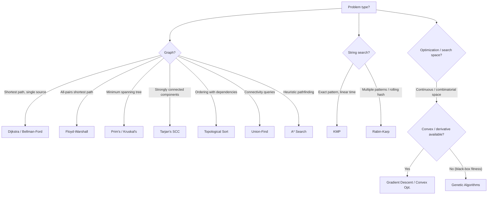

# Advanced Algorithms

This section goes beyond the core patterns — covering algorithms that appear in harder interview rounds, system-design discussions, and competitive programming. Mastery here signals deep CS fundamentals.

---

## What's Covered

| Page | Topics |
|------|--------|
| [Genetic Algorithms](genetic-algorithms.md) | Evolutionary search, fitness functions, crossover, mutation, optimization problems |
| [Famous Algorithms](famous-algorithms.md) | Dijkstra, Floyd-Warshall, Bellman-Ford, KMP, A\*, Union-Find, Tarjan's SCC, MST, and more |

---

## When to Reach for an Advanced Algorithm

---

## Complexity Quick-Reference

| Algorithm | Time | Space | Notes |
|-----------|------|-------|-------|
| Dijkstra | O(E log V) | O(V) | Non-negative weights only |
| Bellman-Ford | O(VE) | O(V) | Handles negative weights |
| Floyd-Warshall | O(V³) | O(V²) | All-pairs |
| Prim's MST | O(E log V) | O(V) | Dense graphs: O(V²) |
| Kruskal's MST | O(E log E) | O(V) | Uses Union-Find |
| Topological Sort | O(V+E) | O(V) | DAGs only |
| Union-Find | O(α(n)) | O(n) | Near-constant with path compression |
| KMP | O(n+m) | O(m) | Pattern length m, text length n |
| Rabin-Karp | O(n+m) avg | O(1) | O(nm) worst case |
| A\* | O(E log V) | O(V) | Depends on heuristic quality |
| Tarjan's SCC | O(V+E) | O(V) | Single DFS pass |
| Genetic Algorithm | O(g·p·f) | O(p) | g=generations, p=pop size, f=fitness cost |

---

[:octicons-arrow-right-24: Start: Genetic Algorithms](genetic-algorithms.md)
