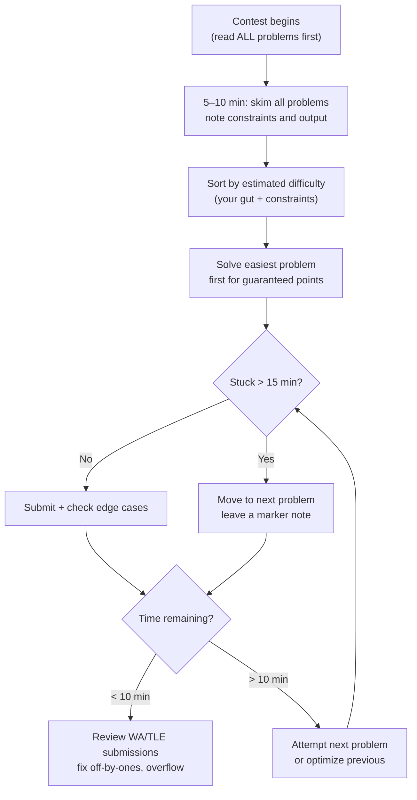
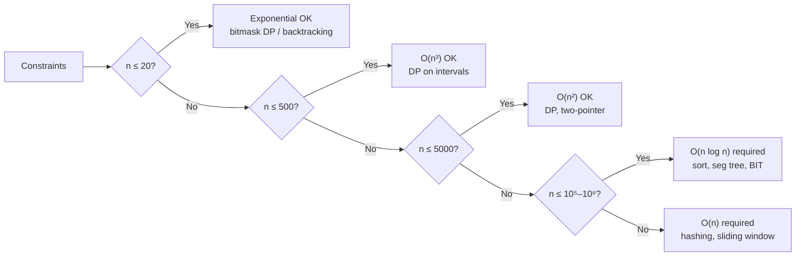

# Competitive Coding Strategies

## Contest Strategy Decision Tree



---

## Time Management During Contests

| Contest Length | Strategy |
|---------------|---------|
| **1 hour** (LeetCode Weekly) | 5 min read all → 20 min Easy → 25 min Medium → 10 min debug |
| **2 hours** (Codeforces Div 2) | 10 min read all → solve A+B immediately → 40 min C → 30 min D → 20 min review |
| **5 hours** (ICPC / USACO) | Read → classify → solve two "almost certain" problems → attack hardest |
| **General rule** | Never spend > 30 min on a single problem before attempting others |

!!! tip "First 10 minutes"
    Read **every** problem statement before writing a single line of code.
    Note: constraints (`n ≤ 10⁵` vs `n ≤ 10⁸`), output format, and whether the problem feels like a known pattern.
    This prevents the classic mistake of spending 45 minutes on problem C only to realize problem B was trivial.

---

## Problem Difficulty Estimation Heuristics



| n Constraint | Time Budget | Typical Algorithms |
|-------------|-------------|-------------------|
| ≤ 20 | O(2ⁿ) | Bitmask DP, brute force |
| ≤ 100 | O(n³) | Floyd-Warshall, matrix DP |
| ≤ 500 | O(n³) | Interval DP, network flow |
| ≤ 5,000 | O(n²) | DP, two-pointer, BFS/DFS |
| ≤ 10⁵ | O(n log n) | Sorting, seg tree, BIT, treap |
| ≤ 10⁶ | O(n) or O(n log n) | Hashing, sieve, sliding window |
| ≤ 10⁹ | O(log n) | Binary search, matrix exponentiation |

---

## Competitive Programming Patterns

### 1. Segment Tree with Lazy Propagation

**Use:** Range update + range query in O(log n). See full deep-dive: [Segment Tree & Fenwick Tree](segment-tree.md).

**Core idea:** Defer updates to children using a `lazy` array; push down before accessing children.

=== "Python"

    ```python
    class LazySegTree:
        def __init__(self, n: int):
            self.n = n
            self.tree = [0] * (4 * n)
            self.lazy = [0] * (4 * n)

        def _push_down(self, node: int, l: int, r: int) -> None:
            if self.lazy[node]:
                mid = (l + r) // 2
                self.tree[2*node]   += self.lazy[node] * (mid - l + 1)
                self.tree[2*node+1] += self.lazy[node] * (r - mid)
                self.lazy[2*node]   += self.lazy[node]
                self.lazy[2*node+1] += self.lazy[node]
                self.lazy[node] = 0

        def update(self, node: int, l: int, r: int, ql: int, qr: int, val: int) -> None:
            if qr < l or r < ql: return
            if ql <= l and r <= qr:
                self.tree[node] += val * (r - l + 1)
                self.lazy[node] += val
                return
            self._push_down(node, l, r)
            mid = (l + r) // 2
            self.update(2*node, l, mid, ql, qr, val)
            self.update(2*node+1, mid+1, r, ql, qr, val)
            self.tree[node] = self.tree[2*node] + self.tree[2*node+1]

        def query(self, node: int, l: int, r: int, ql: int, qr: int) -> int:
            if qr < l or r < ql: return 0
            if ql <= l and r <= qr: return self.tree[node]
            self._push_down(node, l, r)
            mid = (l + r) // 2
            return (self.query(2*node, l, mid, ql, qr) +
                    self.query(2*node+1, mid+1, r, ql, qr))
    ```

=== "TypeScript"

    ```typescript
    class LazySegTree {
        tree: number[]; lazy: number[]; n: number;
        constructor(n: number) {
            this.n = n;
            this.tree = new Array(4 * n).fill(0);
            this.lazy = new Array(4 * n).fill(0);
        }
        pushDown(node: number, l: number, r: number): void {
            if (!this.lazy[node]) return;
            const mid = (l + r) >> 1;
            this.tree[2*node]   += this.lazy[node] * (mid - l + 1);
            this.tree[2*node+1] += this.lazy[node] * (r - mid);
            this.lazy[2*node]   += this.lazy[node];
            this.lazy[2*node+1] += this.lazy[node];
            this.lazy[node] = 0;
        }
        update(node: number, l: number, r: number, ql: number, qr: number, val: number): void {
            if (qr < l || r < ql) return;
            if (ql <= l && r <= qr) { this.tree[node] += val * (r - l + 1); this.lazy[node] += val; return; }
            this.pushDown(node, l, r);
            const mid = (l + r) >> 1;
            this.update(2*node, l, mid, ql, qr, val);
            this.update(2*node+1, mid+1, r, ql, qr, val);
            this.tree[node] = this.tree[2*node] + this.tree[2*node+1];
        }
        query(node: number, l: number, r: number, ql: number, qr: number): number {
            if (qr < l || r < ql) return 0;
            if (ql <= l && r <= qr) return this.tree[node];
            this.pushDown(node, l, r);
            const mid = (l + r) >> 1;
            return this.query(2*node, l, mid, ql, qr) + this.query(2*node+1, mid+1, r, ql, qr);
        }
    }
    ```

---

### 2. Fenwick Tree (Binary Indexed Tree)

**Use:** Prefix sum queries + point updates in O(log n) with minimal code.

=== "Python"

    ```python
    class BIT:
        def __init__(self, n: int):
            self.n = n
            self.tree = [0] * (n + 1)

        def update(self, i: int, delta: int) -> None:
            while i <= self.n:
                self.tree[i] += delta
                i += i & (-i)

        def query(self, i: int) -> int:
            s = 0
            while i > 0:
                s += self.tree[i]
                i -= i & (-i)
            return s

        def range_query(self, l: int, r: int) -> int:
            return self.query(r) - self.query(l - 1)
    ```

=== "TypeScript"

    ```typescript
    class BIT {
        tree: number[];
        constructor(private n: number) { this.tree = new Array(n + 1).fill(0); }
        update(i: number, delta: number): void {
            for (; i <= this.n; i += i & -i) this.tree[i] += delta;
        }
        query(i: number): number {
            let s = 0;
            for (; i > 0; i -= i & -i) s += this.tree[i];
            return s;
        }
        rangeQuery(l: number, r: number): number { return this.query(r) - this.query(l - 1); }
    }
    ```

---

### 3. Sparse Table for RMQ

**Use:** Range minimum/maximum queries in **O(1)** after O(n log n) preprocessing. **Read-only** — no updates.

=== "Python"

    ```python
    import math

    class SparseTable:
        def __init__(self, arr: list[int]):
            n = len(arr)
            LOG = max(1, math.floor(math.log2(n)) + 1)
            self.table = [[float('inf')] * n for _ in range(LOG)]
            self.log = [0] * (n + 1)
            for i in range(2, n + 1):
                self.log[i] = self.log[i // 2] + 1
            self.table[0] = arr[:]
            for k in range(1, LOG):
                for i in range(n - (1 << k) + 1):
                    self.table[k][i] = min(self.table[k-1][i],
                                           self.table[k-1][i + (1 << (k-1))])

        def query(self, l: int, r: int) -> int:
            k = self.log[r - l + 1]
            return min(self.table[k][l], self.table[k][r - (1 << k) + 1])
    ```

=== "TypeScript"

    ```typescript
    class SparseTable {
        table: number[][]; log: number[];
        constructor(arr: number[]) {
            const n = arr.length, LOG = Math.floor(Math.log2(n)) + 1;
            this.log = new Array(n + 1).fill(0);
            for (let i = 2; i <= n; i++) this.log[i] = this.log[i >> 1] + 1;
            this.table = Array.from({ length: LOG }, () => new Array(n).fill(Infinity));
            this.table[0] = [...arr];
            for (let k = 1; k < LOG; k++)
                for (let i = 0; i + (1 << k) <= n; i++)
                    this.table[k][i] = Math.min(this.table[k-1][i], this.table[k-1][i + (1 << (k-1))]);
        }
        query(l: number, r: number): number {
            const k = this.log[r - l + 1];
            return Math.min(this.table[k][l], this.table[k][r - (1 << k) + 1]);
        }
    }
    ```

---

### 4. Suffix Array

**Use:** Pattern matching, longest repeated substring, string comparison in O(n log n) or O(n).

=== "Python"

    ```python
    def build_suffix_array(s: str) -> list[int]:
        """O(n log² n) suffix array construction."""
        n = len(s)
        sa = list(range(n))
        rank = [ord(c) for c in s]
        tmp = [0] * n

        k = 1
        while k < n:
            def cmp_key(i: int):
                return (rank[i], rank[i + k] if i + k < n else -1)
            sa.sort(key=cmp_key)
            tmp[sa[0]] = 0
            for j in range(1, n):
                tmp[sa[j]] = tmp[sa[j-1]] + (1 if cmp_key(sa[j]) != cmp_key(sa[j-1]) else 0)
            rank = tmp[:]
            if rank[sa[-1]] == n - 1: break
            k <<= 1
        return sa
    ```

=== "TypeScript"

    ```typescript
    function buildSuffixArray(s: string): number[] {
        const n = s.length;
        let sa = Array.from({ length: n }, (_, i) => i);
        let rank = Array.from(s, c => c.charCodeAt(0));
        for (let k = 1; k < n; k <<= 1) {
            const cmp = (i: number) => [rank[i], i + k < n ? rank[i + k] : -1] as const;
            sa.sort((a, b) => { const ca = cmp(a), cb = cmp(b); return ca[0] - cb[0] || ca[1] - cb[1]; });
            const tmp = new Array(n).fill(0);
            for (let j = 1; j < n; j++) {
                const [pa, pb] = [cmp(sa[j-1]), cmp(sa[j])];
                tmp[sa[j]] = tmp[sa[j-1]] + (pa[0] === pb[0] && pa[1] === pb[1] ? 0 : 1);
            }
            rank = tmp;
            if (rank[sa[n-1]] === n - 1) break;
        }
        return sa;
    }
    ```

---

### 5. Convex Hull

**Use:** Computational geometry — find the smallest convex polygon enclosing all points.

=== "Python"

    ```python
    from typing import NamedTuple

    class Point(NamedTuple):
        x: float
        y: float

    def cross(o: Point, a: Point, b: Point) -> float:
        return (a.x - o.x) * (b.y - o.y) - (a.y - o.y) * (b.x - o.x)

    def convex_hull(points: list[Point]) -> list[Point]:
        """Andrew's monotone chain — O(n log n)."""
        pts = sorted(set(points))
        n = len(pts)
        if n <= 1: return pts
        lower: list[Point] = []
        for p in pts:
            while len(lower) >= 2 and cross(lower[-2], lower[-1], p) <= 0:
                lower.pop()
            lower.append(p)
        upper: list[Point] = []
        for p in reversed(pts):
            while len(upper) >= 2 and cross(upper[-2], upper[-1], p) <= 0:
                upper.pop()
            upper.append(p)
        return lower[:-1] + upper[:-1]
    ```

=== "TypeScript"

    ```typescript
    type Pt = [number, number];

    function cross(o: Pt, a: Pt, b: Pt): number {
        return (a[0]-o[0])*(b[1]-o[1]) - (a[1]-o[1])*(b[0]-o[0]);
    }

    function convexHull(pts: Pt[]): Pt[] {
        const sorted = [...pts].sort((a, b) => a[0] - b[0] || a[1] - b[1]);
        const lower: Pt[] = [], upper: Pt[] = [];
        for (const p of sorted) {
            while (lower.length >= 2 && cross(lower[lower.length-2], lower[lower.length-1], p) <= 0)
                lower.pop();
            lower.push(p);
        }
        for (const p of [...sorted].reverse()) {
            while (upper.length >= 2 && cross(upper[upper.length-2], upper[upper.length-1], p) <= 0)
                upper.pop();
            upper.push(p);
        }
        return [...lower.slice(0, -1), ...upper.slice(0, -1)];
    }
    ```

---

### 6. Heavy-Light Decomposition (Overview)

**Use:** Path queries on trees — range sum/min/max on the path between any two nodes in O(log² n).

**Key idea:**
1. Decompose the tree into **heavy chains** (always go to the child with the largest subtree).
2. Flatten chains into a contiguous array → run a segment tree on the array.
3. For path `u → v`: climb chains (at most `O(log n)` jumps), each jump does one segment tree query in `O(log n)`.

!!! note "When to use HLD"
    HLD is rarely needed in standard interviews but common in **ICPC**, **IOI**, and **Codeforces Div 1 D/E** problems.
    If you see: "tree + path query + update" — think HLD or Euler tour + BIT.

---

## Competitive Programming Resources

| Platform | Best For | Rating System |
|----------|---------|--------------|
| [Codeforces](https://codeforces.com){ target=_blank } | Regular contests, huge problem archive | Elo-based (Newbie → Legendary Grandmaster) |
| [AtCoder](https://atcoder.jp){ target=_blank } | Clean problem statements, beginner-friendly | ABC (beginner) → AGC (grandmaster) |
| [USACO](https://usaco.org){ target=_blank } | USA olympiad training, 4 divisions | Bronze → Silver → Gold → Platinum |
| [LeetCode](https://leetcode.com){ target=_blank } | Interview-focused, weekly contests | Contest rating |
| [SPOJ](https://www.spoj.com){ target=_blank } | Classic problems, ad hoc practice | — |
| [Kattis](https://open.kattis.com){ target=_blank } | ICPC-style problems | Elo-based |

!!! tip "Recommended progression"
    **Beginners:** LeetCode Easy/Medium → AtCoder ABC → Codeforces Div 3.
    **Intermediate:** Codeforces Div 2 A–C regularly → USACO Silver.
    **Advanced:** Codeforces Div 1, AtCoder ARC/AGC, USACO Gold/Platinum.

---

## Mock Contest Strategy: 2-Hour Allocation

```mermaid
gantt
    title 2-Hour Contest Timeline
    dateFormat mm
    axisFormat %M min
    section Read Phase
    Read all problems & classify   :r1, 00, 10m
    section Solve Phase
    Problem A (easiest)            :a1, 10, 20m
    Problem B                      :b1, 30, 30m
    Problem C                      :c1, 60, 35m
    section Review Phase
    Debug / fix WA submissions     :d1, 95, 15m
    Attempt partial solutions      :d2, 95, 25m
```



**Rules of thumb:**
- If you can't see a path forward in **15 minutes**, write what you have and move on.
- **Partial credit** (if available) is better than a blank submission.
- The last 15 minutes: re-read problem statements for misunderstood constraints.
- Always test with the **smallest edge case** (n=0, n=1, all same values, negative numbers).

!!! warning "Common mistakes"
    - Integer overflow: use `long long` (C++) or ensure Python's arbitrary precision is intentional.
    - Off-by-one in binary search: always verify `lo`, `hi`, and loop termination condition.
    - Forgetting to reset global state between test cases in multi-test problems.
    - Stack overflow from deep recursion: increase stack size or convert to iterative.

---

[:octicons-arrow-right-24: Next: Segment Tree & Fenwick Tree](segment-tree.md)
