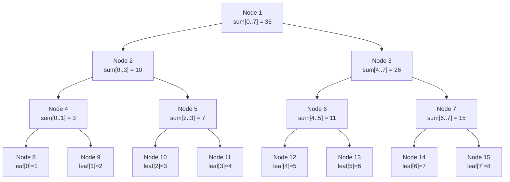
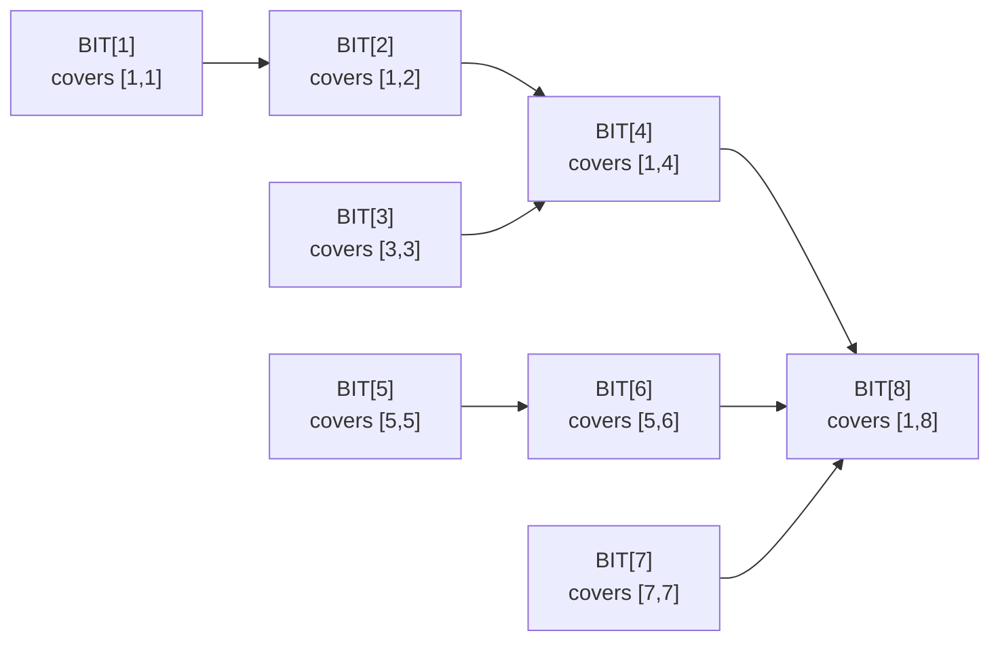

# Segment Tree & Fenwick Tree

## When to Use Which

| Structure | Build | Point Update | Range Query | Range Update | Space |
|-----------|-------|-------------|-------------|-------------|-------|
| **Prefix Sum Array** | O(n) | O(n) rebuild | O(1) | O(n) rebuild | O(n) |
| **Fenwick Tree (BIT)** | O(n log n) | O(log n) | O(log n) | O(log n) with diff BIT | O(n) |
| **Segment Tree** | O(n) | O(log n) | O(log n) | O(log n) with lazy | O(4n) |
| **Sparse Table** | O(n log n) | ❌ (static) | O(1) | ❌ (static) | O(n log n) |

**Decision guide:**

- Point update + prefix/range sum → **Fenwick Tree** (simpler code, same complexity)
- Range update + range query → **Segment Tree with lazy propagation**
- Read-only range min/max → **Sparse Table** (O(1) query)
- Generic range operations (XOR, GCD, custom merge) → **Segment Tree**

---

## Segment Tree Structure



**Array representation:** root at index `1`; children of node `i` are `2i` (left) and `2i+1` (right). Allocate `4n` to be safe.

---

## 1. Segment Tree — Range Sum Query + Point Update

=== "Python"

    ```python
    class SegTree:
        def __init__(self, arr: list[int]):
            self.n = len(arr)
            self.tree = [0] * (4 * self.n)
            self._build(arr, 1, 0, self.n - 1)

        def _build(self, arr: list[int], node: int, l: int, r: int) -> None:
            if l == r:
                self.tree[node] = arr[l]
                return
            mid = (l + r) // 2
            self._build(arr, 2 * node, l, mid)
            self._build(arr, 2 * node + 1, mid + 1, r)
            self.tree[node] = self.tree[2 * node] + self.tree[2 * node + 1]

        def update(self, node: int, l: int, r: int, pos: int, val: int) -> None:
            if l == r:
                self.tree[node] = val
                return
            mid = (l + r) // 2
            if pos <= mid:
                self.update(2 * node, l, mid, pos, val)
            else:
                self.update(2 * node + 1, mid + 1, r, pos, val)
            self.tree[node] = self.tree[2 * node] + self.tree[2 * node + 1]

        def query(self, node: int, l: int, r: int, ql: int, qr: int) -> int:
            if qr < l or r < ql:
                return 0
            if ql <= l and r <= qr:
                return self.tree[node]
            mid = (l + r) // 2
            return (self.query(2 * node, l, mid, ql, qr) +
                    self.query(2 * node + 1, mid + 1, r, ql, qr))

    # Usage
    seg = SegTree([1, 2, 3, 4, 5, 6, 7, 8])
    print(seg.query(1, 0, 7, 2, 5))   # sum of indices 2..5 = 3+4+5+6 = 18
    seg.update(1, 0, 7, 3, 10)        # set index 3 to 10
    print(seg.query(1, 0, 7, 2, 5))   # 3+10+5+6 = 24
    ```

=== "TypeScript"

    ```typescript
    class SegTree {
        tree: number[]; n: number;

        constructor(arr: number[]) {
            this.n = arr.length;
            this.tree = new Array(4 * this.n).fill(0);
            this.build(arr, 1, 0, this.n - 1);
        }

        build(arr: number[], node: number, l: number, r: number): void {
            if (l === r) { this.tree[node] = arr[l]; return; }
            const mid = (l + r) >> 1;
            this.build(arr, 2*node, l, mid);
            this.build(arr, 2*node+1, mid+1, r);
            this.tree[node] = this.tree[2*node] + this.tree[2*node+1];
        }

        update(node: number, l: number, r: number, pos: number, val: number): void {
            if (l === r) { this.tree[node] = val; return; }
            const mid = (l + r) >> 1;
            if (pos <= mid) this.update(2*node, l, mid, pos, val);
            else this.update(2*node+1, mid+1, r, pos, val);
            this.tree[node] = this.tree[2*node] + this.tree[2*node+1];
        }

        query(node: number, l: number, r: number, ql: number, qr: number): number {
            if (qr < l || r < ql) return 0;
            if (ql <= l && r <= qr) return this.tree[node];
            const mid = (l + r) >> 1;
            return this.query(2*node, l, mid, ql, qr) + this.query(2*node+1, mid+1, r, ql, qr);
        }
    }
    ```

=== "Rust"

    ```rust
    pub struct SegTree {
        tree: Vec<i64>,
        n: usize,
    }

    impl SegTree {
        pub fn new(arr: &[i64]) -> Self {
            let n = arr.len();
            let mut st = Self { tree: vec![0; 4 * n], n };
            st.build(arr, 1, 0, n - 1);
            st
        }

        fn build(&mut self, arr: &[i64], node: usize, l: usize, r: usize) {
            if l == r { self.tree[node] = arr[l]; return; }
            let mid = (l + r) / 2;
            self.build(arr, 2*node, l, mid);
            self.build(arr, 2*node+1, mid+1, r);
            self.tree[node] = self.tree[2*node] + self.tree[2*node+1];
        }

        pub fn update(&mut self, node: usize, l: usize, r: usize, pos: usize, val: i64) {
            if l == r { self.tree[node] = val; return; }
            let mid = (l + r) / 2;
            if pos <= mid { self.update(2*node, l, mid, pos, val); }
            else { self.update(2*node+1, mid+1, r, pos, val); }
            self.tree[node] = self.tree[2*node] + self.tree[2*node+1];
        }

        pub fn query(&self, node: usize, l: usize, r: usize, ql: usize, qr: usize) -> i64 {
            if qr < l || r < ql { return 0; }
            if ql <= l && r <= qr { return self.tree[node]; }
            let mid = (l + r) / 2;
            self.query(2*node, l, mid, ql, qr) + self.query(2*node+1, mid+1, r, ql, qr)
        }
    }
    ```

=== "Java"

    ```java
    public class SegTree {
        private final long[] tree;
        private final int n;

        public SegTree(int[] arr) {
            n = arr.length;
            tree = new long[4 * n];
            build(arr, 1, 0, n - 1);
        }

        private void build(int[] arr, int node, int l, int r) {
            if (l == r) { tree[node] = arr[l]; return; }
            int mid = (l + r) / 2;
            build(arr, 2*node, l, mid);
            build(arr, 2*node+1, mid+1, r);
            tree[node] = tree[2*node] + tree[2*node+1];
        }

        public void update(int node, int l, int r, int pos, long val) {
            if (l == r) { tree[node] = val; return; }
            int mid = (l + r) / 2;
            if (pos <= mid) update(2*node, l, mid, pos, val);
            else update(2*node+1, mid+1, r, pos, val);
            tree[node] = tree[2*node] + tree[2*node+1];
        }

        public long query(int node, int l, int r, int ql, int qr) {
            if (qr < l || r < ql) return 0;
            if (ql <= l && r <= qr) return tree[node];
            int mid = (l + r) / 2;
            return query(2*node, l, mid, ql, qr) + query(2*node+1, mid+1, r, ql, qr);
        }
    }
    ```

=== "C#"

    ```csharp
    public class SegTree {
        private readonly long[] tree;
        private readonly int n;

        public SegTree(int[] arr) {
            n = arr.Length;
            tree = new long[4 * n];
            Build(arr, 1, 0, n - 1);
        }

        void Build(int[] arr, int node, int l, int r) {
            if (l == r) { tree[node] = arr[l]; return; }
            int mid = (l + r) / 2;
            Build(arr, 2*node, l, mid); Build(arr, 2*node+1, mid+1, r);
            tree[node] = tree[2*node] + tree[2*node+1];
        }

        public void Update(int node, int l, int r, int pos, long val) {
            if (l == r) { tree[node] = val; return; }
            int mid = (l + r) / 2;
            if (pos <= mid) Update(2*node, l, mid, pos, val);
            else Update(2*node+1, mid+1, r, pos, val);
            tree[node] = tree[2*node] + tree[2*node+1];
        }

        public long Query(int node, int l, int r, int ql, int qr) {
            if (qr < l || r < ql) return 0;
            if (ql <= l && r <= qr) return tree[node];
            int mid = (l + r) / 2;
            return Query(2*node, l, mid, ql, qr) + Query(2*node+1, mid+1, r, ql, qr);
        }
    }
    ```

=== "ASM"

    ```asm
    ; Segment Tree (range sum) in x86-64 — conceptual
    ; tree[] stored as array of int64 at [seg_tree_base + node*8]
    ; query(node, l, r, ql, qr):
    ;   cmp qr, l   / jl return_0       ; qr < l
    ;   cmp r, ql   / jl return_0       ; r < ql
    ;   (check ql<=l && r<=qr -> return tree[node])
    ;   compute mid = (l+r)/2
    ;   call query(2*node, l, mid, ql, qr)  -> save in r13
    ;   call query(2*node+1, mid+1, r, ql, qr) -> rax
    ;   add rax, r13 / ret
    ```

=== "Scala"

    ```scala
    class SegTree(arr: Array[Int]) {
      val n: Int = arr.length
      val tree: Array[Long] = Array.fill(4 * n)(0L)
      build(arr, 1, 0, n - 1)

      def build(a: Array[Int], node: Int, l: Int, r: Int): Unit = {
        if (l == r) { tree(node) = a(l); return }
        val mid = (l + r) / 2
        build(a, 2*node, l, mid); build(a, 2*node+1, mid+1, r)
        tree(node) = tree(2*node) + tree(2*node+1)
      }

      def update(node: Int, l: Int, r: Int, pos: Int, v: Long): Unit = {
        if (l == r) { tree(node) = v; return }
        val mid = (l + r) / 2
        if (pos <= mid) update(2*node, l, mid, pos, v)
        else update(2*node+1, mid+1, r, pos, v)
        tree(node) = tree(2*node) + tree(2*node+1)
      }

      def query(node: Int, l: Int, r: Int, ql: Int, qr: Int): Long = {
        if (qr < l || r < ql) return 0L
        if (ql <= l && r <= qr) return tree(node)
        val mid = (l + r) / 2
        query(2*node, l, mid, ql, qr) + query(2*node+1, mid+1, r, ql, qr)
      }
    }
    ```

---

## 2. Segment Tree with Lazy Propagation — Range Update + Range Query

**Core idea:** Defer range updates using a `lazy` array. Before accessing children, **push down** the pending update.

=== "Python"

    ```python
    class LazySegTree:
        """Range add update, range sum query."""

        def __init__(self, arr: list[int]):
            self.n = len(arr)
            self.tree = [0] * (4 * self.n)
            self.lazy = [0] * (4 * self.n)
            self._build(arr, 1, 0, self.n - 1)

        def _build(self, arr: list[int], node: int, l: int, r: int) -> None:
            if l == r:
                self.tree[node] = arr[l]
                return
            mid = (l + r) // 2
            self._build(arr, 2*node, l, mid)
            self._build(arr, 2*node+1, mid+1, r)
            self.tree[node] = self.tree[2*node] + self.tree[2*node+1]

        def _push_down(self, node: int, l: int, r: int) -> None:
            if self.lazy[node] == 0:
                return
            mid = (l + r) // 2
            # Apply pending addition to left child
            self.tree[2*node]   += self.lazy[node] * (mid - l + 1)
            self.lazy[2*node]   += self.lazy[node]
            # Apply pending addition to right child
            self.tree[2*node+1] += self.lazy[node] * (r - mid)
            self.lazy[2*node+1] += self.lazy[node]
            self.lazy[node] = 0

        def update(self, node: int, l: int, r: int, ql: int, qr: int, val: int) -> None:
            """Add val to all elements in [ql, qr]."""
            if qr < l or r < ql:
                return
            if ql <= l and r <= qr:
                self.tree[node] += val * (r - l + 1)
                self.lazy[node] += val
                return
            self._push_down(node, l, r)
            mid = (l + r) // 2
            self.update(2*node, l, mid, ql, qr, val)
            self.update(2*node+1, mid+1, r, ql, qr, val)
            self.tree[node] = self.tree[2*node] + self.tree[2*node+1]

        def query(self, node: int, l: int, r: int, ql: int, qr: int) -> int:
            """Sum of elements in [ql, qr]."""
            if qr < l or r < ql:
                return 0
            if ql <= l and r <= qr:
                return self.tree[node]
            self._push_down(node, l, r)
            mid = (l + r) // 2
            return (self.query(2*node, l, mid, ql, qr) +
                    self.query(2*node+1, mid+1, r, ql, qr))

    # Usage
    seg = LazySegTree([1, 2, 3, 4, 5])
    seg.update(1, 0, 4, 1, 3, 10)          # add 10 to indices 1..3
    print(seg.query(1, 0, 4, 0, 4))         # 1 + 12 + 13 + 14 + 5 = 45
    ```

=== "TypeScript"

    ```typescript
    class LazySegTree {
        tree: number[]; lazy: number[]; n: number;

        constructor(arr: number[]) {
            this.n = arr.length;
            this.tree = new Array(4 * this.n).fill(0);
            this.lazy = new Array(4 * this.n).fill(0);
            this.build(arr, 1, 0, this.n - 1);
        }

        private build(arr: number[], node: number, l: number, r: number): void {
            if (l === r) { this.tree[node] = arr[l]; return; }
            const mid = (l + r) >> 1;
            this.build(arr, 2*node, l, mid);
            this.build(arr, 2*node+1, mid+1, r);
            this.tree[node] = this.tree[2*node] + this.tree[2*node+1];
        }

        private pushDown(node: number, l: number, r: number): void {
            if (!this.lazy[node]) return;
            const mid = (l + r) >> 1;
            this.tree[2*node]   += this.lazy[node] * (mid - l + 1);
            this.lazy[2*node]   += this.lazy[node];
            this.tree[2*node+1] += this.lazy[node] * (r - mid);
            this.lazy[2*node+1] += this.lazy[node];
            this.lazy[node] = 0;
        }

        update(node: number, l: number, r: number, ql: number, qr: number, val: number): void {
            if (qr < l || r < ql) return;
            if (ql <= l && r <= qr) { this.tree[node] += val * (r-l+1); this.lazy[node] += val; return; }
            this.pushDown(node, l, r);
            const mid = (l + r) >> 1;
            this.update(2*node, l, mid, ql, qr, val);
            this.update(2*node+1, mid+1, r, ql, qr, val);
            this.tree[node] = this.tree[2*node] + this.tree[2*node+1];
        }

        query(node: number, l: number, r: number, ql: number, qr: number): number {
            if (qr < l || r < ql) return 0;
            if (ql <= l && r <= qr) return this.tree[node];
            this.pushDown(node, l, r);
            const mid = (l + r) >> 1;
            return this.query(2*node, l, mid, ql, qr) + this.query(2*node+1, mid+1, r, ql, qr);
        }
    }
    ```

=== "Rust"

    ```rust
    pub struct LazySegTree {
        tree: Vec<i64>,
        lazy: Vec<i64>,
        n: usize,
    }

    impl LazySegTree {
        pub fn new(arr: &[i64]) -> Self {
            let n = arr.len();
            let mut st = Self { tree: vec![0; 4*n], lazy: vec![0; 4*n], n };
            st.build(arr, 1, 0, n - 1);
            st
        }

        fn build(&mut self, arr: &[i64], node: usize, l: usize, r: usize) {
            if l == r { self.tree[node] = arr[l]; return; }
            let mid = (l + r) / 2;
            self.build(arr, 2*node, l, mid);
            self.build(arr, 2*node+1, mid+1, r);
            self.tree[node] = self.tree[2*node] + self.tree[2*node+1];
        }

        fn push_down(&mut self, node: usize, l: usize, r: usize) {
            if self.lazy[node] == 0 { return; }
            let mid = (l + r) / 2;
            self.tree[2*node]   += self.lazy[node] * (mid - l + 1) as i64;
            self.lazy[2*node]   += self.lazy[node];
            self.tree[2*node+1] += self.lazy[node] * (r - mid) as i64;
            self.lazy[2*node+1] += self.lazy[node];
            self.lazy[node] = 0;
        }

        pub fn update(&mut self, node: usize, l: usize, r: usize, ql: usize, qr: usize, val: i64) {
            if qr < l || r < ql { return; }
            if ql <= l && r <= qr {
                self.tree[node] += val * (r - l + 1) as i64;
                self.lazy[node] += val;
                return;
            }
            self.push_down(node, l, r);
            let mid = (l + r) / 2;
            self.update(2*node, l, mid, ql, qr, val);
            self.update(2*node+1, mid+1, r, ql, qr, val);
            self.tree[node] = self.tree[2*node] + self.tree[2*node+1];
        }

        pub fn query(&mut self, node: usize, l: usize, r: usize, ql: usize, qr: usize) -> i64 {
            if qr < l || r < ql { return 0; }
            if ql <= l && r <= qr { return self.tree[node]; }
            self.push_down(node, l, r);
            let mid = (l + r) / 2;
            self.query(2*node, l, mid, ql, qr) + self.query(2*node+1, mid+1, r, ql, qr)
        }
    }
    ```

=== "Java"

    ```java
    public class LazySegTree {
        private final long[] tree, lazy;
        private final int n;

        public LazySegTree(int[] arr) {
            n = arr.length;
            tree = new long[4 * n]; lazy = new long[4 * n];
            build(arr, 1, 0, n - 1);
        }

        void build(int[] arr, int nd, int l, int r) {
            if (l == r) { tree[nd] = arr[l]; return; }
            int mid = (l + r) / 2;
            build(arr, 2*nd, l, mid); build(arr, 2*nd+1, mid+1, r);
            tree[nd] = tree[2*nd] + tree[2*nd+1];
        }

        void pushDown(int nd, int l, int r) {
            if (lazy[nd] == 0) return;
            int mid = (l + r) / 2;
            tree[2*nd]   += lazy[nd] * (mid - l + 1); lazy[2*nd]   += lazy[nd];
            tree[2*nd+1] += lazy[nd] * (r - mid);     lazy[2*nd+1] += lazy[nd];
            lazy[nd] = 0;
        }

        public void update(int nd, int l, int r, int ql, int qr, long val) {
            if (qr < l || r < ql) return;
            if (ql <= l && r <= qr) { tree[nd] += val*(r-l+1); lazy[nd] += val; return; }
            pushDown(nd, l, r);
            int mid = (l + r) / 2;
            update(2*nd, l, mid, ql, qr, val); update(2*nd+1, mid+1, r, ql, qr, val);
            tree[nd] = tree[2*nd] + tree[2*nd+1];
        }

        public long query(int nd, int l, int r, int ql, int qr) {
            if (qr < l || r < ql) return 0;
            if (ql <= l && r <= qr) return tree[nd];
            pushDown(nd, l, r);
            int mid = (l + r) / 2;
            return query(2*nd, l, mid, ql, qr) + query(2*nd+1, mid+1, r, ql, qr);
        }
    }
    ```

=== "C#"

    ```csharp
    public class LazySegTree {
        long[] tree, lazy; int n;

        public LazySegTree(int[] arr) {
            n = arr.Length; tree = new long[4*n]; lazy = new long[4*n];
            Build(arr, 1, 0, n-1);
        }

        void Build(int[] arr, int nd, int l, int r) {
            if (l == r) { tree[nd] = arr[l]; return; }
            int mid = (l+r)/2; Build(arr, 2*nd, l, mid); Build(arr, 2*nd+1, mid+1, r);
            tree[nd] = tree[2*nd] + tree[2*nd+1];
        }

        void PushDown(int nd, int l, int r) {
            if (lazy[nd] == 0) return;
            int mid = (l+r)/2;
            tree[2*nd]   += lazy[nd]*(mid-l+1); lazy[2*nd]   += lazy[nd];
            tree[2*nd+1] += lazy[nd]*(r-mid);   lazy[2*nd+1] += lazy[nd];
            lazy[nd] = 0;
        }

        public void Update(int nd, int l, int r, int ql, int qr, long val) {
            if (qr < l || r < ql) return;
            if (ql <= l && r <= qr) { tree[nd] += val*(r-l+1); lazy[nd] += val; return; }
            PushDown(nd, l, r); int mid = (l+r)/2;
            Update(2*nd, l, mid, ql, qr, val); Update(2*nd+1, mid+1, r, ql, qr, val);
            tree[nd] = tree[2*nd] + tree[2*nd+1];
        }

        public long Query(int nd, int l, int r, int ql, int qr) {
            if (qr < l || r < ql) return 0;
            if (ql <= l && r <= qr) return tree[nd];
            PushDown(nd, l, r); int mid = (l+r)/2;
            return Query(2*nd, l, mid, ql, qr) + Query(2*nd+1, mid+1, r, ql, qr);
        }
    }
    ```

=== "ASM"

    ```asm
    ; Lazy Seg Tree push_down in x86-64 (conceptual)
    ; Assume: rdi=node, rsi=l, rdx=r
    ; tree[] at [tree_base + rdi*8], lazy[] at [lazy_base + rdi*8]
    push_down:
        mov  rax, [lazy_base + rdi*8]
        test rax, rax
        jz   .done                      ; lazy[node] == 0: nothing to do
        mov  rcx, rsi                   ; mid = (l+r)/2
        add  rcx, rdx
        shr  rcx, 1
        ; left child (2*node): tree += lazy * (mid-l+1)
        ; right child (2*node+1): tree += lazy * (r-mid)
        ; propagate lazy to children
        ; clear lazy[node]
        mov  qword [lazy_base + rdi*8], 0
    .done:
        ret
    ```

=== "Scala"

    ```scala
    class LazySegTree(arr: Array[Int]) {
      val n: Int = arr.length
      val tree: Array[Long] = Array.fill(4 * n)(0L)
      val lazy: Array[Long] = Array.fill(4 * n)(0L)
      build(arr, 1, 0, n - 1)

      def build(a: Array[Int], nd: Int, l: Int, r: Int): Unit = {
        if (l == r) { tree(nd) = a(l); return }
        val mid = (l + r) / 2
        build(a, 2*nd, l, mid); build(a, 2*nd+1, mid+1, r)
        tree(nd) = tree(2*nd) + tree(2*nd+1)
      }

      def pushDown(nd: Int, l: Int, r: Int): Unit = {
        if (lazy(nd) == 0) return
        val mid = (l + r) / 2
        tree(2*nd)   += lazy(nd) * (mid - l + 1); lazy(2*nd)   += lazy(nd)
        tree(2*nd+1) += lazy(nd) * (r - mid);     lazy(2*nd+1) += lazy(nd)
        lazy(nd) = 0
      }

      def update(nd: Int, l: Int, r: Int, ql: Int, qr: Int, v: Long): Unit = {
        if (qr < l || r < ql) return
        if (ql <= l && r <= qr) { tree(nd) += v*(r-l+1); lazy(nd) += v; return }
        pushDown(nd, l, r)
        val mid = (l + r) / 2
        update(2*nd, l, mid, ql, qr, v); update(2*nd+1, mid+1, r, ql, qr, v)
        tree(nd) = tree(2*nd) + tree(2*nd+1)
      }

      def query(nd: Int, l: Int, r: Int, ql: Int, qr: Int): Long = {
        if (qr < l || r < ql) return 0L
        if (ql <= l && r <= qr) return tree(nd)
        pushDown(nd, l, r)
        val mid = (l + r) / 2
        query(2*nd, l, mid, ql, qr) + query(2*nd+1, mid+1, r, ql, qr)
      }
    }
    ```

---

## 3. Fenwick Tree (BIT) — Point Update + Prefix Sum

**Core trick:** `i & (-i)` isolates the lowest set bit, which determines the range each node covers.



=== "Python"

    ```python
    class BIT:
        """1-indexed Fenwick Tree for prefix sum / point update."""

        def __init__(self, n: int):
            self.n = n
            self.tree = [0] * (n + 1)

        def update(self, i: int, delta: int) -> None:
            """Add delta to position i (1-indexed)."""
            while i <= self.n:
                self.tree[i] += delta
                i += i & (-i)         # move to parent in update path

        def query(self, i: int) -> int:
            """Prefix sum [1..i]."""
            s = 0
            while i > 0:
                s += self.tree[i]
                i -= i & (-i)         # move to responsible ancestor
            return s

        def range_query(self, l: int, r: int) -> int:
            """Sum of [l..r] (1-indexed)."""
            return self.query(r) - self.query(l - 1)

        def point_query(self, i: int) -> int:
            """Value at position i."""
            return self.range_query(i, i)

    # Usage
    bit = BIT(8)
    for i, v in enumerate([1, 2, 3, 4, 5, 6, 7, 8], start=1):
        bit.update(i, v)
    print(bit.range_query(3, 6))   # 3+4+5+6 = 18
    bit.update(4, 5)               # arr[4] += 5 → arr[4] = 9
    print(bit.range_query(3, 6))   # 3+9+5+6 = 23
    ```

=== "TypeScript"

    ```typescript
    class BIT {
        private tree: number[];
        constructor(private n: number) { this.tree = new Array(n + 1).fill(0); }

        update(i: number, delta: number): void {
            for (; i <= this.n; i += i & -i) this.tree[i] += delta;
        }

        query(i: number): number {
            let s = 0;
            for (; i > 0; i -= i & -i) s += this.tree[i];
            return s;
        }

        rangeQuery(l: number, r: number): number { return this.query(r) - this.query(l - 1); }
    }
    ```

=== "Rust"

    ```rust
    pub struct BIT { tree: Vec<i64>, n: usize }

    impl BIT {
        pub fn new(n: usize) -> Self { Self { tree: vec![0; n + 1], n } }

        pub fn update(&mut self, mut i: usize, delta: i64) {
            while i <= self.n { self.tree[i] += delta; i += i & i.wrapping_neg(); }
        }

        pub fn query(&self, mut i: usize) -> i64 {
            let mut s = 0;
            while i > 0 { s += self.tree[i]; i -= i & i.wrapping_neg(); }
            s
        }

        pub fn range_query(&self, l: usize, r: usize) -> i64 {
            self.query(r) - self.query(l - 1)
        }
    }
    ```

=== "Java"

    ```java
    public class BIT {
        private final long[] tree;
        private final int n;

        public BIT(int n) { this.n = n; tree = new long[n + 1]; }

        public void update(int i, long delta) {
            for (; i <= n; i += i & -i) tree[i] += delta;
        }

        public long query(int i) {
            long s = 0; for (; i > 0; i -= i & -i) s += tree[i]; return s;
        }

        public long rangeQuery(int l, int r) { return query(r) - query(l - 1); }
    }
    ```

=== "C#"

    ```csharp
    public class BIT {
        private readonly long[] tree;
        private readonly int n;

        public BIT(int n) { this.n = n; tree = new long[n + 1]; }

        public void Update(int i, long delta) {
            for (; i <= n; i += i & -i) tree[i] += delta;
        }

        public long Query(int i) {
            long s = 0; for (; i > 0; i -= i & -i) s += tree[i]; return s;
        }

        public long RangeQuery(int l, int r) => Query(r) - Query(l - 1);
    }
    ```

=== "ASM"

    ```asm
    ; Fenwick Tree update in x86-64
    ; rdi = tree base address (1-indexed long array)
    ; rsi = i (1-indexed), rdx = delta, rcx = n
    bit_update:
        mov  rax, rsi              ; rax = i
    .loop:
        cmp  rax, rcx              ; while i <= n
        jg   .done
        mov  r8, rax
        neg  r8
        and  r8, rax               ; r8 = i & (-i)  (lowest set bit)
        add  qword [rdi + rax*8], rdx   ; tree[i] += delta
        add  rax, r8               ; i += i & (-i)
        jmp  .loop
    .done:
        ret

    ; Fenwick Tree query in x86-64
    ; rdi = tree base, rsi = i, result in rax
    bit_query:
        xor  rax, rax              ; sum = 0
        mov  rcx, rsi              ; rcx = i
    .loop:
        test rcx, rcx
        jz   .done
        add  rax, [rdi + rcx*8]    ; sum += tree[i]
        mov  r8, rcx
        neg  r8
        and  r8, rcx
        sub  rcx, r8               ; i -= i & (-i)
        jmp  .loop
    .done:
        ret
    ```

=== "Scala"

    ```scala
    class BIT(n: Int) {
      private val tree = Array.fill(n + 1)(0L)

      def update(var i: Int, delta: Long): Unit = {
        while (i <= n) { tree(i) += delta; i += i & -i }
      }

      def query(var i: Int): Long = {
        var s = 0L
        while (i > 0) { s += tree(i); i -= i & -i }
        s
      }

      def rangeQuery(l: Int, r: Int): Long = query(r) - query(l - 1)
    }
    ```

!!! note "Scala var in parameter"
    Scala does not allow reassigning `val` parameters. Declare a local `var` copy if needed:
    ```scala
    def update(i0: Int, delta: Long): Unit = { var i = i0; while (i <= n) { ... } }
    ```

---

## Example Problems

| Problem | Structure | Key Insight |
|---------|-----------|-------------|
| [Range Sum Query — Mutable](https://leetcode.com/problems/range-sum-query-mutable/){ target=_blank } | Seg Tree or BIT | Point update + range sum |
| [Count of Smaller Numbers After Self](https://leetcode.com/problems/count-of-smaller-numbers-after-self/){ target=_blank } | BIT | Coordinate compress, BIT counts |
| [Range Minimum Query](https://leetcode.com/problems/range-minimum-query/){ target=_blank } | Sparse Table | Static array, O(1) query |
| [My Calendar III](https://leetcode.com/problems/my-calendar-iii/){ target=_blank } | Lazy Seg Tree | Range add, range max query |
| [Falling Squares](https://leetcode.com/problems/falling-squares/){ target=_blank } | Lazy Seg Tree | Range set, range max query |
| [Number of Longest Increasing Subsequence](https://leetcode.com/problems/number-of-longest-increasing-subsequence/){ target=_blank } | Seg Tree (pair) | Store (length, count) per node |

---

## Interview Tips

!!! tip "In a coding interview"
    - **Recognize the pattern:** "range query + update" → immediately think BIT or Seg Tree.
    - For BIT: mention the `i & (-i)` trick and note that it only supports **invertible** operations (sum, XOR — not min/max without modification).
    - For lazy seg tree: always explain the **push-down** invariant before coding.
    - If time-constrained, implement BIT first (fewer lines) and mention that Seg Tree handles non-invertible ops.

!!! warning "Common mistakes"
    - **Off-by-one:** BIT is 1-indexed. Convert 0-indexed input with `i + 1`.
    - **Lazy not pushed before leaf access:** always call `push_down` before recursing into children.
    - **Allocating too little space:** allocate `4 * n` for the segment tree array, not `2 * n`.
    - **Integer overflow:** use `long`/`i64` for sums of large arrays.

---

[:octicons-arrow-left-24: Previous: Competitive Coding Strategies](index.md) · [:octicons-arrow-right-24: Next: Machine Learning](../machine-learning/index.md)
