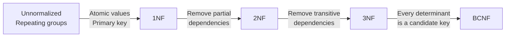
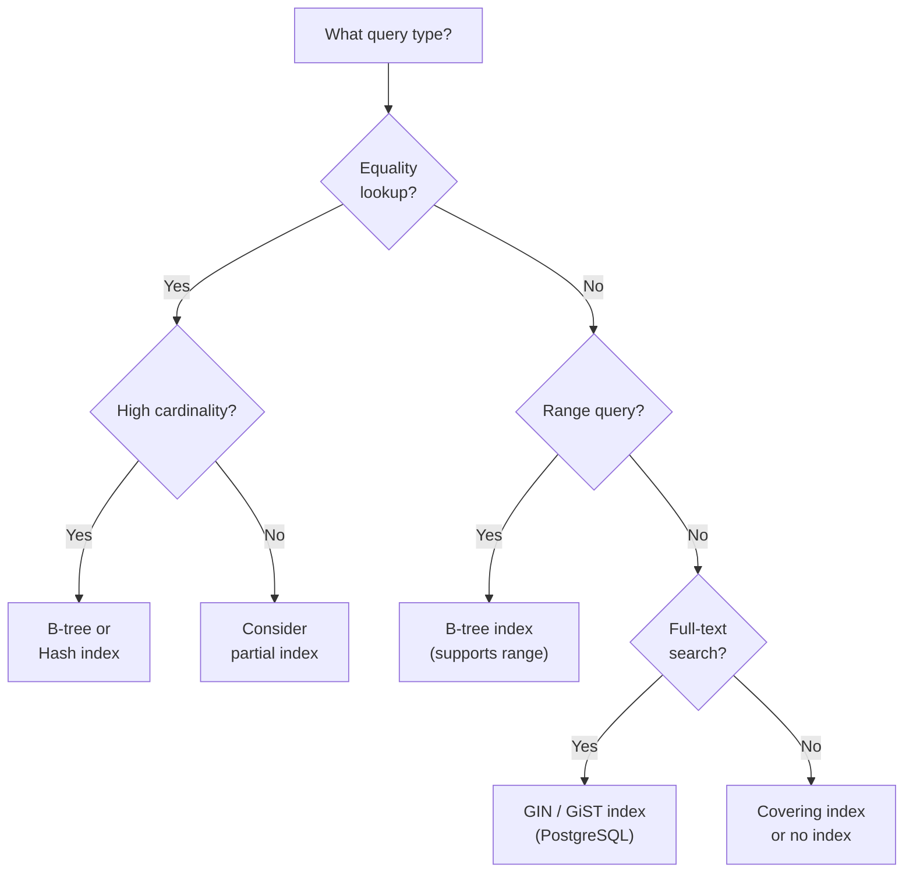
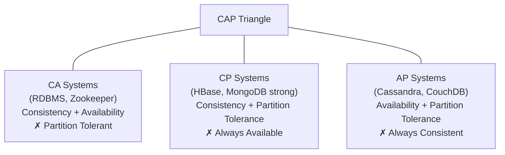
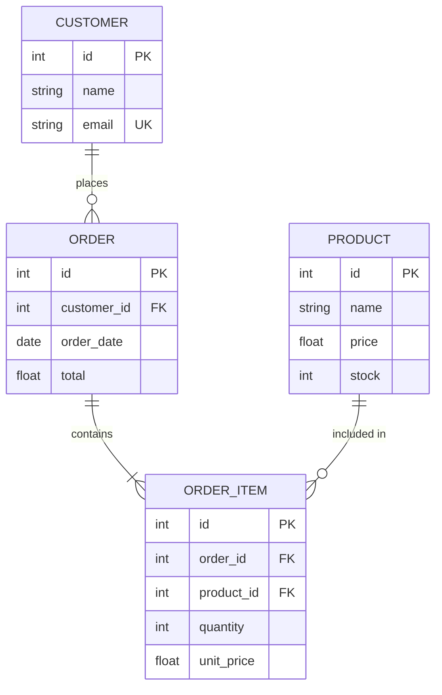

# Database Interview Questions

## RDBMS vs NoSQL

| Dimension | RDBMS (PostgreSQL, MySQL) | Document (MongoDB) | Key-Value (Redis) | Wide-Column (Cassandra) | NewSQL (Spanner, CockroachDB) |
|-----------|--------------------------|-------------------|-------------------|------------------------|-------------------------------|
| **Schema** | Strict, enforced | Flexible / schemaless | None | Flexible families | Strict, distributed |
| **Transactions** | Full ACID | Multi-doc ACID (4.0+) | Lua scripts / MULTI | Lightweight batches | Full ACID (distributed) |
| **Scale** | Vertical + read replicas | Horizontal sharding | Horizontal sharding | Horizontal (native) | Horizontal |
| **Query** | SQL (joins, aggregation) | MQL, aggregation pipeline | GET/SET/SCAN | CQL (no joins) | SQL |
| **Best for** | Financial, relational | Flexible documents, catalogs | Cache, sessions, leaderboards | Time-series, IoT, logs | Global OLTP |

---

## SQL Query Patterns

### 1. Window Functions

Window functions compute a result **across a set of rows related to the current row** without collapsing them like `GROUP BY`.

```sql
-- ROW_NUMBER: unique rank per partition
SELECT
    employee_id,
    department,
    salary,
    ROW_NUMBER() OVER (PARTITION BY department ORDER BY salary DESC) AS dept_rank
FROM employees;

-- RANK: same value = same rank, gaps after ties
-- DENSE_RANK: same value = same rank, no gaps

-- Running total
SELECT
    order_id,
    amount,
    SUM(amount) OVER (PARTITION BY customer_id ORDER BY order_date
                      ROWS BETWEEN UNBOUNDED PRECEDING AND CURRENT ROW) AS running_total
FROM orders;

-- LAG / LEAD: access previous / next row's value
SELECT
    date,
    revenue,
    LAG(revenue, 1)  OVER (ORDER BY date) AS prev_day_revenue,
    LEAD(revenue, 1) OVER (ORDER BY date) AS next_day_revenue,
    revenue - LAG(revenue, 1) OVER (ORDER BY date) AS daily_change
FROM daily_revenue;
```

!!! tip "Window function frame clauses"
    `ROWS BETWEEN UNBOUNDED PRECEDING AND CURRENT ROW` — cumulative sum.
    `ROWS BETWEEN 6 PRECEDING AND CURRENT ROW` — 7-day rolling window.
    `RANGE BETWEEN INTERVAL '7 days' PRECEDING AND CURRENT ROW` — range-based (uses ORDER BY value, not row count).

---

### 2. CTEs and Recursive CTEs

```sql
-- Standard CTE
WITH monthly_sales AS (
    SELECT
        DATE_TRUNC('month', order_date) AS month,
        SUM(amount)                     AS total
    FROM orders
    GROUP BY 1
),
ranked AS (
    SELECT *, RANK() OVER (ORDER BY total DESC) AS rnk FROM monthly_sales
)
SELECT * FROM ranked WHERE rnk <= 3;

-- Recursive CTE: employee org chart traversal
WITH RECURSIVE org_tree AS (
    -- Anchor: start from CEO (no manager)
    SELECT id, name, manager_id, 0 AS depth
    FROM employees
    WHERE manager_id IS NULL

    UNION ALL

    -- Recursive: employees whose manager is already in the tree
    SELECT e.id, e.name, e.manager_id, ot.depth + 1
    FROM employees e
    JOIN org_tree ot ON e.manager_id = ot.id
)
SELECT * FROM org_tree ORDER BY depth, name;
```

!!! note "CTE vs subquery"
    CTEs improve readability and allow **reuse** within the same query. The query optimizer may or may not materialize them — use `MATERIALIZED` / `NOT MATERIALIZED` hints (PostgreSQL 12+) when performance matters.

---

### 3. JOINs

```sql
-- INNER: only matching rows in both tables
SELECT o.order_id, c.name
FROM orders o
INNER JOIN customers c ON o.customer_id = c.id;

-- LEFT: all rows from left, NULL for unmatched right
SELECT c.name, COUNT(o.order_id) AS order_count
FROM customers c
LEFT JOIN orders o ON c.id = o.customer_id
GROUP BY c.name;

-- RIGHT: all rows from right (rarely preferred over LEFT)

-- FULL OUTER: all rows from both, NULL where no match
SELECT c.name, o.order_id
FROM customers c
FULL OUTER JOIN orders o ON c.id = o.customer_id;

-- SELF JOIN: compare rows within the same table
SELECT e.name AS employee, m.name AS manager
FROM employees e
LEFT JOIN employees m ON e.manager_id = m.id;

-- CROSS JOIN: cartesian product (use carefully!)
SELECT p.name, c.color
FROM products p
CROSS JOIN colors c;
```

| JOIN Type | Rows returned |
|-----------|--------------|
| `INNER` | Only matched rows |
| `LEFT` | All left + matched right |
| `RIGHT` | All right + matched left |
| `FULL OUTER` | All rows from both sides |
| `CROSS` | Every combination |
| `SELF` | Same table aliased twice |

---

### 4. Aggregations with GROUP BY / HAVING

```sql
-- HAVING filters AFTER aggregation (WHERE filters before)
SELECT
    department,
    COUNT(*)                              AS headcount,
    AVG(salary)                           AS avg_salary,
    MAX(salary) - MIN(salary)             AS salary_range
FROM employees
WHERE status = 'active'            -- filters rows first
GROUP BY department
HAVING COUNT(*) >= 5               -- filters groups after aggregation
ORDER BY avg_salary DESC;

-- ROLLUP: subtotals and grand total
SELECT department, job_title, SUM(salary)
FROM employees
GROUP BY ROLLUP(department, job_title);

-- GROUPING SETS: multiple groupings in one pass
SELECT department, job_title, SUM(salary)
FROM employees
GROUP BY GROUPING SETS ((department), (job_title), ());
```

---

### 5. Subqueries vs JOINs

```sql
-- Correlated subquery (executes once per row — often slower)
SELECT name, salary
FROM employees e
WHERE salary > (
    SELECT AVG(salary) FROM employees WHERE department = e.department
);

-- Equivalent with JOIN (often faster — single pass)
SELECT e.name, e.salary
FROM employees e
JOIN (
    SELECT department, AVG(salary) AS avg_sal
    FROM employees
    GROUP BY department
) dept_avg ON e.department = dept_avg.department
WHERE e.salary > dept_avg.avg_sal;

-- EXISTS vs IN: use EXISTS when subquery result is large
SELECT name FROM customers c
WHERE EXISTS (
    SELECT 1 FROM orders o WHERE o.customer_id = c.id AND o.amount > 1000
);
```

!!! tip "When to use a subquery vs JOIN"
    Prefer **JOINs** for performance when the subquery result set is large.
    Use **correlated subqueries** for row-by-row comparisons that are hard to express as a join.
    `EXISTS` short-circuits on the first match — prefer it over `IN` when the inner set is large.

---

## Database Design

### Normalization



| Form | Rule | Violation Example | Fix |
|------|------|------------------|-----|
| **1NF** | Atomic values, no repeating groups | `tags = 'sql,nosql,python'` | Separate `tags` table |
| **2NF** | No partial dependency on composite PK | `(order_id, product_id) → product_name` | Move `product_name` to `products` |
| **3NF** | No transitive dependency | `employee_id → dept_id → dept_name` | Separate `departments` table |
| **BCNF** | Every determinant is a candidate key | Remaining edge cases beyond 3NF | Decompose relation |

---

### Indexing Strategies



| Index Type | Structure | Best For | Notes |
|------------|-----------|---------|-------|
| **B-tree** | Balanced tree | Equality + range queries | Default in most RDBMS |
| **Hash** | Hash table | Equality only | Faster for `=`, no range support |
| **Composite** | Multi-column B-tree | `WHERE a = ? AND b = ?` | Column order matters (leftmost prefix) |
| **Covering** | Includes all queried columns | Avoid table heap fetch | `CREATE INDEX ... INCLUDE (col)` |
| **Partial** | Filtered rows | Sparse predicates | `CREATE INDEX ... WHERE status='active'` |
| **GIN/GiST** | Generalized | JSONB, full-text, arrays | PostgreSQL-specific |

!!! warning "Index pitfalls"
    - Indexes slow down `INSERT`/`UPDATE`/`DELETE` — avoid over-indexing write-heavy tables.
    - An index on `(a, b, c)` cannot be used for a query filtering only on `b`.
    - `WHERE LOWER(email) = ?` won't use an index on `email` — create a **functional index** instead.

---

### ACID Properties

| Property | Meaning | Example |
|----------|---------|---------|
| **Atomicity** | All-or-nothing transaction | Transfer fails mid-way → entire rollback |
| **Consistency** | DB moves from one valid state to another | Balance never goes negative if constraint exists |
| **Isolation** | Concurrent transactions don't interfere | Two transfers don't double-spend |
| **Durability** | Committed data survives crashes | WAL (write-ahead log) ensures recovery |

**Isolation levels** (weakest → strongest):

```sql
SET TRANSACTION ISOLATION LEVEL READ UNCOMMITTED;  -- dirty reads possible
SET TRANSACTION ISOLATION LEVEL READ COMMITTED;    -- default in PostgreSQL
SET TRANSACTION ISOLATION LEVEL REPEATABLE READ;   -- phantom reads possible
SET TRANSACTION ISOLATION LEVEL SERIALIZABLE;      -- full isolation, lowest throughput
```

---

### CAP Theorem



!!! note "CAP in practice"
    Network partitions always occur in distributed systems — so you're really choosing between **CP** and **AP**.
    Modern systems (Spanner, CockroachDB) achieve "CA" by minimizing partition probability via low-latency replication, not by violating the theorem.
    **PACELC** extends CAP: even without partitions, choose between **latency** and **consistency**.

---

## Entity-Relationship Diagram Example



---

## Top 20 SQL Interview Questions

| # | Question | Key Point |
|---|---------|-----------|
| 1 | **Difference between WHERE and HAVING?** | WHERE filters rows before grouping; HAVING filters groups after |
| 2 | **Delete duplicate rows keeping one** | `DELETE FROM t WHERE id NOT IN (SELECT MIN(id) FROM t GROUP BY col)` |
| 3 | **Nth highest salary** | `SELECT DISTINCT salary FROM employees ORDER BY salary DESC LIMIT 1 OFFSET N-1` |
| 4 | **Self join use case** | Find employees who earn more than their manager |
| 5 | **UNION vs UNION ALL** | UNION deduplicates (slower); UNION ALL keeps duplicates (faster) |
| 6 | **What is a covering index?** | Index includes all columns needed by the query — avoids heap fetch |
| 7 | **Difference between RANK and DENSE_RANK** | RANK skips numbers after ties; DENSE_RANK does not |
| 8 | **Explain query execution plan** | Use `EXPLAIN ANALYZE` — look for Seq Scan vs Index Scan, cost |
| 9 | **Foreign key vs index** | FK enforces referential integrity; doesn't auto-create an index in all RDBMS |
| 10 | **Difference between clustered and non-clustered index** | Clustered physically reorders rows (one per table); non-clustered is a separate structure |
| 11 | **What is a transaction savepoint?** | Partial rollback within a transaction: `SAVEPOINT sp1; ROLLBACK TO sp1;` |
| 12 | **Find employees with no orders** | LEFT JOIN + `WHERE orders.id IS NULL` or `NOT EXISTS` subquery |
| 13 | **Recursive CTE use case** | Hierarchical data: org charts, filesystem paths, BOM |
| 14 | **What causes a deadlock?** | Two transactions each hold a lock the other needs; DB detects and aborts one |
| 15 | **Difference between TRUNCATE and DELETE** | TRUNCATE is DDL, non-logged, faster, cannot rollback in some DBs; DELETE is DML |
| 16 | **What is index cardinality?** | Number of distinct values; high cardinality = index more selective / useful |
| 17 | **Explain the N+1 query problem** | Fetching N rows then making N separate queries for related data; fix with JOIN or batch load |
| 18 | **When would you denormalize?** | Read-heavy OLAP, known query patterns, when JOINs become a bottleneck |
| 19 | **What is a materialized view?** | Precomputed query result stored on disk; must be refreshed; speeds up complex aggregations |
| 20 | **OLTP vs OLAP** | OLTP: many small transactions, normalized; OLAP: large analytical queries, denormalized (star/snowflake) |

---

## NoSQL Patterns

| Database | Type | Sweet Spot | Avoid When |
|----------|------|-----------|------------|
| **MongoDB** | Document | Flexible schemas, nested data, catalogs | Complex multi-collection joins |
| **Redis** | Key-Value / In-memory | Caching, sessions, pub/sub, rate limiting | Durable primary store for large data |
| **Cassandra** | Wide-Column | High-write time-series, IoT, logs, global scale | Ad-hoc queries, strong consistency |
| **DynamoDB** | Key-Value + Document | Serverless, AWS-native, predictable scale | Complex queries, unknown access patterns |
| **Elasticsearch** | Inverted Index | Full-text search, log aggregation | ACID transactions, primary data store |
| **Neo4j** | Graph | Relationship-heavy data (social, fraud) | Non-graph queries |

!!! tip "Picking NoSQL in an interview"
    Frame your answer around **access patterns first**: "We need to read by user ID and time range with high write throughput — that points to Cassandra with a partition key of `user_id` and clustering key of `timestamp`."

---

[:octicons-arrow-right-24: Next: Competitive Coding Strategies](../competitive/index.md)
