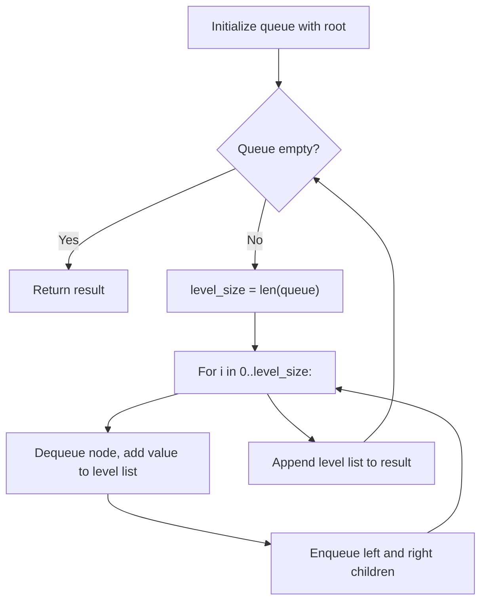

# Binary Tree Level Order Traversal

> [LeetCode 102 — Binary Tree Level Order Traversal](https://leetcode.com/problems/binary-tree-level-order-traversal/){ target=_blank } · Difficulty: **Medium**
> · [NeetCode Video](https://neetcode.io/problems/level-order-traversal-of-binary-tree){ target=_blank }

## Problem

Given the `root` of a binary tree, return the level order traversal of its nodes' values (i.e., from left to right, level by level).

**Example:**
```
Input:     3
          / \
         9  20
            / \
           15  7

Output: [[3],[9,20],[15,7]]
```

---

## Framework Walk-Through

### Step 1 — Understand

| Aspect | Detail |
|--------|--------|
| Input | root of binary tree (0..2000 nodes) |
| Output | list of lists — values grouped by level |
| Key insight | Process nodes **level by level** → BFS with a queue |
| Edge cases | empty tree, single node, skewed tree |

### Step 2 — Entities & State

- **Queue** — holds nodes for the current level
- **Level list** — collects values for one level
- **Result** — collects all level lists

### Step 3 — Data Structure

**Queue (FIFO)** — process nodes in order, level by level.

### Step 4 — Algorithm



### Step 6 — Implement

=== "Python"

    ```python
    from collections import deque
    from typing import Optional

    class TreeNode:
        def __init__(self, val=0, left=None, right=None):
            self.val = val
            self.left = left
            self.right = right

    def level_order(root: Optional[TreeNode]) -> list[list[int]]:
        if not root:
            return []
        result: list[list[int]] = []
        queue: deque[TreeNode] = deque([root])
        while queue:
            level_size = len(queue)
            level: list[int] = []
            for _ in range(level_size):
                node = queue.popleft()
                level.append(node.val)
                if node.left:
                    queue.append(node.left)
                if node.right:
                    queue.append(node.right)
            result.append(level)
        return result
    ```

=== "TypeScript"

    ```typescript
    class TreeNode {
        val: number;
        left: TreeNode | null;
        right: TreeNode | null;
        constructor(val = 0, left: TreeNode | null = null, right: TreeNode | null = null) {
            this.val = val;
            this.left = left;
            this.right = right;
        }
    }

    function levelOrder(root: TreeNode | null): number[][] {
        if (!root) return [];
        const result: number[][] = [];
        const queue: TreeNode[] = [root];
        while (queue.length > 0) {
            const levelSize = queue.length;
            const level: number[] = [];
            for (let i = 0; i < levelSize; i++) {
                const node = queue.shift()!;
                level.push(node.val);
                if (node.left) queue.push(node.left);
                if (node.right) queue.push(node.right);
            }
            result.push(level);
        }
        return result;
    }
    ```

=== "Rust"

    ```rust
    use std::cell::RefCell;
    use std::collections::VecDeque;
    use std::rc::Rc;

    #[derive(Debug)]
    pub struct TreeNode {
        pub val: i32,
        pub left: Option<Rc<RefCell<TreeNode>>>,
        pub right: Option<Rc<RefCell<TreeNode>>>,
    }

    pub fn level_order(root: Option<Rc<RefCell<TreeNode>>>) -> Vec<Vec<i32>> {
        let mut result = Vec::new();
        let Some(root) = root else { return result };
        let mut queue = VecDeque::new();
        queue.push_back(root);
        while !queue.is_empty() {
            let level_size = queue.len();
            let mut level = Vec::new();
            for _ in 0..level_size {
                let node = queue.pop_front().unwrap();
                let node = node.borrow();
                level.push(node.val);
                if let Some(ref left) = node.left {
                    queue.push_back(Rc::clone(left));
                }
                if let Some(ref right) = node.right {
                    queue.push_back(Rc::clone(right));
                }
            }
            result.push(level);
        }
        result
    }
    ```

=== "Java"

    ```java
    import java.util.*;

    class TreeNode {
        int val;
        TreeNode left, right;
        TreeNode(int val) { this.val = val; }
    }

    class Solution {
        public List<List<Integer>> levelOrder(TreeNode root) {
            List<List<Integer>> result = new ArrayList<>();
            if (root == null) return result;
            Queue<TreeNode> queue = new LinkedList<>();
            queue.offer(root);
            while (!queue.isEmpty()) {
                int levelSize = queue.size();
                List<Integer> level = new ArrayList<>();
                for (int i = 0; i < levelSize; i++) {
                    TreeNode node = queue.poll();
                    level.add(node.val);
                    if (node.left != null) queue.offer(node.left);
                    if (node.right != null) queue.offer(node.right);
                }
                result.add(level);
            }
            return result;
        }
    }
    ```

=== "C#"

    ```csharp
    using System.Collections.Generic;

    public class TreeNode {
        public int val;
        public TreeNode left, right;
        public TreeNode(int val = 0) { this.val = val; }
    }

    public class Solution {
        public IList<IList<int>> LevelOrder(TreeNode root) {
            var result = new List<IList<int>>();
            if (root == null) return result;
            var queue = new Queue<TreeNode>();
            queue.Enqueue(root);
            while (queue.Count > 0) {
                int levelSize = queue.Count;
                var level = new List<int>();
                for (int i = 0; i < levelSize; i++) {
                    var node = queue.Dequeue();
                    level.Add(node.val);
                    if (node.left != null) queue.Enqueue(node.left);
                    if (node.right != null) queue.Enqueue(node.right);
                }
                result.Add(level);
            }
            return result;
        }
    }
    ```

=== "ASM"

    ```asm
    ; x86-64 — BFS tree traversal is impractical in pure ASM for interviews.
    ; The key algorithm:
    ;   1. Use a queue (circular buffer or linked list)
    ;   2. Enqueue root
    ;   3. While queue not empty:
    ;        level_size = queue.size
    ;        for i = 0..level_size: dequeue, process, enqueue children
    ; See higher-level implementations above.
    ```

=== "Scala"

    ```scala
    import scala.collection.mutable

    class TreeNode(var value: Int = 0, var left: TreeNode = null, var right: TreeNode = null)

    object Solution {
      def levelOrder(root: TreeNode): List[List[Int]] = {
        if (root == null) return Nil
        val result = mutable.ListBuffer.empty[List[Int]]
        val queue = mutable.Queue[TreeNode](root)
        while (queue.nonEmpty) {
          val levelSize = queue.size
          val level = mutable.ListBuffer.empty[Int]
          for (_ <- 0 until levelSize) {
            val node = queue.dequeue()
            level += node.value
            if (node.left != null) queue.enqueue(node.left)
            if (node.right != null) queue.enqueue(node.right)
          }
          result += level.toList
        }
        result.toList
      }
    }
    ```

### Step 7 — Test

| Tree | Expected | Result |
|------|----------|--------|
| `[3,9,20,null,null,15,7]` | `[[3],[9,20],[15,7]]` | ✅ |
| `[1]` | `[[1]]` | ✅ |
| `[]` | `[]` | ✅ |

**Complexity:** Time O(n), Space O(n)

---

[:octicons-arrow-left-24: Previous: Merge Intervals](merge-intervals.md) · [:octicons-arrow-right-24: Next: Climbing Stairs](climbing-stairs.md)
