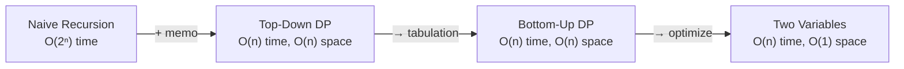

# Climbing Stairs (Dynamic Programming)

> [LeetCode 70 — Climbing Stairs](https://leetcode.com/problems/climbing-stairs/){ target=_blank } · Difficulty: **Easy**
> · [NeetCode Video](https://neetcode.io/problems/climbing-stairs){ target=_blank }

## Problem

You are climbing a staircase with `n` steps. Each time you can climb **1 or 2** steps. In how many distinct ways can you reach the top?

**Example:**
```
Input:  n = 3
Output: 3   (1+1+1, 1+2, 2+1)
```

---

## Framework Walk-Through

### Step 1 — Understand

| Aspect | Detail |
|--------|--------|
| Input | integer `n` (1..45) |
| Output | number of distinct ways |
| Key insight | `ways(n) = ways(n-1) + ways(n-2)` — Fibonacci! |
| Edge cases | n=1 (1 way), n=2 (2 ways) |

### Step 2 — Entities & State

- `n` — total stairs
- `dp[i]` — number of ways to reach step `i`
- Or just two variables: `prev`, `curr` (space optimization)

### Step 3 — Data Structure

**Two variables** — space-optimized DP; we only need the previous two values.

### Step 4 — Algorithm Comparison



| Approach | Time | Space |
|----------|------|-------|
| Naive recursion | O(2ⁿ) | O(n) stack |
| Memoized recursion | O(n) | O(n) |
| Bottom-up DP array | O(n) | O(n) |
| **Two variables** | **O(n)** | **O(1)** |

### Step 6 — Implement

=== "Python"

    ```python
    def climb_stairs(n: int) -> int:
        if n <= 2:
            return n
        prev, curr = 1, 2
        for _ in range(3, n + 1):
            prev, curr = curr, prev + curr
        return curr
    ```

=== "TypeScript"

    ```typescript
    function climbStairs(n: number): number {
        if (n <= 2) return n;
        let prev = 1;
        let curr = 2;
        for (let i = 3; i <= n; i++) {
            const next = prev + curr;
            prev = curr;
            curr = next;
        }
        return curr;
    }
    ```

=== "Rust"

    ```rust
    pub fn climb_stairs(n: i32) -> i32 {
        if n <= 2 {
            return n;
        }
        let (mut prev, mut curr) = (1, 2);
        for _ in 3..=n {
            let next = prev + curr;
            prev = curr;
            curr = next;
        }
        curr
    }
    ```

=== "Java"

    ```java
    class Solution {
        public int climbStairs(int n) {
            if (n <= 2) return n;
            int prev = 1, curr = 2;
            for (int i = 3; i <= n; i++) {
                int next = prev + curr;
                prev = curr;
                curr = next;
            }
            return curr;
        }
    }
    ```

=== "C#"

    ```csharp
    public class Solution {
        public int ClimbStairs(int n) {
            if (n <= 2) return n;
            int prev = 1, curr = 2;
            for (int i = 3; i <= n; i++) {
                int next = prev + curr;
                prev = curr;
                curr = next;
            }
            return curr;
        }
    }
    ```

=== "ASM"

    ```asm
    ; x86-64 Linux — climb_stairs(n)
    ; rdi = n
    ; Returns: eax = number of ways
    section .text
    global climb_stairs
    climb_stairs:
        cmp     edi, 2
        jle     .base
        mov     eax, 1          ; prev = 1
        mov     ecx, 2          ; curr = 2
        mov     edx, 3          ; i = 3
    .loop:
        cmp     edx, edi
        jg      .done
        lea     r8d, [eax + ecx] ; next = prev + curr
        mov     eax, ecx         ; prev = curr
        mov     ecx, r8d         ; curr = next
        inc     edx
        jmp     .loop
    .done:
        mov     eax, ecx
        ret
    .base:
        mov     eax, edi
        ret
    ```

=== "Scala"

    ```scala
    object Solution {
      def climbStairs(n: Int): Int = {
        if (n <= 2) return n
        var prev = 1
        var curr = 2
        for (_ <- 3 to n) {
          val next = prev + curr
          prev = curr
          curr = next
        }
        curr
      }
    }
    ```

### Step 7 — Test

| n | Expected | Result |
|---|----------|--------|
| 1 | 1 | ✅ |
| 2 | 2 | ✅ |
| 3 | 3 | ✅ |
| 5 | 8 | ✅ |
| 45 | 1836311903 | ✅ |

**Complexity:** Time O(n), Space O(1)

---

[:octicons-arrow-left-24: Previous: Binary Tree Level Order](binary-tree-level-order.md) · [:octicons-arrow-right-24: Back to Examples](index.md)
