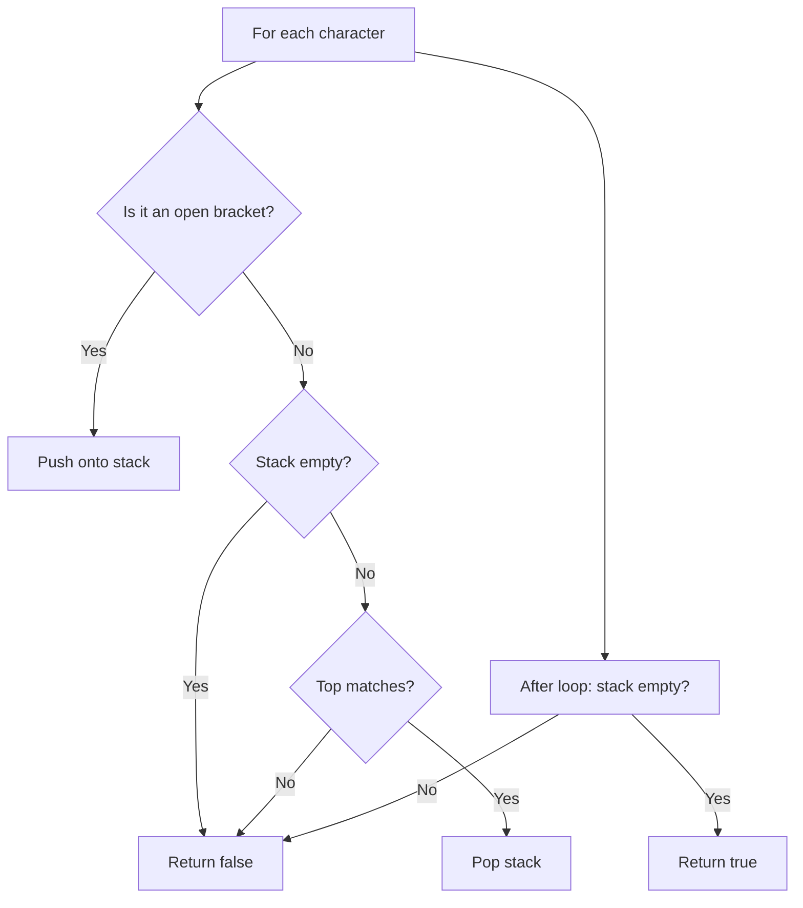

# Valid Parentheses

> [LeetCode 20 — Valid Parentheses](https://leetcode.com/problems/valid-parentheses/){ target=_blank } · Difficulty: **Easy**
> · [NeetCode Video](https://neetcode.io/problems/validate-parentheses){ target=_blank }

## Problem

Given a string `s` containing only `()[]{}`, determine if the input string is valid. A string is valid if every open bracket is closed by the same type in the correct order.

**Example:**
```
Input:  s = "()[]{}"
Output: true

Input:  s = "(]"
Output: false
```

---

## Framework Walk-Through

### Step 1 — Understand

| Aspect | Detail |
|--------|--------|
| Input | string of `()[]{}`, length 1..10⁴ |
| Output | boolean |
| Key insight | Brackets must close in LIFO order → **stack** |
| Edge cases | empty string, single char, nested brackets |

### Step 2 — Entities & State

- **Characters** — each bracket in the string
- **Stack** — tracks unmatched open brackets
- **Mapping** — open → close bracket pairs

### Step 3 — Data Structure

**Stack** — Last-In-First-Out matches the nesting requirement perfectly.

### Step 4 — Algorithm

| Approach | Time | Space |
|----------|------|-------|
| **Stack matching** | **O(n)** | **O(n)** |



### Step 6 — Implement

=== "Python"

    ```python
    def is_valid(s: str) -> bool:
        stack: list[str] = []
        pairs = {')': '(', ']': '[', '}': '{'}
        for ch in s:
            if ch in pairs:
                if not stack or stack[-1] != pairs[ch]:
                    return False
                stack.pop()
            else:
                stack.append(ch)
        return len(stack) == 0
    ```

=== "TypeScript"

    ```typescript
    function isValid(s: string): boolean {
        const stack: string[] = [];
        const pairs: Record<string, string> = {
            ')': '(', ']': '[', '}': '{'
        };
        for (const ch of s) {
            if (ch in pairs) {
                if (!stack.length || stack[stack.length - 1] !== pairs[ch]) {
                    return false;
                }
                stack.pop();
            } else {
                stack.push(ch);
            }
        }
        return stack.length === 0;
    }
    ```

=== "Rust"

    ```rust
    pub fn is_valid(s: String) -> bool {
        let mut stack: Vec<char> = Vec::new();
        for ch in s.chars() {
            match ch {
                '(' | '[' | '{' => stack.push(ch),
                ')' => if stack.pop() != Some('(') { return false; },
                ']' => if stack.pop() != Some('[') { return false; },
                '}' => if stack.pop() != Some('{') { return false; },
                _ => {}
            }
        }
        stack.is_empty()
    }
    ```

=== "Java"

    ```java
    import java.util.ArrayDeque;
    import java.util.Deque;
    import java.util.Map;

    class Solution {
        public boolean isValid(String s) {
            Deque<Character> stack = new ArrayDeque<>();
            Map<Character, Character> pairs = Map.of(
                ')', '(', ']', '[', '}', '{'
            );
            for (char ch : s.toCharArray()) {
                if (pairs.containsKey(ch)) {
                    if (stack.isEmpty() || !stack.peek().equals(pairs.get(ch))) {
                        return false;
                    }
                    stack.pop();
                } else {
                    stack.push(ch);
                }
            }
            return stack.isEmpty();
        }
    }
    ```

=== "C#"

    ```csharp
    using System.Collections.Generic;

    public class Solution {
        public bool IsValid(string s) {
            var stack = new Stack<char>();
            var pairs = new Dictionary<char, char> {
                { ')', '(' }, { ']', '[' }, { '}', '{' }
            };
            foreach (char ch in s) {
                if (pairs.TryGetValue(ch, out char open)) {
                    if (stack.Count == 0 || stack.Peek() != open) return false;
                    stack.Pop();
                } else {
                    stack.Push(ch);
                }
            }
            return stack.Count == 0;
        }
    }
    ```

=== "ASM"

    ```asm
    ; x86-64 Linux — is_valid (simplified stack-based check)
    section .bss
        stack resb 10000

    section .text
    global is_valid
    ; rdi = pointer to null-terminated string
    ; Returns: eax = 1 (valid) or 0 (invalid)
    is_valid:
        lea     rsi, [rel stack]    ; stack pointer
        xor     ecx, ecx            ; stack size = 0
    .loop:
        movzx   eax, byte [rdi]
        test    al, al
        jz      .done
        cmp     al, '('
        je      .push
        cmp     al, '['
        je      .push
        cmp     al, '{'
        je      .push
        ; closing bracket — check match
        test    ecx, ecx
        jz      .invalid
        dec     ecx
        movzx   edx, byte [rsi + rcx]
        cmp     al, ')'
        jne     .try_sq
        cmp     dl, '('
        jne     .invalid
        jmp     .next
    .try_sq:
        cmp     al, ']'
        jne     .try_curly
        cmp     dl, '['
        jne     .invalid
        jmp     .next
    .try_curly:
        cmp     al, '}'
        jne     .next
        cmp     dl, '{'
        jne     .invalid
    .next:
        inc     rdi
        jmp     .loop
    .push:
        mov     [rsi + rcx], al
        inc     ecx
        inc     rdi
        jmp     .loop
    .done:
        test    ecx, ecx
        setz    al
        movzx   eax, al
        ret
    .invalid:
        xor     eax, eax
        ret
    ```

=== "Scala"

    ```scala
    object Solution {
      def isValid(s: String): Boolean = {
        val pairs = Map(')' -> '(', ']' -> '[', '}' -> '{')
        val stack = scala.collection.mutable.Stack[Char]()
        for (ch <- s) {
          if (pairs.contains(ch)) {
            if (stack.isEmpty || stack.pop() != pairs(ch)) return false
          } else {
            stack.push(ch)
          }
        }
        stack.isEmpty
      }
    }
    ```

### Step 7 — Test

| Input | Expected | Result |
|-------|----------|--------|
| `"()"` | `true` | ✅ |
| `"()[]{}"` | `true` | ✅ |
| `"(]"` | `false` | ✅ |
| `"([)]"` | `false` | ✅ |
| `"{[]}"` | `true` | ✅ |
| `""` | `true` | ✅ |

**Complexity:** Time O(n), Space O(n)

---

[:octicons-arrow-left-24: Previous: Two Sum](two-sum.md) · [:octicons-arrow-right-24: Next: Merge Intervals](merge-intervals.md)
