# Problem Solving Framework

This guide provides a **complete, repeatable checklist** you can follow for any coding interview problem — from easy array questions to hard graph/DP challenges.

---

## Master Flowchart

```mermaid
flowchart TD
    Start(["🎯 Read the Problem"]) --> U["Step 1: Understand"]
    U --> E["Step 2: Identify Entities & State"]
    E --> DS["Step 3: Choose Data Structures"]
    DS --> AL["Step 4: Select Algorithms"]
    AL --> PL["Step 5: Plan Approach"]
    PL --> IM["Step 6: Implement"]
    IM --> TO["Step 7: Test & Optimize"]
    TO -->|"All tests pass"| Done(["✅ Done"])
    TO -->|"Wrong answer / TLE"| AL
```

---

## Checklist (copy & use)

- [ ] **Understand** — restate the problem, clarify I/O, identify constraints & edge cases
- [ ] **Entities & State** — list variables, pointers, counters, mappings needed
- [ ] **Data Structures** — pick the right container (array, hash map, tree, heap, graph …)
- [ ] **Algorithms** — brainstorm brute-force *and* optimal approaches; identify pattern
- [ ] **Plan** — write pseudocode; confirm with interviewer
- [ ] **Implement** — code cleanly, use helpers, handle edge cases
- [ ] **Test & Optimize** — trace through examples, analyze Big-O, refactor

---

## Steps

| # | Page | Focus |
|---|------|-------|
| 1 | [Understand the Problem](step1-understand.md) | Inputs, outputs, constraints, edge cases |
| 2 | [Identify Entities & State](step2-entities.md) | Variables, pointers, mutable state |
| 3 | [Choose Data Structures](step3-data-structures.md) | Arrays, maps, sets, heaps, trees, graphs |
| 4 | [Select Algorithms](step4-algorithms.md) | Sorting, searching, recursion, DP, greedy |
| 5 | [Plan Your Approach](step5-approach.md) | Pseudocode, multiple approaches comparison |
| 6 | [Implement](step6-implement.md) | Clean code, helper functions, edge cases |
| 7 | [Test & Optimize](step7-test-optimize.md) | Dry-run, Big-O analysis, refactoring |
