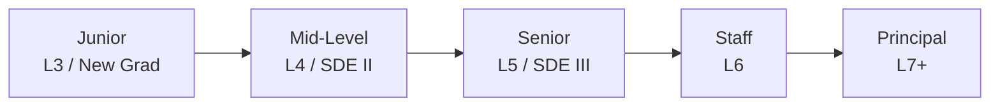
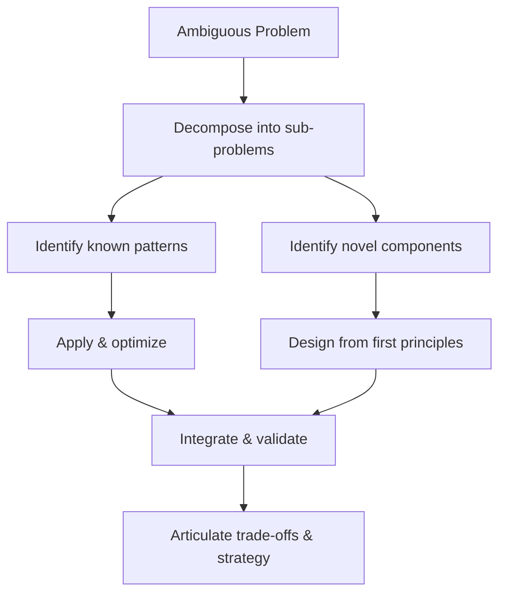

# Career Level Guide

> *"Know where you stand, so you know where to aim."*

Every engineering level brings different expectations in a coding interview. This guide breaks down what interviewers look for — from new-grad to principal — so you can focus your preparation on what matters most for **your** target role.

---

## Junior Engineer (L3 / New Grad)

!!! info "Core expectation"
    Demonstrate **solid fundamentals**. Interviewers want to see that you can translate a well-defined problem into clean, working code within the time limit.

### What Interviewers Look For

- Correct implementation of common data structures and algorithms
- Ability to walk through examples and trace code by hand
- Clear communication — think out loud, explain your reasoning
- Awareness of time and space complexity (Big-O)

### Key Patterns & Data Structures

| Category | Must-Know |
|----------|-----------|
| **Data Structures** | Arrays, Hash Maps, Stacks, Queues, Linked Lists |
| **Patterns** | Two Pointers, Frequency Counting, Basic Recursion |
| **Algorithms** | Binary Search, BFS/DFS (trees), Basic Sorting |

### Recommended Practice Volume

| Difficulty | Count | Focus |
|------------|------:|-------|
| Easy | 50 | Build speed and confidence |
| Medium | 30 | Learn core patterns |
| Hard | 5 | Stretch goals only |
| **Total** | **85** | |

### Time Targets

| Difficulty | Target Time |
|------------|-------------|
| Easy | 10 – 15 min |
| Medium | 20 – 25 min |
| Hard | 35 – 45 min |

### Common Mistakes

!!! warning "Watch out"
    - Jumping straight into code without clarifying the problem
    - Forgetting edge cases (empty input, single element)
    - Not stating Big-O complexity when asked
    - Writing code that compiles but silently gives wrong answers on boundary inputs

### Level-Up Checklist

- [ ] Solve 50+ Easy problems in ≤ 15 min each
- [ ] Explain Big-O for every solution you write
- [ ] Practice restating problems out loud before coding
- [ ] Implement a hash map, linked list, and stack from scratch
- [ ] Complete 3 mock interviews with a peer or online platform

---

## Mid-Level Engineer (L4 / SDE II)

!!! info "Core expectation"
    Show **pattern recognition** and the ability to handle Medium-difficulty problems efficiently. Begin demonstrating design sensibility and trade-off awareness.

### What Interviewers Look For

- Quick identification of which algorithmic pattern fits the problem
- Clean, modular code — helper functions, meaningful variable names
- Proactive discussion of trade-offs (time vs. space, simplicity vs. performance)
- Basic system design reasoning (for design-lite rounds)

### Key Patterns & Data Structures

| Category | Must-Know |
|----------|-----------|
| **Data Structures** | Heaps, Tries, Graphs (adjacency list), Monotonic Stacks |
| **Patterns** | Sliding Window, Binary Search variants, BFS/DFS (graphs), Backtracking |
| **Algorithms** | Topological Sort, Dijkstra basics, Merge Sort, Union-Find intro |
| **Design** | LRU Cache, basic class modeling |

### Recommended Practice Volume

| Difficulty | Count | Focus |
|------------|------:|-------|
| Easy | 30 | Warm-up & speed drills |
| Medium | 80 | Primary focus — pattern mastery |
| Hard | 15 | Build resilience |
| **Total** | **125** | |

### Time Targets

| Difficulty | Target Time |
|------------|-------------|
| Easy | 8 – 12 min |
| Medium | 15 – 22 min |
| Hard | 30 – 40 min |

### Common Mistakes

!!! warning "Watch out"
    - Over-engineering solutions when a simpler approach works
    - Memorizing solutions instead of understanding the underlying pattern
    - Neglecting to test code with non-trivial examples
    - Freezing on unfamiliar problems instead of breaking them into sub-problems

### Level-Up Checklist

- [ ] Identify the correct pattern within 3 minutes of reading a new problem
- [ ] Solve 80+ Medium problems cleanly
- [ ] Implement Union-Find, Trie, and Min-Heap from scratch
- [ ] Complete a basic system design mock (URL shortener, chat app)
- [ ] Explain time/space trade-offs for at least 3 alternative approaches per problem

---

## Senior Engineer (L5 / SDE III)

!!! info "Core expectation"
    Deliver **optimal or near-optimal** solutions with production-quality code. Lead the conversation — drive clarifications, propose multiple approaches, and articulate trade-offs clearly.

### What Interviewers Look For

- Multiple solution approaches ranked by trade-offs before coding
- Optimal or near-optimal time/space complexity
- Production-grade code: error handling, clean abstractions, readability
- Strong system design performance (dedicated round at most companies)
- Ability to self-correct and debug efficiently

### Key Patterns & Data Structures

| Category | Must-Know |
|----------|-----------|
| **Data Structures** | Segment Trees, Binary Indexed Trees, Disjoint Sets |
| **Patterns** | Dynamic Programming (all variants), Greedy proofs, Advanced Graph algorithms |
| **Algorithms** | A*, Bellman-Ford, KMP/Rabin-Karp, Bit manipulation tricks |
| **Design** | Distributed systems basics, caching strategies, database sharding |

### Recommended Practice Volume

| Difficulty | Count | Focus |
|------------|------:|-------|
| Easy | 15 | Speed drills only |
| Medium | 100 | Aim for < 18 min average |
| Hard | 40 | Consistent solving ability |
| **Total** | **155** | |

### Time Targets

| Difficulty | Target Time |
|------------|-------------|
| Easy | 5 – 10 min |
| Medium | 12 – 18 min |
| Hard | 25 – 35 min |

### Common Mistakes

!!! warning "Watch out"
    - Spending too long on a brute-force explanation instead of moving to the optimal solution
    - Writing correct but unreadable code (no helper functions, magic numbers)
    - Weak system design answers that lack depth on scalability and failure modes
    - Not discussing concurrency or thread-safety when relevant

### Level-Up Checklist

- [ ] Solve 40+ Hard problems within time targets
- [ ] For every problem, present at least two approaches with Big-O comparison
- [ ] Practice system design for 30+ minutes daily for 4 weeks
- [ ] Review and refactor past solutions for production readiness
- [ ] Lead 3+ mock interviews as the **interviewer** to sharpen evaluation instincts

---

## Staff Engineer (L6)

!!! info "Core expectation"
    Exhibit **mastery and leadership**. Coding rounds test deep algorithmic fluency; system design rounds test your ability to architect complex, scalable systems. Interviewers also look for signals that you elevate others.

### What Interviewers Look For

- Elegant, well-structured solutions that handle all edge cases naturally
- Deep system design: load balancing, consistency models, failure recovery, capacity planning
- Ability to decompose ambiguous problems into concrete technical plans
- Mentorship signals — how you explain your thinking, how you'd guide a junior engineer
- Cross-functional awareness (product, security, compliance trade-offs)

### Key Patterns & Data Structures

| Category | Must-Know |
|----------|-----------|
| **Data Structures** | Persistent data structures, Skip Lists, Bloom Filters |
| **Patterns** | All DP variants, advanced greedy, randomized algorithms |
| **Algorithms** | Network flow basics, advanced graph theory, amortized analysis |
| **Design** | Event-driven architectures, CQRS, consensus protocols (Raft/Paxos basics) |

### Recommended Practice Volume

| Difficulty | Count | Focus |
|------------|------:|-------|
| Easy | 10 | Maintenance only |
| Medium | 80 | Fluency & speed |
| Hard | 60 | Deep mastery |
| **Total** | **150** | |

### Time Targets

| Difficulty | Target Time |
|------------|-------------|
| Easy | 5 – 8 min |
| Medium | 10 – 15 min |
| Hard | 20 – 30 min |

### Common Mistakes

!!! warning "Watch out"
    - Treating the coding round as "beneath you" and under-preparing
    - System design answers that are too shallow or too narrowly focused
    - Failing to articulate **why** a design decision matters, not just **what** it is
    - Not demonstrating how you'd break down work for a team

### Level-Up Checklist

- [ ] Solve 60+ Hard problems within time targets
- [ ] Complete 10+ full system design practice sessions (45–60 min each)
- [ ] Practice explaining complex trade-offs in plain language
- [ ] Design a system end-to-end: requirements → API → data model → scaling → monitoring
- [ ] Mentor 2+ engineers through mock interview preparation

---

## Principal Engineer (L7+)

!!! info "Core expectation"
    Demonstrate **architectural vision** and the ability to solve novel problems from first principles. At this level, interviews test whether you can invent solutions, not just apply known patterns.

### What Interviewers Look For

- Ability to tackle problems you have never seen before using first principles
- System design at massive scale with deep dives into specific components
- Clear articulation of long-term technical strategy and its business impact
- Novel algorithm design or creative adaptation of known algorithms
- Influence and communication — how you drive alignment across teams

### Key Patterns & Data Structures

| Category | Must-Know |
|----------|-----------|
| **Data Structures** | All previous + domain-specific (R-trees, LSM trees, CRDTs) |
| **Patterns** | Approximation algorithms, probabilistic methods, streaming algorithms |
| **Algorithms** | Distributed algorithms, consensus, MapReduce paradigms |
| **Design** | Multi-region architectures, zero-downtime migrations, platform design |

### Recommended Practice Volume

| Difficulty | Count | Focus |
|------------|------:|-------|
| Easy | 5 | Warm-up only |
| Medium | 50 | Stay sharp |
| Hard | 80 | Primary focus — novel problem solving |
| **Total** | **135** | |

!!! tip "Quality over quantity"
    At L7+, deep analysis of fewer problems is more valuable than racing through volume. Spend time writing up alternative approaches, formal proofs, and optimization analysis for each Hard problem.

### Time Targets

| Difficulty | Target Time |
|------------|-------------|
| Easy | 5 min or less |
| Medium | 10 – 12 min |
| Hard | 20 – 30 min |

### Common Mistakes

!!! warning "Watch out"
    - Relying solely on past experience instead of demonstrating adaptability
    - System design answers that lack a clear point of view or opinionated trade-offs
    - Inability to zoom in and out — getting lost in details or staying too high-level
    - Underestimating the coding round; even at L7+, a failed coding screen is a rejection

### Level-Up Checklist

- [ ] Solve 80+ Hard problems, including contest-style problems
- [ ] Design 5+ large-scale systems with written trade-off documents
- [ ] Practice deriving solutions for problems you have never seen (no hints, no editorial)
- [ ] Prepare 3+ "technical vision" narratives from your career
- [ ] Study 2+ published systems papers (Dynamo, Spanner, Kafka, etc.)

---

## Summary Comparison

| Aspect | Junior (L3) | Mid (L4) | Senior (L5) | Staff (L6) | Principal (L7+) |
|--------|:-----------:|:--------:|:------------:|:----------:|:----------------:|
| **Primary focus** | Fundamentals | Patterns | Optimization | Mastery + Design | Architecture + Novel |
| **Medium target time** | 20 – 25 min | 15 – 22 min | 12 – 18 min | 10 – 15 min | 10 – 12 min |
| **Hard problems expected** | 5 | 15 | 40 | 60 | 80 |
| **System design weight** | None | Light | Significant | Heavy | Dominant |
| **Code quality bar** | Correct | Clean | Production-grade | Elegant | Exemplary |
| **Trade-off discussion** | Basic | Prompted | Proactive | Deep | Strategic |

---

!!! success "Remember"
    The level determines the **depth**, not the **topics**. A senior engineer sees the same Two Sum problem as a junior — but is expected to solve it faster, discuss hash-map collision strategies, and propose a streaming variant for unbounded input.

[:octicons-arrow-left-24: Back to Framework Overview](index.md)
