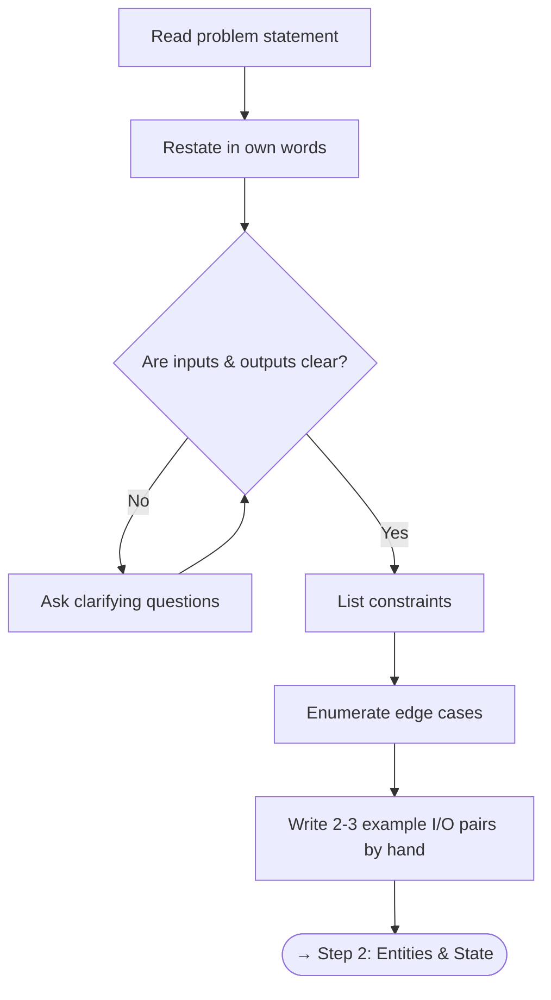

# Step 1 — Understand the Problem

> *"A problem well-stated is half-solved."* — Charles Kettering

Before writing a single line of code, make sure you **fully understand** what is being asked.

---

## Checklist

- [ ] Read the problem statement **twice**
- [ ] Restate the problem in your own words
- [ ] Identify **inputs** — types, ranges, sizes
- [ ] Identify **outputs** — what exactly to return
- [ ] Clarify **constraints** — time/space limits, input size *n*
- [ ] List **edge cases** — empty input, single element, duplicates, negative values, overflow
- [ ] Ask clarifying questions (in an interview, *ask out loud*)

---

## Flowchart

---

## Deep Dive

### 1.1 Restate the Problem

Paraphrase the problem in simpler language. This confirms comprehension and often reveals hidden requirements.

**Example — Two Sum:**

> *Given an array of integers `nums` and a target integer `target`, return the indices of the two numbers that add up to `target`. Each input has exactly one solution, and you may not use the same element twice.*

Restated: "Find two distinct positions in the array whose values sum to `target`."

### 1.2 Identify Inputs & Outputs

| Aspect | Questions to Ask |
|--------|-----------------|
| **Input type** | Array? String? Tree node? Graph adjacency list? |
| **Input size** | What is the maximum *n*? (drives Big-O target) |
| **Value range** | Negative numbers? Zeros? Floating point? |
| **Output type** | Return a value? Modify in-place? Print? |
| **Output format** | Sorted? Any valid answer? All answers? |

### 1.3 Constraints → Big-O Target

| Max *n* | Target Complexity |
|---------|-------------------|
| ≤ 10 | O(n!) — brute force / backtracking |
| ≤ 20 | O(2ⁿ) — bitmask / subset enumeration |
| ≤ 500 | O(n³) |
| ≤ 5 000 | O(n²) |
| ≤ 10⁶ | O(n log n) or O(n) |
| ≤ 10⁸ | O(n) or O(log n) |

### 1.4 Edge Cases

Always consider:

- **Empty** input (`[]`, `""`, `null`)
- **Single element** (`[5]`)
- **All same** values (`[2,2,2,2]`)
- **Already sorted / reverse sorted**
- **Negative numbers**, zeros
- **Very large** or very small values (overflow)
- **Duplicate** values

---

## Practice

Try restating these problems before looking at solutions:

- [Two Sum](https://leetcode.com/problems/two-sum/){ target=_blank } (Easy)
- [Valid Parentheses](https://leetcode.com/problems/valid-parentheses/){ target=_blank } (Easy)
- [Merge Intervals](https://leetcode.com/problems/merge-intervals/){ target=_blank } (Medium)

---

[:octicons-arrow-right-24: Next: Step 2 — Identify Entities & State](step2-entities.md)
