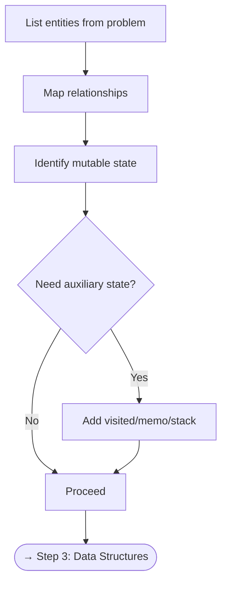
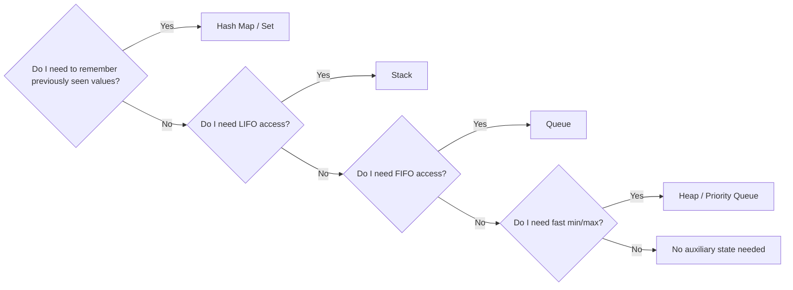

# Step 2 — Identify Entities & State

Once you understand the problem, identify the **things** (entities) you will work with and the **state** you need to track as your algorithm runs.

---

## Checklist

- [ ] List every **entity** mentioned in the problem (numbers, nodes, intervals, characters …)
- [ ] Determine **relationships** between entities (parent-child, before-after, maps-to)
- [ ] Identify **mutable state** — counters, pointers, running totals, flags
- [ ] Decide which state is **local** (inside a loop) vs. **global** (across iterations)
- [ ] Consider whether you need **auxiliary state** (visited set, memo table, stack)

---

## Flowchart

---

## Deep Dive

### 2.1 What Are Entities?

Entities are the **nouns** in the problem statement.

| Problem | Entities |
|---------|----------|
| Two Sum | `nums` array, `target` value, indices |
| Valid Parentheses | string of brackets, individual characters |
| Merge Intervals | list of intervals, start/end values |
| Binary Tree Level Order | tree nodes, levels/depths, values |

### 2.2 What Is State?

State is any value that **changes** during execution.

| State Type | Examples |
|------------|----------|
| **Pointers / Indices** | `left`, `right`, `i`, `j` |
| **Counters** | `count`, `maxLen`, `currentSum` |
| **Flags** | `found`, `isValid` |
| **Collections** | `visited` set, `memo` dict, `stack` |
| **Running values** | `minSoFar`, `maxProfit`, `windowSum` |

### 2.3 Entity–State Table

Before coding, fill in a table like this:

| Entity | Type | State Tracked | Scope |
|--------|------|---------------|-------|
| `nums` | `int[]` | — (input, read-only) | global |
| current pair sum | `int` | changes each iteration | local |
| seen values | `HashMap<int,int>` | grows as we iterate | global |
| result indices | `int[2]` | set once | global |

### 2.4 Recognizing Auxiliary State

---

## Practice

For each problem, try listing entities and state before reading solutions:

- [Contains Duplicate](https://leetcode.com/problems/contains-duplicate/){ target=_blank }
- [Valid Anagram](https://leetcode.com/problems/valid-anagram/){ target=_blank }
- [Group Anagrams](https://leetcode.com/problems/group-anagrams/){ target=_blank }

---

[:octicons-arrow-left-24: Previous: Step 1 — Understand](step1-understand.md) · [:octicons-arrow-right-24: Next: Step 3 — Data Structures](step3-data-structures.md)
