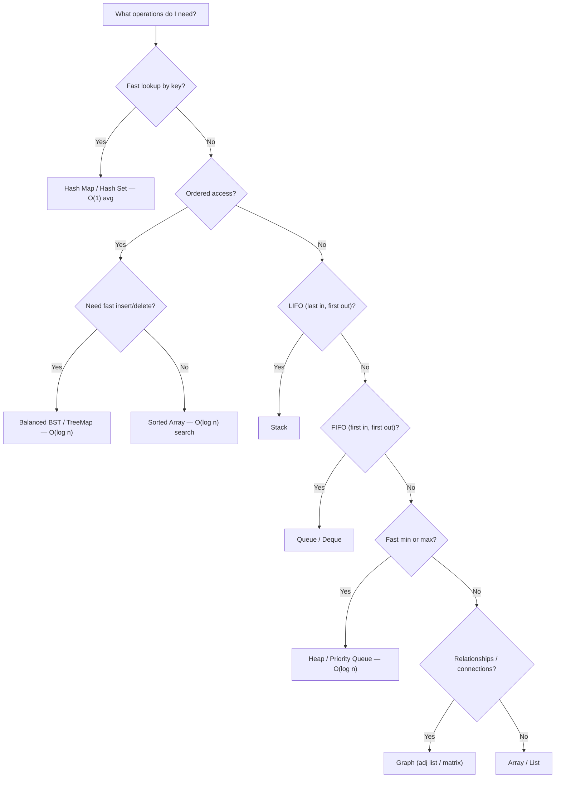

# Step 3 — Choose Data Structures

The right data structure makes the algorithm fall into place. The wrong one makes everything painful.

---

## Checklist

- [ ] Review the entities and state from [Step 2](step2-entities.md)
- [ ] For each entity, pick the data structure that supports the **operations you need** in the required time complexity
- [ ] Consider trade-offs: time vs. space, simplicity vs. performance
- [ ] Verify the structure handles your edge cases

---

## Decision Flowchart

---

## Quick Reference Table

| Data Structure | Insert | Delete | Search | Access | Use When |
|----------------|--------|--------|--------|--------|----------|
| **Array** | O(n) | O(n) | O(n) | O(1) | Index-based access, iteration |
| **Hash Map** | O(1)* | O(1)* | O(1)* | — | Key-value lookup, counting |
| **Hash Set** | O(1)* | O(1)* | O(1)* | — | Membership check, dedup |
| **Stack** | O(1) | O(1) | O(n) | O(1) top | Matching brackets, DFS, undo |
| **Queue** | O(1) | O(1) | O(n) | O(1) front | BFS, level-order, scheduling |
| **Heap** | O(log n) | O(log n) | O(n) | O(1) top | Top-K, median, scheduling |
| **BST / TreeMap** | O(log n) | O(log n) | O(log n) | — | Ordered keys, range queries |
| **Trie** | O(m) | O(m) | O(m) | — | Prefix search, autocomplete |
| **Graph** | O(1) | O(V+E) | O(V+E) | — | Paths, cycles, connectivity |

\* amortized average

---

## Common Pairings

| Pattern | Primary Structure | Auxiliary Structure |
|---------|-------------------|---------------------|
| Two Sum | Array | Hash Map |
| Valid Parentheses | String | Stack |
| BFS / Level Order | Tree/Graph | Queue |
| DFS | Tree/Graph | Stack (or recursion) |
| Sliding Window | Array/String | Hash Map or Deque |
| Top K | Array | Heap |
| Interval Merge | Array of intervals | Sorted Array |
| Union Find | Graph | Disjoint Set Array |

---

## Tips

!!! tip "When in Doubt, Start with a Hash Map"
    If you need O(1) lookup and the problem involves finding pairs, counting, or checking membership, a hash map is almost always the right first choice.

!!! warning "Don't Over-Engineer"
    Using a balanced BST when a sorted array + binary search suffices adds unnecessary complexity. Pick the simplest structure that meets the requirements.

---

## Practice

- [Top K Frequent Elements](https://leetcode.com/problems/top-k-frequent-elements/){ target=_blank } — Heap
- [Implement Queue using Stacks](https://leetcode.com/problems/implement-queue-using-stacks/){ target=_blank } — Stack + Queue
- [LRU Cache](https://leetcode.com/problems/lru-cache/){ target=_blank } — Hash Map + Doubly Linked List

---

[:octicons-arrow-left-24: Previous: Step 2 — Entities & State](step2-entities.md) · [:octicons-arrow-right-24: Next: Step 4 — Select Algorithms](step4-algorithms.md)
