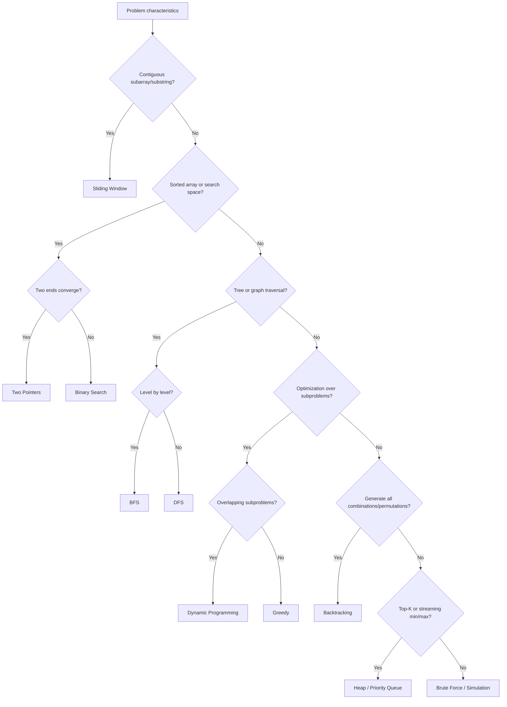
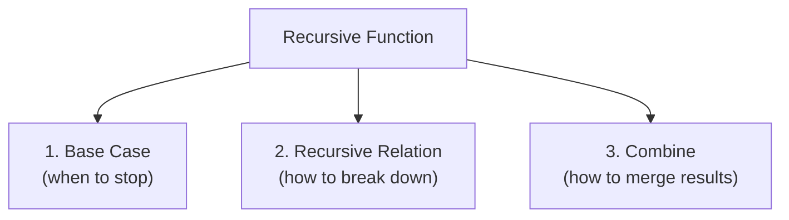

# Step 4 — Select Algorithms

With entities, state, and data structures identified, now choose the **algorithmic technique** that solves the problem.

---

## Checklist

- [ ] Brainstorm a **brute-force** solution first — what is the simplest approach?
- [ ] Estimate brute-force Big-O; does it fit constraints?
- [ ] Identify the **pattern** — does this match a known technique?
- [ ] Consider **multiple approaches** and compare trade-offs
- [ ] Check whether **recursion** is natural for the problem
- [ ] If recursive, identify the **base case** and **recursive relation**
- [ ] If DP, identify **overlapping subproblems** and **optimal substructure**
- [ ] Pick the approach that balances **correctness, efficiency, and simplicity**

---

## Pattern Recognition Flowchart

---

## Algorithm Comparison Table

| Technique | Time | Space | When to Use | Watch Out For |
|-----------|------|-------|-------------|---------------|
| **Brute Force** | O(n²)+ | O(1) | Baseline; tiny *n* | TLE on large inputs |
| **Two Pointers** | O(n) | O(1) | Sorted arrays, pair finding | Requires sorted input |
| **Sliding Window** | O(n) | O(k) | Contiguous subarrays of size k | Window expansion/shrink logic |
| **Binary Search** | O(log n) | O(1) | Monotonic search space | Off-by-one errors |
| **BFS** | O(V+E) | O(V) | Shortest path (unweighted), levels | Memory for queue |
| **DFS** | O(V+E) | O(V) | Paths, cycles, connectivity | Stack overflow on deep graphs |
| **Dynamic Programming** | varies | varies | Overlapping subproblems + optimal substructure | State definition, transitions |
| **Greedy** | O(n log n) | O(1) | Local choice leads to global optimum | Proving correctness |
| **Backtracking** | O(2ⁿ) | O(n) | Enumerate all valid configurations | Pruning for efficiency |
| **Divide & Conquer** | O(n log n) | O(log n) | Problem splits into independent halves | Merge step complexity |

---

## Recursion Deep Dive

### When Is Recursion Natural?

- Tree problems (almost always)
- Divide & conquer (merge sort, binary search)
- Backtracking / subset generation
- Dynamic programming (top-down with memoization)

### The Three Parts of Every Recursive Solution

| Part | Description | Example (Fibonacci) |
|------|-------------|---------------------|
| **Base case** | Smallest instance that can be solved directly | `fib(0) = 0`, `fib(1) = 1` |
| **Recursive relation** | Express `f(n)` in terms of smaller subproblems | `fib(n) = fib(n-1) + fib(n-2)` |
| **Combine** | Merge subproblem results into the final answer | return the sum |

### Recursion → DP Conversion

---

## Comparing Multiple Approaches

Always generate at least **two** approaches before coding:

| Approach | Time | Space | Pros | Cons |
|----------|------|-------|------|------|
| Brute-force nested loops | O(n²) | O(1) | Simple | Too slow for n > 10⁴ |
| Hash map single pass | O(n) | O(n) | Fast | Extra memory |
| Sort + two pointers | O(n log n) | O(1) | In-place | Loses original indices |

Discuss trade-offs with the interviewer, then pick the best fit.

---

## Practice

- [Climbing Stairs](https://leetcode.com/problems/climbing-stairs/){ target=_blank } — DP vs. recursion
- [Coin Change](https://leetcode.com/problems/coin-change/){ target=_blank } — DP vs. greedy
- [Subsets](https://leetcode.com/problems/subsets/){ target=_blank } — Backtracking
- [Kth Largest Element](https://leetcode.com/problems/kth-largest-element-in-an-array/){ target=_blank } — Heap vs. quickselect

---

[:octicons-arrow-left-24: Previous: Step 3 — Data Structures](step3-data-structures.md) · [:octicons-arrow-right-24: Next: Step 5 — Plan Your Approach](step5-approach.md)
