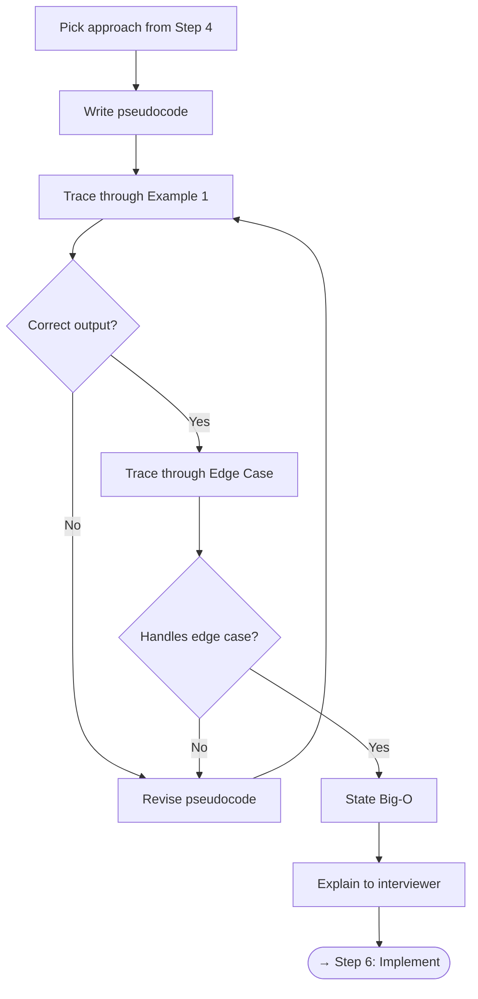

# Step 5 — Plan Your Approach

Before writing code, **write pseudocode** and confirm the plan. This is where you prevent costly rewrites.

---

## Checklist

- [ ] Choose the approach from [Step 4](step4-algorithms.md)
- [ ] Write **pseudocode** — plain language or structured comments
- [ ] Walk through 1–2 examples with your pseudocode by hand
- [ ] Confirm the approach handles all edge cases from [Step 1](step1-understand.md)
- [ ] State expected **time and space complexity**
- [ ] In an interview: **explain your plan to the interviewer** before coding

---

## Flowchart



---

## How to Write Good Pseudocode

### Principles

1. **Use plain language** — not a specific programming language
2. **Be specific** about data structures and operations
3. **Number your steps** for easy reference
4. **Mark edge case handling** explicitly

### Example: Two Sum

```
FUNCTION twoSum(nums, target):
    1. Create empty hash map: seen = {}
    2. FOR each index i, value v in nums:
        a. complement = target - v
        b. IF complement IN seen:
             RETURN [seen[complement], i]
        c. seen[v] = i
    3. RETURN [] (no solution — should not happen per constraints)
```

### Example: Merge Intervals

```
FUNCTION mergeIntervals(intervals):
    1. IF intervals is empty: RETURN []
    2. SORT intervals by start value
    3. result = [intervals[0]]
    4. FOR each interval in intervals[1:]:
        a. last = result[-1]
        b. IF interval.start <= last.end:
             last.end = MAX(last.end, interval.end)  // merge
        c. ELSE:
             APPEND interval to result
    5. RETURN result
```

---

## Comparing Plans

If you brainstormed multiple approaches, make a quick comparison before committing:

| Criteria | Approach A | Approach B |
|----------|-----------|-----------|
| Time complexity | O(n²) | O(n) |
| Space complexity | O(1) | O(n) |
| Code complexity | Low | Medium |
| Handles all edge cases? | Yes | Yes |
| **Decision** | | **✓ Pick this one** |

---

## Communication Tips

!!! tip "Think Out Loud"
    In an interview, narrate your thought process:

    - *"I'm thinking of two approaches…"*
    - *"This approach is O(n) time with O(n) space…"*
    - *"Let me trace through this example to verify…"*
    - *"Does this approach make sense, or would you prefer a different direction?"*

!!! warning "Don't Skip This Step"
    Jumping straight to code is the #1 cause of bugs and wasted time in interviews. A 3-minute planning phase saves 10 minutes of debugging.

---

[:octicons-arrow-left-24: Previous: Step 4 — Select Algorithms](step4-algorithms.md) · [:octicons-arrow-right-24: Next: Step 6 — Implement](step6-implement.md)
