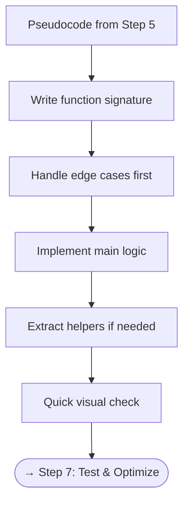

# Step 6 — Implement

Time to translate your plan into clean, working code. Focus on **correctness first**, then polish.

---

## Checklist

- [ ] Translate pseudocode into real code **line by line**
- [ ] Use **meaningful variable names**
- [ ] Extract **helper functions** for repeated logic
- [ ] Handle **edge cases** explicitly (empty input, single element, etc.)
- [ ] Keep code **readable** — the interviewer needs to follow along
- [ ] Avoid premature optimization — get it working first

---

## Flowchart



---

## Implementation Best Practices

### 6.1 Start with the Signature

Define inputs, outputs, and types clearly:

=== "Python"

    ```python
    def two_sum(nums: list[int], target: int) -> list[int]:
        ...
    ```

=== "TypeScript"

    ```typescript
    function twoSum(nums: number[], target: number): number[] {
        // ...
    }
    ```

=== "Rust"

    ```rust
    pub fn two_sum(nums: Vec<i32>, target: i32) -> Vec<i32> {
        todo!()
    }
    ```

=== "Java"

    ```java
    public int[] twoSum(int[] nums, int target) {
        // ...
    }
    ```

=== "C#"

    ```csharp
    public int[] TwoSum(int[] nums, int target) {
        // ...
    }
    ```

=== "ASM"

    ```asm
    ; x86-64 — two_sum not practical in pure ASM for interviews
    ; Focus on higher-level languages for implementation
    section .text
    global two_sum
    two_sum:
        ; rdi = nums pointer, rsi = length, rdx = target
        ret
    ```

=== "Scala"

    ```scala
    def twoSum(nums: Array[Int], target: Int): Array[Int] = {
      ???
    }
    ```

### 6.2 Handle Edge Cases First

```python
def merge_intervals(intervals):
    if not intervals:
        return []
    # ... main logic follows
```

### 6.3 Extract Helper Functions

If a block of logic is complex or reused, extract it:

```python
def is_valid_parentheses(s: str) -> bool:
    def matches(open_char: str, close_char: str) -> bool:
        pairs = {'(': ')', '[': ']', '{': '}'}
        return pairs.get(open_char) == close_char

    stack = []
    for char in s:
        if char in '([{':
            stack.append(char)
        elif not stack or not matches(stack.pop(), char):
            return False
    return len(stack) == 0
```

### 6.4 Naming Conventions

| ❌ Bad | ✅ Good | Why |
|--------|---------|-----|
| `d` | `seen` | Describes purpose |
| `temp` | `complement` | Describes value |
| `arr` | `intervals` | Matches problem domain |
| `res` | `merged` | Describes content |
| `i, j` | `left, right` | Describes role (for pointers) |

---

## Common Interview Anti-Patterns

!!! danger "Avoid These"
    - **Giant monolithic function** — break logic into helpers
    - **Magic numbers** — use named constants
    - **Mutating input** without being asked — always clarify
    - **Ignoring types** — in typed languages, be explicit
    - **Writing code before the plan** — refer back to your pseudocode

---

[:octicons-arrow-left-24: Previous: Step 5 — Plan](step5-approach.md) · [:octicons-arrow-right-24: Next: Step 7 — Test & Optimize](step7-test-optimize.md)
