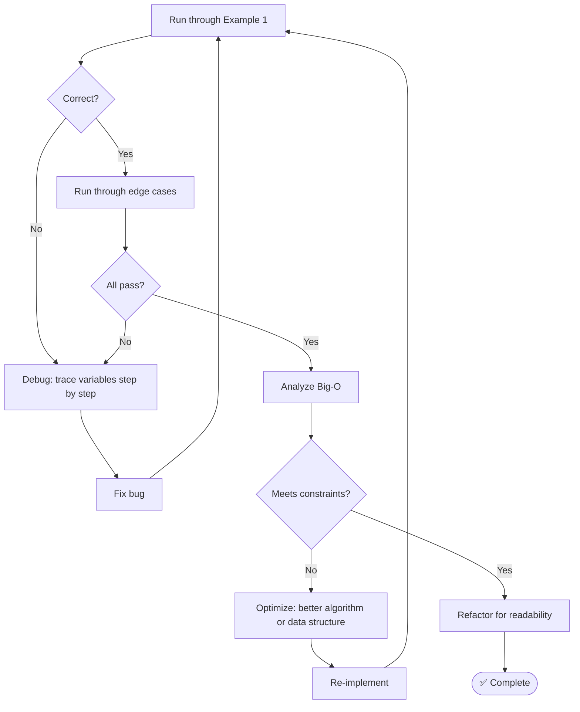
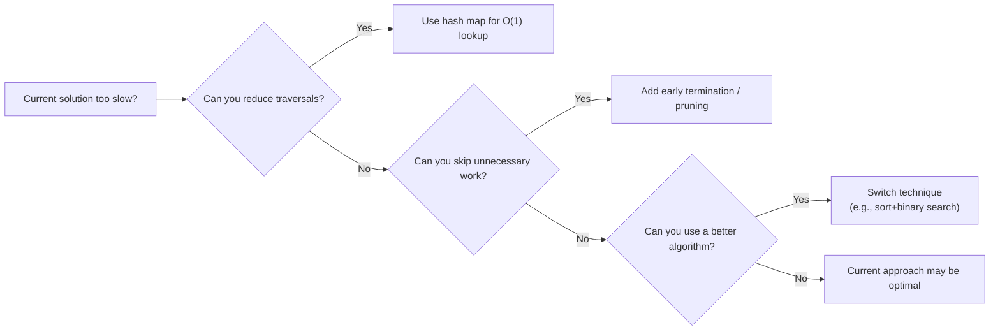

# Step 7 — Test & Optimize

Your code is written. Now verify it works and look for improvements.

---

## Checklist

- [ ] **Dry-run** the code with Example 1 (trace every variable)
- [ ] Dry-run with Example 2 (different path)
- [ ] Dry-run with **edge cases** (empty, single, max size)
- [ ] Confirm **time complexity** matches your target
- [ ] Confirm **space complexity**
- [ ] Look for **off-by-one** errors
- [ ] Check for **null/undefined** issues
- [ ] Consider: can you **reduce space** (e.g., in-place, rolling array)?
- [ ] Consider: can you **reduce time** (e.g., early termination, better data structure)?
- [ ] Refactor for **readability** if time allows

---

## Flowchart

---

## How to Dry-Run

Trace through your code like a debugger. Use a table:

**Example: Two Sum** with `nums = [2, 7, 11, 15]`, `target = 9`

| Step | `i` | `v` | `complement` | `seen` | Action |
|------|-----|-----|-------------|--------|--------|
| 1 | 0 | 2 | 7 | `{}` | 7 not in seen → add `{2:0}` |
| 2 | 1 | 7 | 2 | `{2:0}` | 2 **in** seen → return `[0, 1]` ✅ |

---

## Big-O Cheat Sheet

### Time Complexity

| Pattern | Typical Complexity |
|---------|-------------------|
| Single loop over n elements | O(n) |
| Nested loops | O(n²) |
| Sort then scan | O(n log n) |
| Binary search | O(log n) |
| Hash map lookup in a loop | O(n) |
| BFS/DFS over graph | O(V + E) |
| All subsets | O(2ⁿ) |
| All permutations | O(n!) |

### Space Complexity

| Structure | Space |
|-----------|-------|
| A few variables | O(1) |
| Hash map of n items | O(n) |
| Recursion depth d | O(d) stack |
| 2D DP table | O(n × m) |
| Adjacency list | O(V + E) |

---

## Common Bugs to Check

| Bug | How to Catch |
|-----|-------------|
| Off-by-one | Check loop bounds: `< n` vs `<= n` |
| Empty input | Test with `[]`, `""`, `null` |
| Integer overflow | Large values near `INT_MAX` |
| Wrong return type | Return indices vs. values |
| Mutated input | Did you accidentally sort the original? |
| Missing base case | Recursion that never terminates |

---

## Optimization Strategies

---

## After Solving: Reflect

Ask yourself:

1. What **pattern** did this problem use?
2. What similar problems could I solve with this technique?
3. What would I do differently next time?

Link your reflections to the [Pattern Reference](../patterns/index.md) for long-term learning.

---

[:octicons-arrow-left-24: Previous: Step 6 — Implement](step6-implement.md) · [:octicons-arrow-right-24: Back to Framework Overview](index.md)
