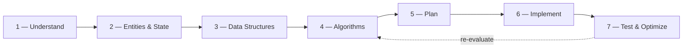

# SWE Interview Coding Guide

A comprehensive, step-by-step framework for solving coding interview problems — from understanding the question to optimizing your solution.

---

## How to Use This Guide

- :material-format-list-checks:{ .lg .middle } **Problem Solving Framework**

    ---

    A 7-step checklist that walks you through every coding problem.

    [:octicons-arrow-right-24: Start the Framework](guide/index.md)

- :material-code-tags:{ .lg .middle } **Code Examples**

    ---

    Full worked examples in 7 languages across varied problem types.

    [:octicons-arrow-right-24: Browse Examples](examples/index.md)

- :material-puzzle:{ .lg .middle } **Pattern Reference**

    ---

    Common algorithmic patterns with identification tips and templates.

    [:octicons-arrow-right-24: Explore Patterns](patterns/index.md)

- :material-book-alphabet:{ .lg .middle } **Glossary**

    ---

    Algorithms, data structures, and 150+ LeetCode problems — all cross-linked and tagged.

    [:octicons-arrow-right-24: Browse Glossary](glossary/index.md)

- :material-cards:{ .lg .middle } **Flash Cards & Quizzes**

    ---

    Self-test with collapsible flash cards and scored quizzes.

    [:octicons-arrow-right-24: Study Flash Cards](flashcards/index.md) · [:octicons-arrow-right-24: Take Quizzes](quizzes/index.md)

---

## The 7-Step Framework at a Glance

| Step | Key Question |
|------|-------------|
| [1 — Understand the Problem](guide/step1-understand.md) | *What are the inputs, outputs, and constraints?* |
| [2 — Identify Entities & State](guide/step2-entities.md) | *What data do I need to track?* |
| [3 — Choose Data Structures](guide/step3-data-structures.md) | *What structure best fits the data?* |
| [4 — Select Algorithms](guide/step4-algorithms.md) | *What approach solves the problem efficiently?* |
| [5 — Plan Your Approach](guide/step5-approach.md) | *What is my pseudocode / step-by-step plan?* |
| [6 — Implement](guide/step6-implement.md) | *Translate the plan into clean code.* |
| [7 — Test & Optimize](guide/step7-test-optimize.md) | *Does it work? Can it be faster/cleaner?* |

---

## Quick Links

- :fontawesome-brands-python: [LeetCode](https://leetcode.com/problemset/){ target=_blank }
- :material-book-open-variant: [NeetCode Roadmap](https://neetcode.io/roadmap){ target=_blank }

---

## Supported Languages

All code examples are provided in:

| Language | Tab Label |
|----------|-----------|
| Python 3 | `Python` |
| TypeScript | `TypeScript` |
| Rust | `Rust` |
| Java | `Java` |
| C# | `C#` |
| x86-64 Assembly | `ASM` |
| Scala | `Scala` |

!!! tip "Global Language Switching"
    Click any language tab and **every code block on the page** will switch to the same language. Your preference is saved across pages.
