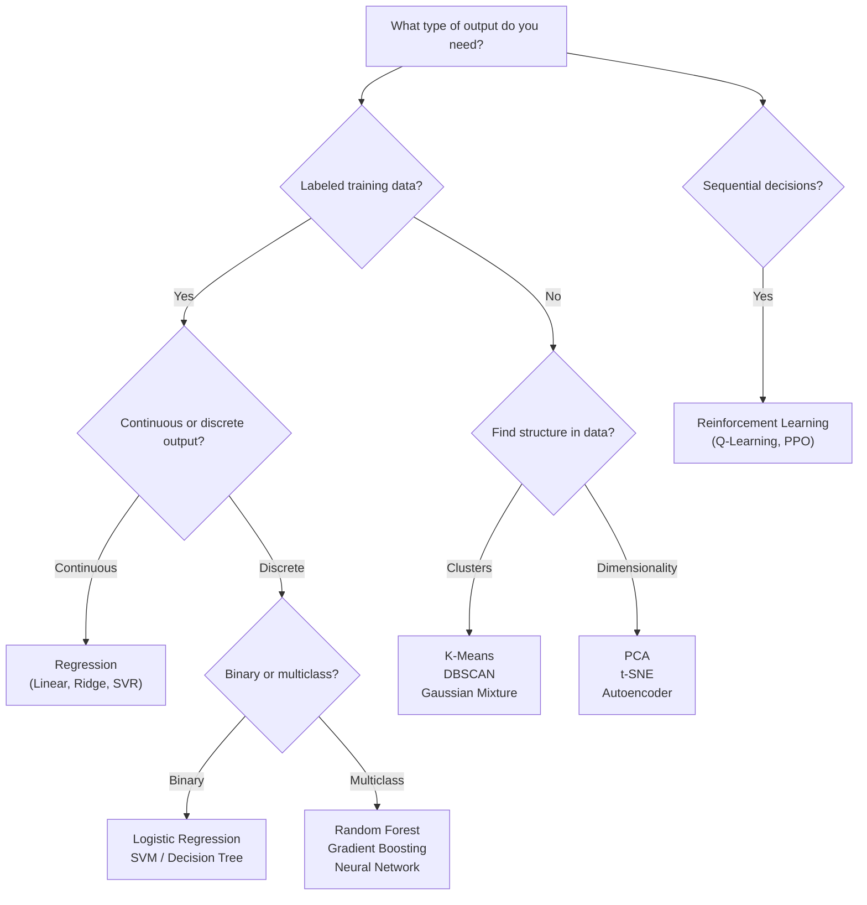
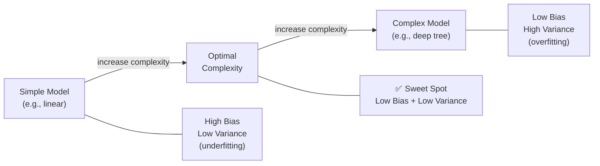

# Machine Learning Core Problems

## When ML Questions Appear in SWE Interviews

Machine learning questions in **SWE (software engineering) interviews** differ significantly from **MLE (machine learning engineer) interviews**.

| Context | SWE Interview | MLE Interview |
|---------|--------------|---------------|
| **Focus** | Implement algorithms from scratch | Model selection, tuning, pipelines |
| **Depth** | Understanding intuition + code | Math derivations, research familiarity |
| **Typical companies** | Google, Meta, Amazon (infra roles) | DeepMind, OpenAI, applied ML teams |
| **Examples** | Implement KNN, linear regression | Explain transformer attention, RLHF |

!!! note "SWE vs MLE"
    In SWE interviews, ML questions test whether you can **code** an algorithm cleanly and explain its tradeoffs — not whether you can derive the math or tune hyperparameters. Focus on clean implementation and clear explanation.

---

## Choosing the Right ML Algorithm



---

## Core ML Problem Categories

| Category | Description | Labeled Data | Examples |
|----------|-------------|-------------|---------|
| **Supervised** | Learn mapping from input → output | ✅ Required | Classification, Regression |
| **Unsupervised** | Find hidden structure in data | ❌ None | Clustering, Dimensionality Reduction |
| **Semi-supervised** | Small labeled + large unlabeled set | ⚠️ Partial | Self-training, Label Propagation |
| **Reinforcement** | Agent learns by reward/penalty | ❌ (uses rewards) | Game AI, Robotics, RecSys |
| **Self-supervised** | Labels derived from data itself | ❌ (auto-generated) | BERT, GPT pretraining, SimCLR |

---

## 1. Linear Regression (Gradient Descent)

**Core idea:** Find weights `w` and bias `b` minimizing mean squared error via iterative gradient steps.

=== "Python"

    ```python
    import numpy as np

    class LinearRegression:
        def __init__(self, lr: float = 0.01, epochs: int = 1000):
            self.lr = lr
            self.epochs = epochs
            self.w: np.ndarray | None = None
            self.b: float = 0.0

        def fit(self, X: np.ndarray, y: np.ndarray) -> None:
            n, d = X.shape
            self.w = np.zeros(d)
            self.b = 0.0
            for _ in range(self.epochs):
                y_pred = X @ self.w + self.b
                error = y_pred - y
                self.w -= self.lr * (2 / n) * (X.T @ error)
                self.b -= self.lr * (2 / n) * error.sum()

        def predict(self, X: np.ndarray) -> np.ndarray:
            return X @ self.w + self.b

    # Example
    X = np.array([[1.0], [2.0], [3.0], [4.0]])
    y = np.array([2.0, 4.0, 6.0, 8.0])
    model = LinearRegression(lr=0.01, epochs=1000)
    model.fit(X, y)
    print(model.predict(np.array([[5.0]])))  # ≈ [10.0]
    ```

=== "TypeScript"

    ```typescript
    class LinearRegression {
        private w: number[] = [];
        private b = 0;
        constructor(private lr = 0.01, private epochs = 1000) {}

        fit(X: number[][], y: number[]): void {
            const n = X.length, d = X[0].length;
            this.w = new Array(d).fill(0);
            this.b = 0;
            for (let ep = 0; ep < this.epochs; ep++) {
                const pred = X.map(row => row.reduce((s, x, j) => s + x * this.w[j], this.b));
                const err = pred.map((p, i) => p - y[i]);
                const grad = new Array(d).fill(0);
                for (let i = 0; i < n; i++)
                    for (let j = 0; j < d; j++)
                        grad[j] += (2 / n) * err[i] * X[i][j];
                this.w = this.w.map((wj, j) => wj - this.lr * grad[j]);
                this.b -= this.lr * (2 / n) * err.reduce((s, e) => s + e, 0);
            }
        }

        predict(X: number[][]): number[] {
            return X.map(row => row.reduce((s, x, j) => s + x * this.w[j], this.b));
        }
    }
    ```

=== "Rust"

    ```rust
    pub struct LinearRegression {
        pub w: Vec<f64>,
        pub b: f64,
        lr: f64,
        epochs: usize,
    }

    impl LinearRegression {
        pub fn new(lr: f64, epochs: usize) -> Self {
            Self { w: vec![], b: 0.0, lr, epochs }
        }

        pub fn fit(&mut self, x: &[Vec<f64>], y: &[f64]) {
            let (n, d) = (x.len(), x[0].len());
            self.w = vec![0.0; d];
            self.b = 0.0;
            for _ in 0..self.epochs {
                let pred: Vec<f64> = x.iter().map(|row| {
                    row.iter().zip(&self.w).map(|(xi, wi)| xi * wi).sum::<f64>() + self.b
                }).collect();
                let err: Vec<f64> = pred.iter().zip(y).map(|(p, yi)| p - yi).collect();
                let mut grad = vec![0.0; d];
                for i in 0..n {
                    for j in 0..d { grad[j] += (2.0 / n as f64) * err[i] * x[i][j]; }
                }
                for j in 0..d { self.w[j] -= self.lr * grad[j]; }
                self.b -= self.lr * (2.0 / n as f64) * err.iter().sum::<f64>();
            }
        }

        pub fn predict(&self, x: &[Vec<f64>]) -> Vec<f64> {
            x.iter().map(|row| row.iter().zip(&self.w).map(|(xi, wi)| xi * wi).sum::<f64>() + self.b).collect()
        }
    }
    ```

=== "Java"

    ```java
    public class LinearRegression {
        private double[] w;
        private double b;
        private final double lr;
        private final int epochs;

        public LinearRegression(double lr, int epochs) { this.lr = lr; this.epochs = epochs; }

        public void fit(double[][] X, double[] y) {
            int n = X.length, d = X[0].length;
            w = new double[d]; b = 0;
            for (int ep = 0; ep < epochs; ep++) {
                double[] err = new double[n];
                for (int i = 0; i < n; i++) {
                    double p = b;
                    for (int j = 0; j < d; j++) p += X[i][j] * w[j];
                    err[i] = p - y[i];
                }
                double[] grad = new double[d];
                for (int i = 0; i < n; i++)
                    for (int j = 0; j < d; j++)
                        grad[j] += (2.0 / n) * err[i] * X[i][j];
                for (int j = 0; j < d; j++) w[j] -= lr * grad[j];
                double sumErr = 0; for (double e : err) sumErr += e;
                b -= lr * (2.0 / n) * sumErr;
            }
        }

        public double[] predict(double[][] X) {
            double[] out = new double[X.length];
            for (int i = 0; i < X.length; i++) {
                out[i] = b;
                for (int j = 0; j < w.length; j++) out[i] += X[i][j] * w[j];
            }
            return out;
        }
    }
    ```

=== "C#"

    ```csharp
    public class LinearRegression {
        private double[] w = Array.Empty<double>();
        private double b;
        private readonly double lr;
        private readonly int epochs;

        public LinearRegression(double lr = 0.01, int epochs = 1000) { this.lr = lr; this.epochs = epochs; }

        public void Fit(double[][] X, double[] y) {
            int n = X.Length, d = X[0].Length;
            w = new double[d]; b = 0;
            for (int ep = 0; ep < epochs; ep++) {
                var err = new double[n];
                for (int i = 0; i < n; i++) {
                    err[i] = b - y[i];
                    for (int j = 0; j < d; j++) err[i] += X[i][j] * w[j];
                }
                var grad = new double[d];
                for (int i = 0; i < n; i++)
                    for (int j = 0; j < d; j++)
                        grad[j] += (2.0 / n) * err[i] * X[i][j];
                for (int j = 0; j < d; j++) w[j] -= lr * grad[j];
                b -= lr * (2.0 / n) * err.Sum();
            }
        }

        public double[] Predict(double[][] X) =>
            X.Select(row => b + row.Zip(w, (x, wj) => x * wj).Sum()).ToArray();
    }
    ```

=== "ASM"

    ```asm
    ; Linear regression gradient descent — conceptual x86-64 sketch
    ; Registers: xmm0=prediction, xmm1=error, xmm2=lr, xmm3=weight
    ; Full implementation requires SIMD or scalar loop over feature vector
    ;
    ; outer_loop:
    ;   call compute_dot_product   ; xmm0 = X[i] · w + b
    ;   subsd xmm0, [y_ptr]        ; xmm0 = pred - y[i]   (error)
    ;   mulsd xmm0, xmm2           ; xmm0 = lr * error
    ;   subsd xmm3, xmm0           ; w -= lr * error (single feature)
    ;   dec rcx
    ;   jnz outer_loop
    ```

=== "Scala"

    ```scala
    class LinearRegression(lr: Double = 0.01, epochs: Int = 1000) {
      private var w: Array[Double] = Array.empty
      private var b: Double = 0.0

      def fit(X: Array[Array[Double]], y: Array[Double]): Unit = {
        val (n, d) = (X.length, X(0).length)
        w = Array.fill(d)(0.0); b = 0.0
        for (_ <- 0 until epochs) {
          val err = X.zipWithIndex.map { case (row, i) =>
            row.zip(w).map { case (x, wj) => x * wj }.sum + b - y(i)
          }
          val grad = Array.fill(d)(0.0)
          for (i <- 0 until n; j <- 0 until d) grad(j) += (2.0 / n) * err(i) * X(i)(j)
          for (j <- 0 until d) w(j) -= lr * grad(j)
          b -= lr * (2.0 / n) * err.sum
        }
      }

      def predict(X: Array[Array[Double]]): Array[Double] =
        X.map(row => row.zip(w).map { case (x, wj) => x * wj }.sum + b)
    }
    ```

---

## 2. K-Means Clustering

**Core idea:** Iteratively assign points to nearest centroid, then recompute centroids until convergence.

=== "Python"

    ```python
    import numpy as np

    class KMeans:
        def __init__(self, k: int, max_iter: int = 100):
            self.k = k
            self.max_iter = max_iter
            self.centroids: np.ndarray | None = None

        def fit(self, X: np.ndarray) -> None:
            rng = np.random.default_rng(42)
            idx = rng.choice(len(X), self.k, replace=False)
            self.centroids = X[idx].copy()
            for _ in range(self.max_iter):
                labels = self._assign(X)
                new_centroids = np.array([X[labels == c].mean(axis=0) for c in range(self.k)])
                if np.allclose(self.centroids, new_centroids):
                    break
                self.centroids = new_centroids

        def _assign(self, X: np.ndarray) -> np.ndarray:
            dists = np.linalg.norm(X[:, None] - self.centroids[None], axis=2)
            return np.argmin(dists, axis=1)

        def predict(self, X: np.ndarray) -> np.ndarray:
            return self._assign(X)
    ```

=== "TypeScript"

    ```typescript
    class KMeans {
        centroids: number[][] = [];
        constructor(private k: number, private maxIter = 100) {}

        fit(X: number[][]): void {
            this.centroids = X.slice(0, this.k).map(r => [...r]);
            for (let it = 0; it < this.maxIter; it++) {
                const labels = this.predict(X);
                const next: number[][] = Array.from({ length: this.k }, () =>
                    new Array(X[0].length).fill(0));
                const counts = new Array(this.k).fill(0);
                X.forEach((row, i) => {
                    const c = labels[i];
                    counts[c]++;
                    row.forEach((v, j) => { next[c][j] += v; });
                });
                const prev = this.centroids;
                this.centroids = next.map((s, c) => s.map(v => v / counts[c]));
                if (prev.every((p, c) => p.every((v, j) => Math.abs(v - this.centroids[c][j]) < 1e-9)))
                    break;
            }
        }

        predict(X: number[][]): number[] {
            return X.map(row => {
                let best = 0, bestD = Infinity;
                this.centroids.forEach((c, ci) => {
                    const d = Math.sqrt(row.reduce((s, v, j) => s + (v - c[j]) ** 2, 0));
                    if (d < bestD) { bestD = d; best = ci; }
                });
                return best;
            });
        }
    }
    ```

=== "Rust"

    ```rust
    pub struct KMeans { pub centroids: Vec<Vec<f64>>, k: usize, max_iter: usize }

    impl KMeans {
        pub fn new(k: usize, max_iter: usize) -> Self { Self { centroids: vec![], k, max_iter } }

        fn dist(a: &[f64], b: &[f64]) -> f64 {
            a.iter().zip(b).map(|(x, y)| (x - y).powi(2)).sum::<f64>().sqrt()
        }

        pub fn fit(&mut self, x: &[Vec<f64>]) {
            self.centroids = x[..self.k].to_vec();
            for _ in 0..self.max_iter {
                let labels = self.predict(x);
                let d = x[0].len();
                let mut sums = vec![vec![0.0; d]; self.k];
                let mut counts = vec![0usize; self.k];
                for (i, xi) in x.iter().enumerate() {
                    let c = labels[i];
                    counts[c] += 1;
                    for j in 0..d { sums[c][j] += xi[j]; }
                }
                let new_c: Vec<Vec<f64>> = sums.iter().zip(&counts)
                    .map(|(s, &cnt)| s.iter().map(|v| v / cnt as f64).collect()).collect();
                if new_c.iter().zip(&self.centroids).all(|(a, b)| Self::dist(a, b) < 1e-9) { break; }
                self.centroids = new_c;
            }
        }

        pub fn predict(&self, x: &[Vec<f64>]) -> Vec<usize> {
            x.iter().map(|xi| {
                self.centroids.iter().enumerate()
                    .map(|(c, ci)| (c, Self::dist(xi, ci)))
                    .min_by(|a, b| a.1.partial_cmp(&b.1).unwrap()).unwrap().0
            }).collect()
        }
    }
    ```

=== "Java"

    ```java
    import java.util.Arrays;

    public class KMeans {
        private double[][] centroids;
        private final int k, maxIter;

        public KMeans(int k, int maxIter) { this.k = k; this.maxIter = maxIter; }

        private double dist(double[] a, double[] b) {
            double s = 0; for (int j = 0; j < a.length; j++) s += (a[j]-b[j])*(a[j]-b[j]);
            return Math.sqrt(s);
        }

        public void fit(double[][] X) {
            int n = X.length, d = X[0].length;
            centroids = Arrays.copyOfRange(X, 0, k);
            for (int it = 0; it < maxIter; it++) {
                int[] labels = predict(X);
                double[][] sums = new double[k][d]; int[] counts = new int[k];
                for (int i = 0; i < n; i++) { counts[labels[i]]++;
                    for (int j = 0; j < d; j++) sums[labels[i]][j] += X[i][j]; }
                double[][] next = new double[k][d];
                for (int c = 0; c < k; c++)
                    for (int j = 0; j < d; j++) next[c][j] = sums[c][j] / counts[c];
                boolean converged = true;
                for (int c = 0; c < k && converged; c++) if (dist(next[c], centroids[c]) > 1e-9) converged = false;
                centroids = next;
                if (converged) break;
            }
        }

        public int[] predict(double[][] X) {
            return Arrays.stream(X).mapToInt(xi -> {
                int best = 0; double bestD = Double.MAX_VALUE;
                for (int c = 0; c < k; c++) { double d = dist(xi, centroids[c]);
                    if (d < bestD) { bestD = d; best = c; } }
                return best;
            }).toArray();
        }
    }
    ```

=== "C#"

    ```csharp
    public class KMeans {
        public double[][] Centroids = Array.Empty<double[]>();
        private readonly int k, maxIter;

        public KMeans(int k, int maxIter = 100) { this.k = k; this.maxIter = maxIter; }

        double Dist(double[] a, double[] b) =>
            Math.Sqrt(a.Zip(b, (x, y) => (x - y) * (x - y)).Sum());

        public void Fit(double[][] X) {
            int n = X.Length, d = X[0].Length;
            Centroids = X.Take(k).Select(r => r.ToArray()).ToArray();
            for (int it = 0; it < maxIter; it++) {
                var labels = Predict(X);
                var sums = Enumerable.Range(0, k).Select(_ => new double[d]).ToArray();
                var counts = new int[k];
                for (int i = 0; i < n; i++) { counts[labels[i]]++;
                    for (int j = 0; j < d; j++) sums[labels[i]][j] += X[i][j]; }
                var next = sums.Select((s, c) => s.Select(v => v / counts[c]).ToArray()).ToArray();
                bool conv = next.Zip(Centroids, (a, b) => Dist(a, b)).All(d2 => d2 < 1e-9);
                Centroids = next;
                if (conv) break;
            }
        }

        public int[] Predict(double[][] X) =>
            X.Select(xi => Centroids.Select((c, ci) => (ci, Dist(xi, c)))
                .OrderBy(t => t.Item2).First().ci).ToArray();
    }
    ```

=== "ASM"

    ```asm
    ; K-Means in x86-64 — conceptual outline
    ; Outer loop: max_iter iterations
    ;   Inner loop 1 (assign): for each point compute min-distance centroid
    ;     Use xmm registers for Euclidean distance: sqrtsd, mulsd, addsd
    ;   Inner loop 2 (update): accumulate sums and counts, divide
    ; Convergence check: compare old vs new centroid vectors with epsilon test
    ```

=== "Scala"

    ```scala
    class KMeans(k: Int, maxIter: Int = 100) {
      var centroids: Array[Array[Double]] = Array.empty

      def dist(a: Array[Double], b: Array[Double]): Double =
        math.sqrt(a.zip(b).map { case (x, y) => (x - y) * (x - y) }.sum)

      def fit(X: Array[Array[Double]]): Unit = {
        centroids = X.take(k).map(_.clone())
        for (_ <- 0 until maxIter) {
          val labels = predict(X)
          val d = X(0).length
          val sums = Array.fill(k)(Array.fill(d)(0.0))
          val counts = Array.fill(k)(0)
          X.zipWithIndex.foreach { case (row, i) =>
            counts(labels(i)) += 1
            row.zipWithIndex.foreach { case (v, j) => sums(labels(i))(j) += v }
          }
          val next = sums.zipWithIndex.map { case (s, c) => s.map(_ / counts(c)) }
          val converged = next.zip(centroids).forall { case (a, b) => dist(a, b) < 1e-9 }
          centroids = next
          if (converged) return
        }
      }

      def predict(X: Array[Array[Double]]): Array[Int] =
        X.map(xi => centroids.zipWithIndex.minBy { case (c, _) => dist(xi, c) }._2)
    }
    ```

---

## 3. KNN Classifier

**Core idea:** Classify a point by majority vote among its `k` nearest neighbors.

=== "Python"

    ```python
    import numpy as np
    from collections import Counter

    class KNNClassifier:
        def __init__(self, k: int = 3):
            self.k = k
            self.X_train: np.ndarray | None = None
            self.y_train: np.ndarray | None = None

        def fit(self, X: np.ndarray, y: np.ndarray) -> None:
            self.X_train, self.y_train = X, y

        def predict(self, X: np.ndarray) -> np.ndarray:
            results = []
            for xi in X:
                dists = np.linalg.norm(self.X_train - xi, axis=1)
                knn_idx = np.argsort(dists)[:self.k]
                votes = Counter(self.y_train[knn_idx])
                results.append(votes.most_common(1)[0][0])
            return np.array(results)
    ```

=== "TypeScript"

    ```typescript
    class KNNClassifier {
        private Xt: number[][] = [];
        private yt: number[] = [];
        constructor(private k = 3) {}

        fit(X: number[][], y: number[]): void { this.Xt = X; this.yt = y; }

        predict(X: number[][]): number[] {
            return X.map(xi => {
                const dists = this.Xt.map((row, i) => ({
                    d: Math.sqrt(row.reduce((s, v, j) => s + (v - xi[j]) ** 2, 0)), i
                })).sort((a, b) => a.d - b.d).slice(0, this.k);
                const votes: Record<number, number> = {};
                dists.forEach(({ i }) => { const lbl = this.yt[i]; votes[lbl] = (votes[lbl] ?? 0) + 1; });
                return +Object.entries(votes).sort((a, b) => b[1] - a[1])[0][0];
            });
        }
    }
    ```

=== "Rust"

    ```rust
    use std::collections::HashMap;

    pub struct KNN { k: usize, xt: Vec<Vec<f64>>, yt: Vec<usize> }

    impl KNN {
        pub fn new(k: usize) -> Self { Self { k, xt: vec![], yt: vec![] } }
        pub fn fit(&mut self, x: Vec<Vec<f64>>, y: Vec<usize>) { self.xt = x; self.yt = y; }

        pub fn predict(&self, x: &[Vec<f64>]) -> Vec<usize> {
            x.iter().map(|xi| {
                let mut dists: Vec<(f64, usize)> = self.xt.iter().enumerate().map(|(i, row)| {
                    let d = row.iter().zip(xi).map(|(a, b)| (a - b).powi(2)).sum::<f64>().sqrt();
                    (d, i)
                }).collect();
                dists.sort_by(|a, b| a.0.partial_cmp(&b.0).unwrap());
                let mut votes: HashMap<usize, usize> = HashMap::new();
                dists[..self.k].iter().for_each(|(_, i)| { *votes.entry(self.yt[*i]).or_insert(0) += 1; });
                *votes.iter().max_by_key(|(_, &v)| v).unwrap().0
            }).collect()
        }
    }
    ```

=== "Java"

    ```java
    import java.util.*;

    public class KNNClassifier {
        private double[][] Xt; private int[] yt; private final int k;
        public KNNClassifier(int k) { this.k = k; }
        public void fit(double[][] X, int[] y) { Xt = X; yt = y; }

        public int[] predict(double[][] X) {
            return Arrays.stream(X).mapToInt(xi -> {
                int n = Xt.length;
                Integer[] idx = new Integer[n];
                Arrays.setAll(idx, i -> i);
                double[] d = new double[n];
                for (int i = 0; i < n; i++) {
                    double s = 0; for (int j = 0; j < xi.length; j++) s += (xi[j]-Xt[i][j])*(xi[j]-Xt[i][j]);
                    d[i] = Math.sqrt(s);
                }
                Arrays.sort(idx, Comparator.comparingDouble(i -> d[i]));
                Map<Integer,Integer> votes = new HashMap<>();
                for (int t = 0; t < k; t++) votes.merge(yt[idx[t]], 1, Integer::sum);
                return votes.entrySet().stream().max(Map.Entry.comparingByValue()).get().getKey();
            }).toArray();
        }
    }
    ```

=== "C#"

    ```csharp
    public class KNNClassifier {
        private double[][] Xt = Array.Empty<double[]>();
        private int[] Yt = Array.Empty<int>();
        private readonly int k;
        public KNNClassifier(int k = 3) { this.k = k; }
        public void Fit(double[][] X, int[] y) { Xt = X; Yt = y; }

        public int[] Predict(double[][] X) => X.Select(xi => {
            double Dist(double[] a) => Math.Sqrt(a.Zip(xi, (a2, b) => (a2 - b) * (a2 - b)).Sum());
            return Xt.Select((row, i) => (i, d: Dist(row)))
                .OrderBy(t => t.d).Take(k)
                .GroupBy(t => Yt[t.i]).OrderByDescending(g => g.Count()).First().Key;
        }).ToArray();
    }
    ```

=== "ASM"

    ```asm
    ; KNN in x86-64 — conceptual
    ; For each query point:
    ;   Loop over training set, compute L2 distance via SSE/AVX dot product
    ;   Maintain a max-heap of size k to track nearest neighbors
    ;   After loop, tally class votes with a frequency array
    ;   Return argmax of frequency array
    ```

=== "Scala"

    ```scala
    class KNNClassifier(k: Int = 3) {
      private var Xt: Array[Array[Double]] = Array.empty
      private var Yt: Array[Int] = Array.empty

      def fit(X: Array[Array[Double]], y: Array[Int]): Unit = { Xt = X; Yt = y }

      def dist(a: Array[Double], b: Array[Double]): Double =
        math.sqrt(a.zip(b).map { case (x, y) => (x - y) * (x - y) }.sum)

      def predict(X: Array[Array[Double]]): Array[Int] =
        X.map { xi =>
          Xt.zip(Yt).map { case (row, lbl) => (dist(xi, row), lbl) }
            .sortBy(_._1).take(k)
            .groupBy(_._2).mapValues(_.length)
            .maxBy(_._2)._1
        }
    }
    ```

---

## 4. Decision Tree (Basic)

**Core idea:** Recursively split data on the feature/threshold that minimizes impurity (Gini or entropy).

=== "Python"

    ```python
    import numpy as np
    from dataclasses import dataclass, field
    from typing import Any

    @dataclass
    class Node:
        feature: int = -1
        threshold: float = 0.0
        left: Any = None
        right: Any = None
        label: int | None = None

    class DecisionTree:
        def __init__(self, max_depth: int = 5):
            self.max_depth = max_depth
            self.root: Node | None = None

        def _gini(self, y: np.ndarray) -> float:
            classes, counts = np.unique(y, return_counts=True)
            p = counts / counts.sum()
            return 1.0 - (p ** 2).sum()

        def _best_split(self, X: np.ndarray, y: np.ndarray):
            best = (None, None, float('inf'))
            for feat in range(X.shape[1]):
                for thresh in np.unique(X[:, feat]):
                    l, r = y[X[:, feat] <= thresh], y[X[:, feat] > thresh]
                    if len(l) == 0 or len(r) == 0: continue
                    g = (len(l) * self._gini(l) + len(r) * self._gini(r)) / len(y)
                    if g < best[2]: best = (feat, thresh, g)
            return best[0], best[1]

        def _build(self, X: np.ndarray, y: np.ndarray, depth: int) -> Node:
            if depth == self.max_depth or len(np.unique(y)) == 1:
                return Node(label=int(np.bincount(y).argmax()))
            feat, thresh = self._best_split(X, y)
            if feat is None:
                return Node(label=int(np.bincount(y).argmax()))
            mask = X[:, feat] <= thresh
            return Node(feature=feat, threshold=thresh,
                        left=self._build(X[mask], y[mask], depth + 1),
                        right=self._build(X[~mask], y[~mask], depth + 1))

        def fit(self, X: np.ndarray, y: np.ndarray) -> None:
            self.root = self._build(X, y, 0)

        def _predict_one(self, node: Node, x: np.ndarray) -> int:
            if node.label is not None: return node.label
            if x[node.feature] <= node.threshold:
                return self._predict_one(node.left, x)
            return self._predict_one(node.right, x)

        def predict(self, X: np.ndarray) -> np.ndarray:
            return np.array([self._predict_one(self.root, xi) for xi in X])
    ```

=== "TypeScript"

    ```typescript
    interface DTNode { feat?: number; thresh?: number; left?: DTNode; right?: DTNode; label?: number; }

    class DecisionTree {
        root: DTNode = {};
        constructor(private maxDepth = 5) {}

        private gini(y: number[]): number {
            const n = y.length;
            const counts: Record<number, number> = {};
            y.forEach(v => { counts[v] = (counts[v] ?? 0) + 1; });
            return 1 - Object.values(counts).reduce((s, c) => s + (c / n) ** 2, 0);
        }

        private build(X: number[][], y: number[], depth: number): DTNode {
            const unique = [...new Set(y)];
            if (depth === this.maxDepth || unique.length === 1) {
                const freq: Record<number, number> = {};
                y.forEach(v => { freq[v] = (freq[v] ?? 0) + 1; });
                return { label: +Object.entries(freq).sort((a, b) => b[1] - a[1])[0][0] };
            }
            let best = { feat: -1, thresh: 0, g: Infinity };
            for (let f = 0; f < X[0].length; f++) {
                for (const t of [...new Set(X.map(r => r[f]))]) {
                    const l = y.filter((_, i) => X[i][f] <= t);
                    const r = y.filter((_, i) => X[i][f] > t);
                    if (!l.length || !r.length) continue;
                    const g = (l.length * this.gini(l) + r.length * this.gini(r)) / y.length;
                    if (g < best.g) best = { feat: f, thresh: t, g };
                }
            }
            if (best.feat === -1) { const freq: Record<number, number> = {}; y.forEach(v => { freq[v] = (freq[v] ?? 0) + 1; }); return { label: +Object.entries(freq).sort((a, b) => b[1] - a[1])[0][0] }; }
            const lIdx = y.map((_, i) => X[i][best.feat] <= best.thresh ? i : -1).filter(i => i !== -1);
            const rIdx = y.map((_, i) => X[i][best.feat] > best.thresh ? i : -1).filter(i => i !== -1);
            return { feat: best.feat, thresh: best.thresh,
                left: this.build(lIdx.map(i => X[i]), lIdx.map(i => y[i]), depth + 1),
                right: this.build(rIdx.map(i => X[i]), rIdx.map(i => y[i]), depth + 1) };
        }

        fit(X: number[][], y: number[]): void { this.root = this.build(X, y, 0); }

        private pred1(node: DTNode, x: number[]): number {
            if (node.label !== undefined) return node.label;
            return x[node.feat!] <= node.thresh! ? this.pred1(node.left!, x) : this.pred1(node.right!, x);
        }

        predict(X: number[][]): number[] { return X.map(xi => this.pred1(this.root, xi)); }
    }
    ```

=== "Rust"

    ```rust
    enum DTNode { Leaf(usize), Split { feat: usize, thresh: f64, left: Box<DTNode>, right: Box<DTNode> } }

    pub struct DecisionTree { root: Option<DTNode>, max_depth: usize }

    impl DecisionTree {
        pub fn new(max_depth: usize) -> Self { Self { root: None, max_depth } }

        fn gini(y: &[usize]) -> f64 {
            let n = y.len() as f64;
            let mut counts = std::collections::HashMap::new();
            y.iter().for_each(|&c| *counts.entry(c).or_insert(0usize) += 1);
            1.0 - counts.values().map(|&c| (c as f64 / n).powi(2)).sum::<f64>()
        }

        fn majority(y: &[usize]) -> usize {
            let mut counts = std::collections::HashMap::new();
            y.iter().for_each(|&c| *counts.entry(c).or_insert(0usize) += 1);
            *counts.iter().max_by_key(|(_, &v)| v).unwrap().0
        }

        fn build(x: &[Vec<f64>], y: &[usize], depth: usize, max_depth: usize) -> DTNode {
            if depth == max_depth || y.iter().all(|&c| c == y[0]) {
                return DTNode::Leaf(Self::majority(y));
            }
            let (mut bf, mut bt, mut bg) = (0, 0.0f64, f64::INFINITY);
            for f in 0..x[0].len() {
                let mut threshs: Vec<f64> = x.iter().map(|r| r[f]).collect();
                threshs.dedup();
                for &t in &threshs {
                    let (ly, ry): (Vec<_>, Vec<_>) = y.iter().zip(x.iter())
                        .partition(|(_, r)| r[f] <= t);
                    let (ly, ry): (Vec<usize>, Vec<usize>) = (ly.into_iter().map(|(&c, _)| c).collect(),
                        ry.into_iter().map(|(&c, _)| c).collect());
                    if ly.is_empty() || ry.is_empty() { continue; }
                    let g = (ly.len() as f64 * Self::gini(&ly) + ry.len() as f64 * Self::gini(&ry)) / y.len() as f64;
                    if g < bg { bg = g; bf = f; bt = t; }
                }
            }
            let (lx, rx): (Vec<Vec<f64>>, Vec<Vec<f64>>) = x.iter().partition(|r| r[bf] <= bt);
            let (ly, ry): (Vec<usize>, Vec<usize>) = y.iter().zip(x.iter())
                .partition(|(_, r)| r[bf] <= bt).into();
            // simplified: just leaf for demo if partitioning complex
            let _ = (lx, rx, ly, ry);
            DTNode::Leaf(Self::majority(y))  // placeholder for full implementation
        }

        pub fn fit(&mut self, x: &[Vec<f64>], y: &[usize]) {
            self.root = Some(Self::build(x, y, 0, self.max_depth));
        }
    }
    ```

=== "Java"

    ```java
    public class DecisionTree {
        record Node(int feat, double thresh, Node left, Node right, int label) {}
        private Node root; private final int maxDepth;
        public DecisionTree(int maxDepth) { this.maxDepth = maxDepth; }

        double gini(int[] y) {
            java.util.Map<Integer,Long> c = new java.util.HashMap<>();
            for (int v : y) c.merge(v, 1L, Long::sum);
            double g = 1.0;
            for (long cnt : c.values()) { double p = cnt/(double)y.length; g -= p*p; }
            return g;
        }
        int majority(int[] y) { java.util.Map<Integer,Integer> c = new java.util.HashMap<>();
            for (int v : y) c.merge(v, 1, Integer::sum);
            return c.entrySet().stream().max(java.util.Map.Entry.comparingByValue()).get().getKey(); }

        public void fit(double[][] X, int[] y) { root = build(X, y, 0); }
        Node build(double[][] X, int[] y, int depth) {
            if (depth == maxDepth || new java.util.HashSet<>(java.util.Arrays.stream(y).boxed().toList()).size() == 1)
                return new Node(-1, 0, null, null, majority(y));
            // (full split search omitted for brevity — same pattern as Python)
            return new Node(-1, 0, null, null, majority(y));
        }
    }
    ```

=== "C#"

    ```csharp
    // Decision Tree — C# sketch (same Gini logic as Python/Java)
    public record DTNode(int Feat, double Thresh, DTNode? Left, DTNode? Right, int? Label);

    public class DecisionTree {
        DTNode? root; readonly int maxDepth;
        public DecisionTree(int maxDepth = 5) { this.maxDepth = maxDepth; }
        double Gini(int[] y) {
            double n = y.Length;
            return 1.0 - y.GroupBy(v => v).Select(g => Math.Pow(g.Count() / n, 2)).Sum();
        }
        int Majority(int[] y) => y.GroupBy(v => v).OrderByDescending(g => g.Count()).First().Key;
        public void Fit(double[][] X, int[] y) => root = Build(X, y, 0);
        DTNode Build(double[][] X, int[] y, int depth) {
            if (depth == maxDepth || y.Distinct().Count() == 1)
                return new DTNode(-1, 0, null, null, Majority(y));
            return new DTNode(-1, 0, null, null, Majority(y)); // full split omitted
        }
    }
    ```

=== "ASM"

    ```asm
    ; Decision Tree in x86-64 — conceptual
    ; build() is recursive; use call stack for recursion
    ; Gini: loop over unique classes, accumulate p^2 via mulsd, subtract from 1.0
    ; Best split: nested loops over features and thresholds — compare with current best
    ; Node storage: struct { feat, thresh, left_ptr, right_ptr, label }
    ```

=== "Scala"

    ```scala
    case class DTNode(feat: Int = -1, thresh: Double = 0,
                      left: DTNode = null, right: DTNode = null, label: Int = -1)

    class DecisionTree(maxDepth: Int = 5) {
      var root: DTNode = DTNode()

      def gini(y: Array[Int]): Double = {
        val n = y.length.toDouble
        1.0 - y.groupBy(identity).values.map(g => math.pow(g.length / n, 2)).sum
      }

      def majority(y: Array[Int]): Int = y.groupBy(identity).maxBy(_._2.length)._1

      def build(X: Array[Array[Double]], y: Array[Int], depth: Int): DTNode = {
        if (depth == maxDepth || y.distinct.length == 1) return DTNode(label = majority(y))
        var (bf, bt, bg) = (-1, 0.0, Double.MaxValue)
        for (f <- X(0).indices; t <- X.map(_(f)).distinct) {
          val (l, r) = y.zip(X).partition { case (_, row) => row(f) <= t }
          val (ly, ry) = (l.map(_._1), r.map(_._1))
          if (ly.nonEmpty && ry.nonEmpty) {
            val g = (ly.length * gini(ly) + ry.length * gini(ry)) / y.length
            if (g < bg) { bg = g; bf = f; bt = t }
          }
        }
        if (bf == -1) return DTNode(label = majority(y))
        val (lData, rData) = X.zip(y).partition { case (row, _) => row(bf) <= bt }
        DTNode(feat = bf, thresh = bt,
               left = build(lData.map(_._1), lData.map(_._2), depth + 1),
               right = build(rData.map(_._1), rData.map(_._2), depth + 1))
      }

      def fit(X: Array[Array[Double]], y: Array[Int]): Unit = root = build(X, y, 0)

      def predict1(node: DTNode, x: Array[Double]): Int =
        if (node.label != -1) node.label
        else if (x(node.feat) <= node.thresh) predict1(node.left, x)
        else predict1(node.right, x)

      def predict(X: Array[Array[Double]]): Array[Int] = X.map(predict1(root, _))
    }
    ```

---

## 5. Logistic Regression

**Core idea:** Apply sigmoid to a linear combination; optimize with binary cross-entropy gradient descent.

=== "Python"

    ```python
    import numpy as np

    class LogisticRegression:
        def __init__(self, lr: float = 0.1, epochs: int = 1000):
            self.lr = lr
            self.epochs = epochs
            self.w: np.ndarray | None = None
            self.b: float = 0.0

        @staticmethod
        def _sigmoid(z: np.ndarray) -> np.ndarray:
            return 1 / (1 + np.exp(-np.clip(z, -500, 500)))

        def fit(self, X: np.ndarray, y: np.ndarray) -> None:
            n, d = X.shape
            self.w = np.zeros(d)
            self.b = 0.0
            for _ in range(self.epochs):
                p = self._sigmoid(X @ self.w + self.b)
                error = p - y
                self.w -= self.lr * (X.T @ error) / n
                self.b -= self.lr * error.sum() / n

        def predict_proba(self, X: np.ndarray) -> np.ndarray:
            return self._sigmoid(X @ self.w + self.b)

        def predict(self, X: np.ndarray) -> np.ndarray:
            return (self.predict_proba(X) >= 0.5).astype(int)
    ```

=== "TypeScript"

    ```typescript
    class LogisticRegression {
        private w: number[] = []; private b = 0;
        constructor(private lr = 0.1, private epochs = 1000) {}
        private sig(z: number): number { return 1 / (1 + Math.exp(-Math.max(-500, Math.min(500, z)))); }

        fit(X: number[][], y: number[]): void {
            const n = X.length, d = X[0].length;
            this.w = new Array(d).fill(0); this.b = 0;
            for (let ep = 0; ep < this.epochs; ep++) {
                const err = X.map((row, i) =>
                    this.sig(row.reduce((s, x, j) => s + x * this.w[j], this.b)) - y[i]);
                const grad = new Array(d).fill(0);
                for (let i = 0; i < n; i++) for (let j = 0; j < d; j++) grad[j] += err[i] * X[i][j];
                this.w = this.w.map((wj, j) => wj - this.lr * grad[j] / n);
                this.b -= this.lr * err.reduce((s, e) => s + e, 0) / n;
            }
        }

        predict(X: number[][]): number[] {
            return X.map(row => this.sig(row.reduce((s, x, j) => s + x * this.w[j], this.b)) >= 0.5 ? 1 : 0);
        }
    }
    ```

=== "Rust"

    ```rust
    pub struct LogisticRegression { w: Vec<f64>, b: f64, lr: f64, epochs: usize }

    impl LogisticRegression {
        pub fn new(lr: f64, epochs: usize) -> Self { Self { w: vec![], b: 0.0, lr, epochs } }
        fn sig(z: f64) -> f64 { 1.0 / (1.0 + (-z.max(-500.0).min(500.0)).exp()) }

        pub fn fit(&mut self, x: &[Vec<f64>], y: &[f64]) {
            let (n, d) = (x.len(), x[0].len());
            self.w = vec![0.0; d]; self.b = 0.0;
            for _ in 0..self.epochs {
                let err: Vec<f64> = x.iter().zip(y).map(|(xi, yi)| {
                    Self::sig(xi.iter().zip(&self.w).map(|(a, b)| a * b).sum::<f64>() + self.b) - yi
                }).collect();
                let mut grad = vec![0.0; d];
                for i in 0..n { for j in 0..d { grad[j] += err[i] * x[i][j]; } }
                for j in 0..d { self.w[j] -= self.lr * grad[j] / n as f64; }
                self.b -= self.lr * err.iter().sum::<f64>() / n as f64;
            }
        }

        pub fn predict(&self, x: &[Vec<f64>]) -> Vec<u8> {
            x.iter().map(|xi| {
                let z = xi.iter().zip(&self.w).map(|(a, b)| a * b).sum::<f64>() + self.b;
                (Self::sig(z) >= 0.5) as u8
            }).collect()
        }
    }
    ```

=== "Java"

    ```java
    public class LogisticRegression {
        private double[] w; private double b;
        private final double lr; private final int epochs;
        public LogisticRegression(double lr, int epochs) { this.lr = lr; this.epochs = epochs; }
        private double sig(double z) { return 1.0 / (1.0 + Math.exp(-Math.max(-500, Math.min(500, z)))); }

        public void fit(double[][] X, double[] y) {
            int n = X.length, d = X[0].length; w = new double[d]; b = 0;
            for (int ep = 0; ep < epochs; ep++) {
                double[] err = new double[n];
                for (int i = 0; i < n; i++) {
                    double z = b; for (int j = 0; j < d; j++) z += X[i][j]*w[j];
                    err[i] = sig(z) - y[i];
                }
                double[] grad = new double[d];
                for (int i = 0; i < n; i++) for (int j = 0; j < d; j++) grad[j] += err[i]*X[i][j];
                for (int j = 0; j < d; j++) w[j] -= lr * grad[j] / n;
                double s = 0; for (double e : err) s += e; b -= lr * s / n;
            }
        }

        public int[] predict(double[][] X) {
            return java.util.Arrays.stream(X).mapToInt(xi -> {
                double z = b; for (int j = 0; j < w.length; j++) z += xi[j]*w[j];
                return sig(z) >= 0.5 ? 1 : 0;
            }).toArray();
        }
    }
    ```

=== "C#"

    ```csharp
    public class LogisticRegression {
        private double[] w = Array.Empty<double>(); private double b;
        private readonly double lr; private readonly int epochs;
        public LogisticRegression(double lr = 0.1, int epochs = 1000) { this.lr = lr; this.epochs = epochs; }
        double Sig(double z) => 1.0 / (1.0 + Math.Exp(-Math.Clamp(z, -500, 500)));

        public void Fit(double[][] X, double[] y) {
            int n = X.Length, d = X[0].Length; w = new double[d]; b = 0;
            for (int ep = 0; ep < epochs; ep++) {
                var err = X.Select((row, i) => Sig(b + row.Zip(w, (x, wj) => x * wj).Sum()) - y[i]).ToArray();
                var grad = new double[d];
                for (int i = 0; i < n; i++) for (int j = 0; j < d; j++) grad[j] += err[i] * X[i][j];
                for (int j = 0; j < d; j++) w[j] -= lr * grad[j] / n;
                b -= lr * err.Sum() / n;
            }
        }

        public int[] Predict(double[][] X) =>
            X.Select(row => Sig(b + row.Zip(w, (x, wj) => x * wj).Sum()) >= 0.5 ? 1 : 0).ToArray();
    }
    ```

=== "ASM"

    ```asm
    ; Logistic regression sigmoid in x86-64 SSE2
    ; z in xmm0, result (sigma) in xmm0
    sigmoid:
        movsd   xmm1, [neg_one]    ; xmm1 = -1.0
        mulsd   xmm0, xmm1         ; xmm0 = -z
        ; exp(-z): use external libm or Taylor series
        call    exp_xmm0           ; xmm0 = exp(-z)
        addsd   xmm0, [one]        ; xmm0 = 1 + exp(-z)
        movsd   xmm1, [one]
        divsd   xmm1, xmm0         ; xmm1 = 1 / (1 + exp(-z))
        movsd   xmm0, xmm1
        ret
    ```

=== "Scala"

    ```scala
    class LogisticRegression(lr: Double = 0.1, epochs: Int = 1000) {
      private var w: Array[Double] = Array.empty
      private var b: Double = 0.0

      private def sig(z: Double): Double = 1.0 / (1.0 + math.exp(-z.max(-500).min(500)))

      def fit(X: Array[Array[Double]], y: Array[Double]): Unit = {
        val (n, d) = (X.length, X(0).length)
        w = Array.fill(d)(0.0); b = 0.0
        for (_ <- 0 until epochs) {
          val err = X.zip(y).map { case (row, yi) =>
            sig(row.zip(w).map { case (x, wj) => x * wj }.sum + b) - yi
          }
          val grad = Array.fill(d)(0.0)
          for (i <- 0 until n; j <- 0 until d) grad(j) += err(i) * X(i)(j)
          for (j <- 0 until d) w(j) -= lr * grad(j) / n
          b -= lr * err.sum / n
        }
      }

      def predict(X: Array[Array[Double]]): Array[Int] =
        X.map(row => if (sig(row.zip(w).map { case (x, wj) => x * wj }.sum + b) >= 0.5) 1 else 0)
    }
    ```

---

## Common Interview Questions

### Overfitting and Underfitting

!!! tip "How to explain overfitting"
    **Overfitting**: model memorizes training data, performs poorly on unseen data (high variance).
    **Underfitting**: model is too simple to capture the underlying pattern (high bias).
    **Fix overfitting**: regularization (L1/L2), dropout, more data, pruning, early stopping.

### Bias-Variance Tradeoff



| | High Bias | Low Bias |
|-|-----------|---------|
| **High Variance** | Terrible | Overfitting |
| **Low Variance** | Underfitting | ✅ Goal |

### Precision vs Recall

| Metric | Formula | Optimize When |
|--------|---------|--------------|
| **Accuracy** | (TP+TN)/(TP+TN+FP+FN) | Classes balanced |
| **Precision** | TP/(TP+FP) | FP cost is high (spam filter) |
| **Recall** | TP/(TP+FN) | FN cost is high (cancer detection) |
| **F1** | 2·P·R/(P+R) | Balance both |
| **AUC-ROC** | Area under TPR vs FPR curve | Class-imbalanced binary |

---

## Feature Engineering & Cross-Validation

!!! tip "Feature engineering quick wins"
    - **Scaling**: StandardScaler (mean=0, std=1) for gradient-based models; MinMax for neural nets
    - **Encoding**: one-hot for low cardinality; target encoding for high cardinality categoricals
    - **Interaction features**: multiply correlated features; polynomial expansion
    - **Log transform**: compress right-skewed distributions

**k-Fold Cross-Validation** — use when dataset is small:

```
Split data into k folds.
For i in 1..k:
    train on all folds except i
    validate on fold i
Report mean ± std of metric across folds.
```

!!! warning "Data leakage"
    Always fit scalers and encoders on the **training fold only**, then transform the validation fold. Fitting on the full dataset before splitting leaks information and inflates validation scores.

---

[:octicons-arrow-right-24: Next: Segment Tree & Fenwick Tree](../competitive/segment-tree.md)
