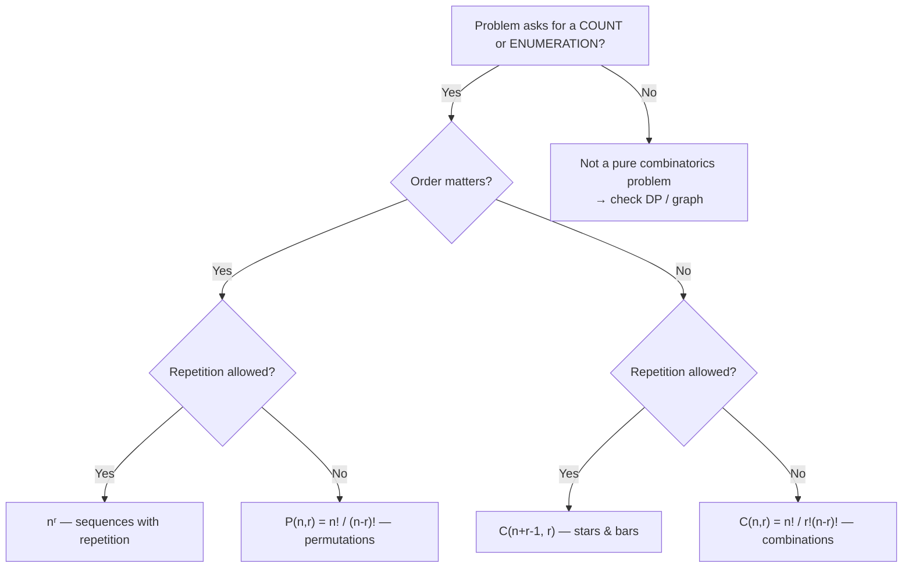
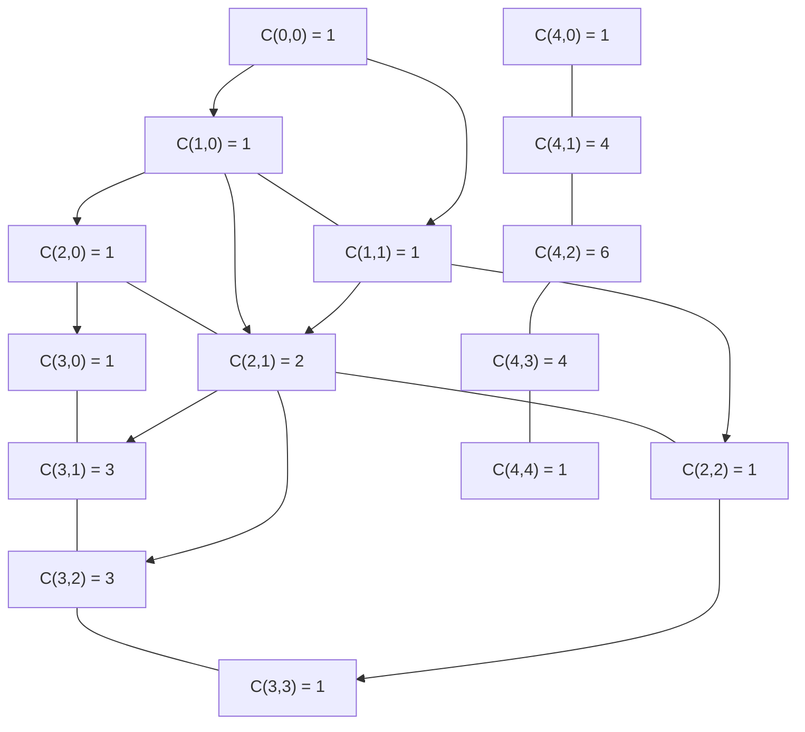

# Combinatorics

## When It Appears in Interviews

- **"How many ways …"** — staircase, coin change counting, tile filling
- **Permutation/arrangement** problems — anagram counts, scheduling orders
- **Subset / combination** enumeration — power sets, k-choose-n selections
- **Keywords:** "distinct", "arrangements", "choose", "unique paths", "ways to"

---

## Identifying a Combinatorics Problem



---

## Key Formulas

| Formula | Expression | Use Case |
|---------|-----------|----------|
| Permutation | `P(n,r) = n! / (n-r)!` | Ordered selections without repetition |
| Combination | `C(n,r) = n! / (r! × (n-r)!)` | Unordered selections without repetition |
| Multinomial | `n! / (k₁! × k₂! × … × kₘ!)` | Arrangements with repeated elements (anagrams) |
| Stars & Bars | `C(n+r-1, r)` | Distribute `r` identical items into `n` bins |
| Inclusion-Exclusion | `\|A∪B\| = \|A\| + \|B\| - \|A∩B\|` | Count union avoiding double-count |
| Pascal's Rule | `C(n,r) = C(n-1,r-1) + C(n-1,r)` | Build combinations incrementally (DP) |

---

## Pascal's Triangle



Each entry equals the sum of the two entries above it — the foundation of the DP approach to `C(n,r)`.

---

## Template: Compute C(n, r) with DP (Pascal's Triangle)

=== "Python"

    ```python
    def comb(n: int, r: int) -> int:
        # Build Pascal's triangle row by row up to n
        dp = [[0] * (n + 1) for _ in range(n + 1)]
        for i in range(n + 1):
            dp[i][0] = 1
            for j in range(1, i + 1):
                dp[i][j] = dp[i - 1][j - 1] + dp[i - 1][j]
        return dp[n][r]

    # Built-in alternative
    from math import comb as math_comb
    ```

=== "TypeScript"

    ```typescript
    function comb(n: number, r: number): number {
        const dp: number[][] = Array.from({ length: n + 1 }, () =>
            new Array(n + 1).fill(0)
        );
        for (let i = 0; i <= n; i++) {
            dp[i][0] = 1;
            for (let j = 1; j <= i; j++) {
                dp[i][j] = dp[i - 1][j - 1] + dp[i - 1][j];
            }
        }
        return dp[n][r];
    }
    ```

=== "Rust"

    ```rust
    pub fn comb(n: usize, r: usize) -> u64 {
        let mut dp = vec![vec![0u64; n + 1]; n + 1];
        for i in 0..=n {
            dp[i][0] = 1;
            for j in 1..=i {
                dp[i][j] = dp[i - 1][j - 1] + dp[i - 1][j];
            }
        }
        dp[n][r]
    }
    ```

=== "Java"

    ```java
    class Solution {
        public long comb(int n, int r) {
            long[][] dp = new long[n + 1][n + 1];
            for (int i = 0; i <= n; i++) {
                dp[i][0] = 1;
                for (int j = 1; j <= i; j++) {
                    dp[i][j] = dp[i - 1][j - 1] + dp[i - 1][j];
                }
            }
            return dp[n][r];
        }
    }
    ```

=== "C#"

    ```csharp
    public class Solution {
        public long Comb(int n, int r) {
            long[,] dp = new long[n + 1, n + 1];
            for (int i = 0; i <= n; i++) {
                dp[i, 0] = 1;
                for (int j = 1; j <= i; j++) {
                    dp[i, j] = dp[i - 1, j - 1] + dp[i - 1, j];
                }
            }
            return dp[n, r];
        }
    }
    ```

=== "ASM"

    ```asm
    ; C(n, r) via Pascal's Triangle — x86-64 conceptual sketch
    ; Allocate (n+1)*(n+1) qword array on heap or stack
    ; Outer loop: i = 0 to n  (rcx)
    ;   dp[i][0] = 1
    ;   Inner loop: j = 1 to i  (rdx)
    ;     dp[i][j] = dp[i-1][j-1] + dp[i-1][j]
    ; Return dp[n][r] in rax
    ```

=== "Scala"

    ```scala
    object Solution {
      def comb(n: Int, r: Int): Long = {
        val dp = Array.ofDim[Long](n + 1, n + 1)
        for (i <- 0 to n) {
          dp(i)(0) = 1
          for (j <- 1 to i) dp(i)(j) = dp(i - 1)(j - 1) + dp(i - 1)(j)
        }
        dp(n)(r)
      }
    }
    ```

---

## Template: Next Permutation

=== "Python"

    ```python
    def next_permutation(nums: list[int]) -> None:
        """Mutates nums in-place to its next lexicographic permutation."""
        n = len(nums)
        i = n - 2
        # Step 1: find rightmost ascent
        while i >= 0 and nums[i] >= nums[i + 1]:
            i -= 1
        if i >= 0:
            # Step 2: swap with smallest element to the right that is larger
            j = n - 1
            while nums[j] <= nums[i]:
                j -= 1
            nums[i], nums[j] = nums[j], nums[i]
        # Step 3: reverse the suffix
        nums[i + 1:] = reversed(nums[i + 1:])
    ```

=== "TypeScript"

    ```typescript
    function nextPermutation(nums: number[]): void {
        const n = nums.length;
        let i = n - 2;
        while (i >= 0 && nums[i] >= nums[i + 1]) i--;
        if (i >= 0) {
            let j = n - 1;
            while (nums[j] <= nums[i]) j--;
            [nums[i], nums[j]] = [nums[j], nums[i]];
        }
        let left = i + 1, right = n - 1;
        while (left < right) {
            [nums[left], nums[right]] = [nums[right], nums[left]];
            left++; right--;
        }
    }
    ```

=== "Rust"

    ```rust
    pub fn next_permutation(nums: &mut Vec<i32>) {
        let n = nums.len();
        let mut i = n.wrapping_sub(2);
        while i < n && nums[i] >= nums[i + 1] { i = i.wrapping_sub(1); }
        if i < n {
            let mut j = n - 1;
            while nums[j] <= nums[i] { j -= 1; }
            nums.swap(i, j);
        }
        let start = if i < n { i + 1 } else { 0 };
        nums[start..].reverse();
    }
    ```

=== "Java"

    ```java
    class Solution {
        public void nextPermutation(int[] nums) {
            int n = nums.length, i = n - 2;
            while (i >= 0 && nums[i] >= nums[i + 1]) i--;
            if (i >= 0) {
                int j = n - 1;
                while (nums[j] <= nums[i]) j--;
                int tmp = nums[i]; nums[i] = nums[j]; nums[j] = tmp;
            }
            for (int l = i + 1, r = n - 1; l < r; l++, r--) {
                int tmp = nums[l]; nums[l] = nums[r]; nums[r] = tmp;
            }
        }
    }
    ```

=== "C#"

    ```csharp
    public class Solution {
        public void NextPermutation(int[] nums) {
            int n = nums.Length, i = n - 2;
            while (i >= 0 && nums[i] >= nums[i + 1]) i--;
            if (i >= 0) {
                int j = n - 1;
                while (nums[j] <= nums[i]) j--;
                (nums[i], nums[j]) = (nums[j], nums[i]);
            }
            Array.Reverse(nums, i + 1, n - i - 1);
        }
    }
    ```

=== "ASM"

    ```asm
    ; Next permutation — x86-64 conceptual
    ; rsi = pointer to int array, rdi = length
    ; Step 1: scan right-to-left for nums[i] < nums[i+1]  → store index in rbx
    ; Step 2: scan right-to-left for nums[j] > nums[rbx]  → swap
    ; Step 3: reverse suffix from rbx+1 to end using two-pointer swap loop
    ```

=== "Scala"

    ```scala
    object Solution {
      def nextPermutation(nums: Array[Int]): Unit = {
        val n = nums.length
        var i = n - 2
        while (i >= 0 && nums(i) >= nums(i + 1)) i -= 1
        if (i >= 0) {
          var j = n - 1
          while (nums(j) <= nums(i)) j -= 1
          val tmp = nums(i); nums(i) = nums(j); nums(j) = tmp
        }
        var (l, r) = (i + 1, n - 1)
        while (l < r) {
          val tmp = nums(l); nums(l) = nums(r); nums(r) = tmp
          l += 1; r -= 1
        }
      }
    }
    ```

---

## Template: Generate All Subsets (Power Set)

=== "Python"

    ```python
    def subsets(nums: list[int]) -> list[list[int]]:
        result: list[list[int]] = []
        def backtrack(start: int, path: list[int]) -> None:
            result.append(path[:])
            for i in range(start, len(nums)):
                path.append(nums[i])
                backtrack(i + 1, path)
                path.pop()
        backtrack(0, [])
        return result
    ```

=== "TypeScript"

    ```typescript
    function subsets(nums: number[]): number[][] {
        const result: number[][] = [];
        function backtrack(start: number, path: number[]): void {
            result.push([...path]);
            for (let i = start; i < nums.length; i++) {
                path.push(nums[i]);
                backtrack(i + 1, path);
                path.pop();
            }
        }
        backtrack(0, []);
        return result;
    }
    ```

=== "Rust"

    ```rust
    pub fn subsets(nums: Vec<i32>) -> Vec<Vec<i32>> {
        let mut result = Vec::new();
        fn backtrack(nums: &[i32], start: usize, path: &mut Vec<i32>, result: &mut Vec<Vec<i32>>) {
            result.push(path.clone());
            for i in start..nums.len() {
                path.push(nums[i]);
                backtrack(nums, i + 1, path, result);
                path.pop();
            }
        }
        backtrack(&nums, 0, &mut vec![], &mut result);
        result
    }
    ```

=== "Java"

    ```java
    class Solution {
        public List<List<Integer>> subsets(int[] nums) {
            List<List<Integer>> result = new ArrayList<>();
            backtrack(nums, 0, new ArrayList<>(), result);
            return result;
        }
        private void backtrack(int[] nums, int start, List<Integer> path, List<List<Integer>> result) {
            result.add(new ArrayList<>(path));
            for (int i = start; i < nums.length; i++) {
                path.add(nums[i]);
                backtrack(nums, i + 1, path, result);
                path.remove(path.size() - 1);
            }
        }
    }
    ```

=== "C#"

    ```csharp
    public class Solution {
        public IList<IList<int>> Subsets(int[] nums) {
            var result = new List<IList<int>>();
            Backtrack(nums, 0, new List<int>(), result);
            return result;
        }
        private void Backtrack(int[] nums, int start, List<int> path, List<IList<int>> result) {
            result.Add(new List<int>(path));
            for (int i = start; i < nums.Length; i++) {
                path.Add(nums[i]);
                Backtrack(nums, i + 1, path, result);
                path.RemoveAt(path.Count - 1);
            }
        }
    }
    ```

=== "ASM"

    ```asm
    ; Power-set via bitmask — x86-64 conceptual
    ; For n elements: iterate mask = 0 to (1<<n)-1
    ; For each mask, iterate bit positions 0..n-1
    ;   TEST mask with (1 << bit); if set, include nums[bit] in current subset
    ; Total 2^n subsets; each subset output as needed
    ```

=== "Scala"

    ```scala
    object Solution {
      def subsets(nums: Array[Int]): List[List[Int]] = {
        val result = scala.collection.mutable.ListBuffer[List[Int]]()
        def backtrack(start: Int, path: List[Int]): Unit = {
          result += path
          for (i <- start until nums.length) backtrack(i + 1, path :+ nums(i))
        }
        backtrack(0, List())
        result.toList
      }
    }
    ```

---

## Common Interview Problems

| Problem | Formula / Technique | Difficulty | Link |
|---------|-------------------|-----------|------|
| Climbing Stairs | Fibonacci / `C(n,k)` staircase | Easy | [LeetCode 70](https://leetcode.com/problems/climbing-stairs/){ target=_blank } |
| Subsets | Power set / backtracking | Medium | [LeetCode 78](https://leetcode.com/problems/subsets/){ target=_blank } |
| Permutations | Backtracking / next permutation | Medium | [LeetCode 46](https://leetcode.com/problems/permutations/){ target=_blank } |
| Next Permutation | In-place permutation algorithm | Medium | [LeetCode 31](https://leetcode.com/problems/next-permutation/){ target=_blank } |
| Unique Paths | `C(m+n-2, m-1)` | Medium | [LeetCode 62](https://leetcode.com/problems/unique-paths/){ target=_blank } |
| Coin Change II | Unbounded knapsack / combination count | Medium | [LeetCode 518](https://leetcode.com/problems/coin-change-ii/){ target=_blank } |
| Count Anagrams | Multinomial coefficient | Hard | Variant of anagram problems |

---

[:octicons-arrow-left-24: Back: Math Index](index.md) · [:octicons-arrow-right-24: Next: Probability](probability.md)
