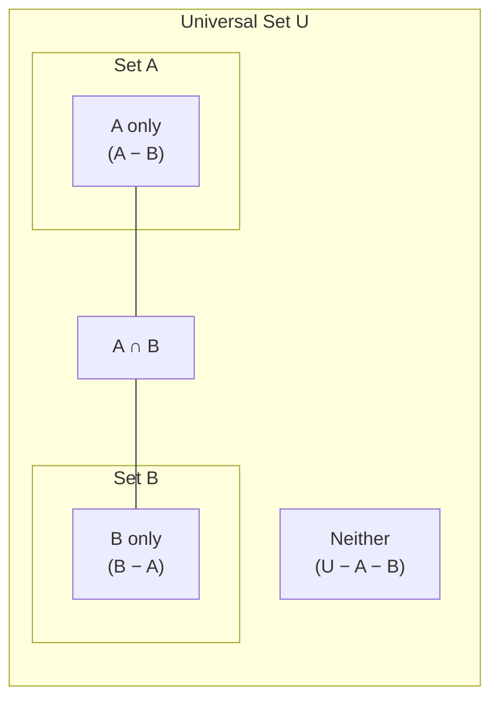

# Discrete Math

## Relevance to Coding Interviews

Discrete math underpins the low-level logic that separates clever O(log n) solutions from brute-force ones:

- **Modular arithmetic** — hash functions, cyclic buffers, overflow-safe arithmetic
- **GCD / LCM** — simplifying fractions, synchronizing periods, LCM of array
- **Prime numbers & sieve** — prime factorization, number of divisors, cryptography-adjacent problems
- **Set operations & logic** — XOR tricks, bitmasks, union-find
- **Graph theory basics** — degree, connectivity, bipartiteness (covered in detail in the Patterns section)

---

## Key Concepts & Formulas

| Concept | Formula / Rule | Interview Use |
|---------|---------------|--------------|
| **Modular addition** | `(a + b) mod m = ((a mod m) + (b mod m)) mod m` | Prevent overflow in large sums |
| **Modular multiply** | `(a × b) mod m = ((a mod m) × (b mod m)) mod m` | Combinatorics counts mod 10⁹+7 |
| **GCD (Euclidean)** | `gcd(a, b) = gcd(b, a mod b)` | Simplify fractions, sync problems |
| **LCM** | `lcm(a, b) = a × b / gcd(a, b)` | Period synchronization |
| **Fermat's little theorem** | `aᵖ⁻¹ ≡ 1 (mod p)` for prime p, a∤p | Modular inverse: `a⁻¹ ≡ aᵖ⁻² (mod p)` |
| **Euler's totient φ(n)** | Count integers 1..n coprime to n | RSA, generalized modular inverse |
| **CRT** | Unique solution to system of congruences mod pairwise-coprime mᵢ | Large mod decomposition |
| **XOR identity** | `a XOR a = 0`, `a XOR 0 = a` | Find single / missing number |
| **Bit tricks** | `n & (n-1)` clears lowest set bit | Power-of-two check, popcount |

---

## Venn Diagram — Set Relationships



- `|A ∪ B| = |A| + |B| − |A ∩ B|` (inclusion-exclusion)
- Generalizes: `|A ∪ B ∪ C| = |A| + |B| + |C| − |A∩B| − |A∩C| − |B∩C| + |A∩B∩C|`

---

## Template: GCD (Euclidean Algorithm)

=== "Python"

    ```python
    def gcd(a: int, b: int) -> int:
        while b:
            a, b = b, a % b
        return a

    def lcm(a: int, b: int) -> int:
        return a // gcd(a, b) * b   # divide first to avoid overflow
    ```

=== "TypeScript"

    ```typescript
    function gcd(a: number, b: number): number {
        while (b !== 0) { [a, b] = [b, a % b]; }
        return a;
    }
    function lcm(a: number, b: number): number {
        return (a / gcd(a, b)) * b;
    }
    ```

=== "Rust"

    ```rust
    pub fn gcd(mut a: u64, mut b: u64) -> u64 {
        while b != 0 { let t = b; b = a % b; a = t; }
        a
    }
    pub fn lcm(a: u64, b: u64) -> u64 {
        a / gcd(a, b) * b
    }
    ```

=== "Java"

    ```java
    class Solution {
        public long gcd(long a, long b) {
            while (b != 0) { long t = b; b = a % b; a = t; }
            return a;
        }
        public long lcm(long a, long b) { return a / gcd(a, b) * b; }
    }
    ```

=== "C#"

    ```csharp
    public class Solution {
        public long Gcd(long a, long b) {
            while (b != 0) { long t = b; b = a % b; a = t; }
            return a;
        }
        public long Lcm(long a, long b) => a / Gcd(a, b) * b;
    }
    ```

=== "ASM"

    ```asm
    ; GCD — x86-64 iterative Euclidean
    ; Arguments: rdi = a, rsi = b
    ; Loop:
    ;   TEST rsi, rsi   ; while b != 0
    ;   JZ   done
    ;   MOV  rax, rdi
    ;   XOR  rdx, rdx
    ;   DIV  rsi        ; rdx = a mod b
    ;   MOV  rdi, rsi   ; a = b
    ;   MOV  rsi, rdx   ; b = a mod b
    ;   JMP  loop
    ; done: rax = rdi (result)
    ```

=== "Scala"

    ```scala
    object Solution {
      def gcd(a: Long, b: Long): Long = if (b == 0) a else gcd(b, a % b)
      def lcm(a: Long, b: Long): Long = a / gcd(a, b) * b
    }
    ```

---

## Template: Sieve of Eratosthenes

Find all primes up to `n` in O(n log log n) time.

=== "Python"

    ```python
    def sieve(n: int) -> list[int]:
        is_prime = [True] * (n + 1)
        is_prime[0] = is_prime[1] = False
        for i in range(2, int(n**0.5) + 1):
            if is_prime[i]:
                for j in range(i * i, n + 1, i):
                    is_prime[j] = False
        return [i for i, p in enumerate(is_prime) if p]
    ```

=== "TypeScript"

    ```typescript
    function sieve(n: number): number[] {
        const isPrime = new Array(n + 1).fill(true);
        isPrime[0] = isPrime[1] = false;
        for (let i = 2; i * i <= n; i++) {
            if (isPrime[i]) {
                for (let j = i * i; j <= n; j += i) isPrime[j] = false;
            }
        }
        return isPrime.reduce((acc: number[], p, i) => (p ? [...acc, i] : acc), []);
    }
    ```

=== "Rust"

    ```rust
    pub fn sieve(n: usize) -> Vec<usize> {
        let mut is_prime = vec![true; n + 1];
        is_prime[0] = false;
        if n > 0 { is_prime[1] = false; }
        let mut i = 2;
        while i * i <= n {
            if is_prime[i] {
                let mut j = i * i;
                while j <= n { is_prime[j] = false; j += i; }
            }
            i += 1;
        }
        (2..=n).filter(|&x| is_prime[x]).collect()
    }
    ```

=== "Java"

    ```java
    class Solution {
        public List<Integer> sieve(int n) {
            boolean[] isPrime = new boolean[n + 1];
            Arrays.fill(isPrime, true);
            isPrime[0] = isPrime[1] = false;
            for (int i = 2; (long)i * i <= n; i++)
                if (isPrime[i])
                    for (int j = i * i; j <= n; j += i) isPrime[j] = false;
            List<Integer> primes = new ArrayList<>();
            for (int i = 2; i <= n; i++) if (isPrime[i]) primes.add(i);
            return primes;
        }
    }
    ```

=== "C#"

    ```csharp
    public class Solution {
        public List<int> Sieve(int n) {
            bool[] isPrime = new bool[n + 1];
            Array.Fill(isPrime, true);
            isPrime[0] = isPrime[1] = false;
            for (int i = 2; (long)i * i <= n; i++)
                if (isPrime[i])
                    for (int j = i * i; j <= n; j += i) isPrime[j] = false;
            var primes = new List<int>();
            for (int i = 2; i <= n; i++) if (isPrime[i]) primes.Add(i);
            return primes;
        }
    }
    ```

=== "ASM"

    ```asm
    ; Sieve of Eratosthenes — x86-64 conceptual
    ; Allocate byte array isPrime[0..n], fill with 1
    ; Set isPrime[0]=0, isPrime[1]=0
    ; Outer loop i=2 while i*i<=n:
    ;   CMP byte [isPrime + i], 1 ; if isPrime[i]
    ;   JNE next_i
    ;   Inner loop j=i*i; j<=n; j+=i:
    ;     MOV byte [isPrime + j], 0
    ; Collect indices where isPrime[i]=1 into result
    ```

=== "Scala"

    ```scala
    object Solution {
      def sieve(n: Int): List[Int] = {
        val isPrime = Array.fill(n + 1)(true)
        isPrime(0) = false; if (n > 0) isPrime(1) = false
        var i = 2
        while (i.toLong * i <= n) {
          if (isPrime(i)) { var j = i * i; while (j <= n) { isPrime(j) = false; j += i } }
          i += 1
        }
        (2 to n).filter(isPrime).toList
      }
    }
    ```

---

## Template: Modular Exponentiation

Compute `base^exp mod m` in O(log exp) via fast exponentiation (square-and-multiply).

=== "Python"

    ```python
    def mod_pow(base: int, exp: int, mod: int) -> int:
        result = 1
        base %= mod
        while exp > 0:
            if exp & 1:           # if current bit is set
                result = result * base % mod
            base = base * base % mod
            exp >>= 1
        return result

    # Built-in: pow(base, exp, mod)
    ```

=== "TypeScript"

    ```typescript
    function modPow(base: bigint, exp: bigint, mod: bigint): bigint {
        let result = 1n;
        base %= mod;
        while (exp > 0n) {
            if (exp & 1n) result = result * base % mod;
            base = base * base % mod;
            exp >>= 1n;
        }
        return result;
    }
    ```

=== "Rust"

    ```rust
    pub fn mod_pow(mut base: u64, mut exp: u64, modulus: u64) -> u64 {
        let mut result = 1u64;
        base %= modulus;
        while exp > 0 {
            if exp & 1 == 1 { result = result * base % modulus; }
            base = base * base % modulus;
            exp >>= 1;
        }
        result
    }
    ```

=== "Java"

    ```java
    class Solution {
        public long modPow(long base, long exp, long mod) {
            long result = 1;
            base %= mod;
            while (exp > 0) {
                if ((exp & 1) == 1) result = result * base % mod;
                base = base * base % mod;
                exp >>= 1;
            }
            return result;
        }
    }
    ```

=== "C#"

    ```csharp
    public class Solution {
        public long ModPow(long b, long exp, long mod) {
            long result = 1; b %= mod;
            while (exp > 0) {
                if ((exp & 1) == 1) result = result * b % mod;
                b = b * b % mod;
                exp >>= 1;
            }
            return result;
        }
    }
    ```

=== "ASM"

    ```asm
    ; Modular exponentiation — x86-64
    ; rdi=base, rsi=exp, rdx=mod  →  result in rax
    ; rax = 1  (result)
    ; rdi %= rdx
    ; Loop while rsi != 0:
    ;   TEST rsi, 1       ; if LSB set
    ;   JZ   skip_mul
    ;   MUL  rdi → rax * rdi; then DIV rdx → rax = rdx remainder
    ; skip_mul:
    ;   rdi = rdi * rdi MOD rdx
    ;   SHR rsi, 1
    ```

=== "Scala"

    ```scala
    object Solution {
      def modPow(base: Long, exp: Long, mod: Long): Long = {
        var (b, e, result) = (base % mod, exp, 1L)
        while (e > 0) {
          if ((e & 1) == 1) result = result * b % mod
          b = b * b % mod
          e >>= 1
        }
        result
      }
    }
    ```

---

## Template: Modular Inverse (Fermat's Little Theorem)

When `mod` is prime: `a⁻¹ ≡ a^(mod-2) (mod p)`

=== "Python"

    ```python
    def mod_inverse(a: int, p: int) -> int:
        """p must be prime."""
        return pow(a, p - 2, p)
    ```

=== "TypeScript"

    ```typescript
    function modInverse(a: bigint, p: bigint): bigint {
        return modPow(a, p - 2n, p);  // reuse modPow from above
    }
    ```

=== "Rust"

    ```rust
    pub fn mod_inverse(a: u64, p: u64) -> u64 {
        mod_pow(a, p - 2, p)  // p must be prime
    }
    ```

=== "Java"

    ```java
    class Solution {
        public long modInverse(long a, long p) {
            return modPow(a, p - 2, p);  // p must be prime
        }
    }
    ```

=== "C#"

    ```csharp
    public class Solution {
        public long ModInverse(long a, long p) => ModPow(a, p - 2, p);
    }
    ```

=== "ASM"

    ```asm
    ; Modular inverse via Fermat: call modPow(a, p-2, p)
    ; rdi=a, rsi=p-2, rdx=p
    ; Reuse modular exponentiation routine above
    ```

=== "Scala"

    ```scala
    object Solution {
      def modInverse(a: Long, p: Long): Long = modPow(a, p - 2, p)
    }
    ```

---

## Common Interview Problems

| Problem | Key Technique | Difficulty | Link |
|---------|-------------|-----------|------|
| Single Number | XOR identity `a^a=0` | Easy | [LeetCode 136](https://leetcode.com/problems/single-number/){ target=_blank } |
| GCD of Strings | `gcd(len(s1), len(s2))` | Easy | [LeetCode 1071](https://leetcode.com/problems/greatest-common-divisor-of-strings/){ target=_blank } |
| Count Primes | Sieve of Eratosthenes | Medium | [LeetCode 204](https://leetcode.com/problems/count-primes/){ target=_blank } |
| Pow(x, n) | Fast modular exponentiation | Medium | [LeetCode 50](https://leetcode.com/problems/powx-n/){ target=_blank } |
| Super Pow | Modular exponentiation | Medium | [LeetCode 372](https://leetcode.com/problems/super-pow/){ target=_blank } |
| Ugly Number II | LCM / prime factorization | Medium | [LeetCode 264](https://leetcode.com/problems/ugly-number-ii/){ target=_blank } |
| Find Missing Number | XOR or Gauss sum | Easy | [LeetCode 268](https://leetcode.com/problems/missing-number/){ target=_blank } |

---

[:octicons-arrow-left-24: Back: Linear Algebra](linear-algebra.md) · [:octicons-arrow-right-24: Back to Math Index](index.md)
