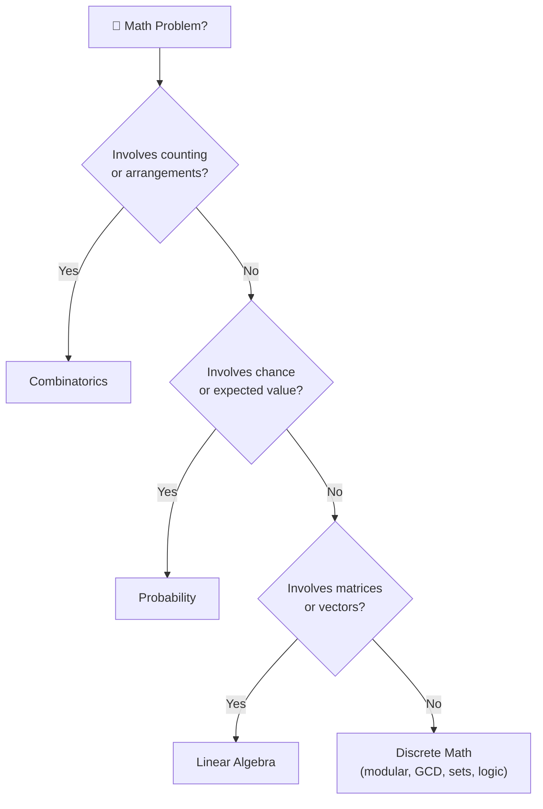

# Math for Coding Interviews

Strong mathematical intuition separates good engineers from great ones in technical interviews.
This section covers the four mathematical domains that appear most frequently in coding problems,
from classic combinatorics puzzles to linear-algebra-backed matrix questions.

---

## Topics at a Glance

| Topic | Core Ideas | When It Appears |
|-------|-----------|-----------------|
| [Combinatorics](combinatorics.md) | Permutations, combinations, subsets, inclusion-exclusion | Counting paths, anagram groups, n-choose-k, coin arrangements |
| [Probability](probability.md) | Sample space, conditional probability, expected value, Bayes | Random shuffle, reservoir sampling, weighted random pick |
| [Linear Algebra](linear-algebra.md) | Vectors, matrices, dot/cross product, transpose, determinant | Rotate image, spiral matrix, ML/graphics adjacency |
| [Discrete Math](discrete-math.md) | Sets, logic, modular arithmetic, GCD/LCM, primes, graph theory | Hash functions, number theory, bit logic, cryptography-adjacent |

---

## How to Navigate

---

## Quick Interview Tips

- **Combinatorics** — if you see "how many ways", think factorials, Pascal's triangle, or DP.
- **Probability** — random selection problems almost always reduce to Fisher-Yates or reservoir sampling.
- **Linear Algebra** — matrix rotation and spiral traversal are the two most-tested matrix patterns.
- **Discrete Math** — GCD and modular exponentiation appear in hard number-theory problems; know them cold.

---

[:octicons-arrow-right-24: Start: Combinatorics](combinatorics.md)
