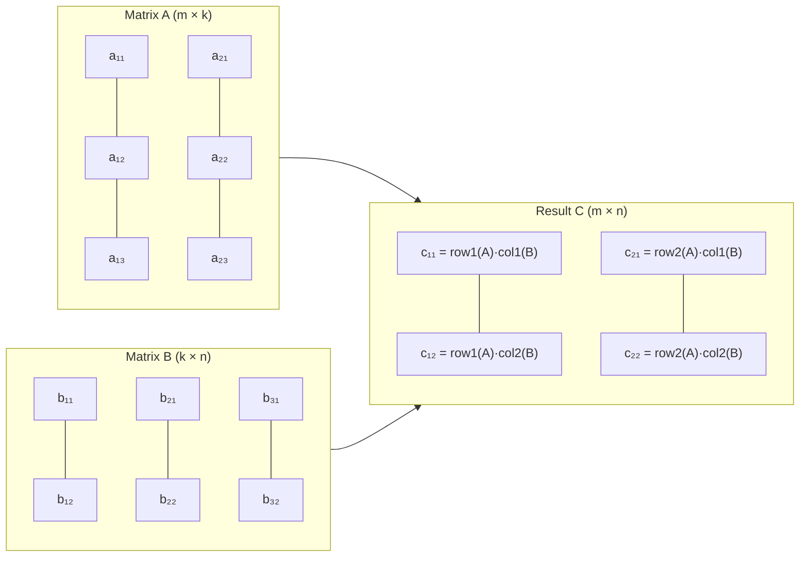

# Linear Algebra

## When It Appears in Interviews

- **Matrix manipulation** — rotate image (90°), spiral matrix traversal, set matrix zeroes
- **Coordinate transformations** — rotate/reflect a grid, affine transforms in geometry problems
- **Graph adjacency** — adjacency matrix representation and multiplication
- **ML / data-science roles** — dot products, cosine similarity, PCA concepts

---

## Key Concepts

| Concept | Definition | Interview Relevance |
|---------|-----------|-------------------|
| **Vector** | Ordered list of numbers `[x, y, z]` | Distance, direction, dot/cross product |
| **Dot product** | `A · B = Σ aᵢbᵢ` | Cosine similarity, projection |
| **Cross product** | `A × B` (3-D) — perpendicular vector | Orientation tests, area of triangle |
| **Matrix multiply** | `(AB)ᵢⱼ = Σₖ Aᵢₖ Bₖⱼ` | Graph reachability, transforms |
| **Transpose** | `Aᵀᵢⱼ = Aⱼᵢ` | Rotate image (step 1), column access |
| **Determinant 2×2** | `ad − bc` | Check if matrix is invertible |
| **Determinant 3×3** | Cofactor expansion along row 1 | Orientation, area/volume |
| **Eigenvalue** | `Av = λv` | PCA, stability analysis (rarely coded) |

---

## Matrix Multiplication Visualization



`C[i][j] = sum(A[i][k] * B[k][j] for k in range(cols_A))`

---

## Template: Matrix Multiply

=== "Python"

    ```python
    def mat_mul(A: list[list[float]], B: list[list[float]]) -> list[list[float]]:
        m, k, n = len(A), len(A[0]), len(B[0])
        C = [[0.0] * n for _ in range(m)]
        for i in range(m):
            for j in range(n):
                for p in range(k):
                    C[i][j] += A[i][p] * B[p][j]
        return C
    ```

=== "TypeScript"

    ```typescript
    function matMul(A: number[][], B: number[][]): number[][] {
        const m = A.length, k = A[0].length, n = B[0].length;
        const C: number[][] = Array.from({ length: m }, () => new Array(n).fill(0));
        for (let i = 0; i < m; i++)
            for (let j = 0; j < n; j++)
                for (let p = 0; p < k; p++)
                    C[i][j] += A[i][p] * B[p][j];
        return C;
    }
    ```

=== "Rust"

    ```rust
    pub fn mat_mul(a: &[Vec<f64>], b: &[Vec<f64>]) -> Vec<Vec<f64>> {
        let (m, k, n) = (a.len(), a[0].len(), b[0].len());
        let mut c = vec![vec![0f64; n]; m];
        for i in 0..m {
            for j in 0..n {
                for p in 0..k {
                    c[i][j] += a[i][p] * b[p][j];
                }
            }
        }
        c
    }
    ```

=== "Java"

    ```java
    class Solution {
        public double[][] matMul(double[][] A, double[][] B) {
            int m = A.length, k = A[0].length, n = B[0].length;
            double[][] C = new double[m][n];
            for (int i = 0; i < m; i++)
                for (int j = 0; j < n; j++)
                    for (int p = 0; p < k; p++)
                        C[i][j] += A[i][p] * B[p][j];
            return C;
        }
    }
    ```

=== "C#"

    ```csharp
    public class Solution {
        public double[,] MatMul(double[,] A, double[,] B) {
            int m = A.GetLength(0), k = A.GetLength(1), n = B.GetLength(1);
            double[,] C = new double[m, n];
            for (int i = 0; i < m; i++)
                for (int j = 0; j < n; j++)
                    for (int p = 0; p < k; p++)
                        C[i, j] += A[i, p] * B[p, j];
            return C;
        }
    }
    ```

=== "ASM"

    ```asm
    ; Matrix multiply — x86-64 conceptual (row-major storage)
    ; A: m×k  B: k×n  C: m×n  (double precision, 8 bytes/element)
    ; Triple nested loop: i=0..m, j=0..n, p=0..k
    ;   addr_A = base_A + (i*k + p)*8
    ;   addr_B = base_B + (p*n + j)*8
    ;   addr_C = base_C + (i*n + j)*8
    ;   Use vmovsd + vfmadd231sd (AVX) for fused multiply-add
    ```

=== "Scala"

    ```scala
    object Solution {
      def matMul(A: Array[Array[Double]], B: Array[Array[Double]]): Array[Array[Double]] = {
        val (m, k, n) = (A.length, A(0).length, B(0).length)
        val C = Array.ofDim[Double](m, n)
        for (i <- 0 until m; j <- 0 until n; p <- 0 until k)
          C(i)(j) += A(i)(p) * B(p)(j)
        C
      }
    }
    ```

---

## Template: Dot Product & Transpose

=== "Python"

    ```python
    def dot(a: list[float], b: list[float]) -> float:
        return sum(x * y for x, y in zip(a, b))

    def transpose(M: list[list[float]]) -> list[list[float]]:
        rows, cols = len(M), len(M[0])
        return [[M[r][c] for r in range(rows)] for c in range(cols)]
    ```

=== "TypeScript"

    ```typescript
    function dot(a: number[], b: number[]): number {
        return a.reduce((s, v, i) => s + v * b[i], 0);
    }
    function transpose(M: number[][]): number[][] {
        return M[0].map((_, c) => M.map(row => row[c]));
    }
    ```

=== "Rust"

    ```rust
    pub fn dot(a: &[f64], b: &[f64]) -> f64 {
        a.iter().zip(b).map(|(x, y)| x * y).sum()
    }
    pub fn transpose(m: &[Vec<f64>]) -> Vec<Vec<f64>> {
        let (rows, cols) = (m.len(), m[0].len());
        (0..cols).map(|c| (0..rows).map(|r| m[r][c]).collect()).collect()
    }
    ```

=== "Java"

    ```java
    class Solution {
        public double dot(double[] a, double[] b) {
            double s = 0;
            for (int i = 0; i < a.length; i++) s += a[i] * b[i];
            return s;
        }
        public double[][] transpose(double[][] M) {
            int rows = M.length, cols = M[0].length;
            double[][] T = new double[cols][rows];
            for (int r = 0; r < rows; r++)
                for (int c = 0; c < cols; c++)
                    T[c][r] = M[r][c];
            return T;
        }
    }
    ```

=== "C#"

    ```csharp
    public class Solution {
        public double Dot(double[] a, double[] b) {
            double s = 0;
            for (int i = 0; i < a.Length; i++) s += a[i] * b[i];
            return s;
        }
        public double[,] Transpose(double[,] M) {
            int rows = M.GetLength(0), cols = M.GetLength(1);
            double[,] T = new double[cols, rows];
            for (int r = 0; r < rows; r++)
                for (int c = 0; c < cols; c++)
                    T[c, r] = M[r, c];
            return T;
        }
    }
    ```

=== "ASM"

    ```asm
    ; Dot product — x86-64 with SSE2
    ; xmm0 = 0.0 (accumulator)
    ; Loop i=0 to n-1:
    ;   movsd xmm1, [a + i*8]
    ;   mulsd xmm1, [b + i*8]
    ;   addsd xmm0, xmm1
    ; Result in xmm0
    ;
    ; Transpose (square n×n in-place):
    ; Loop i=0..n-1, j=i+1..n-1:
    ;   swap M[i*n+j] and M[j*n+i]  using two movsd + two movsd
    ```

=== "Scala"

    ```scala
    object Solution {
      def dot(a: Array[Double], b: Array[Double]): Double =
        a.zip(b).map { case (x, y) => x * y }.sum

      def transpose(M: Array[Array[Double]]): Array[Array[Double]] =
        M(0).indices.toArray.map(c => M.map(_(c)))
    }
    ```

---

## Template: Determinant (2×2 and 3×3)

=== "Python"

    ```python
    def det2(M: list[list[float]]) -> float:
        return M[0][0] * M[1][1] - M[0][1] * M[1][0]

    def det3(M: list[list[float]]) -> float:
        a, b, c = M[0]
        return (a * (M[1][1]*M[2][2] - M[1][2]*M[2][1])
              - b * (M[1][0]*M[2][2] - M[1][2]*M[2][0])
              + c * (M[1][0]*M[2][1] - M[1][1]*M[2][0]))
    ```

=== "TypeScript"

    ```typescript
    function det2(M: number[][]): number {
        return M[0][0] * M[1][1] - M[0][1] * M[1][0];
    }
    function det3(M: number[][]): number {
        const [a, b, c] = M[0];
        return (a * (M[1][1]*M[2][2] - M[1][2]*M[2][1])
              - b * (M[1][0]*M[2][2] - M[1][2]*M[2][0])
              + c * (M[1][0]*M[2][1] - M[1][1]*M[2][0]));
    }
    ```

=== "Rust"

    ```rust
    pub fn det2(m: &[[f64; 2]; 2]) -> f64 {
        m[0][0] * m[1][1] - m[0][1] * m[1][0]
    }
    pub fn det3(m: &[[f64; 3]; 3]) -> f64 {
        let (a, b, c) = (m[0][0], m[0][1], m[0][2]);
        a * (m[1][1]*m[2][2] - m[1][2]*m[2][1])
      - b * (m[1][0]*m[2][2] - m[1][2]*m[2][0])
      + c * (m[1][0]*m[2][1] - m[1][1]*m[2][0])
    }
    ```

=== "Java"

    ```java
    class Solution {
        public double det2(double[][] M) {
            return M[0][0]*M[1][1] - M[0][1]*M[1][0];
        }
        public double det3(double[][] M) {
            double a = M[0][0], b = M[0][1], c = M[0][2];
            return a*(M[1][1]*M[2][2]-M[1][2]*M[2][1])
                 - b*(M[1][0]*M[2][2]-M[1][2]*M[2][0])
                 + c*(M[1][0]*M[2][1]-M[1][1]*M[2][0]);
        }
    }
    ```

=== "C#"

    ```csharp
    public class Solution {
        public double Det2(double[,] M) => M[0,0]*M[1,1] - M[0,1]*M[1,0];
        public double Det3(double[,] M) {
            double a = M[0,0], b = M[0,1], c = M[0,2];
            return a*(M[1,1]*M[2,2]-M[1,2]*M[2,1])
                 - b*(M[1,0]*M[2,2]-M[1,2]*M[2,0])
                 + c*(M[1,0]*M[2,1]-M[1,1]*M[2,0]);
        }
    }
    ```

=== "ASM"

    ```asm
    ; det2(M) = M[0][0]*M[1][1] - M[0][1]*M[1][0]
    ; movsd xmm0, [M]       ; M[0][0]
    ; mulsd xmm0, [M+24]    ; * M[1][1]  (offset 3*8)
    ; movsd xmm1, [M+8]     ; M[0][1]
    ; mulsd xmm1, [M+16]    ; * M[1][0]
    ; subsd xmm0, xmm1      ; result in xmm0
    ```

=== "Scala"

    ```scala
    object Solution {
      def det2(M: Array[Array[Double]]): Double =
        M(0)(0)*M(1)(1) - M(0)(1)*M(1)(0)

      def det3(M: Array[Array[Double]]): Double = {
        val Array(a, b, c) = M(0)
        a*(M(1)(1)*M(2)(2)-M(1)(2)*M(2)(1)) -
        b*(M(1)(0)*M(2)(2)-M(1)(2)*M(2)(0)) +
        c*(M(1)(0)*M(2)(1)-M(1)(1)*M(2)(0))
      }
    }
    ```

---

## Interview Applications

| Problem | Technique | Difficulty | Link |
|---------|-----------|-----------|------|
| Rotate Image | Transpose + reverse rows | Medium | [LeetCode 48](https://leetcode.com/problems/rotate-image/){ target=_blank } |
| Spiral Matrix | Layer-by-layer traversal | Medium | [LeetCode 54](https://leetcode.com/problems/spiral-matrix/){ target=_blank } |
| Set Matrix Zeroes | Mark rows/cols in-place | Medium | [LeetCode 73](https://leetcode.com/problems/set-matrix-zeroes/){ target=_blank } |
| Valid Sudoku | Row/col/box sets | Medium | [LeetCode 36](https://leetcode.com/problems/valid-sudoku/){ target=_blank } |
| Sparse Matrix Multiply | Skip zeros, column index | Medium | [LeetCode 311](https://leetcode.com/problems/sparse-matrix-multiplication/){ target=_blank } |

---

[:octicons-arrow-left-24: Back: Probability](probability.md) · [:octicons-arrow-right-24: Next: Discrete Math](discrete-math.md)
