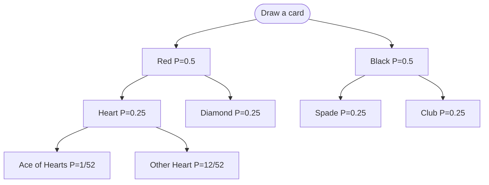

# Probability

## When It Appears in Interviews

- **Random selection** — pick a random element from a stream, a weighted list, or an infinite sequence
- **Shuffle algorithms** — producing a uniformly random permutation in-place
- **Expected value reasoning** — "what is the expected number of steps / comparisons / iterations?"
- **Keywords:** "random", "uniform", "shuffle", "weighted", "probability", "expected"

---

## Core Concepts

| Concept | Definition |
|---------|-----------|
| **Sample space Ω** | The set of all possible outcomes |
| **Event A** | A subset of Ω |
| **P(A)** | Probability of A: `\|A\| / \|Ω\|` for uniform distributions |
| **Complement** | `P(Aᶜ) = 1 − P(A)` |
| **Union** | `P(A∪B) = P(A) + P(B) − P(A∩B)` |
| **Conditional** | `P(A\|B) = P(A∩B) / P(B)` |
| **Bayes' Theorem** | `P(A\|B) = P(B\|A) · P(A) / P(B)` |
| **Expected Value** | `E[X] = Σ xᵢ · P(xᵢ)` |
| **Variance** | `Var(X) = E[X²] − (E[X])²` |
| **Linearity of E** | `E[X + Y] = E[X] + E[Y]` (always, even if dependent) |

---

## Probability Decision Tree Example



Conditional: P(Heart | Red) = P(Heart ∩ Red) / P(Red) = (1/4) / (1/2) = **1/2**.

---

## Template: Fisher-Yates Shuffle

Produces a **uniformly random permutation** in O(n) time, O(1) extra space.

=== "Python"

    ```python
    import random

    def fisher_yates_shuffle(arr: list) -> None:
        """Shuffle arr in-place using the Knuth / Fisher-Yates algorithm."""
        n = len(arr)
        for i in range(n - 1, 0, -1):
            j = random.randint(0, i)          # 0 ≤ j ≤ i
            arr[i], arr[j] = arr[j], arr[i]
    ```

=== "TypeScript"

    ```typescript
    function fisherYatesShuffle(arr: unknown[]): void {
        for (let i = arr.length - 1; i > 0; i--) {
            const j = Math.floor(Math.random() * (i + 1));
            [arr[i], arr[j]] = [arr[j], arr[i]];
        }
    }
    ```

=== "Rust"

    ```rust
    use rand::Rng;

    pub fn fisher_yates_shuffle<T>(arr: &mut Vec<T>) {
        let mut rng = rand::thread_rng();
        let n = arr.len();
        for i in (1..n).rev() {
            let j = rng.gen_range(0..=i);
            arr.swap(i, j);
        }
    }
    ```

=== "Java"

    ```java
    import java.util.Random;

    class Solution {
        public void fisherYatesShuffle(int[] arr) {
            Random rand = new Random();
            for (int i = arr.length - 1; i > 0; i--) {
                int j = rand.nextInt(i + 1);   // 0 ≤ j ≤ i
                int tmp = arr[i]; arr[i] = arr[j]; arr[j] = tmp;
            }
        }
    }
    ```

=== "C#"

    ```csharp
    public class Solution {
        private static readonly Random _rng = new();
        public void FisherYatesShuffle(int[] arr) {
            for (int i = arr.Length - 1; i > 0; i--) {
                int j = _rng.Next(i + 1);
                (arr[i], arr[j]) = (arr[j], arr[i]);
            }
        }
    }
    ```

=== "ASM"

    ```asm
    ; Fisher-Yates — x86-64 conceptual
    ; rsi = array base, rdi = n (length)
    ; Outer loop: i from n-1 down to 1  (rbx)
    ;   Call rand() or use rdrand instruction → rax
    ;   j = rax MOD (i+1)  → rdx  (via xor rdx,rdx; div rbx_plus_1)
    ;   Swap arr[i] and arr[j] using two mov + xchg
    ```

=== "Scala"

    ```scala
    import scala.util.Random

    object Solution {
      def fisherYatesShuffle(arr: Array[Int]): Unit = {
        val rng = new Random()
        for (i <- arr.length - 1 to 1 by -1) {
          val j = rng.nextInt(i + 1)
          val tmp = arr(i); arr(i) = arr(j); arr(j) = tmp
        }
      }
    }
    ```

---

## Template: Reservoir Sampling

Select `k` items uniformly at random from a stream of **unknown length** in O(n) time, O(k) space.

=== "Python"

    ```python
    import random
    from typing import Iterator

    def reservoir_sample(stream: Iterator[int], k: int) -> list[int]:
        reservoir: list[int] = []
        for i, item in enumerate(stream):
            if i < k:
                reservoir.append(item)
            else:
                j = random.randint(0, i)      # 0 ≤ j ≤ i
                if j < k:
                    reservoir[j] = item
        return reservoir
    ```

=== "TypeScript"

    ```typescript
    function reservoirSample(stream: number[], k: number): number[] {
        const reservoir = stream.slice(0, k);
        for (let i = k; i < stream.length; i++) {
            const j = Math.floor(Math.random() * (i + 1));
            if (j < k) reservoir[j] = stream[i];
        }
        return reservoir;
    }
    ```

=== "Rust"

    ```rust
    use rand::Rng;

    pub fn reservoir_sample(stream: &[i32], k: usize) -> Vec<i32> {
        let mut rng = rand::thread_rng();
        let mut reservoir: Vec<i32> = stream[..k].to_vec();
        for (i, &item) in stream[k..].iter().enumerate() {
            let j = rng.gen_range(0..=(i + k));
            if j < k { reservoir[j] = item; }
        }
        reservoir
    }
    ```

=== "Java"

    ```java
    import java.util.Random;

    class Solution {
        public int[] reservoirSample(int[] stream, int k) {
            Random rand = new Random();
            int[] reservoir = new int[k];
            System.arraycopy(stream, 0, reservoir, 0, k);
            for (int i = k; i < stream.length; i++) {
                int j = rand.nextInt(i + 1);
                if (j < k) reservoir[j] = stream[i];
            }
            return reservoir;
        }
    }
    ```

=== "C#"

    ```csharp
    public class Solution {
        private static readonly Random _rng = new();
        public int[] ReservoirSample(int[] stream, int k) {
            int[] reservoir = new int[k];
            Array.Copy(stream, reservoir, k);
            for (int i = k; i < stream.Length; i++) {
                int j = _rng.Next(i + 1);
                if (j < k) reservoir[j] = stream[i];
            }
            return reservoir;
        }
    }
    ```

=== "ASM"

    ```asm
    ; Reservoir sampling — x86-64 conceptual
    ; rsi = stream array, rdi = n, rcx = k
    ; Phase 1: copy first k elements into reservoir array
    ; Phase 2: i = k to n-1
    ;   j = rand() MOD (i+1)
    ;   CMP j, k  → if j < k: reservoir[j] = stream[i]
    ```

=== "Scala"

    ```scala
    import scala.util.Random

    object Solution {
      def reservoirSample(stream: Array[Int], k: Int): Array[Int] = {
        val rng = new Random()
        val reservoir = stream.take(k).clone()
        for (i <- k until stream.length) {
          val j = rng.nextInt(i + 1)
          if (j < k) reservoir(j) = stream(i)
        }
        reservoir
      }
    }
    ```

---

## Template: Weighted Random Selection

Pick an index with probability proportional to its weight (prefix-sum + binary search).

=== "Python"

    ```python
    import random, bisect

    class WeightedRandom:
        def __init__(self, weights: list[int]) -> None:
            self.prefix = []
            total = 0
            for w in weights:
                total += w
                self.prefix.append(total)
            self.total = total

        def pick_index(self) -> int:
            target = random.randint(1, self.total)
            return bisect.bisect_left(self.prefix, target)
    ```

=== "TypeScript"

    ```typescript
    class WeightedRandom {
        private prefix: number[];
        private total: number;
        constructor(weights: number[]) {
            this.prefix = [];
            this.total = 0;
            for (const w of weights) {
                this.total += w;
                this.prefix.push(this.total);
            }
        }
        pickIndex(): number {
            const target = Math.floor(Math.random() * this.total) + 1;
            let lo = 0, hi = this.prefix.length - 1;
            while (lo < hi) {
                const mid = (lo + hi) >> 1;
                if (this.prefix[mid] < target) lo = mid + 1;
                else hi = mid;
            }
            return lo;
        }
    }
    ```

=== "Rust"

    ```rust
    use rand::Rng;

    struct WeightedRandom { prefix: Vec<i64>, total: i64 }
    impl WeightedRandom {
        fn new(weights: &[i64]) -> Self {
            let mut prefix = Vec::with_capacity(weights.len());
            let mut total = 0i64;
            for &w in weights { total += w; prefix.push(total); }
            Self { prefix, total }
        }
        fn pick_index(&self) -> usize {
            let target = rand::thread_rng().gen_range(1..=self.total);
            self.prefix.partition_point(|&p| p < target)
        }
    }
    ```

=== "Java"

    ```java
    import java.util.Random;

    class WeightedRandom {
        private final int[] prefix;
        private final int total;
        private final Random rand = new Random();

        public WeightedRandom(int[] weights) {
            prefix = new int[weights.length];
            int sum = 0;
            for (int i = 0; i < weights.length; i++) { sum += weights[i]; prefix[i] = sum; }
            total = sum;
        }
        public int pickIndex() {
            int target = rand.nextInt(total) + 1;
            int lo = 0, hi = prefix.length - 1;
            while (lo < hi) {
                int mid = (lo + hi) >>> 1;
                if (prefix[mid] < target) lo = mid + 1; else hi = mid;
            }
            return lo;
        }
    }
    ```

=== "C#"

    ```csharp
    public class WeightedRandom {
        private readonly int[] _prefix;
        private readonly int _total;
        private static readonly Random _rng = new();

        public WeightedRandom(int[] weights) {
            _prefix = new int[weights.Length];
            int sum = 0;
            for (int i = 0; i < weights.Length; i++) { sum += weights[i]; _prefix[i] = sum; }
            _total = sum;
        }
        public int PickIndex() {
            int target = _rng.Next(1, _total + 1);
            int lo = 0, hi = _prefix.Length - 1;
            while (lo < hi) {
                int mid = (lo + hi) / 2;
                if (_prefix[mid] < target) lo = mid + 1; else hi = mid;
            }
            return lo;
        }
    }
    ```

=== "ASM"

    ```asm
    ; Weighted random pick — x86-64 conceptual
    ; Precompute prefix-sum array in memory
    ; Call rand() → rax; compute target = (rax MOD total) + 1
    ; Binary search prefix array for leftmost entry >= target
    ;   lo=0, hi=n-1; mid=(lo+hi)/2; CMP prefix[mid], target
    ;   JL → lo=mid+1; else hi=mid; until lo==hi → return lo in rax
    ```

=== "Scala"

    ```scala
    import scala.util.Random

    class WeightedRandom(weights: Array[Int]) {
      private val prefix: Array[Int] = weights.scanLeft(0)(_ + _).tail
      private val total: Int = prefix.last
      private val rng = new Random()

      def pickIndex(): Int = {
        val target = rng.nextInt(total) + 1
        var lo = 0; var hi = prefix.length - 1
        while (lo < hi) {
          val mid = (lo + hi) / 2
          if (prefix(mid) < target) lo = mid + 1 else hi = mid
        }
        lo
      }
    }
    ```

---

## Common Interview Problems

| Problem | Key Insight | Difficulty | Link |
|---------|-----------|-----------|------|
| Shuffle an Array | Fisher-Yates | Medium | [LeetCode 384](https://leetcode.com/problems/shuffle-an-array/){ target=_blank } |
| Linked List Random Node | Reservoir sampling (k=1) | Medium | [LeetCode 382](https://leetcode.com/problems/linked-list-random-node/){ target=_blank } |
| Random Pick with Weight | Prefix sum + binary search | Medium | [LeetCode 528](https://leetcode.com/problems/random-pick-with-weight/){ target=_blank } |
| Random Pick Index | Reservoir sampling over equal-value indices | Medium | [LeetCode 398](https://leetcode.com/problems/random-pick-index/){ target=_blank } |

---

[:octicons-arrow-left-24: Back: Combinatorics](combinatorics.md) · [:octicons-arrow-right-24: Next: Linear Algebra](linear-algebra.md)
