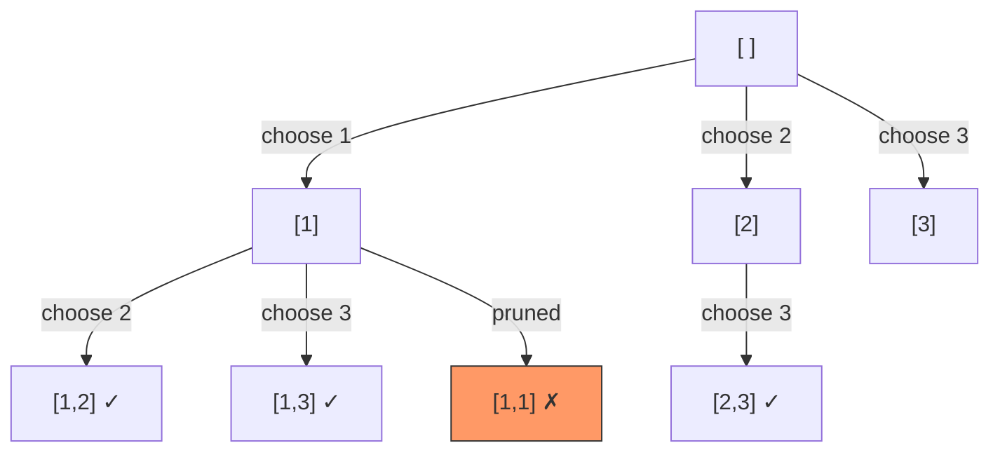

# Backtracking

## When to Use

- Problem asks for **all combinations, permutations, or subsets**
- You need to explore choices and **undo** them when they don't lead to a solution
- Keywords: "generate all", "find all", "possible combinations", "N-Queens"

---

## How It Works



At each step, **choose** a candidate, **recurse** with the updated state, then **undo** the choice (backtrack). Prune branches that violate constraints to avoid unnecessary work.

---

## Template

=== "Python"

    ```python
    def backtrack(nums: list[int]) -> list[list[int]]:
        result: list[list[int]] = []

        def helper(start: int, path: list[int]) -> None:
            result.append(path[:])          # record snapshot
            for i in range(start, len(nums)):
                path.append(nums[i])        # choose
                helper(i + 1, path)          # explore
                path.pop()                   # undo

        helper(0, [])
        return result
    ```

=== "TypeScript"

    ```typescript
    function backtrack(nums: number[]): number[][] {
        const result: number[][] = [];

        function helper(start: number, path: number[]): void {
            result.push([...path]);          // record snapshot
            for (let i = start; i < nums.length; i++) {
                path.push(nums[i]);          // choose
                helper(i + 1, path);         // explore
                path.pop();                  // undo
            }
        }

        helper(0, []);
        return result;
    }
    ```

=== "Rust"

    ```rust
    pub fn backtrack(nums: &[i32]) -> Vec<Vec<i32>> {
        let mut result: Vec<Vec<i32>> = Vec::new();

        fn helper(nums: &[i32], start: usize, path: &mut Vec<i32>,
                  result: &mut Vec<Vec<i32>>) {
            result.push(path.clone());       // record snapshot
            for i in start..nums.len() {
                path.push(nums[i]);          // choose
                helper(nums, i + 1, path, result); // explore
                path.pop();                  // undo
            }
        }

        helper(nums, 0, &mut Vec::new(), &mut result);
        result
    }
    ```

=== "Java"

    ```java
    class Solution {
        public List<List<Integer>> backtrack(int[] nums) {
            List<List<Integer>> result = new ArrayList<>();
            helper(nums, 0, new ArrayList<>(), result);
            return result;
        }

        private void helper(int[] nums, int start,
                            List<Integer> path,
                            List<List<Integer>> result) {
            result.add(new ArrayList<>(path));   // record snapshot
            for (int i = start; i < nums.length; i++) {
                path.add(nums[i]);               // choose
                helper(nums, i + 1, path, result); // explore
                path.remove(path.size() - 1);    // undo
            }
        }
    }
    ```

=== "C#"

    ```csharp
    public class Solution {
        public IList<IList<int>> Backtrack(int[] nums) {
            var result = new List<IList<int>>();
            Helper(nums, 0, new List<int>(), result);
            return result;
        }

        private void Helper(int[] nums, int start,
                            List<int> path,
                            List<IList<int>> result) {
            result.Add(new List<int>(path));      // record snapshot
            for (int i = start; i < nums.Length; i++) {
                path.Add(nums[i]);                // choose
                Helper(nums, i + 1, path, result); // explore
                path.RemoveAt(path.Count - 1);    // undo
            }
        }
    }
    ```

=== "ASM"

    ```asm
    ; Backtracking — conceptual x86-64
    ; Use the call stack as the recursion stack
    ; Push chosen element, recurse, then pop to undo (backtrack)
    ; Prune by checking constraints before the recursive call
    ```

=== "Scala"

    ```scala
    object Solution {
      def backtrack(nums: Array[Int]): List[List[Int]] = {
        val result = scala.collection.mutable.ListBuffer[List[Int]]()

        def helper(start: Int, path: List[Int]): Unit = {
          result += path                   // record snapshot
          for (i <- start until nums.length) {
            helper(i + 1, path :+ nums(i)) // choose & explore
          }                                // undo is implicit (immutable list)
        }

        helper(0, Nil)
        result.toList
      }
    }
    ```

---

## Variations

| Variation | Description |
|-----------|-------------|
| **Subsets** | Collect every partial path; start index prevents duplicates |
| **Permutations** | Use a visited set instead of a start index; path length == n is the goal |
| **Combinations** | Fixed-size k paths; prune when remaining elements < k − path length |
| **Constraint Satisfaction** | Check validity before recursing (e.g., Sudoku cell conflicts) |
| **N-Queens** | Place one queen per row; prune columns and diagonals |

---

## Practice Problems

| Problem | Difficulty | Link |
|---------|-----------|------|
| Subsets | Medium | [LeetCode 78](https://leetcode.com/problems/subsets/){ target=_blank } |
| Permutations | Medium | [LeetCode 46](https://leetcode.com/problems/permutations/){ target=_blank } |
| Combination Sum | Medium | [LeetCode 39](https://leetcode.com/problems/combination-sum/){ target=_blank } |
| N-Queens | Hard | [LeetCode 51](https://leetcode.com/problems/n-queens/){ target=_blank } |
| Word Search | Medium | [LeetCode 79](https://leetcode.com/problems/word-search/){ target=_blank } |
| Palindrome Partitioning | Medium | [LeetCode 131](https://leetcode.com/problems/palindrome-partitioning/){ target=_blank } |
