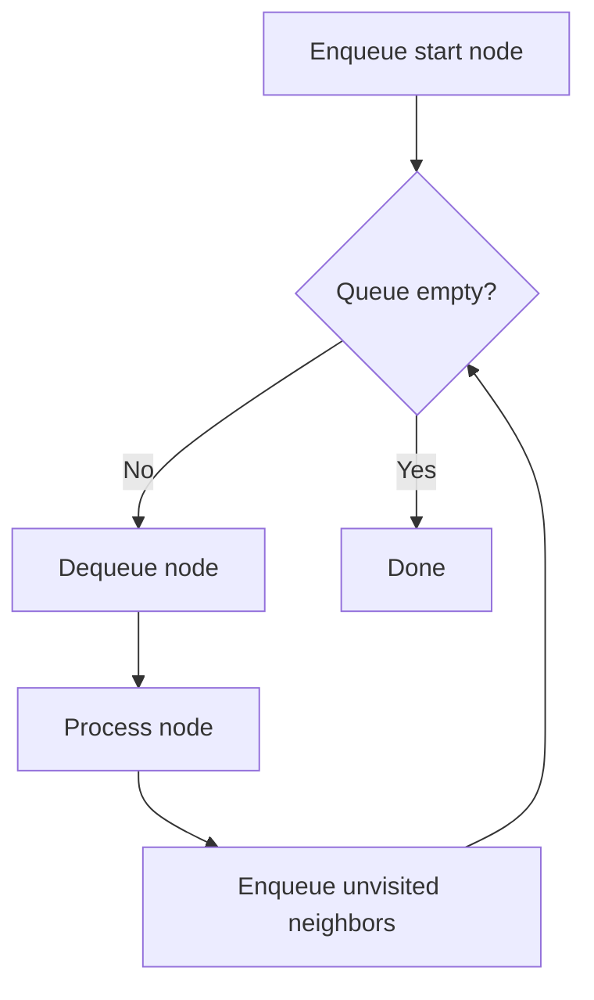
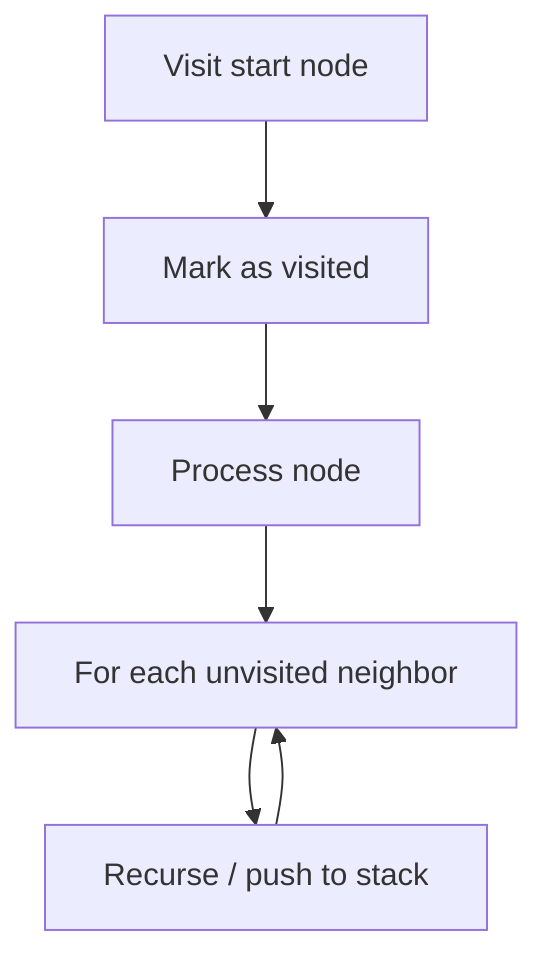

# BFS & DFS

## When to Use

- **BFS** — shortest path (unweighted), level-order traversal, nearest neighbor
- **DFS** — path finding, cycle detection, topological sort, connected components
- Both work on **trees** and **graphs**

---

## Comparison

| Aspect | BFS | DFS |
|--------|-----|-----|
| Data structure | Queue (FIFO) | Stack (LIFO) / recursion |
| Traversal order | Level by level | Branch by branch |
| Shortest path? | ✅ (unweighted) | ❌ |
| Space | O(width) | O(depth) |
| Best for | Levels, shortest path | Paths, cycles, backtracking |

---

## BFS Template



=== "Python"

    ```python
    from collections import deque

    def bfs(graph: dict[int, list[int]], start: int) -> list[int]:
        visited = {start}
        queue = deque([start])
        order: list[int] = []
        while queue:
            node = queue.popleft()
            order.append(node)
            for neighbor in graph[node]:
                if neighbor not in visited:
                    visited.add(neighbor)
                    queue.append(neighbor)
        return order
    ```

=== "TypeScript"

    ```typescript
    function bfs(graph: Map<number, number[]>, start: number): number[] {
        const visited = new Set<number>([start]);
        const queue: number[] = [start];
        const order: number[] = [];
        while (queue.length > 0) {
            const node = queue.shift()!;
            order.push(node);
            for (const neighbor of graph.get(node) ?? []) {
                if (!visited.has(neighbor)) {
                    visited.add(neighbor);
                    queue.push(neighbor);
                }
            }
        }
        return order;
    }
    ```

=== "Rust"

    ```rust
    use std::collections::{HashMap, HashSet, VecDeque};

    pub fn bfs(graph: &HashMap<i32, Vec<i32>>, start: i32) -> Vec<i32> {
        let mut visited = HashSet::from([start]);
        let mut queue = VecDeque::from([start]);
        let mut order = Vec::new();
        while let Some(node) = queue.pop_front() {
            order.push(node);
            if let Some(neighbors) = graph.get(&node) {
                for &neighbor in neighbors {
                    if visited.insert(neighbor) {
                        queue.push_back(neighbor);
                    }
                }
            }
        }
        order
    }
    ```

=== "Java"

    ```java
    import java.util.*;

    class Solution {
        public List<Integer> bfs(Map<Integer, List<Integer>> graph, int start) {
            Set<Integer> visited = new HashSet<>(Set.of(start));
            Queue<Integer> queue = new LinkedList<>(List.of(start));
            List<Integer> order = new ArrayList<>();
            while (!queue.isEmpty()) {
                int node = queue.poll();
                order.add(node);
                for (int neighbor : graph.getOrDefault(node, List.of())) {
                    if (visited.add(neighbor)) {
                        queue.offer(neighbor);
                    }
                }
            }
            return order;
        }
    }
    ```

=== "C#"

    ```csharp
    using System.Collections.Generic;

    public class Solution {
        public List<int> Bfs(Dictionary<int, List<int>> graph, int start) {
            var visited = new HashSet<int> { start };
            var queue = new Queue<int>();
            queue.Enqueue(start);
            var order = new List<int>();
            while (queue.Count > 0) {
                int node = queue.Dequeue();
                order.Add(node);
                if (graph.TryGetValue(node, out var neighbors)) {
                    foreach (int neighbor in neighbors) {
                        if (visited.Add(neighbor)) {
                            queue.Enqueue(neighbor);
                        }
                    }
                }
            }
            return order;
        }
    }
    ```

=== "ASM"

    ```asm
    ; BFS in assembly — use a queue (circular buffer)
    ; Maintain visited set via a bitmap or boolean array
    ; For each dequeued node, iterate adjacency list and enqueue unvisited
    ```

=== "Scala"

    ```scala
    import scala.collection.mutable

    object Solution {
      def bfs(graph: Map[Int, List[Int]], start: Int): List[Int] = {
        val visited = mutable.Set(start)
        val queue = mutable.Queue(start)
        val order = mutable.ListBuffer.empty[Int]
        while (queue.nonEmpty) {
          val node = queue.dequeue()
          order += node
          for (neighbor <- graph.getOrElse(node, Nil)) {
            if (visited.add(neighbor)) queue.enqueue(neighbor)
          }
        }
        order.toList
      }
    }
    ```

---

## DFS Template



=== "Python"

    ```python
    def dfs(graph: dict[int, list[int]], start: int) -> list[int]:
        visited: set[int] = set()
        order: list[int] = []

        def _dfs(node: int) -> None:
            visited.add(node)
            order.append(node)
            for neighbor in graph[node]:
                if neighbor not in visited:
                    _dfs(neighbor)

        _dfs(start)
        return order
    ```

=== "TypeScript"

    ```typescript
    function dfs(graph: Map<number, number[]>, start: number): number[] {
        const visited = new Set<number>();
        const order: number[] = [];
        function _dfs(node: number): void {
            visited.add(node);
            order.push(node);
            for (const neighbor of graph.get(node) ?? []) {
                if (!visited.has(neighbor)) _dfs(neighbor);
            }
        }
        _dfs(start);
        return order;
    }
    ```

=== "Rust"

    ```rust
    use std::collections::{HashMap, HashSet};

    pub fn dfs(graph: &HashMap<i32, Vec<i32>>, start: i32) -> Vec<i32> {
        let mut visited = HashSet::new();
        let mut order = Vec::new();
        fn _dfs(
            node: i32,
            graph: &HashMap<i32, Vec<i32>>,
            visited: &mut HashSet<i32>,
            order: &mut Vec<i32>,
        ) {
            visited.insert(node);
            order.push(node);
            if let Some(neighbors) = graph.get(&node) {
                for &neighbor in neighbors {
                    if !visited.contains(&neighbor) {
                        _dfs(neighbor, graph, visited, order);
                    }
                }
            }
        }
        _dfs(start, graph, &mut visited, &mut order);
        order
    }
    ```

=== "Java"

    ```java
    import java.util.*;

    class Solution {
        public List<Integer> dfs(Map<Integer, List<Integer>> graph, int start) {
            Set<Integer> visited = new HashSet<>();
            List<Integer> order = new ArrayList<>();
            dfsHelper(graph, start, visited, order);
            return order;
        }

        private void dfsHelper(Map<Integer, List<Integer>> graph, int node,
                               Set<Integer> visited, List<Integer> order) {
            visited.add(node);
            order.add(node);
            for (int neighbor : graph.getOrDefault(node, List.of())) {
                if (!visited.contains(neighbor)) {
                    dfsHelper(graph, neighbor, visited, order);
                }
            }
        }
    }
    ```

=== "C#"

    ```csharp
    using System.Collections.Generic;

    public class Solution {
        public List<int> Dfs(Dictionary<int, List<int>> graph, int start) {
            var visited = new HashSet<int>();
            var order = new List<int>();
            DfsHelper(graph, start, visited, order);
            return order;
        }

        private void DfsHelper(Dictionary<int, List<int>> graph, int node,
                                HashSet<int> visited, List<int> order) {
            visited.Add(node);
            order.Add(node);
            if (graph.TryGetValue(node, out var neighbors)) {
                foreach (int neighbor in neighbors) {
                    if (!visited.Contains(neighbor)) {
                        DfsHelper(graph, neighbor, visited, order);
                    }
                }
            }
        }
    }
    ```

=== "ASM"

    ```asm
    ; DFS in assembly — use the call stack or an explicit stack
    ; Mark visited in a boolean array
    ; For each node, iterate adjacency list and recurse on unvisited
    ```

=== "Scala"

    ```scala
    import scala.collection.mutable

    object Solution {
      def dfs(graph: Map[Int, List[Int]], start: Int): List[Int] = {
        val visited = mutable.Set.empty[Int]
        val order = mutable.ListBuffer.empty[Int]

        def _dfs(node: Int): Unit = {
          visited += node
          order += node
          for (neighbor <- graph.getOrElse(node, Nil)) {
            if (!visited.contains(neighbor)) _dfs(neighbor)
          }
        }

        _dfs(start)
        order.toList
      }
    }
    ```

---

## Practice Problems

| Problem | Type | Difficulty | Link |
|---------|------|-----------|------|
| Number of Islands | DFS/BFS | Medium | [LeetCode 200](https://leetcode.com/problems/number-of-islands/){ target=_blank } |
| Binary Tree Level Order Traversal | BFS | Medium | [LeetCode 102](https://leetcode.com/problems/binary-tree-level-order-traversal/){ target=_blank } |
| Course Schedule | DFS (topological) | Medium | [LeetCode 207](https://leetcode.com/problems/course-schedule/){ target=_blank } |
| Word Ladder | BFS | Hard | [LeetCode 127](https://leetcode.com/problems/word-ladder/){ target=_blank } |

---

[:octicons-arrow-left-24: Previous: Two Pointers](two-pointers.md) · [:octicons-arrow-right-24: Next: Dynamic Programming](dynamic-programming.md)
