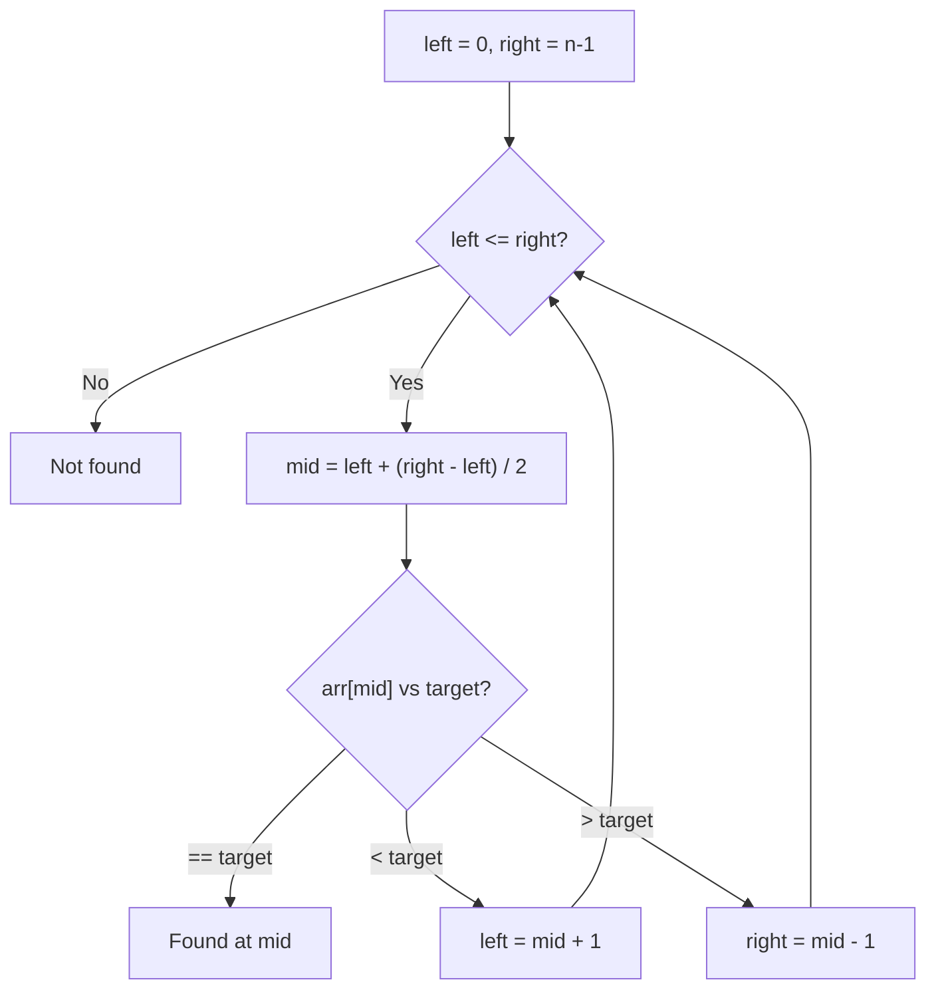

# Binary Search

## When to Use

- Search space is **sorted** or **monotonic**
- You can **discard half** the search space at each step
- Keywords: "sorted array", "find minimum", "search rotated", "kth element"

---

## How It Works



---

## Template

=== "Python"

    ```python
    def binary_search(nums: list[int], target: int) -> int:
        left, right = 0, len(nums) - 1
        while left <= right:
            mid = left + (right - left) // 2
            if nums[mid] == target:
                return mid
            elif nums[mid] < target:
                left = mid + 1
            else:
                right = mid - 1
        return -1
    ```

=== "TypeScript"

    ```typescript
    function binarySearch(nums: number[], target: number): number {
        let left = 0, right = nums.length - 1;
        while (left <= right) {
            const mid = left + Math.floor((right - left) / 2);
            if (nums[mid] === target) return mid;
            else if (nums[mid] < target) left = mid + 1;
            else right = mid - 1;
        }
        return -1;
    }
    ```

=== "Rust"

    ```rust
    pub fn binary_search(nums: &[i32], target: i32) -> i32 {
        let (mut left, mut right) = (0i32, nums.len() as i32 - 1);
        while left <= right {
            let mid = left + (right - left) / 2;
            match nums[mid as usize].cmp(&target) {
                std::cmp::Ordering::Equal => return mid,
                std::cmp::Ordering::Less => left = mid + 1,
                std::cmp::Ordering::Greater => right = mid - 1,
            }
        }
        -1
    }
    ```

=== "Java"

    ```java
    class Solution {
        public int binarySearch(int[] nums, int target) {
            int left = 0, right = nums.length - 1;
            while (left <= right) {
                int mid = left + (right - left) / 2;
                if (nums[mid] == target) return mid;
                else if (nums[mid] < target) left = mid + 1;
                else right = mid - 1;
            }
            return -1;
        }
    }
    ```

=== "C#"

    ```csharp
    public class Solution {
        public int BinarySearch(int[] nums, int target) {
            int left = 0, right = nums.Length - 1;
            while (left <= right) {
                int mid = left + (right - left) / 2;
                if (nums[mid] == target) return mid;
                else if (nums[mid] < target) left = mid + 1;
                else right = mid - 1;
            }
            return -1;
        }
    }
    ```

=== "ASM"

    ```asm
    ; x86-64 — binary_search
    ; rdi = *nums, esi = length, edx = target
    section .text
    global binary_search
    binary_search:
        xor     ecx, ecx            ; left = 0
        lea     r8d, [esi - 1]      ; right = length - 1
    .loop:
        cmp     ecx, r8d
        jg      .not_found
        lea     eax, [ecx + r8d]
        shr     eax, 1              ; mid = (left + right) / 2
        mov     r9d, [rdi + rax*4]  ; nums[mid]
        cmp     r9d, edx
        je      .found
        jl      .go_right
        lea     r8d, [rax - 1]      ; right = mid - 1
        jmp     .loop
    .go_right:
        lea     ecx, [rax + 1]      ; left = mid + 1
        jmp     .loop
    .found:
        ret                         ; eax = mid
    .not_found:
        mov     eax, -1
        ret
    ```

=== "Scala"

    ```scala
    object Solution {
      def binarySearch(nums: Array[Int], target: Int): Int = {
        var left = 0; var right = nums.length - 1
        while (left <= right) {
          val mid = left + (right - left) / 2
          if (nums(mid) == target) return mid
          else if (nums(mid) < target) left = mid + 1
          else right = mid - 1
        }
        -1
      }
    }
    ```

---

## Variations

| Variation | Modification |
|-----------|-------------|
| **Find leftmost** | When found, set `right = mid - 1` and keep searching |
| **Find rightmost** | When found, set `left = mid + 1` and keep searching |
| **Search on answer** | Binary search on the answer space (e.g., "minimum capacity to ship") |
| **Rotated array** | Check which half is sorted first |

---

## Practice Problems

| Problem | Variation | Difficulty | Link |
|---------|----------|-----------|------|
| Binary Search | Standard | Easy | [LeetCode 704](https://leetcode.com/problems/binary-search/){ target=_blank } |
| Search in Rotated Sorted Array | Rotated | Medium | [LeetCode 33](https://leetcode.com/problems/search-in-rotated-sorted-array/){ target=_blank } |
| Find Minimum in Rotated Sorted Array | Rotated | Medium | [LeetCode 153](https://leetcode.com/problems/find-minimum-in-rotated-sorted-array/){ target=_blank } |
| Koko Eating Bananas | Search on answer | Medium | [LeetCode 875](https://leetcode.com/problems/koko-eating-bananas/){ target=_blank } |
| Median of Two Sorted Arrays | Advanced | Hard | [LeetCode 4](https://leetcode.com/problems/median-of-two-sorted-arrays/){ target=_blank } |

---

[:octicons-arrow-left-24: Previous: Dynamic Programming](dynamic-programming.md) · [:octicons-arrow-right-24: Back to Pattern Reference](index.md)
