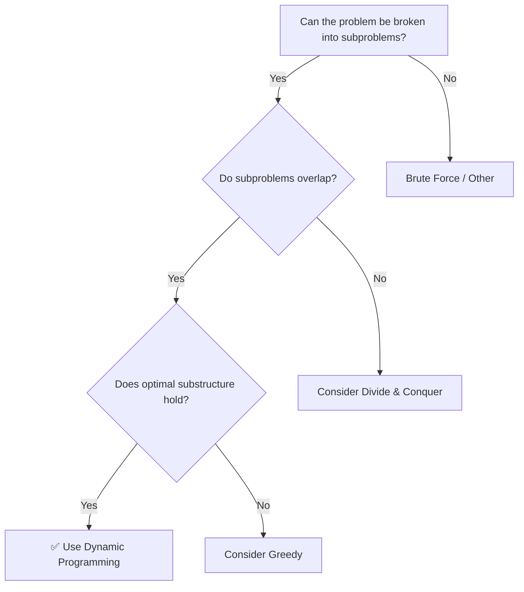
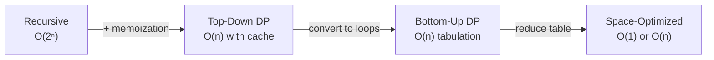

# Dynamic Programming

## When to Use

- Problem has **overlapping subproblems** (same computation repeated)
- Problem has **optimal substructure** (optimal solution builds on optimal sub-solutions)
- Keywords: "minimum cost", "maximum profit", "number of ways", "can you reach…"

---

## DP Decision Flowchart



## Approaches



---

## Template: 1D DP

=== "Python"

    ```python
    def dp_template(n: int) -> int:
        # Bottom-up with space optimization
        if n <= 1:
            return n
        prev, curr = 0, 1
        for i in range(2, n + 1):
            prev, curr = curr, prev + curr  # transition
        return curr
    ```

=== "TypeScript"

    ```typescript
    function dpTemplate(n: number): number {
        if (n <= 1) return n;
        let prev = 0, curr = 1;
        for (let i = 2; i <= n; i++) {
            const next = prev + curr;
            prev = curr;
            curr = next;
        }
        return curr;
    }
    ```

=== "Rust"

    ```rust
    pub fn dp_template(n: usize) -> usize {
        if n <= 1 { return n; }
        let (mut prev, mut curr) = (0, 1);
        for _ in 2..=n {
            let next = prev + curr;
            prev = curr;
            curr = next;
        }
        curr
    }
    ```

=== "Java"

    ```java
    class Solution {
        public int dpTemplate(int n) {
            if (n <= 1) return n;
            int prev = 0, curr = 1;
            for (int i = 2; i <= n; i++) {
                int next = prev + curr;
                prev = curr;
                curr = next;
            }
            return curr;
        }
    }
    ```

=== "C#"

    ```csharp
    public class Solution {
        public int DpTemplate(int n) {
            if (n <= 1) return n;
            int prev = 0, curr = 1;
            for (int i = 2; i <= n; i++) {
                int next = prev + curr;
                prev = curr;
                curr = next;
            }
            return curr;
        }
    }
    ```

=== "ASM"

    ```asm
    ; 1D DP in x86-64 — same as Fibonacci in climbing-stairs example
    ; Use two registers as prev/curr, loop from 2 to n
    ```

=== "Scala"

    ```scala
    object Solution {
      def dpTemplate(n: Int): Int = {
        if (n <= 1) return n
        var prev = 0; var curr = 1
        for (_ <- 2 to n) {
          val next = prev + curr
          prev = curr
          curr = next
        }
        curr
      }
    }
    ```

---

## Common DP Patterns

| Pattern | State | Transition | Examples |
|---------|-------|-----------|----------|
| **Linear** | `dp[i]` | `dp[i] = f(dp[i-1], dp[i-2], ...)` | Climbing Stairs, House Robber |
| **Knapsack** | `dp[i][w]` | Include/exclude item `i` with capacity `w` | 0/1 Knapsack, Coin Change |
| **Grid** | `dp[r][c]` | From `dp[r-1][c]` and `dp[r][c-1]` | Unique Paths, Min Path Sum |
| **String** | `dp[i][j]` | Compare `s[i]` and `t[j]` | Edit Distance, LCS |
| **Interval** | `dp[i][j]` | Split at `k` in range `[i,j]` | Matrix Chain, Burst Balloons |

---

## Practice Problems

| Problem | Sub-Pattern | Difficulty | Link |
|---------|-------------|-----------|------|
| Climbing Stairs | Linear | Easy | [LeetCode 70](https://leetcode.com/problems/climbing-stairs/){ target=_blank } |
| House Robber | Linear | Medium | [LeetCode 198](https://leetcode.com/problems/house-robber/){ target=_blank } |
| Coin Change | Knapsack | Medium | [LeetCode 322](https://leetcode.com/problems/coin-change/){ target=_blank } |
| Unique Paths | Grid | Medium | [LeetCode 62](https://leetcode.com/problems/unique-paths/){ target=_blank } |
| Longest Common Subsequence | String | Medium | [LeetCode 1143](https://leetcode.com/problems/longest-common-subsequence/){ target=_blank } |
| Edit Distance | String | Medium | [LeetCode 72](https://leetcode.com/problems/edit-distance/){ target=_blank } |

---

[:octicons-arrow-left-24: Previous: BFS & DFS](bfs-dfs.md) · [:octicons-arrow-right-24: Next: Binary Search](binary-search.md)
