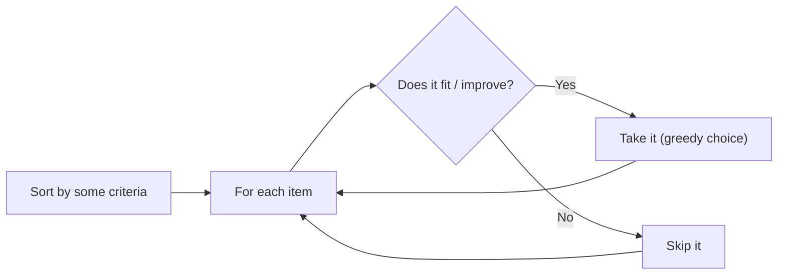

# Greedy

## When to Use

- A **locally optimal choice** at each step leads to the **global optimum**
- Problem involves scheduling, interval selection, or optimization
- Keywords: "minimum number of", "maximum profit", "earliest deadline", "fewest coins"

---

## How It Works



The greedy approach works when you can prove that taking the locally best option never prevents you from finding the globally best solution.

---

## Template

=== "Python"

    ```python
    def greedy_interval_schedule(intervals: list[list[int]]) -> int:
        """Maximum number of non-overlapping intervals."""
        intervals.sort(key=lambda x: x[1])  # sort by end time
        count = 0
        end = float('-inf')
        for start, finish in intervals:
            if start >= end:
                count += 1
                end = finish
        return count
    ```

=== "TypeScript"

    ```typescript
    function greedyIntervalSchedule(intervals: number[][]): number {
        intervals.sort((a, b) => a[1] - b[1]);
        let count = 0, end = -Infinity;
        for (const [start, finish] of intervals) {
            if (start >= end) { count++; end = finish; }
        }
        return count;
    }
    ```

=== "Rust"

    ```rust
    pub fn greedy_interval_schedule(intervals: &mut Vec<[i32; 2]>) -> i32 {
        intervals.sort_by_key(|iv| iv[1]);
        let (mut count, mut end) = (0, i32::MIN);
        for iv in intervals.iter() {
            if iv[0] >= end { count += 1; end = iv[1]; }
        }
        count
    }
    ```

=== "Java"

    ```java
    public int greedyIntervalSchedule(int[][] intervals) {
        Arrays.sort(intervals, (a, b) -> a[1] - b[1]);
        int count = 0, end = Integer.MIN_VALUE;
        for (int[] iv : intervals) {
            if (iv[0] >= end) { count++; end = iv[1]; }
        }
        return count;
    }
    ```

=== "C#"

    ```csharp
    public int GreedyIntervalSchedule(int[][] intervals) {
        Array.Sort(intervals, (a, b) => a[1].CompareTo(b[1]));
        int count = 0, end = int.MinValue;
        foreach (var iv in intervals) {
            if (iv[0] >= end) { count++; end = iv[1]; }
        }
        return count;
    }
    ```

=== "ASM"

    ```asm
    ; Greedy Interval Schedule — conceptual x86-64
    ; Sort intervals by end time (call qsort)
    ; Walk sorted array: if start >= last_end, increment count, update last_end
    ```

=== "Scala"

    ```scala
    def greedyIntervalSchedule(intervals: Array[Array[Int]]): Int = {
      val sorted = intervals.sortBy(_(1))
      var count = 0; var end = Int.MinValue
      for (iv <- sorted) if (iv(0) >= end) { count += 1; end = iv(1) }
      count
    }
    ```

---

## Common Greedy Patterns

| Pattern | Strategy | Example |
|---------|----------|---------|
| **Interval scheduling** | Sort by end time, pick non-overlapping | Non-overlapping Intervals |
| **Activity selection** | Sort by finish time, select compatible | Meeting Rooms |
| **Fractional knapsack** | Sort by value/weight ratio | — |
| **Jump game** | Track farthest reachable index | Jump Game |
| **Gas station** | Track running surplus | Gas Station |
| **Partition labels** | Track last occurrence of each char | Partition Labels |

---

## Greedy vs. DP

!!! warning "When Greedy Fails"
    Greedy does NOT work for 0/1 Knapsack, Coin Change (arbitrary denominations), or Edit Distance. These require DP because locally optimal choices can lead to globally suboptimal results.

| Criteria | Greedy | DP |
|----------|--------|-----|
| **Makes choices** | One best choice per step | All choices, pick optimal |
| **Correctness** | Must prove greedy property | Always correct |
| **Complexity** | Usually O(n log n) | Usually O(n²) or O(n·k) |
| **When to use** | Sorting + single pass suffices | Overlapping subproblems |

---

## Practice Problems

| Problem | Difficulty | Link |
|---------|-----------|------|
| Jump Game | Medium | [LeetCode 55](https://leetcode.com/problems/jump-game/){ target=_blank } |
| Jump Game II | Medium | [LeetCode 45](https://leetcode.com/problems/jump-game-ii/){ target=_blank } |
| Gas Station | Medium | [LeetCode 134](https://leetcode.com/problems/gas-station/){ target=_blank } |
| Non-overlapping Intervals | Medium | [LeetCode 435](https://leetcode.com/problems/non-overlapping-intervals/){ target=_blank } |
| Partition Labels | Medium | [LeetCode 763](https://leetcode.com/problems/partition-labels/){ target=_blank } |
| Valid Parenthesis String | Medium | [LeetCode 678](https://leetcode.com/problems/valid-parenthesis-string/){ target=_blank } |
| Task Scheduler | Medium | [LeetCode 621](https://leetcode.com/problems/task-scheduler/){ target=_blank } |

---

[:octicons-arrow-left-24: Previous: Backtracking](backtracking.md) · [:octicons-arrow-right-24: Next: Heap / Priority Queue](heap.md)
