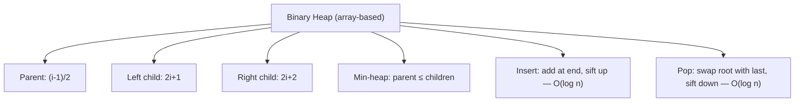

# Heap / Priority Queue

## When to Use

- Need repeated access to the **minimum or maximum** element
- **Top-K** problems, **K-th largest/smallest**
- **Merge K sorted** structures
- Keywords: "top k", "k-th largest", "median", "schedule", "merge k"

---

## How It Works



---

## Template

=== "Python"

    ```python
    import heapq

    def top_k_frequent(nums: list[int], k: int) -> list[int]:
        count: dict[int, int] = {}
        for n in nums:
            count[n] = count.get(n, 0) + 1
        # Min-heap of size k by frequency
        return heapq.nlargest(k, count.keys(), key=count.get)
    ```

=== "TypeScript"

    ```typescript
    // Using sorted array as simple priority queue
    function topKFrequent(nums: number[], k: number): number[] {
        const count = new Map<number, number>();
        for (const n of nums) count.set(n, (count.get(n) ?? 0) + 1);
        return [...count.entries()]
            .sort((a, b) => b[1] - a[1])
            .slice(0, k)
            .map(e => e[0]);
    }
    ```

=== "Rust"

    ```rust
    use std::collections::{BinaryHeap, HashMap};
    use std::cmp::Reverse;

    pub fn top_k_frequent(nums: Vec<i32>, k: usize) -> Vec<i32> {
        let mut count = HashMap::new();
        for n in &nums { *count.entry(n).or_insert(0) += 1; }
        let mut heap = BinaryHeap::new();
        for (&val, &freq) in &count {
            heap.push(Reverse((freq, val)));
            if heap.len() > k { heap.pop(); }
        }
        heap.into_iter().map(|Reverse((_, v))| v).collect()
    }
    ```

=== "Java"

    ```java
    public int[] topKFrequent(int[] nums, int k) {
        Map<Integer, Integer> count = new HashMap<>();
        for (int n : nums) count.merge(n, 1, Integer::sum);
        PriorityQueue<Integer> heap = new PriorityQueue<>(
            (a, b) -> count.get(a) - count.get(b));
        for (int key : count.keySet()) {
            heap.offer(key);
            if (heap.size() > k) heap.poll();
        }
        return heap.stream().mapToInt(i -> i).toArray();
    }
    ```

=== "C#"

    ```csharp
    public int[] TopKFrequent(int[] nums, int k) {
        var count = new Dictionary<int, int>();
        foreach (int n in nums) count[n] = count.GetValueOrDefault(n) + 1;
        var heap = new PriorityQueue<int, int>();
        foreach (var kv in count) {
            heap.Enqueue(kv.Key, kv.Value);
            if (heap.Count > k) heap.Dequeue();
        }
        var result = new int[k];
        for (int i = 0; i < k; i++) result[i] = heap.Dequeue();
        return result;
    }
    ```

=== "ASM"

    ```asm
    ; Heap — array-based binary heap
    ; Push: place at end, sift up (compare with parent, swap if needed)
    ; Pop: swap root with last, sift down (compare with smaller child)
    ```

=== "Scala"

    ```scala
    import scala.collection.mutable
    def topKFrequent(nums: Array[Int], k: Int): Array[Int] = {
      val count = nums.groupBy(identity).view.mapValues(_.length).toMap
      val heap = mutable.PriorityQueue.empty[(Int, Int)](Ordering.by(-_._2))
      for ((v, f) <- count) {
        heap.enqueue((v, f))
        if (heap.size > k) heap.dequeue()
      }
      heap.map(_._1).toArray
    }
    ```

---

## Common Heap Patterns

| Pattern | Description | Example |
|---------|-------------|---------|
| **Top-K** | Maintain min-heap of size K | Top K Frequent Elements |
| **K-th element** | Heap of size K, top is answer | Kth Largest in Stream |
| **Two heaps** | Max-heap for lower half, min-heap for upper | Find Median from Stream |
| **Merge K sorted** | Heap of K current elements, always pop smallest | Merge K Sorted Lists |
| **Greedy scheduling** | Pop highest priority task | Task Scheduler |

---

## Practice Problems

| Problem | Difficulty | Link |
|---------|-----------|------|
| Kth Largest Element in a Stream | Easy | [LeetCode 703](https://leetcode.com/problems/kth-largest-element-in-a-stream/){ target=_blank } |
| Last Stone Weight | Easy | [LeetCode 1046](https://leetcode.com/problems/last-stone-weight/){ target=_blank } |
| Kth Largest Element in an Array | Medium | [LeetCode 215](https://leetcode.com/problems/kth-largest-element-in-an-array/){ target=_blank } |
| Top K Frequent Elements | Medium | [LeetCode 347](https://leetcode.com/problems/top-k-frequent-elements/){ target=_blank } |
| Task Scheduler | Medium | [LeetCode 621](https://leetcode.com/problems/task-scheduler/){ target=_blank } |
| Merge K Sorted Lists | Hard | [LeetCode 23](https://leetcode.com/problems/merge-k-sorted-lists/){ target=_blank } |
| Find Median from Data Stream | Hard | [LeetCode 295](https://leetcode.com/problems/find-median-from-data-stream/){ target=_blank } |

---

[:octicons-arrow-left-24: Previous: Greedy](greedy.md) · [:octicons-arrow-right-24: Next: Intervals](intervals.md)
