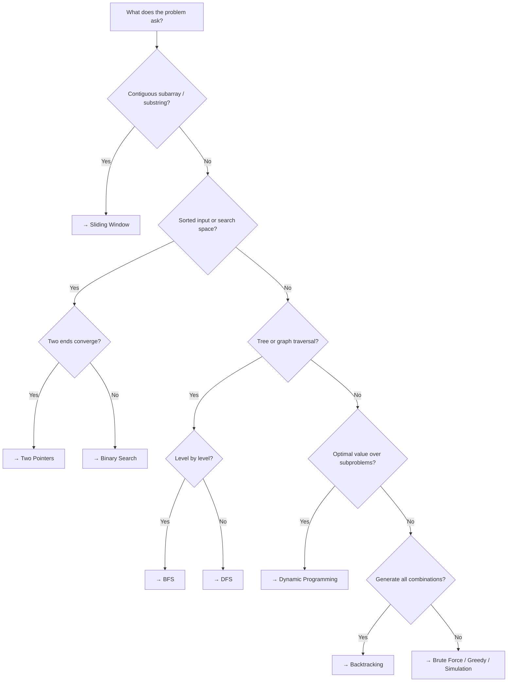

# Pattern Reference

Recognizing which **algorithmic pattern** a problem belongs to is the most valuable interview skill. This section provides templates and identification tips for the most common patterns.

---

## Pattern Selection Flowchart

---

## Patterns at a Glance

| Pattern | When to Use | Time | Key Data Structure | Page |
|---------|-------------|------|--------------------|------|
| [Sliding Window](sliding-window.md) | Contiguous subarray of size k or variable | O(n) | Array + Hash Map | [→](sliding-window.md) |
| [Two Pointers](two-pointers.md) | Sorted arrays, pair finding | O(n) | Sorted Array | [→](two-pointers.md) |
| [BFS & DFS](bfs-dfs.md) | Trees, graphs, shortest path | O(V+E) | Queue / Stack | [→](bfs-dfs.md) |
| [Dynamic Programming](dynamic-programming.md) | Overlapping subproblems | varies | Array / Hash Map | [→](dynamic-programming.md) |
| [Binary Search](binary-search.md) | Monotonic search space | O(log n) | Sorted Array | [→](binary-search.md) |

---

## External Resources

- [NeetCode Roadmap](https://neetcode.io/roadmap){ target=_blank } — visual pattern map
- [LeetCode Patterns](https://seanprashad.com/leetcode-patterns/){ target=_blank } — problems by pattern
- [14 Patterns to Ace Any Coding Interview](https://hackernoon.com/14-patterns-to-ace-any-coding-interview-question-c5bb3357f6ed){ target=_blank }
