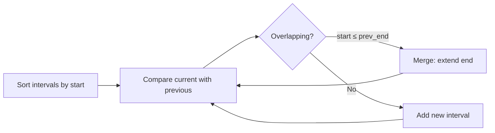

# Intervals

## When to Use

- Problem involves **ranges, time slots, or intervals**
- Keywords: "merge", "insert", "overlapping", "meeting rooms", "non-overlapping"
- Typical approach: **sort + linear sweep**

---

## How It Works



---

## Template: Merge Intervals

=== "Python"

    ```python
    def merge(intervals: list[list[int]]) -> list[list[int]]:
        intervals.sort(key=lambda x: x[0])
        merged = [intervals[0]]
        for start, end in intervals[1:]:
            if start <= merged[-1][1]:
                merged[-1][1] = max(merged[-1][1], end)
            else:
                merged.append([start, end])
        return merged
    ```

=== "TypeScript"

    ```typescript
    function merge(intervals: number[][]): number[][] {
        intervals.sort((a, b) => a[0] - b[0]);
        const merged = [intervals[0]];
        for (let i = 1; i < intervals.length; i++) {
            const last = merged[merged.length - 1];
            if (intervals[i][0] <= last[1])
                last[1] = Math.max(last[1], intervals[i][1]);
            else merged.push(intervals[i]);
        }
        return merged;
    }
    ```

=== "Rust"

    ```rust
    pub fn merge(mut intervals: Vec<Vec<i32>>) -> Vec<Vec<i32>> {
        intervals.sort_by_key(|iv| iv[0]);
        let mut merged = vec![intervals[0].clone()];
        for iv in intervals.iter().skip(1) {
            let last = merged.last_mut().unwrap();
            if iv[0] <= last[1] { last[1] = last[1].max(iv[1]); }
            else { merged.push(iv.clone()); }
        }
        merged
    }
    ```

=== "Java"

    ```java
    public int[][] merge(int[][] intervals) {
        Arrays.sort(intervals, (a, b) -> a[0] - b[0]);
        List<int[]> merged = new ArrayList<>();
        merged.add(intervals[0]);
        for (int i = 1; i < intervals.length; i++) {
            int[] last = merged.get(merged.size() - 1);
            if (intervals[i][0] <= last[1])
                last[1] = Math.max(last[1], intervals[i][1]);
            else merged.add(intervals[i]);
        }
        return merged.toArray(new int[0][]);
    }
    ```

=== "C#"

    ```csharp
    public int[][] Merge(int[][] intervals) {
        Array.Sort(intervals, (a, b) => a[0].CompareTo(b[0]));
        var merged = new List<int[]> { intervals[0] };
        for (int i = 1; i < intervals.Length; i++) {
            var last = merged[^1];
            if (intervals[i][0] <= last[1])
                last[1] = Math.Max(last[1], intervals[i][1]);
            else merged.Add(intervals[i]);
        }
        return merged.ToArray();
    }
    ```

=== "ASM"

    ```asm
    ; Intervals — conceptual x86-64
    ; Sort by start (call qsort), then linear sweep comparing start vs prev end
    ```

=== "Scala"

    ```scala
    def merge(intervals: Array[Array[Int]]): Array[Array[Int]] = {
      val sorted = intervals.sortBy(_(0))
      val merged = scala.collection.mutable.ArrayBuffer(sorted(0))
      for (iv <- sorted.tail) {
        val last = merged.last
        if (iv(0) <= last(1)) last(1) = last(1) max iv(1)
        else merged += iv
      }
      merged.toArray
    }
    ```

---

## Practice Problems

| Problem | Difficulty | Link |
|---------|-----------|------|
| Meeting Rooms | Easy | [LeetCode 252](https://leetcode.com/problems/meeting-rooms/){ target=_blank } |
| Insert Interval | Medium | [LeetCode 57](https://leetcode.com/problems/insert-interval/){ target=_blank } |
| Merge Intervals | Medium | [LeetCode 56](https://leetcode.com/problems/merge-intervals/){ target=_blank } |
| Non-overlapping Intervals | Medium | [LeetCode 435](https://leetcode.com/problems/non-overlapping-intervals/){ target=_blank } |
| Meeting Rooms II | Medium | [LeetCode 253](https://leetcode.com/problems/meeting-rooms-ii/){ target=_blank } |
| Minimum Interval to Include Each Query | Hard | [LeetCode 1851](https://leetcode.com/problems/minimum-interval-to-include-each-query/){ target=_blank } |

---

[:octicons-arrow-left-24: Previous: Heap](heap.md) · [:octicons-arrow-right-24: Next: Bit Manipulation](bit-manipulation.md)
