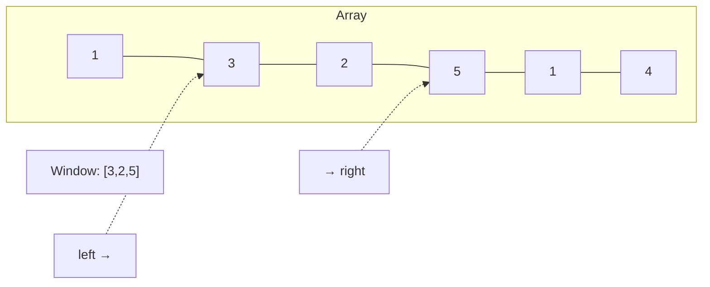

# Sliding Window

## When to Use

- Problem involves a **contiguous subarray or substring**
- You need to find max/min/count of something within a window
- Keywords: "subarray of size k", "longest substring", "minimum window"

---

## How It Works



Maintain two pointers (`left`, `right`) defining a window. Expand `right` to explore, shrink `left` to satisfy constraints.

---

## Template

=== "Python"

    ```python
    def sliding_window(arr: list[int], k: int) -> int:
        left = 0
        window_sum = 0
        best = 0
        for right in range(len(arr)):
            window_sum += arr[right]         # expand
            if right - left + 1 > k:
                window_sum -= arr[left]      # shrink
                left += 1
            best = max(best, window_sum)
        return best
    ```

=== "TypeScript"

    ```typescript
    function slidingWindow(arr: number[], k: number): number {
        let left = 0, windowSum = 0, best = 0;
        for (let right = 0; right < arr.length; right++) {
            windowSum += arr[right];
            if (right - left + 1 > k) {
                windowSum -= arr[left];
                left++;
            }
            best = Math.max(best, windowSum);
        }
        return best;
    }
    ```

=== "Rust"

    ```rust
    pub fn sliding_window(arr: &[i32], k: usize) -> i32 {
        let (mut left, mut window_sum, mut best) = (0, 0, 0);
        for right in 0..arr.len() {
            window_sum += arr[right];
            if right - left + 1 > k {
                window_sum -= arr[left];
                left += 1;
            }
            best = best.max(window_sum);
        }
        best
    }
    ```

=== "Java"

    ```java
    class Solution {
        public int slidingWindow(int[] arr, int k) {
            int left = 0, windowSum = 0, best = 0;
            for (int right = 0; right < arr.length; right++) {
                windowSum += arr[right];
                if (right - left + 1 > k) {
                    windowSum -= arr[left];
                    left++;
                }
                best = Math.max(best, windowSum);
            }
            return best;
        }
    }
    ```

=== "C#"

    ```csharp
    public class Solution {
        public int SlidingWindow(int[] arr, int k) {
            int left = 0, windowSum = 0, best = 0;
            for (int right = 0; right < arr.Length; right++) {
                windowSum += arr[right];
                if (right - left + 1 > k) {
                    windowSum -= arr[left];
                    left++;
                }
                best = Math.Max(best, windowSum);
            }
            return best;
        }
    }
    ```

=== "ASM"

    ```asm
    ; Sliding window — conceptual x86-64
    ; Maintain left/right indices in registers, running sum in eax
    ; Increment right each iteration; if window > k, increment left
    ; Track best in a separate register
    ```

=== "Scala"

    ```scala
    object Solution {
      def slidingWindow(arr: Array[Int], k: Int): Int = {
        var left = 0; var windowSum = 0; var best = 0
        for (right <- arr.indices) {
          windowSum += arr(right)
          if (right - left + 1 > k) {
            windowSum -= arr(left)
            left += 1
          }
          best = best.max(windowSum)
        }
        best
      }
    }
    ```

---

## Practice Problems

| Problem | Difficulty | Link |
|---------|-----------|------|
| Maximum Average Subarray I | Easy | [LeetCode 643](https://leetcode.com/problems/maximum-average-subarray-i/){ target=_blank } |
| Longest Substring Without Repeating Characters | Medium | [LeetCode 3](https://leetcode.com/problems/longest-substring-without-repeating-characters/){ target=_blank } |
| Minimum Window Substring | Hard | [LeetCode 76](https://leetcode.com/problems/minimum-window-substring/){ target=_blank } |

---

[:octicons-arrow-right-24: Next: Two Pointers](two-pointers.md)
