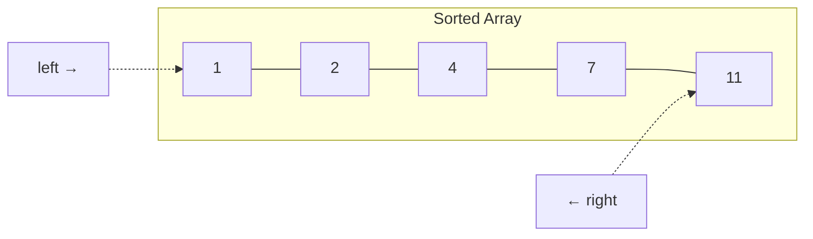

# Two Pointers

## When to Use

- Input is **sorted** (or can be sorted)
- Finding **pairs** that satisfy a condition
- Comparing elements from both ends
- Keywords: "pair with sum", "three sum", "container with most water"

---

## How It Works



Start with pointers at opposite ends. Move them inward based on the comparison result.

---

## Template

=== "Python"

    ```python
    def two_pointer_pair(nums: list[int], target: int) -> list[int]:
        nums.sort()
        left, right = 0, len(nums) - 1
        while left < right:
            current = nums[left] + nums[right]
            if current == target:
                return [left, right]
            elif current < target:
                left += 1
            else:
                right -= 1
        return []
    ```

=== "TypeScript"

    ```typescript
    function twoPointerPair(nums: number[], target: number): number[] {
        nums.sort((a, b) => a - b);
        let left = 0, right = nums.length - 1;
        while (left < right) {
            const current = nums[left] + nums[right];
            if (current === target) return [left, right];
            else if (current < target) left++;
            else right--;
        }
        return [];
    }
    ```

=== "Rust"

    ```rust
    pub fn two_pointer_pair(nums: &mut Vec<i32>, target: i32) -> Vec<i32> {
        nums.sort();
        let (mut left, mut right) = (0, nums.len() - 1);
        while left < right {
            let current = nums[left] + nums[right];
            if current == target {
                return vec![left as i32, right as i32];
            } else if current < target {
                left += 1;
            } else {
                right -= 1;
            }
        }
        vec![]
    }
    ```

=== "Java"

    ```java
    import java.util.Arrays;

    class Solution {
        public int[] twoPointerPair(int[] nums, int target) {
            Arrays.sort(nums);
            int left = 0, right = nums.length - 1;
            while (left < right) {
                int current = nums[left] + nums[right];
                if (current == target) return new int[] { left, right };
                else if (current < target) left++;
                else right--;
            }
            return new int[] {};
        }
    }
    ```

=== "C#"

    ```csharp
    using System;

    public class Solution {
        public int[] TwoPointerPair(int[] nums, int target) {
            Array.Sort(nums);
            int left = 0, right = nums.Length - 1;
            while (left < right) {
                int current = nums[left] + nums[right];
                if (current == target) return new int[] { left, right };
                else if (current < target) left++;
                else right--;
            }
            return Array.Empty<int>();
        }
    }
    ```

=== "ASM"

    ```asm
    ; Two pointers — conceptual x86-64
    ; left in ecx (starts at 0), right in edx (starts at n-1)
    ; Compare sum to target; adjust left++ or right-- accordingly
    ; Loop while left < right
    ```

=== "Scala"

    ```scala
    object Solution {
      def twoPointerPair(nums: Array[Int], target: Int): Array[Int] = {
        val sorted = nums.sorted
        var left = 0; var right = sorted.length - 1
        while (left < right) {
          val current = sorted(left) + sorted(right)
          if (current == target) return Array(left, right)
          else if (current < target) left += 1
          else right -= 1
        }
        Array.empty
      }
    }
    ```

---

## Variations

| Variation | Description |
|-----------|-------------|
| **Same direction** | Both pointers move left→right (fast/slow for linked lists) |
| **Opposite direction** | Pointers converge from both ends |
| **Three pointers** | Fix one, two-pointer on the rest (3Sum) |

---

## Practice Problems

| Problem | Difficulty | Link |
|---------|-----------|------|
| Two Sum II (sorted) | Medium | [LeetCode 167](https://leetcode.com/problems/two-sum-ii-input-array-is-sorted/){ target=_blank } |
| 3Sum | Medium | [LeetCode 15](https://leetcode.com/problems/3sum/){ target=_blank } |
| Container With Most Water | Medium | [LeetCode 11](https://leetcode.com/problems/container-with-most-water/){ target=_blank } |
| Trapping Rain Water | Hard | [LeetCode 42](https://leetcode.com/problems/trapping-rain-water/){ target=_blank } |

---

[:octicons-arrow-left-24: Previous: Sliding Window](sliding-window.md) · [:octicons-arrow-right-24: Next: BFS & DFS](bfs-dfs.md)
