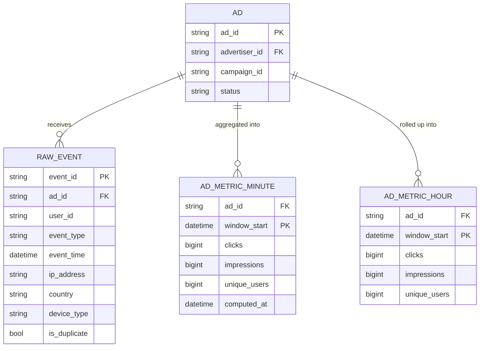
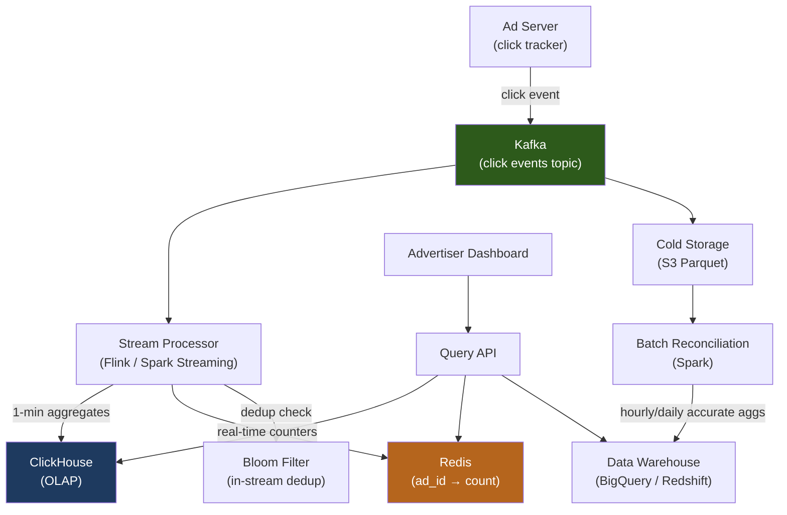
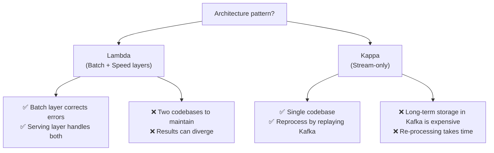
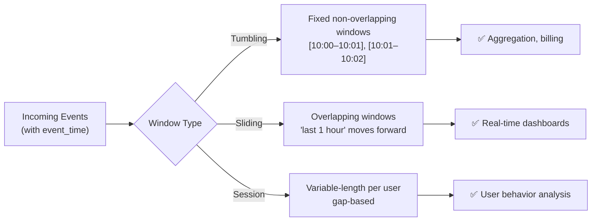

# Design Ad Click Aggregation (Real-Time Analytics)

An ad click aggregation system counts ad clicks and impressions in near-real-time, enabling advertisers to monitor campaign performance and the platform to detect click fraud. The challenge is accurately aggregating high-volume event streams while handling late arrivals, duplicates, and providing both real-time dashboards and precise historical reports.

---

## Requirements

### Functional Requirements

1. Record ad click and impression events as they occur.
2. Query aggregate counts (clicks, impressions, CTR) by `(ad_id, time_window)`.
3. Support time windows: last 1 minute, 1 hour, 1 day.
4. *(Optional)* Real-time fraud detection (click farms, bots).
5. *(Optional)* Breakdowns by country, device type, browser.
6. *(Optional)* Billing-grade accurate counts for advertiser invoicing.

### Non-Functional Requirements

- **High throughput** — ingest 1 M click events/sec at peak.
- **Low latency** — dashboards update within 1 minute.
- **Exactly-once counting** — duplicates inflate advertiser costs and damage trust.
- **Scale** — 1 T events/year; query latency < 1 second for recent windows.

!!! note "Clarifying scope"
    Ask: *"Do we need real-time counts (seconds) or near-real-time (minutes)? Is billing-grade accuracy required, or is approximate counting acceptable for the dashboard?"*

---

## Capacity Estimation

| Metric | Assumption | Result |
|--------|-----------|--------|
| Peak click events | 1 M events/sec | **~86 B events/day** |
| Event size | 200 bytes | **~17 TB raw data/day** |
| Unique active ads | 10 M ads | — |
| Aggregated rows/day | 10 M ads × 1 440 min/day | **~14.4 B aggregated rows/day** |
| Query rate | 10 k advertisers × 10 queries/min | **~1 700 QPS** |

!!! tip "Back-of-envelope shortcut"
    Raw events are too large to query directly. Aggregate into time-bucketed counters to reduce query data from 17 TB/day to manageable summary tables.

---

## API Design

```
POST /api/v1/events/click
Body:  { "ad_id": "ad_123", "user_id": "u_456", "timestamp": 1700000000, "ip": "1.2.3.4", "country": "US", "device": "mobile" }
Response 202

GET /api/v1/ads/{ad_id}/metrics?start=2025-01-15T10:00:00Z&end=2025-01-15T11:00:00Z&granularity=minute
Response 200:
{
  "ad_id": "ad_123",
  "metrics": [
    { "window_start": "2025-01-15T10:00:00Z", "clicks": 1420, "impressions": 24500, "ctr": 0.058 }
  ]
}

GET /api/v1/ads/{ad_id}/metrics/realtime
Response 200: { "ad_id": "ad_123", "clicks_last_minute": 234, "clicks_last_hour": 14200 }
```

---

## Data Model



**Storage choice:** Raw events in Kafka (temporary) and cold storage (S3 Parquet). Minute-level aggregates in ClickHouse (OLAP, columnar). Hour/day aggregates in PostgreSQL. Real-time counters in Redis.

---

## High-Level Architecture



---

## Key Design Decisions

### Lambda vs. Kappa Architecture



**Recommended:** Lambda architecture for billing-grade systems — the batch layer acts as the ground truth for invoicing, while the speed layer powers real-time dashboards. Kappa is preferred when simplicity outweighs the need for a batch correction layer.

### Time Windowing



**For dashboards:** Sliding windows (last 1 minute, last 1 hour) using Redis counters with TTL. **For billing:** Tumbling 1-minute windows in ClickHouse, rolled up to daily in the data warehouse.

### Deduplication

Duplicate clicks arise from bot retries, network glitches, and ad server retransmissions:

1. **Bloom filter in-stream:** Before counting, check `BloomFilter.contains(event_id)`. Probabilistic but fast — false positive rate ~0.1%.
2. **Exact dedup with Redis SET:** `SADD dedup:{ad_id}:{minute} event_id` — exact but expensive at scale.
3. **Hybrid:** Use Bloom filter as first pass; exact dedup for suspected fraud events flagged by the fraud model.

### Handling Late Arrivals

Events can arrive late due to mobile offline mode or network delays:

- Maintain a **watermark** per Kafka partition: the latest event timestamp seen.
- Accept events up to 5 minutes late (within the allowed lateness window).
- Events arriving > 5 minutes late go to a "late arrivals" topic, processed by the batch job.
- This ensures the streaming layer's counts stabilize within 5 minutes of the window close.

---

## Example Interview Dialog

> **Interviewer:** How do you ensure advertisers are billed accurately, given that the stream processor might count some events twice or miss some?

> **Candidate:** I use a two-layer approach — classic Lambda architecture. The streaming layer gives near-real-time counts for dashboards but may have small errors. Billing uses counts from the batch layer: every hour, Spark reads the raw events from S3 Parquet (the immutable record), deduplicates by `event_id` exactly, and computes the authoritative hourly aggregates in the data warehouse. Advertisers are invoiced using these batch-computed numbers, not the streaming counts. The dashboard shows streaming counts with a label "approximate — final numbers available after hour close."

---

> **Interviewer:** How do you handle click fraud at 1 million events per second?

> **Candidate:** Click fraud detection runs as a parallel stream processing job. I look for signals in near-real-time: more than N clicks from the same IP in 1 minute (velocity), clicks from IPs on known bot lists (blocklist lookup in Redis), and statistical anomalies like a sudden 100× spike in CTR for an ad that had stable historical performance. Events flagged as fraudulent are routed to a `fraud_events` Kafka topic and excluded from billing counts. For more sophisticated fraud (distributed botnets), a separate batch ML model scores click patterns daily and retroactively marks events, triggering a billing adjustment.

---

## Deep Dive: ClickHouse for OLAP Aggregation

ClickHouse is a columnar OLAP database optimized for aggregation queries:

```sql
-- Minute-level aggregations stored as a materialized view
CREATE MATERIALIZED VIEW ad_clicks_1min
ENGINE = SummingMergeTree
PARTITION BY toYYYYMMDD(window_start)
ORDER BY (ad_id, window_start)
AS SELECT
    ad_id,
    toStartOfMinute(event_time) AS window_start,
    count() AS clicks,
    uniqCombined(user_id) AS unique_users
FROM raw_click_events
GROUP BY ad_id, window_start;
```

**`SummingMergeTree`** automatically merges partial aggregations in the background — inserts from multiple stream processing partitions accumulate and are summed lazily, providing exactly-once semantics at the aggregate level without requiring coordination during ingestion.

---

## Deep Dive: Redis Real-Time Counters

For real-time dashboard metrics ("clicks in the last minute"):

```
Key schema: clicks:{ad_id}:{unix_minute}
Command:    INCR clicks:ad_123:28333420      (current minute bucket)
TTL:        EXPIRE clicks:ad_123:28333420 120  (auto-expire after 2 minutes)

Query "last 1 minute":
  MGET clicks:ad_123:28333420 clicks:ad_123:28333419
  → sum the two values
```

Each minute bucket is a separate key with a 2-minute TTL. This uses O(1) memory per ad per active minute and requires zero cleanup — Redis expires old buckets automatically.

---

[:octicons-arrow-left-24: Back: System Design Index](index.md)
