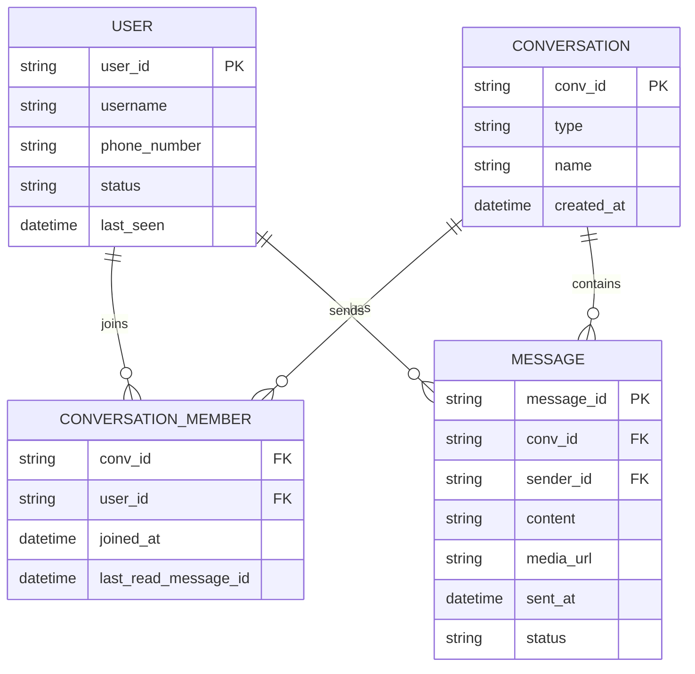
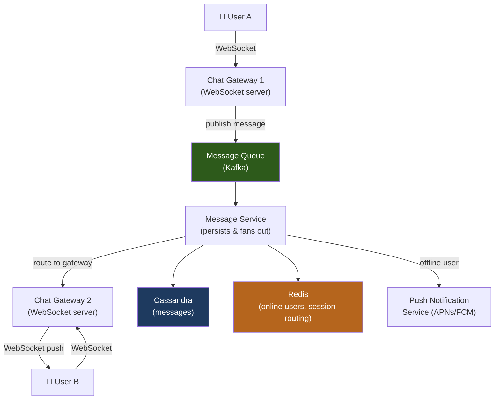
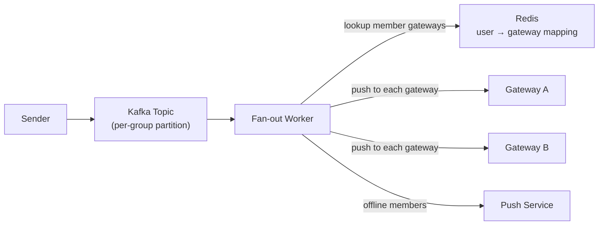
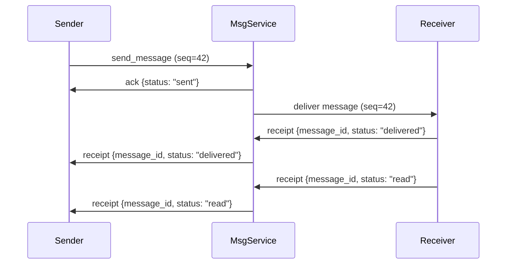

# Design a Chat System (e.g., WhatsApp / Slack)

A chat system delivers messages between users with low latency, supports group conversations, and maintains message history. The core challenge is pushing messages in real-time to potentially millions of concurrent connections while providing durability and ordering guarantees.

---

## Requirements

### Functional Requirements

1. One-to-one messaging between users.
2. Group chats (up to 500 members).
3. Messages are delivered in order; each message has a monotonically increasing ID within a conversation.
4. Message delivery receipts (sent, delivered, read).
5. *(Optional)* Online/last-seen presence indicators.
6. *(Optional)* Media attachments (images, files).
7. *(Optional)* Push notifications for offline users.

### Non-Functional Requirements

- **Low latency** — message delivery in < 500 ms for online users.
- **High availability** — users expect 24/7 service.
- **Durability** — messages must not be lost.
- **Scale** — 500 M daily active users, 100 B messages/day.

!!! note "Clarifying scope"
    Ask: *"Is end-to-end encryption required? Should I focus on 1:1 chat or include group chats? What's the max group size?"*

---

## Capacity Estimation

| Metric | Assumption | Result |
|--------|-----------|--------|
| Message rate | 100 B messages / 86 400 s | **~1.16 M messages/sec** |
| Message size | 100 bytes average | **~116 MB/sec write throughput** |
| Storage per year | 1.16 M msg/s × 100 B × 31.5 M s | **~3.6 PB/year** |
| Concurrent connections | 500 M DAU × 20% online at peak | **~100 M WebSocket connections** |

!!! tip "Back-of-envelope shortcut"
    100 M persistent WebSocket connections requires careful memory management — each idle connection uses ~10–20 KB RAM, totaling 1–2 TB across chat gateway servers.

---

## API Design

```
WebSocket: wss://chat.example.com/ws
  Client → Server:  { "type": "send_message", "conversation_id": "conv_abc", "content": "Hello!", "client_msg_id": "cm_001" }
  Server → Client:  { "type": "new_message", "message_id": "m_123456", "conversation_id": "conv_abc", "sender_id": "u_789", "content": "Hello!", "timestamp": 1700000000 }
  Server → Client:  { "type": "receipt", "message_id": "m_123456", "status": "delivered" }

REST fallback (for offline / message history):
GET  /api/v1/conversations/{conv_id}/messages?before_id=m_123456&limit=50
POST /api/v1/conversations
     Body: { "participant_ids": ["u_1", "u_2"], "type": "direct" }
```

---

## Data Model



**Storage choice:** Messages stored in Cassandra, partitioned by `(conv_id, time_bucket)` — optimized for the most common access pattern: load the last N messages in a conversation. User and conversation metadata in PostgreSQL.

---

## High-Level Architecture



---

## Key Design Decisions

### WebSocket vs. Long Polling vs. Server-Sent Events

| Transport | Direction | Use Case |
|-----------|-----------|----------|
| **WebSocket** | Bidirectional | Full-duplex chat — ideal |
| **Long Polling** | Server→Client (simulated) | Fallback for restrictive proxies |
| **SSE** | Server→Client only | Read-only feeds |

**Recommended:** WebSocket for all platforms. Implement long polling as a fallback for clients behind proxies that terminate WebSocket connections.

### Message Fan-out: 1:1 vs. Group

For 1:1 messages, delivering to a single connection is straightforward. Group chats require fanning out to all members:



For very large groups (> 500 members), fan-out happens asynchronously via the Kafka consumer. This prevents the sender from waiting for delivery to all members.

### Message Ordering

Each conversation is assigned a **sequence number** maintained by a Redis counter (`INCR conv:{conv_id}:seq`). This gives messages a monotonic ID within each conversation, ensuring clients can detect gaps and request missing messages.

### Presence System

```
User connects:    Redis HSET presence:{user_id} gateway_id gw1; EXPIRE 60
User heartbeat:   EXPIRE presence:{user_id} 60  (every 30s)
User disconnects: DEL presence:{user_id}
Fetch online:     HEXISTS presence:{user_id}
```

---

## Example Interview Dialog

> **Interviewer:** How do you route a message to the right WebSocket gateway server when you have thousands of gateway nodes?

> **Candidate:** Each gateway registers all its connected user IDs in Redis on connection: `HSET presence:{user_id} gateway_id gw_007`. When the Message Service needs to deliver to User B, it looks up `presence:{user_id}` to find which gateway owns that connection, then sends the message directly to that gateway via an internal pub/sub channel or gRPC call. If the user is offline (key missing), the message goes to the push notification service instead.

---

> **Interviewer:** How do you guarantee message ordering in a distributed system?

> **Candidate:** I use a per-conversation sequence number stored in Redis. When a message is submitted, the Message Service atomically increments `INCR conv:{conv_id}:seq` and assigns that integer as the message's sequence number before writing to Cassandra. Clients display messages sorted by sequence number and detect gaps — if they receive sequence 5 after 3 (missing 4), they issue a REST request to fetch the missing message. This gives ordering within a conversation without requiring a global sequence or distributed transaction.

---

> **Interviewer:** What happens to messages sent while a user is offline?

> **Candidate:** Messages are persisted to Cassandra regardless of delivery status. For users with mobile apps, we send a push notification (APNs for iOS, FCM for Android) with a lightweight payload containing the conversation ID. When the user opens the app, it connects via WebSocket and fetches unread messages from the REST API using the `last_read_message_id` stored per conversation membership. This "pull on reconnect" pattern ensures no messages are missed even if push notifications are dropped.

---

## Deep Dive: Cassandra Schema for Messages

Cassandra data model optimized for "load last 50 messages in a conversation":

```
CREATE TABLE messages (
    conv_id       text,
    time_bucket   int,          -- floor(timestamp / 86400) = day bucket
    message_id    timeuuid,     -- natural time-ordered key
    sender_id     text,
    content       text,
    media_url     text,
    status        text,
    PRIMARY KEY ((conv_id, time_bucket), message_id)
) WITH CLUSTERING ORDER BY (message_id DESC);
```

**Partition key** `(conv_id, time_bucket)` keeps a single day's messages for a conversation on the same node, bounding partition size. The `timeuuid` clustering key is time-ordered and unique, providing natural ordering without a separate counter.

---

## Deep Dive: Read Receipts

Delivery receipts flow back from recipient to sender via the same WebSocket channel:



Read receipts are stored in the `MESSAGE` table and in the `CONVERSATION_MEMBER.last_read_message_id` column. For group chats, read receipts are aggregated: "read by N of M members."

---

[:octicons-arrow-left-24: Back: System Design Index](index.md)
