# Design a Code Deployment System (e.g., CI/CD Pipeline)

A code deployment system automates the journey from a developer's commit to running code in production. It must be fast enough to not block developers, reliable enough that bad code doesn't reach production, and flexible enough to support progressive rollouts that limit blast radius.

---

## Requirements

### Functional Requirements

1. On every code push, automatically run build, test, and lint steps.
2. On merge to main, automatically deploy to staging; manually promote to production.
3. Support blue-green and canary deployment strategies.
4. Enable instant rollback to the previous version.
5. *(Optional)* Feature flags / dark launches.
6. *(Optional)* Multi-region deployments.
7. *(Optional)* Deployment audit log and approval workflows.

### Non-Functional Requirements

- **Fast feedback** — CI pipeline result in < 10 minutes.
- **Reliability** — pipeline failures must not affect production.
- **Scalability** — support 1 000 engineers committing concurrently.
- **Safety** — bad deploys should be automatically detected and rolled back.

!!! note "Clarifying scope"
    Ask: *"Is this for a monolith or microservices? What is the target deployment platform — VMs, Kubernetes, serverless? Should I include the build system or focus on deployment?"*

---

## Capacity Estimation

| Metric | Assumption | Result |
|--------|-----------|--------|
| Concurrent builds | 1 000 engineers × 5 commits/day / 600 s pipeline | **~8 concurrent builds** (bursty: ~50 peak) |
| Build artifact size | 500 MB Docker image per service | — |
| Artifact registry storage | 50 services × 100 versions × 500 MB | **~2.5 TB** |
| Deploy frequency | 50 services × 10 deploys/day | **~500 deploys/day** |

!!! tip "Back-of-envelope shortcut"
    CI/CD is more about latency (feedback loop) than throughput. Optimize for P95 pipeline time — developers context-switch when waiting > 10 minutes.

---

## API Design

```
# Internal APIs (used by CLI tooling and the dashboard)

POST /api/v1/pipelines/trigger
Body:  { "repo": "my-service", "commit_sha": "abc1234", "branch": "main", "triggered_by": "push" }
Response 202: { "pipeline_id": "pl_xyz", "status": "QUEUED" }

GET /api/v1/pipelines/{pipeline_id}
Response 200: { "pipeline_id": "pl_xyz", "status": "IN_PROGRESS", "stages": [{ "name": "test", "status": "PASSED", "duration_secs": 87 }] }

POST /api/v1/deployments
Body:  { "service": "my-service", "version": "v1.2.3", "environment": "production", "strategy": "canary", "canary_pct": 10 }
Response 202: { "deployment_id": "dep_abc", "status": "DEPLOYING" }

POST /api/v1/deployments/{deployment_id}/rollback
Response 202: { "status": "ROLLING_BACK" }
```

---

## Data Model


**Storage choice:** PostgreSQL for pipeline and deployment metadata. Object storage (S3) for build logs and test results. Container registry (ECR, GCR) for Docker images, indexed by content-addressable SHA256 digest.

---

## High-Level Architecture

```mermaid
flowchart TD
    DevPush["👩‍💻 Developer\ngit push"] -->|"webhook"| GitProvider["Git Provider\n(GitHub / GitLab)"]
    GitProvider -->|"webhook event"| PipelineOrch["Pipeline Orchestrator\n(triggers pipeline)"]

    PipelineOrch -->|"queue build job"| JobQueue["Job Queue\n(Kafka / Redis)"]
    JobQueue --> BuildAgents["Build Agent Pool\n(Docker containers)"]

    BuildAgents -->|"1. checkout"| Repo["Code Repository"]
    BuildAgents -->|"2. build + test"| BuildEnv["Isolated Build Env\n(Docker-in-Docker)"]
    BuildAgents -->|"3. push image"| Registry["Container Registry\n(ECR / GCR)"]
    BuildAgents -->|"4. update status"| PipelineDB["Pipeline DB\n(PostgreSQL)"]

    Registry -->|"promote to prod"| DeploySvc["Deployment Service"]
    DeploySvc -->|"rolling / blue-green / canary"| K8s["Kubernetes Cluster\n(production)"]
    K8s -->|"metrics"| Monitor["Monitoring\n(Prometheus / Datadog)"]
    Monitor -->|"error rate spike"| AutoRollback["Auto-Rollback\nController"]

    style BuildAgents fill:#2d5a1b,color:#fff
    style K8s fill:#1e3a5f,color:#fff
    style Registry fill:#b5651d,color:#fff
```



---

## Key Design Decisions

### Deployment Strategies

```mermaid
flowchart TD
    A["Deploy new version v2"] --> B{"Strategy?"}
    B -->|"Simplest"| Rolling["Rolling Update\nReplace pods one-by-one"]
    B -->|"Zero downtime"| BG["Blue-Green\nSwitch traffic at LB"]
    B -->|"Risk reduction"| Canary["Canary\nRoute N% to new version"]

    Rolling --> R_Con["❌ Mixed versions during deploy\n❌ Rollback = re-deploy old version"]
    BG --> BG_Pro["✅ Instant switch\n✅ Instant rollback (flip LB back)"]
    BG --> BG_Con["❌ 2× resource cost during deploy"]
    Canary --> C_Pro["✅ Limit blast radius\n✅ A/B test new version"]
    Canary --> C_Con["❌ More complex routing\n❌ Longer deploy window"]
```



**Recommended for production:** Canary deployments with automatic promotion or rollback based on error rate and latency metrics. Start at 1%, wait 5 minutes, expand to 10%, 25%, 50%, 100% if metrics stay healthy.

### Immutable Artifacts

Every build produces an immutable Docker image tagged with the commit SHA (`my-service:abc1234`). Deployments always reference a specific image digest (not a mutable tag like `:latest`):

```
docker pull my-service@sha256:e3b0c44298fc1c149afb...
```

This guarantees: staging and production run byte-for-byte identical code. Rollback = point Kubernetes to the previous image digest — no rebuild required.

### Pipeline as Code

Pipeline definition lives in the repository (`.ci/pipeline.yaml`):

```yaml
stages:
  - name: lint
    command: "make lint"
    timeout: 120
  - name: test
    command: "make test"
    parallelism: 4
    timeout: 300
  - name: build
    command: "docker build -t ${IMAGE}:${COMMIT_SHA} ."
  - name: push
    command: "docker push ${IMAGE}:${COMMIT_SHA}"
    condition: "branch == main"
```

**Benefits:** Pipeline changes are code-reviewed, versioned, and rolled back like application code.

---

## Example Interview Dialog

> **Interviewer:** How do you minimize build times for a large monorepo with 200 services?

> **Candidate:** Two key techniques: **incremental builds** and **remote caching**. For incremental builds, I use a dependency graph to determine which services are affected by a given commit. If only `service-A`'s code changed, I only rebuild `service-A` and its dependents — not all 200 services. I implement this using a build tool like Bazel or Nx that tracks file-level dependency graphs. For remote caching, build outputs (compiled binaries, test results, Docker layers) are stored in a shared cache keyed by a hash of inputs. If the same inputs were built before (e.g., a dependency that didn't change), the cached output is fetched instead of rebuilt — this often achieves > 80% cache hit rates.

---

> **Interviewer:** How would you implement automatic rollback if a deploy causes an error rate spike?

> **Candidate:** I'd deploy a rollback controller that continuously monitors key SLIs after every deployment: error rate, P99 latency, and crash rate. The controller is aware of deployment events via the Deployment Service's API. For canary deployments, it compares the error rate of the canary pods against the stable pods. If the canary error rate exceeds a threshold (e.g., 2× baseline) for more than 2 consecutive 1-minute windows, it automatically triggers a rollback: sets canary traffic to 0% and fires an alert to the on-call engineer. The rollback itself is just a Kubernetes image update reverting to the previous digest — no code changes needed.

---

> **Interviewer:** How do you handle secrets (API keys, DB passwords) in the build and deploy pipeline?

> **Candidate:** Secrets are never stored in the repository or baked into Docker images. In the build pipeline, secrets needed for integration tests are injected at runtime from a secrets manager (HashiCorp Vault or AWS Secrets Manager) as environment variables into the build container. In production, secrets are mounted into Kubernetes pods as environment variables or volume mounts from Kubernetes Secrets, which are backed by the secrets manager. Vault uses short-lived, automatically-rotated credentials. The pipeline only has permission to access the specific secrets it needs (least-privilege IAM roles).

---

## Deep Dive: Canary Analysis


Canary analysis compares statistical distributions, not just point-in-time values — use a two-sample t-test or Mann-Whitney U-test to avoid false positives from transient spikes. Tools like Kayenta (Netflix) automate this analysis.

---

## Deep Dive: Build Isolation and Security

Each build runs in an isolated Docker container with:
- Read-only filesystem except for designated output directories.
- No network access during the test stage (prevents supply-chain attacks from calling home).
- Resource limits (CPU, memory) to prevent one build from starving others.
- Ephemeral credentials (short-lived IAM role assumed per build).
- Image scanning (Trivy, Snyk) for known CVEs before push to registry.

Build containers are destroyed after each job — no state persists between builds.

---

[:octicons-arrow-left-24: Back: System Design Index](index.md)
