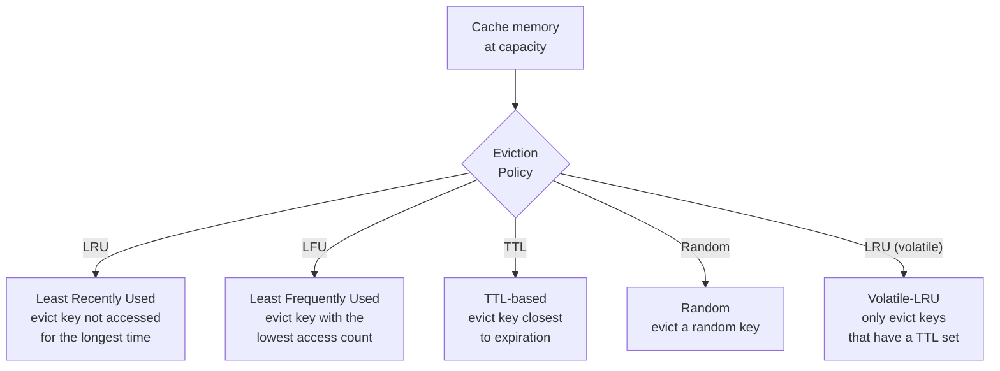
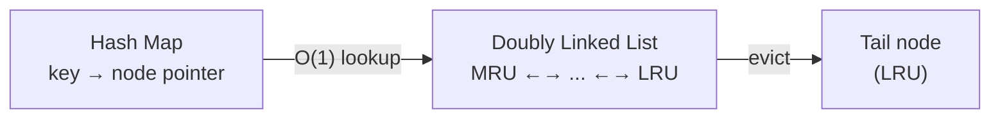
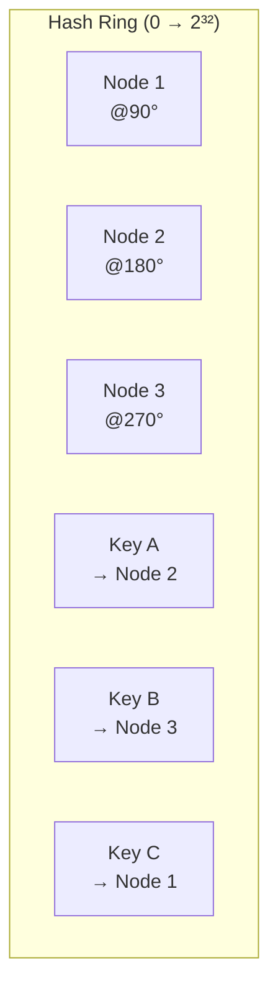
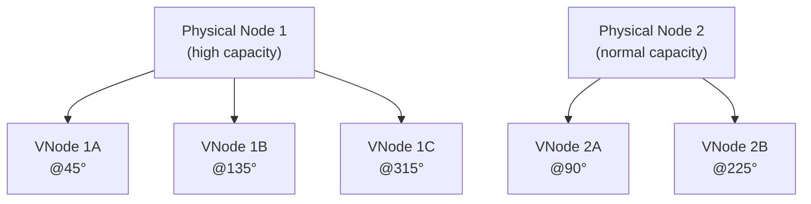
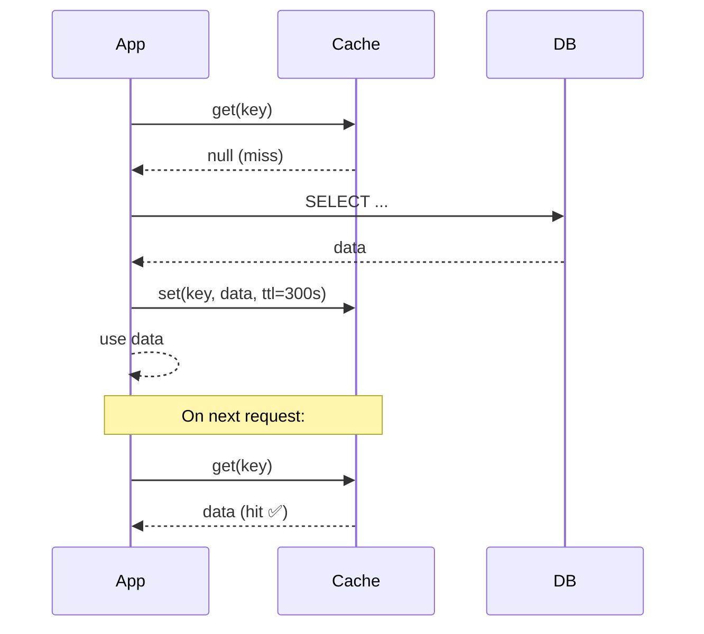
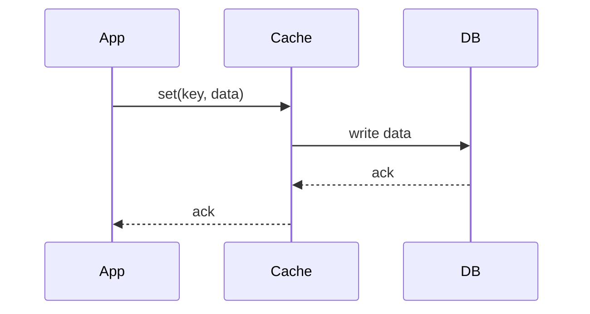
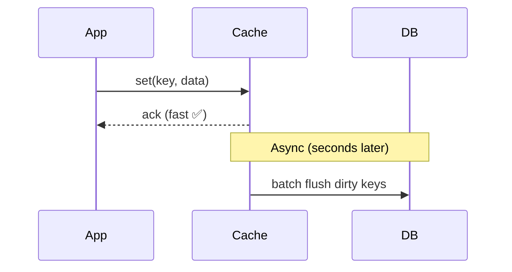
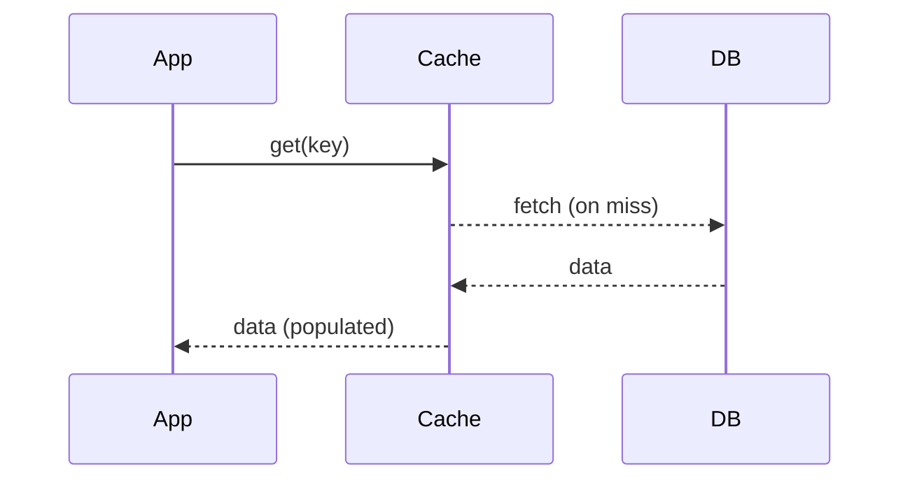
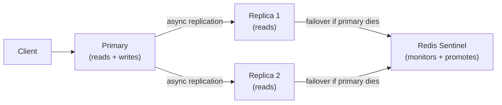

# Design a Distributed Cache (e.g., Redis / Memcached)

A distributed cache stores frequently accessed data in fast in-memory storage, dramatically reducing latency and database load. This design problem tests your understanding of eviction policies, consistent hashing, replication, and cache coherence.

---

## Requirements

### Functional Requirements

1. `set(key, value, ttl)` — store a value with an optional time-to-live.
2. `get(key)` → value or null — retrieve a value; return null on miss.
3. `delete(key)` — explicitly remove a key.
4. Support **TTL-based expiration** — keys expire automatically.
5. Support **eviction** when memory is full (configurable policy).

### Non-Functional Requirements

- **Latency:** `get`/`set` in < 1 ms at p99.
- **Scale:** Support hundreds of millions of keys across a cluster.
- **Availability:** Survive node failures without full cache loss.
- **Consistency:** Tunable — strong consistency for some use cases, eventual for others.

!!! note "Clarifying scope"
    Ask: *"Is this a general-purpose cache or domain-specific (e.g., session store)? Do clients need strong consistency or is eventual consistency fine? What's the maximum value size?"*

---

## Capacity Estimation

| Metric | Assumption | Result |
|--------|-----------|--------|
| Total keys | 200M | — |
| Avg key+value size | 1 KB | 200 GB total data |
| Nodes with 64 GB RAM each | — | ~4 nodes (50% memory headroom) |
| Read QPS | 1M/sec | — |
| Write QPS | 100K/sec | — |
| Hit rate target | 95% | — |

---

## Eviction Policies

When the cache reaches its memory limit, it must evict keys to make room. The right eviction policy depends on access patterns.

| Policy | Best For | Weakness |
|--------|----------|----------|
| **LRU (allkeys-lru)** | General purpose; working set fits in cache | Doesn't account for frequency — a one-time scan evicts hot keys |
| **LFU (allkeys-lfu)** | Skewed access patterns with clear hot keys | Slow to adapt to new hot keys (cold start) |
| **TTL-based** | Data with natural expiry (sessions, tokens) | Doesn't evict based on access patterns |
| **Volatile-LRU** | Mix of persistent + ephemeral keys | Persistent keys never evicted — can fill cache |
| **No eviction** | Critical data that must not be lost | Cache can fill up and start returning errors |

!!! tip "Redis recommendation"
    For most general-purpose caches, use `allkeys-lru`. If your access pattern is highly skewed (a small number of keys get > 90% of traffic), `allkeys-lfu` can improve hit rates significantly.

### LRU Implementation Detail

A correct O(1) LRU cache uses:
- A **hash map** for O(1) key lookup.
- A **doubly linked list** to track access order (most recent at head).
- On `get`: move accessed node to head.
- On eviction: remove node from tail.

---

## Consistent Hashing for Distribution

Naive sharding (`hash(key) % N`) requires remapping nearly all keys when a node is added or removed. **Consistent hashing** minimizes remapping.

**How it works:**

1. Hash both nodes and keys onto a circular ring (0 to 2³²).
2. A key is assigned to the **first node clockwise** from its hash position.
3. When a node is added/removed, only the keys in its predecessor arc are remapped — typically `1/N` of total keys.

### Virtual Nodes (VNodes)

A single node maps to many positions on the ring (typically 100–200 virtual nodes per physical node). This:
- Evenly distributes keys even with heterogeneous node capacities.
- Prevents hotspots when one node holds a disproportionate arc.

---

## Cache Patterns

### Cache-Aside (Lazy Loading)

The application manages the cache explicitly. Most common pattern.

**Pros:** Simple; cache only contains data that was actually requested.
**Cons:** Cache miss adds two extra round trips; thundering herd on cold start.

---

### Write-Through

Every write goes to both cache and DB synchronously.

**Pros:** Cache always consistent with DB; reads always hit cache after first write.
**Cons:** Write latency increased (wait for both cache + DB); rarely accessed data wastes cache space.

---

### Write-Back (Write-Behind)

Writes go to cache only; DB is updated asynchronously in batches.

**Pros:** Lowest write latency; batching reduces DB write load.
**Cons:** Data loss risk if cache node fails before flush; complex implementation.

---

### Read-Through

Cache sits between app and DB; handles misses automatically.

**Pros:** App logic simplified — never needs to talk to DB directly.
**Cons:** First request always slow; requires cache to know DB schema.

---

### Pattern Comparison

| Pattern | Read Latency | Write Latency | Consistency | Complexity |
|---------|-------------|--------------|-------------|------------|
| **Cache-Aside** | High (miss) / Low (hit) | DB latency | Eventual | Low |
| **Write-Through** | Low | DB latency | Strong | Medium |
| **Write-Back** | Low | < 1 ms | Eventual | High |
| **Read-Through** | Low (after warmup) | DB latency | Strong | Medium |

---

## Replication and High Availability

### Primary-Replica Replication

- **Redis Sentinel:** Monitors primary; auto-promotes a replica if the primary is unreachable for > 30s.
- **Redis Cluster:** 16 384 hash slots distributed across primaries; each primary has replicas for HA. Supports automatic sharding + failover.

### Replication Lag Trade-Off

Async replication is fast but means replicas can be **slightly stale**. For most cache use cases (eventual consistency), this is fine. For session data or rate-limit counters that require accuracy, always read from the primary.

---

## Example Interview Dialog

> **Interviewer:** How do you handle the thundering herd problem when the cache is cold?

> **Candidate:** The thundering herd happens when a popular key expires and thousands of requests simultaneously miss the cache, all hitting the database at once. I'd handle it with **mutex locking**: when a cache miss occurs, one request acquires a distributed lock (Redis `SET NX`) and fetches from DB, while other requests for the same key wait briefly then retry the cache. Only the lock holder writes to cache. This collapses N database reads into one. A simpler alternative is **probabilistic early expiration** — each read has a small chance of refreshing the key before it actually expires, spreading the refresh load over time.

---

> **Interviewer:** How do you handle cache eviction when a node fails and keys remapped to a new node are all cold?

> **Candidate:** This is a real traffic spike risk. When consistent hashing remaps keys from a failed node to its successor, that successor has none of those keys and will see a sudden surge of cache misses — all hitting the DB. Mitigations: (1) **Replicate hot keys** — each key is stored on 2+ adjacent nodes on the hash ring, so a single failure doesn't lose data; (2) **Read-through warming** — after node replacement, a background job pre-warms the cache for known hot keys before routing live traffic; (3) **DB connection pooling + circuit breakers** — cap how many DB requests the app will make, shedding load gracefully rather than overwhelming the DB.

---

[:octicons-arrow-left-24: Back: Notification System](notification-system.md) · [:octicons-arrow-right-24: Next: Message Queue](message-queue.md)
