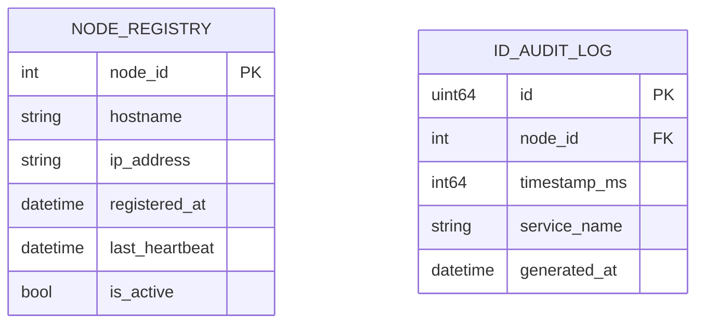
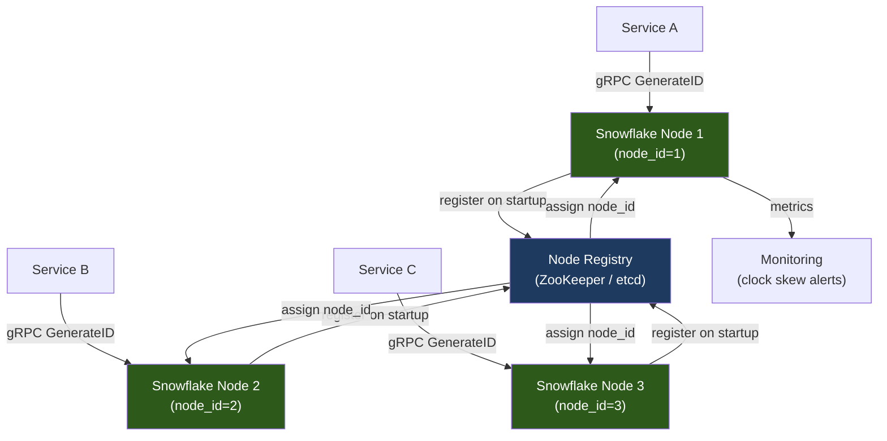
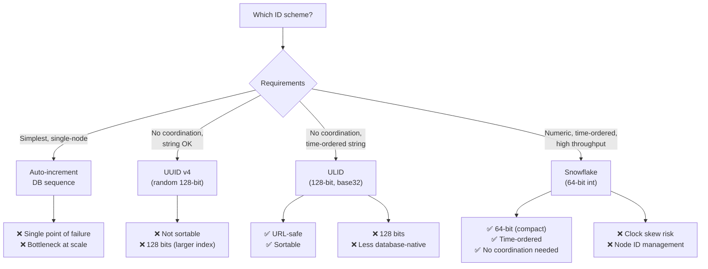
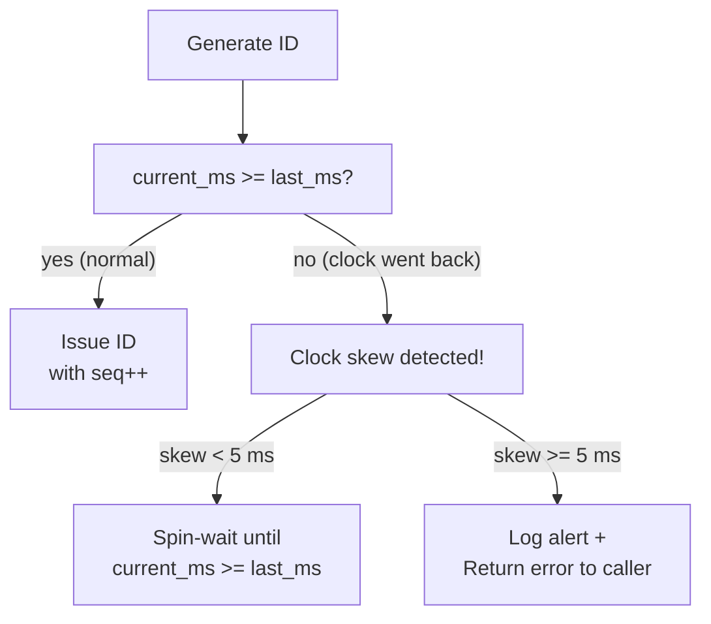

# Design a Distributed ID Generator (e.g., Twitter Snowflake)

A distributed ID generator produces globally unique, roughly time-ordered identifiers without requiring coordination between nodes. IDs must be generated at high throughput, be safe to use as database primary keys, and ideally reveal ordering information for efficient range queries.

---

## Requirements

### Functional Requirements

1. Generate a globally unique 64-bit integer ID.
2. IDs must be sortable by time (k-sorted — IDs generated around the same time should be close in value).
3. Multiple generator nodes must not produce the same ID.
4. *(Optional)* IDs should not reveal user counts or business metrics (non-sequential per entity).

### Non-Functional Requirements

- **High throughput** — generate > 1 M IDs/sec across the cluster.
- **Low latency** — generation in < 1 ms (ideally < 1 µs on the hot path).
- **High availability** — ID generation is a dependency for every write in the system.
- **No single point of failure** — no central coordinator required.

!!! note "Clarifying scope"
    Ask: *"Should IDs be numeric (64-bit int) or string? Do we need human readability? Can IDs leak the creation timestamp?"*

---

## Capacity Estimation

| Metric | Assumption | Result |
|--------|-----------|--------|
| Peak ID generation | 10 services × 100 k IDs/sec each | **~1 M IDs/sec** |
| Snowflake IDs available | 1000 IDs/ms per node | **1 000 × 1 024 nodes × 4 096 seq/ms = ~4 B IDs/ms** |
| ID size | 64 bits = 8 bytes | 8 bytes per ID — compact for DB indexes |
| Epoch rollover | Snowflake with 41-bit timestamp | **~69 years before epoch overflow** |

!!! tip "Back-of-envelope shortcut"
    A 64-bit Snowflake ID can encode 41 bits of milliseconds (~69 years), 10 bits of node ID (1 024 nodes), and 12 bits of sequence (4 096 IDs per ms per node) = over 4 billion IDs per second across the cluster.

---

## API Design

```
# Internal service — called via gRPC or library, not a public REST API

gRPC:
rpc GenerateID(GenerateIDRequest) returns (GenerateIDResponse);

message GenerateIDRequest {
  string service_name = 1;   // for audit/metrics
}

message GenerateIDResponse {
  uint64 id = 1;
  int64  timestamp_ms = 2;   // when the ID was generated
  uint32 node_id = 3;
}

# Batch generation:
rpc GenerateIDs(GenerateIDsRequest) returns (GenerateIDsResponse);

message GenerateIDsRequest {
  uint32 count = 1;   // max 1000
}
```

---

## Data Model



**Storage choice:** The `NODE_REGISTRY` is the only persistent store — a small table in PostgreSQL or a ZooKeeper/etcd node registry. The ID generation itself is purely in-memory arithmetic; no database is touched per ID generation.

---

## High-Level Architecture



---

## Key Design Decisions

### Bit Layout: Twitter Snowflake

```
 63        22         12        0
  |---------|----------|---------|
  | 41 bits | 10 bits  | 12 bits |
  |timestamp| node_id  |  seq    |
```

| Field | Bits | Range | Notes |
|-------|------|-------|-------|
| Sign bit | 1 | 0 | Always 0 (keep IDs positive) |
| Timestamp | 41 | ~69 years in ms | Relative to a custom epoch |
| Node ID | 10 | 0–1023 | Unique per generator node |
| Sequence | 12 | 0–4095 | Reset each ms; overflow waits for next ms |

**Custom epoch:** Set to your company's founding date (e.g., 2020-01-01 00:00:00 UTC) to maximize the usable timestamp range.

### Comparing ID Schemes



### Handling Clock Skew

Clock skew is the main failure mode for Snowflake: if a node's clock moves backward, it could regenerate a previously-issued timestamp and produce duplicate IDs.



**Best practice:** Enable NTP with `chronyd` on all generator nodes and alert on clock drift > 1 ms. Cloud VMs typically stay within ±1 ms.

---

## Example Interview Dialog

> **Interviewer:** How does the Snowflake node know its `node_id`, and what happens if two nodes claim the same ID?

> **Candidate:** On startup, each generator node contacts a coordination service — I'd use etcd or ZooKeeper. The node calls a `create_ephemeral_sequential` node (in ZooKeeper) or a compare-and-swap (in etcd). The coordination service assigns a unique integer from a pool of 0–1023. If the process crashes and restarts, it gets a new node ID, possibly different from before — that's fine, as long as no two live nodes share the same ID simultaneously. The ephemeral ZooKeeper node expires when the generator dies, freeing the ID for reuse.

---

> **Interviewer:** Why are Snowflake IDs k-sorted rather than strictly sorted?

> **Candidate:** "K-sorted" means IDs generated within the same millisecond on different nodes may interleave — Node 1 and Node 2 both generate IDs at timestamp 1000, but they produce different node_id bits so the values are far apart in the integer space. IDs from the same node within the same millisecond are strictly ordered by sequence. Across nodes, the timestamps are the same but the node bits differ, so ordering is not guaranteed within that 1 ms window. In practice this is fine for database indexes — insertion order is approximately temporal, which is all most workloads need.

---

> **Interviewer:** What would you change if you needed 128-bit IDs?

> **Candidate:** I'd switch to ULIDs or UUID v7. ULID uses 48-bit millisecond timestamp + 80 bits of random data, encoded as a 26-character base32 string. UUID v7 is similar but follows the RFC UUID byte layout. Both are 128 bits, time-ordered, and require no coordination. The tradeoff versus Snowflake is that 128-bit values double the index size in databases like PostgreSQL — UUID primary keys have measurably higher B-tree overhead than 64-bit integers at scale.

---

## Deep Dive: Sequence Overflow and Monotonic Clocks

When 4 096 IDs are generated within a single millisecond (sequence wraps around):

```python
def generate_id(self):
    now_ms = current_time_ms()
    if now_ms == self.last_timestamp:
        self.sequence = (self.sequence + 1) & 0xFFF  # 12-bit mask
        if self.sequence == 0:
            # Sequence exhausted — wait for the next millisecond
            while now_ms <= self.last_timestamp:
                now_ms = current_time_ms()
    else:
        self.sequence = 0
    self.last_timestamp = now_ms
    return (now_ms - EPOCH) << 22 | (self.node_id << 12) | self.sequence
```

**Monotonic clock:** Always use a monotonic clock source (not wall clock) for the timestamp delta calculation to prevent small backward jumps caused by NTP adjustments. Use `time.monotonic_ns()` in Python or `CLOCK_MONOTONIC` in C.

---

## Deep Dive: Alternatives at Different Scales

| Scale | Recommended Approach |
|-------|---------------------|
| Single node, < 10 k IDs/sec | DB auto-increment (simple, no infra) |
| Multi-region, string IDs OK | UUID v4 or ULID |
| High throughput, 64-bit required | Twitter Snowflake or Sonyflake |
| Strict global ordering required | Spanner TrueTime (Google) or CockroachDB HLC |

---

[:octicons-arrow-left-24: Back: System Design Index](index.md)
