# Design Cloud File Storage (e.g., Google Drive / Dropbox)

A cloud file storage system lets users upload, sync, share, and version files across multiple devices. The core challenges are handling large file uploads efficiently, deduplicating content at scale, and syncing changes reliably across concurrent clients.

---

## Requirements

### Functional Requirements

1. Upload and download files (up to 5 GB per file).
2. Organize files into folders.
3. Sync changes across all devices in near-real-time.
4. Maintain version history; restore any previous version.
5. Share files or folders with other users (view or edit permissions).
6. *(Optional)* Full-text search across file contents.
7. *(Optional)* Collaborative editing (Google Docs-style).

### Non-Functional Requirements

- **Durability** — files must never be lost (11 nines target).
- **Consistency** — after a successful upload, all devices must eventually see the new version.
- **Low latency** — small file uploads should complete in < 1 s.
- **Scale** — 500 M users, 10 PB total storage, 10 M uploads/day.

!!! note "Clarifying scope"
    Ask: *"Is real-time collaborative editing in scope, or just sync and versioning? Should I include full-text content search?"*

---

## Capacity Estimation

| Metric | Assumption | Result |
|--------|-----------|--------|
| Storage | 500 M users × 20 GB avg | **~10 PB total** |
| Uploads | 10 M files/day / 86 400 s | **~115 uploads/sec** |
| Avg file size | 1 MB | **~115 MB/sec upload throughput** |
| Metadata rows | 500 M users × 10 k files | **~5 B file metadata rows** |
| Dedup savings | 30% of bytes are duplicate content | **~3 PB saved via deduplication** |

!!! tip "Back-of-envelope shortcut"
    Content-addressable storage (hash-based dedup) is one of the highest-ROI optimizations: common files (OS images, templates, PDFs) are stored once even if millions of users have them.

---

## API Design

```
POST /api/v1/files/initiate-upload
Body:  { "name": "report.pdf", "size_bytes": 10485760, "parent_folder_id": "f_abc" }
Response 200: { "upload_id": "up_xyz", "chunk_urls": ["https://upload.../chunk/0", "...chunk/1"] }

PUT https://upload.example.com/chunk/{chunk_id}
Body: <binary chunk data>
Response 200: { "chunk_hash": "sha256:abc..." }

POST /api/v1/files/complete-upload
Body:  { "upload_id": "up_xyz", "chunk_hashes": ["sha256:abc...", "sha256:def..."] }
Response 201: { "file_id": "fi_123", "version_id": "v1" }

GET /api/v1/files/{file_id}/download
Response 302: Location: https://cdn.example.com/content/{content_hash}

GET /api/v1/files/{file_id}/versions
Response 200: { "versions": [{ "version_id": "v3", "created_at": "...", "size_bytes": 10485760 }] }
```

---

## Data Model


**Storage choice:** File/folder metadata in PostgreSQL. Content blocks (binary data) in object storage (S3/GCS), keyed by SHA-256 hash for deduplication. A single `CONTENT_BLOCK` row tracks reference counts — when `ref_count` reaches zero, the block is garbage collected.

---

## High-Level Architecture

```mermaid
flowchart TD
    Client["👤 Client\n(Desktop / Mobile)"] -->|"chunked upload"| UploadSvc["Upload Service\n(presigned URLs)"]
    Client -->|"metadata ops"| MetaAPI["Metadata API"]
    Client -->|"download"| CDN["CDN\n(content delivery)"]

    UploadSvc -->|"chunks"| ObjStore["Object Storage\n(S3 / GCS)\nContent-Addressed"]
    UploadSvc -->|"notify complete"| MQ["Kafka"]
    MQ --> ProcessSvc["File Processor\n(virus scan, thumbnail)"]
    ProcessSvc --> ObjStore

    MetaAPI --> MetaDB["PostgreSQL\n(metadata, versions)"]
    MetaAPI -->|"sync events"| NotifSvc["Notification Service\n(WebSocket)"]
    NotifSvc --> Client

    CDN -->|"origin fetch"| ObjStore

    style ObjStore fill:#1e3a5f,color:#fff
    style MetaDB fill:#2d5a1b,color:#fff
    style CDN fill:#b5651d,color:#fff
```



---

## Key Design Decisions

### Chunked Upload

Large files are split into fixed-size chunks (4–8 MB each):


Benefits: parallel upload (faster), resumable (retry only failed chunks), and content-addressable storage at the chunk level.

### Content-Addressable Storage (Deduplication)

Each chunk is identified by its SHA-256 hash:

1. Client computes `sha256(chunk_bytes)` locally before uploading.
2. Client sends `check_chunk` request: "Does hash `abc123` exist?"
3. If yes → skip upload (zero-byte transfer for that chunk).
4. If no → upload the chunk, store it under that hash.

This is called **block-level deduplication**. Common files (e.g., `node_modules`, OS DLLs) only ever store one copy regardless of how many users have them.

### Sync Protocol


The sync service uses a **vector clock** per file node to detect concurrent edits. If two devices modify the same file simultaneously, a conflict copy is created (e.g., `report (conflicted copy 2025-01-15).pdf`).

---

## Example Interview Dialog

> **Interviewer:** How would you handle a 5 GB file upload that gets interrupted halfway through?

> **Candidate:** Chunked uploads are inherently resumable. The client tracks which chunks have been confirmed (responses stored locally). On restart, it queries the server: "Which chunks of upload_id `up_xyz` have you received?" — the server returns a bitfield of confirmed chunks. The client re-uploads only the missing chunks and then completes the upload. The presigned URLs are time-limited (say, 1 hour), so a resumed upload within that window works directly; after expiry, the client requests fresh presigned URLs for the remaining chunks, referencing the same `upload_id`.

---

> **Interviewer:** How does deduplication work when two users upload the same 1 GB file?

> **Candidate:** Both clients compute SHA-256 hashes of each 8 MB chunk before uploading. When User A uploads first, those chunk hashes are stored in `CONTENT_BLOCK`. When User B starts uploading, their client sends `check_chunk` requests for each hash — the server responds "already have it" for every chunk, so User B transfers zero bytes. We just create a new `FILE_VERSION` record pointing to those existing `CONTENT_BLOCK` rows and increment their `ref_count`. User B's "upload" completes in milliseconds. We only pay for storage once, but both users see the file in their drives.

---

> **Interviewer:** How do you handle concurrent edits to the same file from two devices?

> **Candidate:** I use optimistic concurrency with a version vector. Each file has a `current_version_id`. When a device uploads a new version, it includes the `base_version_id` it started from. If `base_version_id` matches the server's current version, the update is accepted and a new version is created. If they differ — meaning another device updated the file while this one was editing — we create a **conflict copy**: the server keeps both versions, names one with a "conflicted copy" suffix, and notifies both devices. The user can manually resolve the conflict, similar to Dropbox's behavior.

---

## Deep Dive: Version History and Garbage Collection

Every file change creates a new `FILE_VERSION` row pointing to content blocks. Old versions are retained for the user's version history window (e.g., 30 days for free, 180 days for paid):


**Safety:** GC runs in two phases: first marks content blocks with `ref_count = 0` as "pending deletion," waits 24 hours (for any in-flight uploads referencing the block), then physically deletes. This prevents race conditions where an upload completes after the GC check.

---

## Deep Dive: Storage Tiering

Not all data is accessed equally:

| Tier | Storage Class | Access Pattern | Cost |
|------|-------------|---------------|------|
| Hot | S3 Standard | Last 30 days, active syncs | High |
| Warm | S3 IA (Infrequent Access) | 30–365 days | Medium |
| Cold | S3 Glacier | > 1 year, version archive | Low |

A lifecycle policy automatically moves content blocks between tiers based on `last_accessed_at`. Downloads from cold storage add 3–5 hours of restore latency, which is acceptable for a "restore old version" use case.

---

[:octicons-arrow-left-24: Back: System Design Index](index.md)
