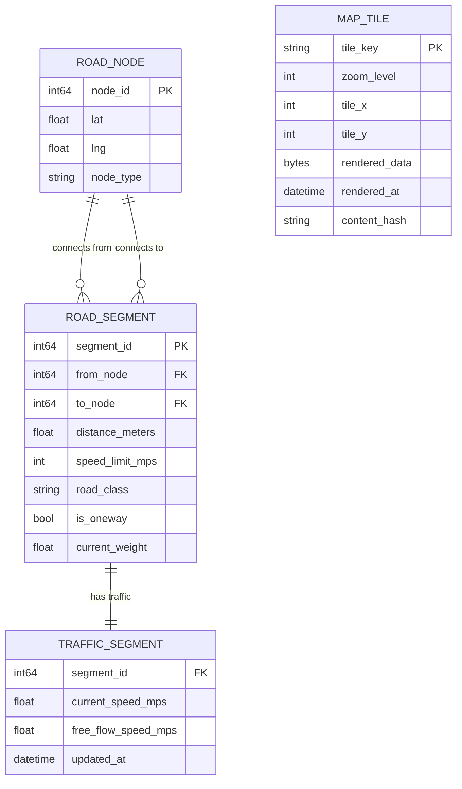
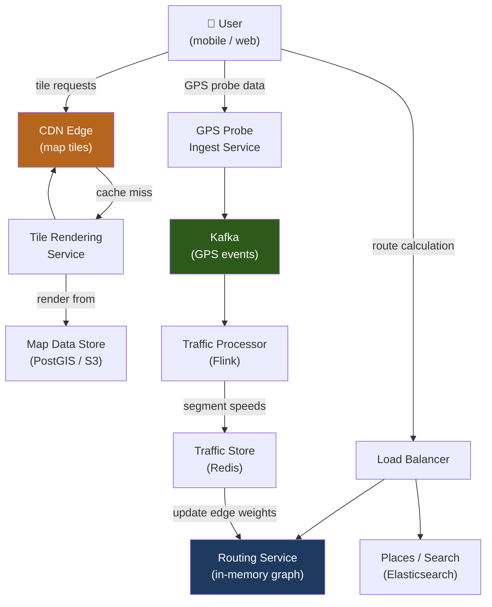
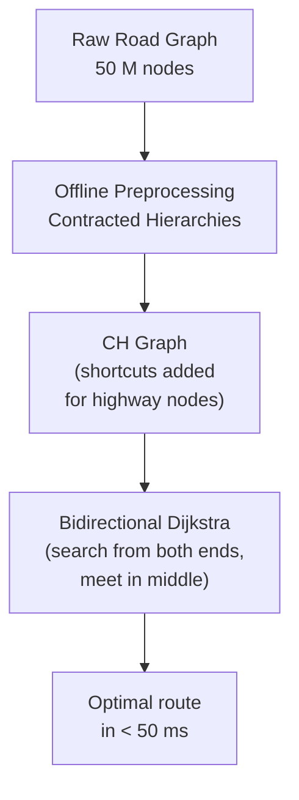
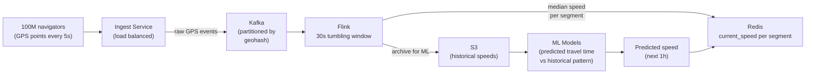

# Design Google Maps / Navigation Service

Google Maps is one of the most complex consumer applications ever built. It ingests petabytes of map data, renders billions of map tiles, calculates optimal routes in real-time, and incorporates live traffic conditions — all served to over a billion users. This problem tests graph algorithms, geospatial data structures, and distributed serving.

---

## Requirements

### Functional Requirements

1. Display a map for a given viewport (center coordinates + zoom level).
2. Calculate the shortest/fastest route between two points.
3. Show real-time traffic conditions on the route.
4. Navigate turn-by-turn with ETA updates as traffic changes.
5. *(Optional)* Search for places by name or category.
6. *(Optional)* Public transit routing (bus, subway, walking).
7. *(Optional)* Offline maps download.

### Non-Functional Requirements

- **Low latency** — route calculation in < 1 second; map tiles in < 200 ms.
- **High availability** — navigation failure during driving is a safety issue.
- **Accuracy** — routing must reflect current road conditions within minutes.
- **Scale** — 1 B monthly active users; 100 M daily route requests.

!!! note "Clarifying scope"
    Ask: *"Should I cover map rendering, routing, or both? Is real-time traffic required? Should I include place search (geocoding)?"*

---

## Capacity Estimation

| Metric | Assumption | Result |
|--------|-----------|--------|
| Route requests | 100 M/day / 86 400 s | **~1 160 route requests/sec** |
| Map tile requests | 1 B users × 50 tiles/session / 86 400 s | **~580 k tile requests/sec** |
| Tile cache hit rate | 90% cached at CDN edge | **58 k origin tile requests/sec** |
| GPS probe data | 100 M active navigators × 1 location/5 s | **~20 M GPS points/sec** |
| Road graph size | 50 M road segments, ~100 bytes each | **~5 GB graph in memory** |

!!! tip "Back-of-envelope shortcut"
    Map tiles are the dominant read workload. With > 90% CDN cache hits, the origin tile servers handle far less load than the raw QPS suggests. Pre-render and cache aggressively.

---

## API Design

```
GET /api/v1/tiles/{z}/{x}/{y}
Response 200: <binary PNG or vector tile>
(Cached at CDN with long TTL; tiles are immutable once rendered)

POST /api/v1/routes/calculate
Body:  { "origin": { "lat": 37.7749, "lng": -122.4194 }, "destination": { "lat": 37.3382, "lng": -121.8863 }, "mode": "driving", "departure_time": "now" }
Response 200:
{
  "route_id": "rt_abc",
  "distance_meters": 75400,
  "duration_secs": 3420,
  "polyline": "encoded_polyline_string",
  "steps": [{ "instruction": "Head north on Market St", "distance_m": 500 }],
  "traffic_delay_secs": 180
}

PUT /api/v1/routes/{route_id}/location
Body:  { "lat": 37.772, "lng": -122.418, "heading": 45, "speed_mps": 12 }
Response 200: { "remaining_secs": 3100, "recalculate": false }
```

---

## Data Model



**Storage choice:** Road graph as an adjacency list in memory (5 GB for the full world, fits in RAM on routing servers). Map tiles in object storage (S3), served via CDN. Traffic data in Redis (high write frequency, ~30 s TTL then refreshed).

---

## High-Level Architecture



---

## Key Design Decisions

### Road Graph Representation

The world's road network is a directed weighted graph:
- **Node:** road intersection or point of interest (~50 M nodes globally)
- **Edge:** road segment between two nodes, with travel time as weight (~100 M edges)

**Contracted Hierarchies (CH):** Computing A-to-B across a continent with Dijkstra on the raw graph takes seconds — too slow. Contracted Hierarchies pre-process the graph by "contracting" less important nodes (adding shortcuts between important nodes), reducing query time by 1000×:



Pre-processing takes hours but is done offline. Online queries use the pre-computed shortcut graph.

### Map Tiles: Raster vs. Vector

| Type | Format | Rendered by | Pros | Cons |
|------|--------|-------------|------|------|
| **Raster** | PNG / WebP | Server | Simple client, exact pixel control | Fixed size; need many zoom levels |
| **Vector** | MVT (Mapbox Vector Tile) | Client (GPU) | Smooth zoom, smaller download, dynamic styling | Client must do rendering work |

**Recommended:** Vector tiles for modern apps (Mapbox, Google Maps Web). Each tile is a compact binary blob of geometries; the client renders with WebGL, enabling smooth 60 fps pan/zoom.

### Tile Naming and Caching

Tiles use the TMS/XYZ scheme: `/{z}/{x}/{y}.mvt` — zoom level, column, row.

- Zoom 0: 1 tile covers the whole world.
- Zoom 16: 65 M tiles cover the world at street level.
- Tiles are **immutable**: once rendered from a given map data version, a tile never changes (only replaced on map data update).
- This makes CDN caching trivial: `Cache-Control: max-age=86400, immutable`.

---

## Example Interview Dialog

> **Interviewer:** How do you calculate a route across the entire US in under a second?

> **Candidate:** Raw Dijkstra on 50 million nodes would take minutes. The key is **Contracted Hierarchies (CH)** — an offline pre-processing step that adds "shortcut" edges between high-importance nodes (highways, major roads), effectively bypassing unimportant local roads during long-distance queries. At query time, bidirectional Dijkstra starts from both origin and destination simultaneously, expanding only upward in the node importance hierarchy. The two search frontiers meet in the middle, and the total number of nodes expanded drops from millions to thousands. This brings cross-country route calculation to under 50 ms. The pre-processing is done offline and updated periodically as the road graph changes.

---

> **Interviewer:** How do you incorporate real-time traffic into routes?

> **Candidate:** Traffic data comes from two sources: (1) GPS probe data — speed readings aggregated from all users currently navigating, and (2) incident reports (accidents, road closures). GPS probes are streamed to Kafka, aggregated by Flink in 30-second tumbling windows per road segment, and written to Redis as `current_speed` per segment. The routing service reads traffic-adjusted travel times from Redis when computing routes. During navigation, the client sends GPS pings every 5 seconds; if traffic on the remaining route worsens significantly (ETA changes by > 2 minutes), the server suggests a re-route. This "continuous re-evaluation" pattern means the route adapts to traffic without full re-computation from scratch — only the remaining portion is re-evaluated.

---

> **Interviewer:** How do you handle map tile rendering at scale for 580 k tile requests per second?

> **Candidate:** The key insight is that map tiles are almost entirely static — roads don't change often. With a 90% CDN cache hit rate, only ~58 k requests/sec reach the origin tile servers. For those, I'd run a pre-rendering pipeline: offline jobs render all tiles at zoom levels 0–14 (coarser zoom = fewer tiles) and upload them to S3. Zoom 15–20 (street level) tiles are rendered on-demand by tile rendering pods (stateless, auto-scalable) and cached in S3 and CDN. When the map data is updated (new road, building demolished), I invalidate affected tiles by computing which `(z, x, y)` buckets the changed geometry falls in and purging those CDN keys.

---

## Deep Dive: GPS Probe Data Pipeline



**Privacy:** GPS coordinates are anonymized before aggregation — the association between a user and their location is broken at the ingest layer. Only aggregate speeds per road segment are retained.

---

## Deep Dive: ETA Calculation

ETA is not just `distance / speed` — it incorporates:

1. **Base travel time:** road segment distance / speed limit.
2. **Traffic adjustment:** current probe-measured speed vs. free-flow speed → delay multiplier.
3. **Turn penalties:** left turns at signalized intersections add ~15 s.
4. **Time-of-day patterns:** ML model predicts speed based on historical data (e.g., rush hour patterns repeat weekly).
5. **Incident delays:** accidents and road closures add fixed penalties.

Final ETA is the sum of adjusted segment weights along the route, computed by the CH query.

---

[:octicons-arrow-left-24: Back: System Design Index](index.md)
