# Design a Hotel / Flight Booking System (e.g., Booking.com)

A booking platform lets users search available inventory and reserve a unit (hotel room or flight seat) with payment. The central challenge is preventing double-booking: inventory is finite and multiple users may attempt to reserve the last available unit simultaneously.

---

## Requirements

### Functional Requirements

1. Search for available hotels/rooms or flights by date, location, and filters.
2. Reserve a room or seat; hold inventory for a short window while the user completes payment.
3. Confirm or cancel a booking.
4. View booking history and active reservations.
5. *(Optional)* Real-time pricing changes.
6. *(Optional)* Review and rating system.

### Non-Functional Requirements

- **Consistency** — overbooking must be avoided (or handled with explicit overbooking policies).
- **High availability** — users must be able to search even if booking is briefly degraded.
- **Low latency** — search results in < 1 s; booking confirmation in < 3 s.
- **Scale** — 50 M daily searches, 500 k bookings/day.

!!! note "Clarifying scope"
    Ask: *"Should I handle the GDS (Global Distribution System) integration for flights, or assume inventory is already in our system? Is overbooking allowed (like airlines commonly do)?"*

---

## Capacity Estimation

| Metric | Assumption | Result |
|--------|-----------|--------|
| Search QPS | 50 M / 86 400 s | **~580 QPS** (with heavy caching) |
| Booking QPS | 500 k / 86 400 s | **~6 QPS** (transactional, not cached) |
| Inventory rows | 500 k hotels × 50 room types × 365 days | **~9.1 B inventory rows** |
| Booking storage | 500 k/day × 365 × 2 KB | **~365 GB/year** |

!!! tip "Back-of-envelope shortcut"
    Search is read-heavy and cache-friendly. Booking is low-QPS but requires ACID guarantees — these are solved by different subsystems.

---

## API Design

```
GET /api/v1/hotels/search?city=Paris&check_in=2025-06-01&check_out=2025-06-05&guests=2
Response 200: { "results": [{ "hotel_id": "h_123", "name": "...", "price_per_night": 180, "available_rooms": 3 }] }

POST /api/v1/bookings/reserve
Body:  { "hotel_id": "h_123", "room_type": "DOUBLE", "check_in": "2025-06-01", "check_out": "2025-06-05", "guest_id": "u_456" }
Response 200: { "reservation_id": "res_abc", "status": "HELD", "held_until": "2025-01-15T10:15:00Z", "total_price": 900 }

POST /api/v1/bookings/{reservation_id}/confirm
Body:  { "payment_method_id": "pm_xxx" }
Response 200: { "booking_id": "book_xyz", "status": "CONFIRMED" }

DELETE /api/v1/bookings/{booking_id}
Response 200: { "status": "CANCELLED", "refund_amount": 900 }
```

---

## Data Model


**Storage choice:** PostgreSQL for inventory and bookings (ACID required). Elasticsearch for full-text hotel search with faceted filters. Redis for temporary holds during the payment window.

---

## High-Level Architecture


---

## Key Design Decisions

### Preventing Double-Booking: Optimistic vs. Pessimistic Locking

```mermaid
flowchart TD
    A["Two users book the last room"] --> B{"Locking strategy"}
    B -->|"Pessimistic"| PL["SELECT FOR UPDATE\n(row-level lock)"]
    B -->|"Optimistic"| OL["Check version column\nUPDATE ... WHERE version=N"]
    B -->|"Redis lock"| RL["SET hold:{room}:{date} NX EX 600"]

    PL --> P_Pro["✅ Guarantees no conflict\n✅ Simple logic"]
    PL --> P_Con["❌ Locks held during payment\n❌ Deadlock risk under load"]
    OL --> O_Pro["✅ No long-held locks\n✅ High throughput"]
    OL --> O_Con["❌ Retry logic on conflict\n❌ Starvation under high contention"]
    RL --> R_Pro["✅ Fast, atomic hold\n✅ Auto-expires on timeout"]
    RL --> R_Con["❌ Redis is not the source of truth\n❌ Must reconcile with DB"]
```



**Recommended approach:**

1. **Hold phase (10-minute window):** Acquire a Redis lock on `hold:{room_type_id}:{date}:{slot_number}`. This is instant and doesn't touch the DB.
2. **Confirm phase:** When payment succeeds, run a DB transaction: decrement `available_count` with optimistic locking (`WHERE available_count > 0 AND version = N`).
3. If the DB update fails (race), release the hold and return a "no longer available" error.

### Overbooking Policy

Airlines routinely overbook by 5–10%, expecting no-shows. Hotels can implement the same:

- Store `available_count = total_rooms * 1.05` for overbooking buffer.
- If all rooms are actually occupied at check-in, the hotel "walks" the guest (pays for alternative accommodation).
- Flag `is_overbooked = true` on the booking for downstream handling.

---

## Example Interview Dialog

> **Interviewer:** How do you handle the case where two users try to book the last available room simultaneously?

> **Candidate:** I use a two-phase approach. During the shopping phase, users see a "hold" placed on the room — I use Redis `SETNX` to atomically grab a slot, with a 10-minute TTL. This prevents two browsers from reaching the payment screen for the same last room. At payment confirmation, I use an optimistic-lock DB update: `UPDATE inventory SET available_count = available_count - 1, version = version + 1 WHERE room_type_id = 'X' AND stay_date = '2025-06-01' AND available_count > 0 AND version = 42`. If zero rows are updated, someone else beat us to it, and we return a conflict error to the user. The hold in Redis auto-expires, returning the inventory to the pool.

---

> **Interviewer:** Search must be fast but inventory changes frequently. How do you keep search results consistent?

> **Candidate:** Search uses Elasticsearch, which is optimized for queries but has eventual consistency with the source of truth (PostgreSQL). I tolerate a small lag — Elasticsearch is updated via a CDC (Change Data Capture) pipeline from PostgreSQL every few seconds. The search results show approximate availability; the authoritative check happens when the user clicks "Book." If inventory changed between search and booking, we show a "room no longer available" message. This design keeps the read path fast (ES query < 50 ms) and doesn't require synchronous writes to two stores.

---

## Deep Dive: Inventory at Scale

For 9 billion inventory rows (500 k hotels × 50 room types × 365 days), we need efficient storage and query patterns:

**Partitioning by date:** PostgreSQL table partitioned by `stay_date` using range partitioning. Queries for a specific date range touch only the relevant partitions. Older partitions (past dates) are archived to cheap object storage.


**Denormalization for search:** Pre-compute a summary row per `(hotel_id, check_in, check_out)` for common stay lengths (1, 2, 3, 7 nights), updated nightly by a batch job. This allows `O(1)` availability queries for standard stay lengths.

---

## Deep Dive: Distributed Locking for Inventory Holds


If the user abandons the booking, the Redis hold TTL expires after 10 minutes, automatically releasing the slot without any cleanup job.

---

[:octicons-arrow-left-24: Back: System Design Index](index.md)
