# System Design

System design interviews test your ability to architect large-scale distributed systems under real-world constraints. Unlike coding interviews, there is no single correct answer — interviewers evaluate your **thought process**, your ability to **navigate trade-offs**, and how you **communicate** complex ideas clearly.

!!! tip "What interviewers actually look for"
    - Can you clarify ambiguous requirements before jumping in?
    - Do you reason about scale and bottlenecks proactively?
    - Do you make opinionated decisions and defend them?
    - Can you identify weak points in your own design?

---

## Interview Framework

Use this structured approach for every system design interview.

```mermaid
flowchart TD
    A["🎯 Clarify Requirements\n(5 min)"] --> B["📐 Capacity Estimation\n(5 min)"]
    B --> C["🔌 API Design\n(5 min)"]
    C --> D["🗄️ Data Model\n(5 min)"]
    D --> E["🏗️ High-Level Architecture\n(10 min)"]
    E --> F["🔬 Deep Dive\n(10 min)"]
    F --> G["⚠️ Bottlenecks & Trade-offs\n(5 min)"]

    style A fill:#1e3a5f,color:#fff
    style B fill:#1e3a5f,color:#fff
    style C fill:#1e3a5f,color:#fff
    style D fill:#1e3a5f,color:#fff
    style E fill:#1e5f3a,color:#fff
    style F fill:#1e5f3a,color:#fff
    style G fill:#5f3a1e,color:#fff
```

### Step-by-Step Breakdown

| Step | Duration | Goal | Key Questions |
|------|----------|------|---------------|
| **Clarify Requirements** | ~5 min | Define scope; separate functional from non-functional | Who are the users? What features are in scope? Read-heavy or write-heavy? |
| **Capacity Estimation** | ~5 min | Justify technology choices with rough numbers | How many requests/sec? How much storage per year? Bandwidth? |
| **API Design** | ~5 min | Define the contract between client and server | REST vs gRPC? What endpoints? Request/response shapes? |
| **Data Model** | ~5 min | Choose storage type; sketch schema | SQL vs NoSQL? Key access patterns? Indexes? |
| **High-Level Architecture** | ~10 min | Draw the major components and data flows | Where does load balancing sit? How do services communicate? |
| **Deep Dive** | ~10 min | Drill into the hardest part of the problem | How do you handle hotspots? How does caching work? |
| **Bottlenecks & Trade-offs** | ~5 min | Show self-awareness about design weaknesses | What breaks at 10× scale? What did you trade off for simplicity? |

---

## Designs Covered in This Section

| # | System | Core Concepts |
|---|--------|---------------|
| 1 | [URL Shortener](url-shortener.md) | Hashing, redirection, analytics, sharding |
| 2 | [Rate Limiter](rate-limiter.md) | Token bucket, sliding window, Redis, distributed counters |
| 3 | [Twitter / Social Feed](twitter-feed.md) | Fan-out, timelines, celebrity problem, ranking |
| 4 | [Web Crawler](web-crawler.md) | BFS/DFS frontier, dedup, politeness, distributed crawling |
| 5 | [Notification System](notification-system.md) | Push/SMS/email, queues, retry, idempotency |
| 6 | [Distributed Cache](distributed-cache.md) | LRU/LFU, consistent hashing, write-through, replication |
| 7 | [Message Queue](message-queue.md) | Kafka, partitions, consumer groups, exactly-once |
| 8 | Design a Search Autocomplete | Trie, top-K, prefix cache, CDN edge |
| 9 | Design Google Drive / Dropbox | Chunking, dedup, sync protocol, metadata |
| 10 | Design YouTube / Netflix | Video encoding, CDN, adaptive bitrate |
| 11 | Design a Ride-Sharing App | Geo-indexing, matching, surge pricing |
| 12 | Design a Chat System (WhatsApp) | WebSocket, presence, group messaging, E2E encryption |
| 13 | Design Instagram / Photo Sharing | Object storage, CDN, feed aggregation |
| 14 | Design a Typeahead / Search | Inverted index, fuzzy matching, ranking |
| 15 | Design a Proximity Service (Yelp) | Geohash, quadtree, range queries |
| 16 | Design a Stock Exchange | Order book, matching engine, CQRS |
| 17 | Design a Distributed Lock | Lease-based locking, Redlock, ZooKeeper |
| 18 | Design a Metrics & Monitoring System | Time-series DB, Prometheus, alerting |
| 19 | Design a Payment System | ACID transactions, idempotency keys, reconciliation |
| 20 | Design a Hotel Booking System | Inventory, double-booking prevention, transactions |
| 21 | Design a Leaderboard | Sorted sets, Redis ZSET, periodic vs real-time |
| 22 | Design an API Gateway | Auth, rate limiting, routing, circuit breaking |
| 23 | Design a Distributed File System | Replication, namenode, erasure coding |
| 24 | Design a Key-Value Store | LSM tree, compaction, WAL, consistent hashing |
| 25 | Design a Live Streaming Platform | RTMP ingest, HLS, edge PoPs, latency |

---

## Core Principles

### CAP Theorem

Every distributed system must choose two of three guarantees when a network partition occurs:

!!! note "Partition tolerance is not optional"
    In practice, network partitions **will** happen. You are really choosing between **consistency** and **availability** when a partition occurs. Most modern distributed databases are AP with tunable consistency.

---

### Scalability Patterns

| Pattern | Description | When to Use |
|---------|-------------|-------------|
| **Vertical Scaling** | Bigger machine (more CPU/RAM) | Quick wins; limited ceiling |
| **Horizontal Scaling** | More machines behind a load balancer | Stateless services, commodity hardware |
| **Database Sharding** | Partition data across multiple DB nodes by a shard key | Read/write throughput beyond a single DB |
| **Read Replicas** | Route reads to replicas, writes to primary | Read-heavy workloads |
| **Denormalization** | Duplicate data to avoid expensive JOINs | High-read NoSQL patterns |
| **Async Processing** | Queue work; process out-of-band | Tasks that don't need synchronous response |
| **CQRS** | Separate read and write models | Complex domains with different read/write patterns |

---

### Caching Strategies

| Strategy | Description | Consistency | Complexity |
|----------|-------------|-------------|------------|
| **Cache-Aside (Lazy)** | App checks cache first; on miss, loads from DB and populates cache | Eventual | Low |
| **Write-Through** | Write to cache and DB simultaneously | Strong | Medium |
| **Write-Back (Write-Behind)** | Write to cache; flush to DB asynchronously | Eventual | High |
| **Read-Through** | Cache sits in front of DB; handles misses transparently | Strong | Medium |

!!! warning "Cache invalidation is hard"
    Phil Karlton famously said: *"There are only two hard things in computer science: cache invalidation and naming things."* Always discuss your invalidation strategy — TTL-based expiry, explicit eviction, or event-driven invalidation.

---

### Load Balancing

| Algorithm | Description | Best For |
|-----------|-------------|----------|
| **Round Robin** | Requests distributed in order | Uniform request cost |
| **Least Connections** | Route to server with fewest active connections | Variable request duration |
| **IP Hash** | Hash client IP → same server | Session affinity / sticky sessions |
| **Weighted Round Robin** | Servers with higher weight get more requests | Heterogeneous server capacity |
| **Random** | Pick a random server | Stateless, uniform nodes |

---

### CDN and Edge Caching

A CDN (Content Delivery Network) caches content at **Points of Presence (PoPs)** geographically close to users.

```mermaid
flowchart LR
    User1["👤 User\n(New York)"] --> PoP1["CDN PoP\n(US-East)"]
    User2["👤 User\n(London)"] --> PoP2["CDN PoP\n(EU-West)"]
    User3["👤 User\n(Tokyo)"] --> PoP3["CDN PoP\n(AP-East)"]
    PoP1 -->|"Cache miss"| Origin["Origin Server"]
    PoP2 -->|"Cache miss"| Origin
    PoP3 -->|"Cache miss"| Origin
```

**When to mention a CDN**: static assets (JS, CSS, images), video streaming, global user base, large file downloads.

---

## How to Structure a 45-Minute Interview

!!! example "Opening the interview"
    > *"Before I start drawing, let me make sure I understand the scope. Are we designing this for a startup with 10k users or a large-scale system with 100M users? Should I focus on the core read/write path, or do you also want me to cover analytics and admin features?"*

!!! tip "Driving the conversation"
    After each section, **narrate your reasoning** before moving on:
    > *"I'm going to use a NoSQL store here because our access pattern is almost entirely key-value lookups and we don't need ACID transactions. Does that match what you had in mind, or would you like me to justify further?"*

---

[:octicons-arrow-right-24: Start: URL Shortener](url-shortener.md)
