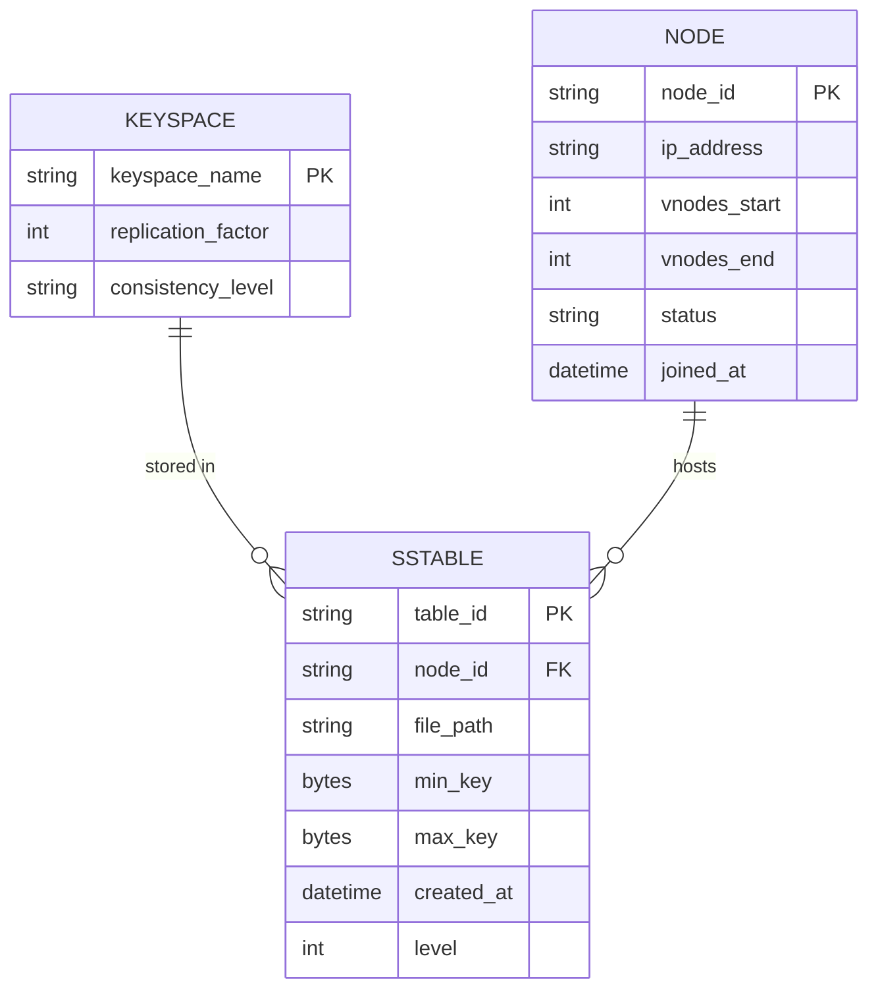
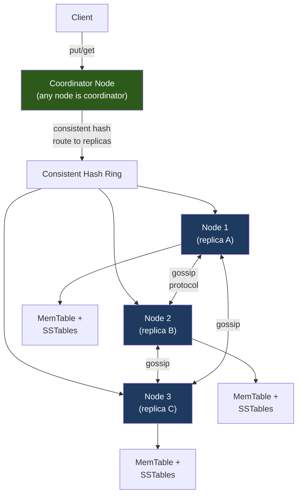
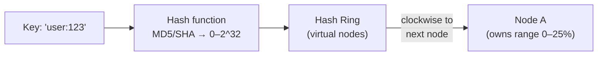
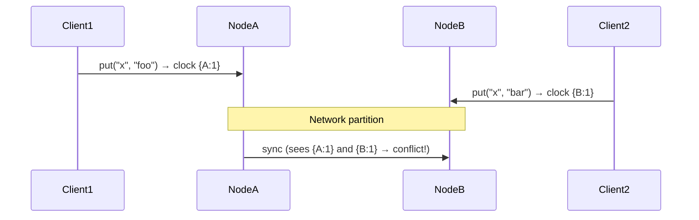
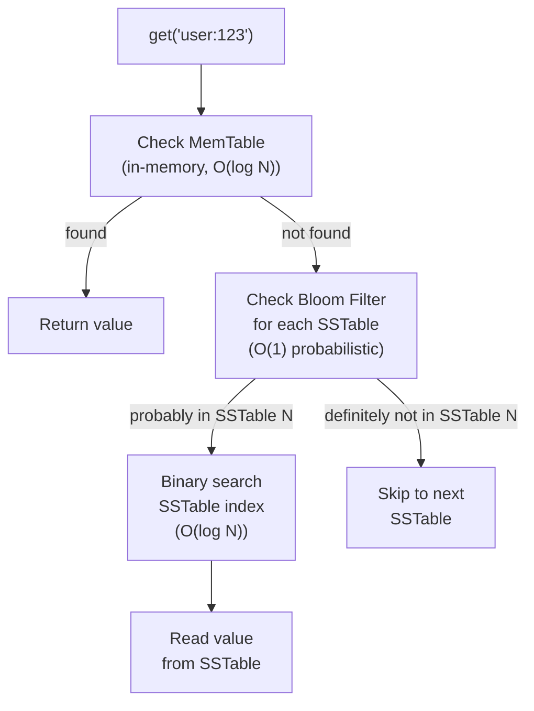

# Design a Key-Value Store (e.g., DynamoDB / Cassandra)

Designing a distributed key-value store from scratch tests your understanding of distributed systems fundamentals: consistent hashing, replication, consistency vs. availability trade-offs (CAP theorem), and compaction. This is one of the deepest system design problems and is often asked at senior/staff level.

---

## Requirements

### Functional Requirements

1. `put(key, value)` — store or update a key-value pair.
2. `get(key)` — retrieve the value for a key.
3. `delete(key)` — remove a key.
4. Keys and values are arbitrary byte arrays (max 10 MB per value).
5. *(Optional)* TTL / expiration on keys.
6. *(Optional)* Range queries on keys.

### Non-Functional Requirements

- **High availability** — continue serving reads and writes during node failures.
- **Scalability** — horizontal scale to petabytes; add nodes with minimal disruption.
- **Tunable consistency** — configurable read/write quorums (strong vs. eventual).
- **Durability** — no data loss on disk failure.
- **Low latency** — P99 < 5 ms for reads and writes.

!!! note "Clarifying scope"
    Ask: *"Is this a general-purpose KV store like Cassandra, or an in-memory cache like Redis? Do we need transactions? What consistency level — eventual or strong?"*

---

## Capacity Estimation

| Metric | Assumption | Result |
|--------|-----------|--------|
| Peak write QPS | 100 k writes/sec | — |
| Peak read QPS | 500 k reads/sec | — |
| Avg value size | 1 KB | — |
| Write throughput | 100 k × 1 KB | **~100 MB/sec per cluster** |
| Storage | 10 B keys × 1 KB avg | **~10 TB** (before replication) |
| With 3× replication | 10 TB × 3 | **~30 TB total disk** |

!!! tip "Back-of-envelope shortcut"
    With consistent hashing and N=3 replication, adding one node rebalances ~1/N of the total data — for 10 nodes, that's just 10% rebalanced, not 100%.

---

## API Design

```
# Internal binary protocol (like Thrift or Protobuf over TCP)

Put(key: bytes, value: bytes, ttl_secs: optional int) → OK | Error
Get(key: bytes) → Value(bytes) | NotFound | Error
Delete(key: bytes) → OK | Error
Scan(start_key: bytes, end_key: bytes, limit: int) → list[KeyValue]

# Client-configurable consistency per request:
Get(key, consistency=QUORUM)    # read from majority of replicas
Put(key, value, consistency=ONE) # write to one replica, replicate async
```

---

## Data Model



**Storage internals:** Data is stored using an **LSM-Tree (Log-Structured Merge-Tree)**. Writes go to an in-memory MemTable, which is periodically flushed to immutable SSTables on disk. Reads check MemTable first, then SSTables from newest to oldest. Compaction merges SSTables to reclaim space and improve read performance.

---

## High-Level Architecture



---

## Key Design Decisions

### Consistent Hashing



**Virtual nodes (vnodes):** Each physical node owns multiple non-contiguous positions on the ring (e.g., 150 vnodes per node). Benefits:
- Uniform data distribution even with heterogeneous hardware.
- Adding a node rebalances from many existing nodes simultaneously (no hotspot).
- Failed nodes' data is redistributed across all remaining nodes, not just two neighbors.

### Quorum Reads and Writes

With replication factor N and quorum W for writes, R for reads:

- **Strong consistency:** W + R > N (e.g., N=3, W=2, R=2)
- **Eventual consistency:** W=1, R=1 (fastest, but may read stale data)
- **Write-heavy:** W=1, R=3 (fast writes, slower reads)

```
N=3, W=2, R=2 guarantees at least one replica in common between any write and read quorum.
```

### Vector Clocks and Conflict Resolution

When two clients write the same key concurrently to different replicas (network partition):



Conflict strategies:
- **Last-Write-Wins (LWW):** Use physical timestamp — simple but loses concurrent updates.
- **Vector clocks:** Track causal history; surface conflicts to the application for manual resolution (DynamoDB's approach).
- **CRDTs:** Data types that merge automatically (e.g., counters, sets).

### Gossip Protocol

Nodes discover cluster membership and detect failures via gossip:
- Every second, each node selects a random peer and exchanges state (node list, heartbeat timestamps).
- A node is marked **suspect** if no heartbeat is received within T seconds.
- Failure detection converges in O(log N) gossip rounds.

---

## Example Interview Dialog

> **Interviewer:** If a write goes to only one of three replicas before the network partitions, how does the system recover?

> **Candidate:** Cassandra uses a mechanism called **hinted handoff** for short-lived failures. The coordinator stores a "hint" (the write payload) locally and replays it to the target node when it comes back online. For longer outages, **read repair** catches inconsistencies: during a quorum read, the coordinator reads from all replicas in the quorum, detects divergence by comparing vector clocks or timestamps, and asynchronously writes the most recent value back to any replica that had a stale copy. For catastrophic cases, a manual **anti-entropy repair** (Merkle tree comparison between replicas) finds and fixes all divergence.

---

> **Interviewer:** How does an LSM-tree write path work, and why is it faster than a B-tree for writes?

> **Candidate:** With an LSM-tree, every write is an in-memory operation: append to a write-ahead log (WAL) for durability, then insert into the MemTable (a sorted in-memory structure, usually a red-black tree or skip list). Once the MemTable reaches a size threshold (e.g., 128 MB), it's flushed to disk as an immutable SSTable file — a sequential write, which is the fastest possible disk I/O. B-trees require random writes to update pages in-place, which is much slower on spinning disks and causes write amplification on SSDs. The tradeoff is that reads may need to search multiple SSTable files, which compaction mitigates.

---

> **Interviewer:** What is compaction and why is it necessary?

> **Candidate:** Over time, many SSTable files accumulate. Reads must check all of them in reverse-chronological order for the most recent value (or a tombstone for deletes) — this grows slower as more SSTables pile up. Compaction merges SSTables: it reads multiple SSTables, merges their sorted key streams (like a merge sort), drops tombstoned keys, and writes a single new SSTable. This reduces read amplification (fewer files to check) and reclaims disk space. The tradeoff is write amplification — compaction re-writes data that's already on disk. LSM-tree designs tune the compaction strategy (leveled, tiered, FIFO) to balance read vs. write amplification.

---

## Deep Dive: LSM-Tree Read Path



**Bloom filters** are crucial for read performance: a per-SSTable Bloom filter answers "is this key definitely NOT in this file?" with zero false negatives (never skip a file that has the key). This avoids reading SSTables that don't contain the key.

---

## Deep Dive: Replication Strategies

| Strategy | How it works | Use case |
|----------|-------------|----------|
| **Simple** | Distribute N replicas across N nodes in the ring | Single datacenter |
| **NetworkTopology** | Place replicas across racks/DCs based on topology | Multi-datacenter HA |
| **Multi-DC active/active** | Each DC accepts writes; async replication cross-DC | Global availability |

For multi-DC replication, each datacenter maintains its own local quorum. Cross-DC replication is asynchronous to avoid write latency over intercontinental links. `LOCAL_QUORUM` consistency level satisfies quorum within a single DC, providing strong consistency locally while the remote DC is eventually consistent.

---

[:octicons-arrow-left-24: Back: System Design Index](index.md)
