# Design a Live Streaming Platform (e.g., Twitch / YouTube Live)

Live streaming requires ultra-low ingest-to-viewer latency, real-time transcoding, and delivery to potentially millions of concurrent viewers — all while handling the unpredictability of live content (sudden stream starts, variable bitrates, and unplanned ends). Unlike on-demand video, there is no pre-processing window.

---

## Requirements

### Functional Requirements

1. Streamers can broadcast live video from OBS, mobile, or a browser.
2. Viewers can watch streams with < 10 second ingest-to-viewer latency (standard) or < 2 s (low-latency mode).
3. Viewers see stream metadata: title, category, live viewer count.
4. Live chat alongside the video.
5. *(Optional)* Stream recording and VOD (video on demand) after the stream ends.
6. *(Optional)* Clips — viewers save short highlights.

### Non-Functional Requirements

- **Low latency** — standard: < 10 s; low-latency: < 2 s (e.g., for interactive streams).
- **High availability** — a streamer's broadcast must not be interrupted by infrastructure failures.
- **Scalability** — support 100 k concurrent live streams; top streams with 1 M+ concurrent viewers.
- **Reliability** — video must not freeze or buffer for viewers on the fast path.

!!! note "Clarifying scope"
    Ask: *"What latency target — broadcast delay (10 s) or interactive (< 2 s)? Is live chat in scope? Should I handle VOD recording?"*

---

## Capacity Estimation

| Metric | Assumption | Result |
|--------|-----------|--------|
| Concurrent streams | 100 k streams | — |
| Ingest bandwidth | 100 k × 6 Mbps avg | **~600 Gbps ingest** |
| Viewer bandwidth | 1 M peak viewers × 5 Mbps | **~5 Tbps CDN egress** |
| Transcoding | 100 k streams × 3 renditions | **300 k concurrent transcode jobs** |
| Storage (recordings) | 100 k streams × 4 hrs avg × 3 GB/hr | **~1.2 PB/day if all recorded** |

!!! tip "Back-of-envelope shortcut"
    5 Tbps CDN egress is enormous — this drives the need for edge caching and CDN partnerships. The cost of egress is often the largest operational expense.

---

## API Design

```
# Streamer side — standard RTMP ingest
Stream key endpoint: rtmp://ingest.example.com/live/{stream_key}
  (streamers configure this in OBS / streaming software)

# Viewer side
GET /api/v1/streams/{stream_id}
Response 200:
{
  "stream_id": "s_abc",
  "streamer": "johndoe",
  "title": "Morning coding session",
  "category": "Software",
  "viewer_count": 4820,
  "manifest_url": "https://cdn.example.com/live/s_abc/hls/master.m3u8",
  "started_at": "2025-01-15T09:00:00Z"
}

GET /api/v1/streams?category=gaming&sort=viewer_count&limit=20
Response 200: { "streams": [...] }

# WebSocket for chat:
wss://chat.example.com/streams/{stream_id}/chat
```

---

## Data Model


**Storage choice:** Stream and user metadata in PostgreSQL. Video segments in object storage (S3). Live segments also written to CDN edge nodes immediately. Chat messages in Cassandra (high write throughput, time-ordered). Viewer counts in Redis (approximate, using HyperLogLog).

---

## High-Level Architecture

```mermaid
flowchart TD
    Streamer["📡 Streamer\n(OBS / mobile)"] -->|"RTMP"| IngestEdge["Ingest Edge\n(regional ingest server)"]
    IngestEdge -->|"relay RTMP"| TranscodeCluster["Transcode Cluster\n(FFmpeg workers)"]

    TranscodeCluster -->|"HLS segments\n(2–4s each)"| SegmentStore["Object Storage\n(S3) + CDN Origin"]
    TranscodeCluster -->|"update manifest"| ManifestSvc["Manifest Service\n(live .m3u8 updater)"]

    SegmentStore --> CDNEdge["CDN Edge Nodes\n(worldwide PoPs)"]
    ManifestSvc --> CDNEdge

    Viewer["👤 Viewer"] -->|"HLS pull"| CDNEdge
    Viewer -->|"GET stream info"| API["Stream API"]
    API --> MetaDB["PostgreSQL\n(stream metadata)"]
    API --> Redis["Redis\n(viewer count,\nlive stream list)"]

    Streamer -->|"WebSocket chat"| ChatSvc["Chat Service"]
    Viewer -->|"WebSocket chat"| ChatSvc
    ChatSvc --> ChatDB["Cassandra\n(chat messages)"]

    style CDNEdge fill:#b5651d,color:#fff
    style TranscodeCluster fill:#2d5a1b,color:#fff
    style MetaDB fill:#1e3a5f,color:#fff
```



---

## Key Design Decisions

### RTMP Ingest to HLS Delivery Pipeline


**GOP alignment:** Each segment must start on a Group-of-Pictures (GOP) boundary so clients can seek and switch bitrates without decoding artifacts. Streamers should set a 2-second keyframe interval in their encoder settings.

### Latency Modes

| Mode | Segment Size | DVR Buffer | End-to-End Latency |
|------|-------------|-----------|-------------------|
| **Standard HLS** | 6–10 s | 3–5 segments | 15–30 s |
| **Low-Latency HLS (LL-HLS)** | 0.5–2 s | 2–3 segments | 2–5 s |
| **WebRTC** | Sub-frame | None | < 500 ms |

For interactive gaming and chat-reaction streams, LL-HLS (Apple's Low-Latency HLS extension) is the practical standard. WebRTC is used only for 1:1 or small-group scenarios (< 1 000 viewers).

### Viewer Count at Scale

Exact viewer counts per stream are expensive (1 M Redis increments/sec). Instead:

```
PFADD viewers:{stream_id} {user_id}     # HyperLogLog add — O(1)
PFCOUNT viewers:{stream_id}             # Cardinality estimate — ±0.81% error
```

HyperLogLog gives < 1% error with only 12 KB per stream — accurate enough for the displayed viewer count. Exact counts are computed from log analysis for analytics.

---

## Example Interview Dialog

> **Interviewer:** How do you handle a popular streamer who suddenly attracts 1 million concurrent viewers?

> **Candidate:** The CDN is the key enabler. Each CDN edge node caches the last N segments of a live stream. When a million viewers request segment `#1234`, the CDN serves it from its edge cache — the origin (S3) only needs to handle the initial fill request per PoP, not 1 M requests. Since HLS segments are immutable once written (each segment file is unique by sequence number), CDN caching is trivially correct with a short TTL. The origin only receives load proportional to the number of CDN PoPs (hundreds), not the number of viewers. The ingest → transcode → segment write path is completely decoupled from the viewer delivery path.

---

> **Interviewer:** How do you recover if the ingest server handling a popular stream goes down mid-broadcast?

> **Candidate:** I'd architect ingest with redundancy. The streamer's encoder is configured with a primary and backup ingest endpoint. RTMP allows reconnection — OBS can detect a dropped connection and reconnect within seconds. On reconnection, a different ingest server picks up the stream. The transcode cluster tracks which stream key maps to which transcode job; on reconnect, it either resumes the same job (if state is recoverable) or starts a new one, adding a brief gap to the HLS manifest that viewers see as a brief stutter. For critical streams, I'd use RTMP contribution with active-active: the encoder sends to two ingest servers simultaneously, and the transcode cluster consumes from whichever is healthier.

---

## Deep Dive: Low-Latency HLS (LL-HLS)

Standard HLS requires 3 full segments to be available before playback starts, creating 15–30 s latency. LL-HLS reduces this with partial segments:


**Blocking preload hints:** The manifest contains hints about the next partial segment. Players issue HTTP requests for the next segment before it's available; the CDN holds the connection open and responds as soon as the segment is written ("push" semantics over HTTP/2).

---

## Deep Dive: VOD Recording

Every segment written for the live stream is also archived to S3 for VOD:


This "record as you go" approach means the full VOD is immediately available the moment the stream ends, with zero additional processing time.

---

[:octicons-arrow-left-24: Back: System Design Index](index.md)
