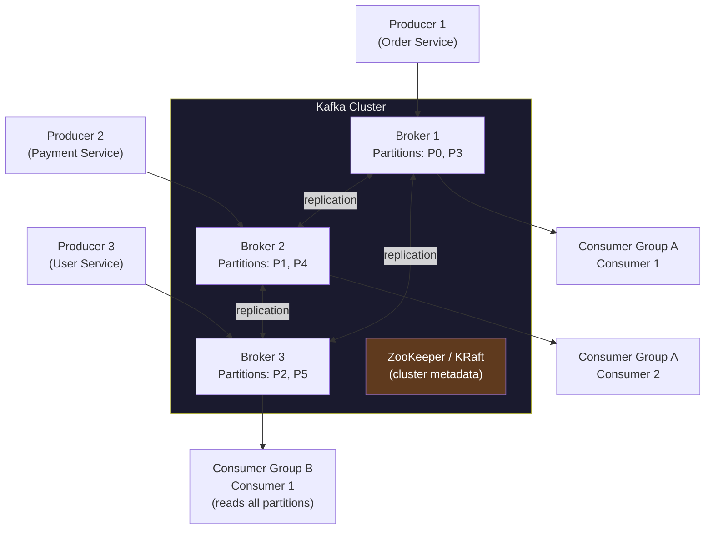
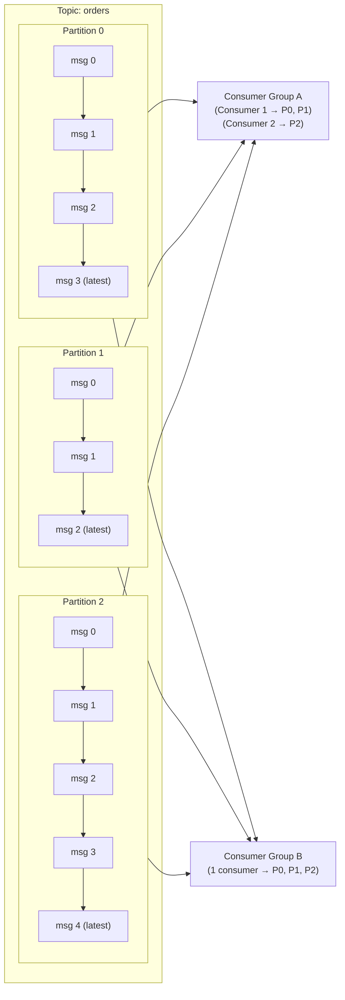
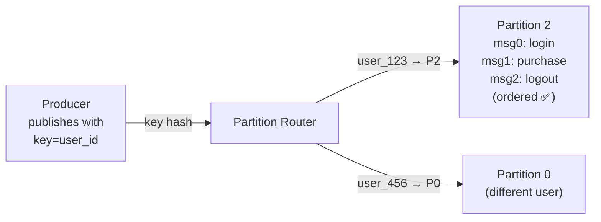
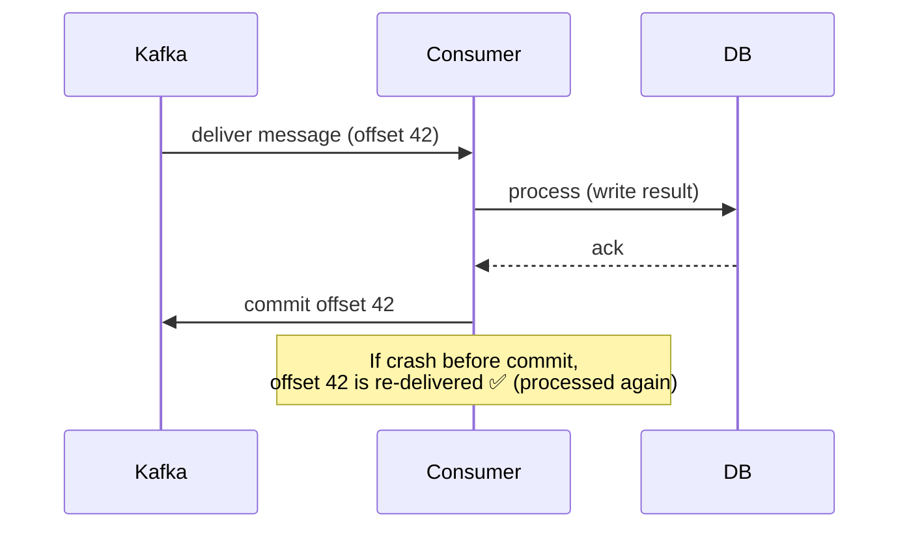
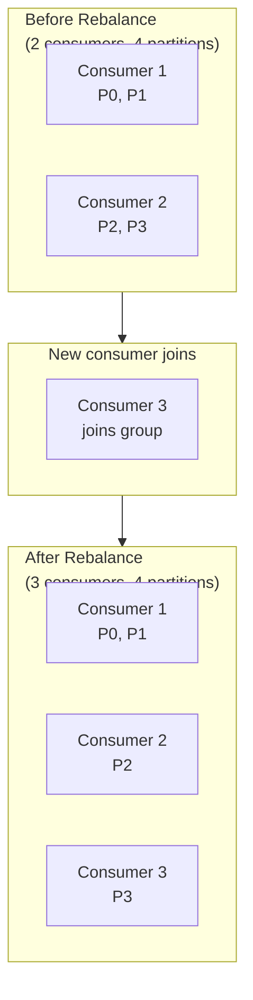
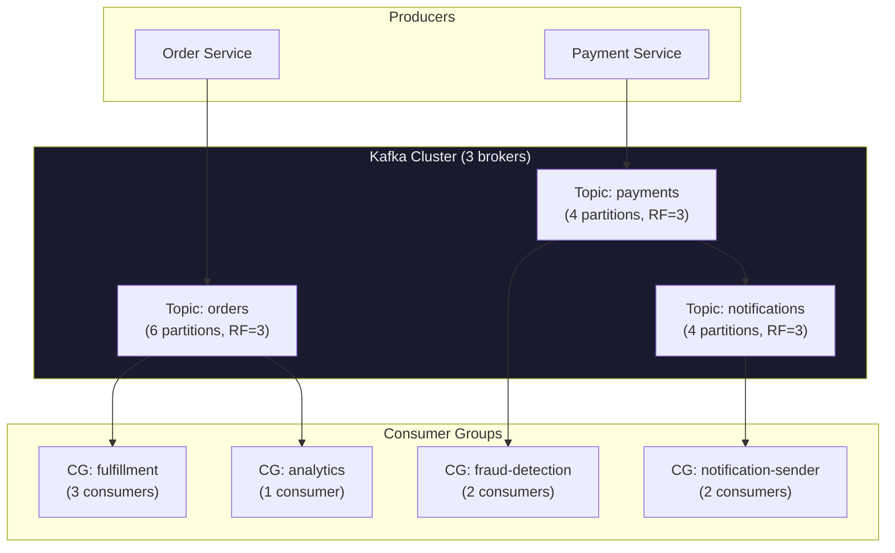
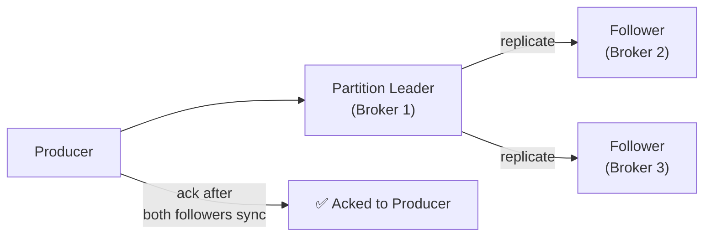

# Design a Message Queue (e.g., Kafka / RabbitMQ)

A message queue decouples producers from consumers, enabling asynchronous communication, load leveling, and fault tolerance across services. Kafka is the dominant choice for high-throughput, durable, replayable event streaming; RabbitMQ excels at low-latency task queues.

---

## Requirements

### Functional Requirements

1. Producers **publish messages** to named topics.
2. Consumers **subscribe** to topics and receive messages.
3. Messages are **persisted durably** — not lost on broker restart.
4. Support **multiple consumer groups** — each group sees all messages independently.
5. Support **replay** — consumers can re-read historical messages.
6. Messages within a partition are **ordered**.

### Non-Functional Requirements

- **Throughput:** Handle millions of messages/sec across a cluster.
- **Durability:** No data loss once a message is acknowledged by the broker.
- **Scalability:** Scale producers and consumers independently.
- **Low latency:** Publish-to-consume latency < 10 ms for hot paths.
- **Fault tolerance:** Survive broker node failures without losing data.

!!! note "Clarifying scope"
    Ask: *"Is this a task queue (each message processed by exactly one consumer) or a pub/sub log (each consumer group sees all messages)? Do you need exactly-once semantics? How long should messages be retained?"*

---

## Capacity Estimation

| Metric | Assumption | Result |
|--------|-----------|--------|
| Message rate | 1M messages/sec | — |
| Avg message size | 1 KB | **~1 GB/sec ingress** |
| Retention | 7 days | 1 GB/sec × 86 400 × 7 ≈ **~600 TB** |
| Replication factor | 3× | ~1.8 PB total storage |
| Consumer groups | 10 | Each reads full stream independently |

---

## Kafka Architecture



---

## Core Concepts

### Topics, Partitions, and Offsets



**Key properties:**

- A **topic** is a logical stream of events.
- Each topic is split into **partitions** — the unit of parallelism and ordering.
- Messages within a partition are **strictly ordered by offset** (0, 1, 2, ...).
- Messages **across partitions** have no ordering guarantee.
- **Consumer groups** allow multiple applications to consume the same topic independently.
- Each partition is assigned to exactly **one consumer** within a group.

### Partition Assignment

| Partitioning Strategy | How It Works | Use When |
|----------------------|-------------|---------|
| **Round-robin** | Messages cycled across partitions | No ordering requirement; maximize parallelism |
| **Key-based hash** | `partition = hash(key) % N` | Messages with same key must be ordered (e.g., same user's events) |
| **Custom partitioner** | Application-defined logic | Complex routing rules |

---

## Message Ordering Guarantees

!!! warning "Global ordering is expensive"
    Kafka only guarantees ordering **within a partition**. If you need all messages from user `u123` to be processed in order, use `user_id` as the partition key — all their messages land in the same partition, processed sequentially.



---

## Delivery Semantics

| Semantic | Behavior | How Achieved |
|----------|----------|-------------|
| **At-most-once** | Message may be lost; never processed twice | Consumer commits offset before processing |
| **At-least-once** | Message may be processed multiple times; never lost | Consumer commits offset after successful processing |
| **Exactly-once** | Processed exactly once, no loss, no duplicates | Kafka transactions + idempotent consumers |

### At-Least-Once Pattern (Most Common)



**Implication:** Consumers must be **idempotent** — processing the same message twice should produce the same result. Use a unique message ID stored in the DB as a deduplication key.

### Exactly-Once with Kafka Transactions

```
producer.initTransactions()
producer.beginTransaction()
  producer.send(outputTopic, record)
  consumer.commitSync(offsetsForTransaction)
producer.commitTransaction()
```

Kafka's transactional producer atomically commits the output message AND the consumer offset together. This is powerful but adds ~10–20% throughput overhead.

---

## Consumer Group Rebalancing

When consumers join or leave a group, Kafka **rebalances** partition assignments.



**Rebalance strategies:**

| Strategy | Behavior | Downtime |
|----------|----------|---------|
| **Eager (Stop-the-World)** | All consumers stop, all partitions revoked, then reassigned | Brief pause for entire group |
| **Cooperative (Incremental)** | Only affected partitions move; others continue processing | Near-zero downtime |

!!! tip "Use cooperative rebalancing"
    Since Kafka 2.4+, cooperative incremental rebalancing (set `partition.assignment.strategy=CooperativeStickyAssignor`) avoids the stop-the-world pause that can cause missed heartbeats and cascading rebalances.

---

## High-Level Architecture



---

## Replication and Durability



**Key configuration:**

| Setting | Value | Meaning |
|---------|-------|---------|
| `replication.factor` | 3 | Each partition stored on 3 brokers |
| `min.insync.replicas` | 2 | At least 2 replicas must acknowledge a write |
| `acks=all` | Producer setting | Wait for all in-sync replicas to confirm |
| `unclean.leader.election=false` | Broker setting | Never elect a lagging replica as leader (prefer availability loss over data loss) |

With `acks=all` and `min.insync.replicas=2`, Kafka guarantees **no data loss** even if one broker fails immediately after a write.

---

## Use Cases

| Use Case | Pattern | Why Kafka |
|----------|---------|-----------|
| **Event streaming** | Producers → topics → analytics consumers | High throughput, long retention, replay |
| **Microservices decoupling** | Service A emits events; Service B reacts | Services evolve independently; no direct coupling |
| **Log aggregation** | App servers → Kafka → Elasticsearch / S3 | Absorbs spikes; centralizes logs |
| **Database CDC** | DB binlog → Kafka (via Debezium) | Sync DB changes to caches, search indexes, replicas |
| **Stream processing** | Kafka + Flink / Spark Streaming | Stateful real-time computations |
| **Task queue** | Each partition = one worker | Ordered per-entity processing |

---

## Kafka vs RabbitMQ

| Dimension | Kafka | RabbitMQ |
|-----------|-------|----------|
| **Model** | Append-only log; pull-based | Message broker; push-based |
| **Throughput** | Very high (millions/sec) | High (tens of thousands/sec) |
| **Message retention** | Configurable (days/weeks) | Until consumed (or TTL) |
| **Replay** | ✅ Yes (rewind offset) | ❌ No (once consumed, gone) |
| **Ordering** | Within a partition | Within a queue |
| **Consumer model** | Pull (consumer controls pace) | Push (broker delivers to consumer) |
| **Best for** | Event streaming, analytics pipelines, CDC | Task queues, RPC, complex routing, priority queues |

---

## Example Interview Dialog

> **Interviewer:** How would you ensure messages from the same user are processed in order across multiple consumer instances?

> **Candidate:** Use the `user_id` as the **partition key** when publishing. Kafka hashes the key and routes all messages with the same key to the same partition. Since each partition is consumed by exactly one consumer in a group, all events from a given user are processed sequentially by a single consumer instance. The trade-off is that partition assignment is sticky — if one user generates 10× more events than others, that partition's consumer becomes a bottleneck. I'd monitor partition lag and potentially re-partition if a hotspot user causes imbalance.

---

> **Interviewer:** What happens to unprocessed messages if a consumer crashes mid-processing?

> **Candidate:** With at-least-once semantics, if the consumer crashes after processing but before committing the offset, the partition is reassigned during the next rebalance and the message is re-delivered to a new consumer. This means the message is **processed twice**. The consumer must be idempotent — for example, a payment processor would check whether a transaction ID already exists in the DB before applying it. To minimize re-processing, commit offsets frequently (every 100ms or every 100 messages) to reduce the replay window after a crash.

---

> **Interviewer:** How would you use Kafka as the backbone for a CQRS / event sourcing system?

> **Candidate:** In event sourcing, every state change is recorded as an immutable event. Kafka is a natural fit because it's an **append-only log with configurable retention**. The write side publishes domain events (e.g., `OrderPlaced`, `OrderShipped`) to a Kafka topic. Multiple read-side projections — each a separate consumer group — subscribe and build their own optimized read models (e.g., a SQL view for reporting, an Elasticsearch index for search, a Redis cache for the dashboard). To rebuild a projection from scratch, you replay from offset 0. Kafka's retention makes this possible without a separate event store.

---

[:octicons-arrow-left-24: Back: Distributed Cache](distributed-cache.md) · [:octicons-arrow-right-24: Back to Index](index.md)
