# Design "Nearby Friends" / Location-Based Service

A nearby friends feature shows a user which of their friends are currently within a configurable radius (e.g., 5 km). It requires continuously tracking the location of potentially millions of opted-in users, efficiently querying that location data, and surfacing results with low latency while respecting user privacy.

---

## Requirements

### Functional Requirements

1. Opted-in users share their location; the system updates it in near-real-time (every 30 seconds).
2. A user can query which friends are within a configurable radius (1–50 km).
3. Show approximate distance to each nearby friend (e.g., "~2 km away") — not precise coordinates.
4. Users can toggle location sharing on/off at any time.
5. *(Optional)* Push notification when a friend enters a user's radius.
6. *(Optional)* Location history / trails.

### Non-Functional Requirements

- **Low latency** — nearby query responds in < 200 ms.
- **Eventual consistency** — location data can be 30–60 seconds stale.
- **Privacy** — never expose a friend's exact coordinates; fuzz to ~100m precision.
- **Scale** — 100 M opted-in users, each updating every 30 seconds.

!!! note "Clarifying scope"
    Ask: *"Is this for friends only or all users within radius? Should I include location history? What privacy guarantees are required?"*

---

## Capacity Estimation

| Metric | Assumption | Result |
|--------|-----------|--------|
| Location update rate | 100 M users / 30 s interval | **~3.3 M writes/sec** |
| Location record size | 50 bytes (user_id, geohash, timestamp) | **~165 MB/sec write throughput** |
| In-memory store size | 100 M users × 50 bytes | **~5 GB** |
| Nearby query QPS | 100 M users × 2 queries/min / 60 s | **~3.3 M reads/sec** |

!!! tip "Back-of-envelope shortcut"
    3.3 M writes/sec and 3.3 M reads/sec are both high. Redis Cluster with 10 shards handles ~500 k ops/sec per shard — plan for 10–20 Redis nodes.

---

## API Design

```
PUT /api/v1/users/{user_id}/location
Body:  { "lat": 37.7749, "lng": -122.4194, "accuracy_meters": 15 }
Response 204

GET /api/v1/users/{user_id}/nearby-friends?radius_km=5
Response 200:
{
  "friends": [
    { "user_id": "u_456", "display_name": "Alice", "approx_distance_km": 1.2, "last_updated": "2025-01-15T10:00:00Z" },
    { "user_id": "u_789", "display_name": "Bob", "approx_distance_km": 3.7, "last_updated": "2025-01-15T09:59:45Z" }
  ]
}

DELETE /api/v1/users/{user_id}/location
Response 204   (opt-out — removes location from store)
```

---

## Data Model


**Storage choice:** Current locations in Redis Geo (Sorted Set backed by geohash). `USER_LOCATION` in Redis is the hot path. Friendship graph in PostgreSQL or a graph DB. Optional `LOCATION_HISTORY` in Cassandra (time-series append-only).

---

## High-Level Architecture


---

## Key Design Decisions

### Geospatial Indexing: Geohash Partitioning

Geohash encodes latitude/longitude as a string where shared prefix = geographic proximity:

| Geohash length | Cell size | Use case |
|---------------|-----------|----------|
| 4 chars | ~40 km × 20 km | City-level |
| 6 chars | ~1.2 km × 0.6 km | Neighborhood |
| 7 chars | ~150 m × 75 m | Street block |

Redis is sharded by the first 3–4 characters of the geohash, distributing users across nodes by geography. A nearby query looks in the target cell and its 8 neighbors (to handle users near cell borders).


### WebSocket vs. HTTP for Location Updates

| Transport | Trade-off | Decision |
|-----------|-----------|---------|
| **HTTP PUT** every 30s | Simple; connection overhead per update | Acceptable for 30s intervals |
| **WebSocket** persistent | Low overhead; enables server push | Better for < 5s update intervals |

At a 30-second update interval, HTTP with connection pooling is simpler and sufficient. Use WebSocket only if real-time tracking (< 5s intervals) is required.

### Privacy: Coordinate Fuzzing


1. Store exact coordinates server-side only.
2. In query responses, snap the friend's location to the nearest 100 m grid point.
3. Return only distance, not coordinates.
4. Randomize the snapping offset slightly per (viewer, target) pair to prevent triangulation attacks.

---

## Example Interview Dialog

> **Interviewer:** With 3.3 million location updates per second, how would you scale the write path?

> **Candidate:** The write path needs to be extremely lightweight — just a Redis `GEOADD` per update. I'd scale using a Redis Geo Cluster sharded by the geohash prefix (first 4 characters), giving ~16^4 = 65 k possible cells, distributed across 20–40 Redis nodes. Each node handles ~80–170 k writes/sec, well within Redis's single-node capacity of ~500 k simple ops/sec. In front of Redis I'd deploy a fleet of stateless Location Service nodes behind a load balancer — they fan out writes to the correct shard with no coordination needed.

---

> **Interviewer:** How would you handle a user who has 5 000 friends — wouldn't the nearby query be slow?

> **Candidate:** Even with 5 000 friends, the query has two steps: (1) fetch the user's friend list from PostgreSQL (~5 k user IDs), and (2) for each friend, check their current geohash in Redis. Step 2 is a Redis `MGET` operation (batch lookup by key) which is O(N) but extremely fast in Redis — 5 000 key lookups takes ~5 ms. I'd further optimize by pre-computing a set intersection: store each user's friends in a Redis Set, and use a Lua script to pipeline the geo lookups. For users with an unusually large friend count I'd cap the nearby result at 200 friends and note in the API docs that very large friend lists are paginated.

---

> **Interviewer:** How would you prevent a user from tracking another user's location over time by querying repeatedly?

> **Candidate:** Several layers of protection: First, the response only shows approximate distance, not coordinates. Second, I'd add coordinate fuzzing with a per-viewer random offset that stays constant within a session but changes daily — this prevents triangulation by repeated queries from different angles. Third, I'd rate-limit the nearby API to a reasonable number of requests per minute. Fourth, if a user turns off location sharing, their entry is immediately deleted from the Redis store, so the next query returns them as unavailable. For additional protection, the randomization offset makes it impossible to infer the target's exact path even with many observations.

---

## Deep Dive: Real-Time Proximity Notifications

When a friend enters your radius, you want a push notification. This requires an efficient proximity detection mechanism:

```mermaid
flowchart TD
    LocUpdate["Location update\nfrom user A"] --> CheckRadius["Check: is A within\nradius of any friend?"]
    CheckRadius --> FriendLoc["Fetch friend locations\nfrom Redis Geo"]
    FriendLoc --> Compare["Distance < threshold?"]
    Compare -->|"yes, new entry"| PushSvc["Push Notification\n(APNs / FCM)"]
    Compare -->|"already notified\nor no change"| Skip["Skip"]
    PushSvc --> FriendDevice["📱 Friend's Device"]
```



Track last-notified state per `(user_A, friend_B)` pair in Redis with a TTL matching the cooldown period (e.g., 1 hour) to avoid notification spam when two users are close for an extended period.

---

## Deep Dive: Scaling for Events (Concert, Stadium)

A sporting event concentrates 50 k users in 0.1 km² — a single geohash cell. This creates a hotspot on one Redis shard:

- **Cell subdivision:** For hotspot cells, switch from geohash-7 (150 m) to geohash-9 (< 5 m) sharding during the event. Detect hotspots by monitoring writes/sec per geohash prefix.
- **Read throttling:** Cap "nearby in 100 m" queries at 10/min per user during concerts.
- **Dedicated event shard:** Temporarily route all writes for a known large-event geohash to a dedicated Redis shard with extra replicas.

---

[:octicons-arrow-left-24: Back: System Design Index](index.md)
