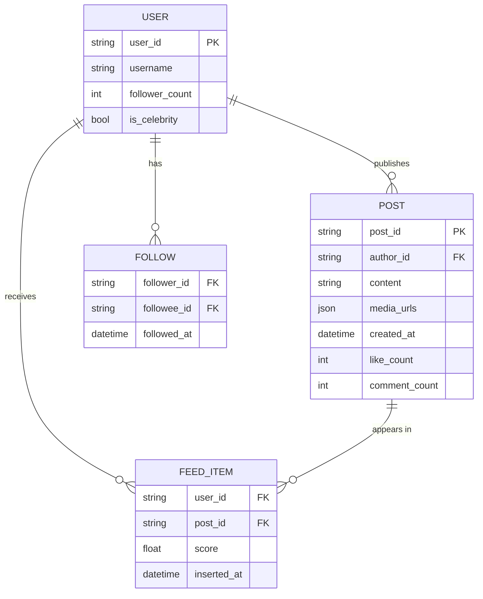
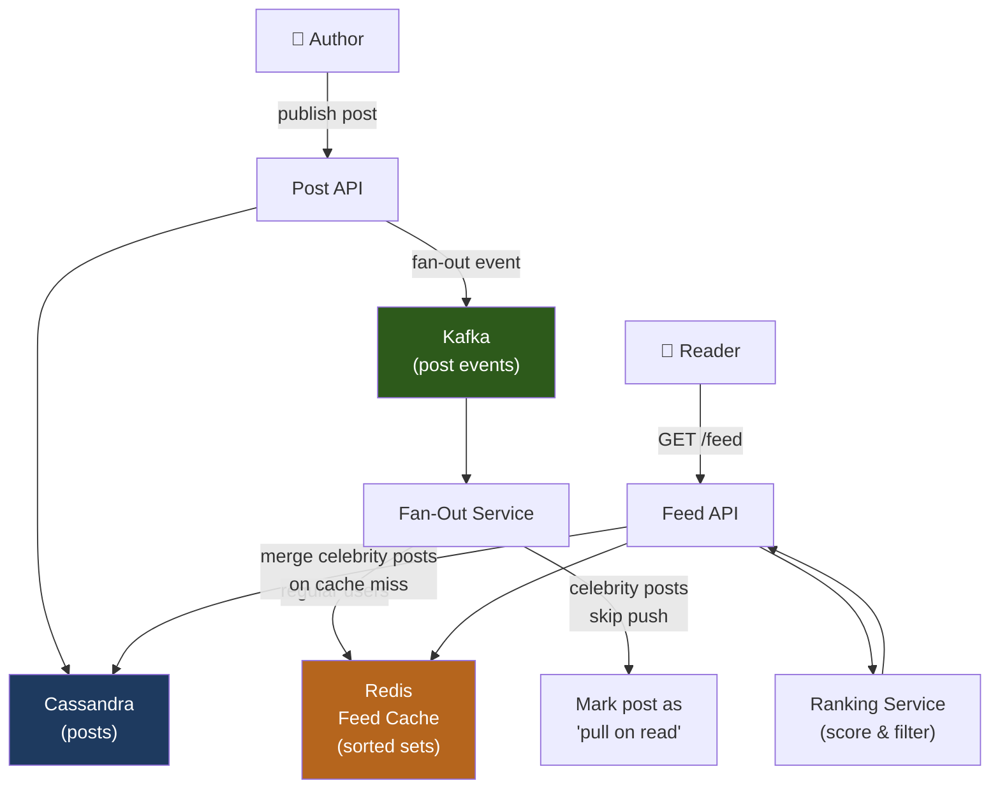
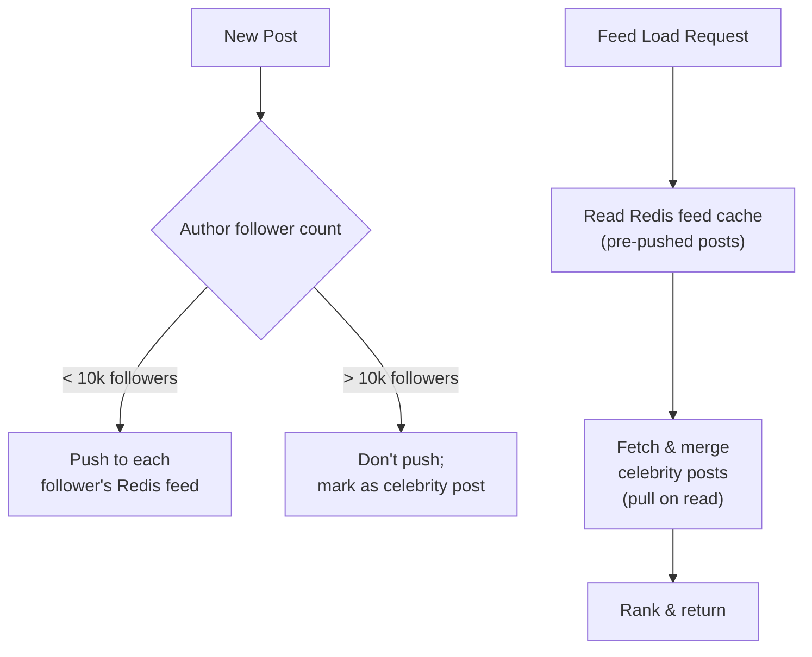
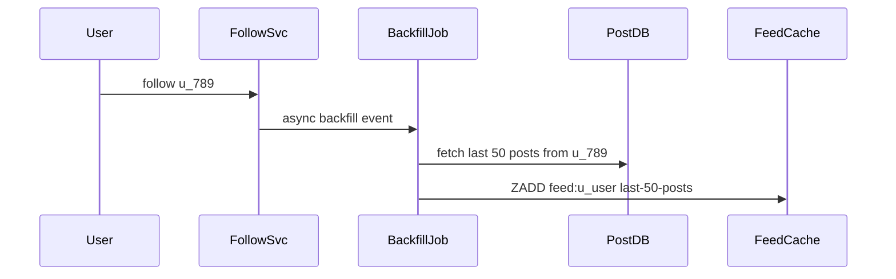

# Design a News Feed (e.g., Facebook / LinkedIn)

A news feed aggregates content from accounts a user follows, ranks it by relevance, and serves a personalized, paginated timeline. It must balance freshness, relevance, and performance for hundreds of millions of users with wildly asymmetric follower graphs (celebrities vs. regular users).

---

## Requirements

### Functional Requirements

1. Users can publish posts (text, image, link).
2. A user's feed shows recent posts from accounts they follow, ranked by relevance.
3. Feed supports infinite scroll / pagination.
4. New posts appear in followers' feeds within seconds (for online users).
5. *(Optional)* React, comment, share on posts.
6. *(Optional)* Ads interspersed with organic content.

### Non-Functional Requirements

- **Low latency** — feed load in < 500 ms.
- **Eventual consistency** — a post may take a few seconds to appear in all followers' feeds.
- **High availability** — users check feeds constantly; downtime is highly visible.
- **Scale** — 1 B daily active users; 100 M posts published per day.

!!! note "Clarifying scope"
    Ask: *"Should I focus on feed generation or also the ranking algorithm? How should I handle celebrities with 100 M followers?"*

---

## Capacity Estimation

| Metric | Assumption | Result |
|--------|-----------|--------|
| Post write QPS | 100 M posts/day / 86 400 s | **~1 160 writes/sec** |
| Feed read QPS | 1 B DAU × 10 refreshes/day / 86 400 s | **~115 700 reads/sec** |
| Avg followers per user | 500 | — |
| Feed fan-out (push) | 1 160 writes × 500 followers | **~580 k fan-out writes/sec** |
| Feed cache size | 1 B users × 20 posts × 1 KB | **~20 TB** (use hot-user subset) |

!!! tip "Back-of-envelope shortcut"
    A 100 M-follower celebrity posting creates 100 M fan-out writes — clearly infeasible to push. This motivates the hybrid push/pull model.

---

## API Design

```
POST /api/v1/posts
Body:  { "user_id": "u_123", "content": "Hello world!", "media_urls": [] }
Response 201: { "post_id": "p_abc", "created_at": "..." }

GET /api/v1/feed?user_id=u_456&limit=20&cursor=p_last_seen
Response 200:
{
  "posts": [
    { "post_id": "p_xyz", "author_id": "u_789", "content": "...", "score": 0.95, "created_at": "..." }
  ],
  "next_cursor": "p_prev_post_id"
}

POST /api/v1/posts/{post_id}/reactions
Body: { "user_id": "u_456", "reaction_type": "LIKE" }
Response 200: { "reaction_count": 42 }
```

---

## Data Model



**Storage choice:** Posts and user data in Cassandra (high write throughput, time-ordered access). Pre-computed feed lists in Redis sorted sets (`ZADD feed:{user_id} score post_id`). Follow graph in a graph database or a simple relational table.

---

## High-Level Architecture



---

## Key Design Decisions

### Push vs. Pull vs. Hybrid Fan-out

| Model | How it works | Best for |
|-------|-------------|----------|
| **Push (fan-out on write)** | On post, write to each follower's feed cache | Users with < 10 k followers |
| **Pull (fan-out on read)** | On feed load, query all followees' posts | Celebrities with millions of followers |
| **Hybrid** | Push for regular users, pull for celebrities | Production standard |



### Feed Ranking

A simplified EdgeRank-inspired scoring formula:

```
score = affinity × weight × time_decay

affinity  = interaction history between viewer and author
            (comments/likes/DMs boost this score)
weight    = post type weight (video > image > link > text)
time_decay = e^(-λ × age_in_hours)   where λ controls decay speed
```

Scores are re-computed when the feed is loaded, not pre-stored, to keep them fresh.

### Pagination

Use **cursor-based pagination** (not offset):

- Cursor = `post_id` of the last seen item (encoded as opaque token).
- `ZRANGEBYSCORE feed:{user_id} -inf (cursor LIMIT 0 20` in Redis sorted set.
- Offset pagination (`LIMIT 20 OFFSET 100`) breaks when new items are inserted at the top of the feed between page loads.

---

## Example Interview Dialog

> **Interviewer:** How do you handle a celebrity like Taylor Swift posting to 100 million followers?

> **Candidate:** I use a hybrid model. For regular users (< 10 k followers), I push the post to each follower's Redis feed sorted set immediately — 10 k writes is fine. For celebrity accounts, I skip the push entirely. Instead, when any follower loads their feed, the Feed API also queries the last N posts from each celebrity they follow (a small "pull" step), merges them with the pre-pushed regular-user posts, and runs the ranking function. The tradeoff is slightly higher feed load latency for users following many celebrities, but this is far better than trying to fan out to 100 M Redis writes per celebrity post.

---

> **Interviewer:** How do you ensure a user always sees their own post in their feed immediately after publishing?

> **Candidate:** After a user publishes a post, we write it directly to their own feed cache synchronously (before the async fan-out starts). This is a single Redis write and takes < 1 ms. For all followers, the fan-out is async and may take a few seconds, which is acceptable. This solves the "I can't see my own post" experience without requiring the async fan-out to complete before returning a 201 to the author.

---

> **Interviewer:** How would you add ad serving to the feed?

> **Candidate:** Ads are interspersed at fixed positions — say, every 5th post — without occupying a slot in the organic ranked list. The Feed API calls an Ad Service with the user's ID and targeting signals, gets back 2–3 candidate ads, inserts them at positions 5 and 10, and returns the combined list. The Ad Service runs its own auction and ranking independently of organic content. This keeps the organic feed ranking decoupled from ad logic.

---

## Deep Dive: Redis Sorted Set Feed Structure

```
Key:   feed:{user_id}
Type:  Sorted Set
Score: unix_timestamp (or composite relevance score)
Value: post_id
```

Operations:
- **Fan-out:** `ZADD feed:u_456 1700000000 p_abc` — O(log N)
- **Trim:** `ZREMRANGEBYRANK feed:u_456 0 -1001` — keep only top 1000 posts
- **Read:** `ZREVRANGE feed:u_456 0 19 WITHSCORES` — top 20 posts

Feed lists are capped at 1 000 entries. Older posts beyond the cap are fetched from Cassandra on deep pagination.

---

## Deep Dive: Feed Backfill on First Follow

When a user follows a new account, their feed should retroactively include some recent posts from that account:



Backfill is asynchronous and runs within seconds. The user sees the new account's posts on their next feed refresh.

---

[:octicons-arrow-left-24: Back: System Design Index](index.md)
