# Design a Notification System

A notification system delivers messages to users across multiple channels — push notifications, SMS, email, and in-app alerts. It's a critical infrastructure service at every consumer app, and a popular interview topic at companies like Meta, Airbnb, and LinkedIn.

---

## Requirements

### Functional Requirements

1. Support multiple notification channels: **push** (iOS/Android), **SMS**, **email**, **in-app**.
2. Send notifications triggered by system events (e.g., new message, payment confirmation, friend request).
3. Respect user **notification preferences** (opt-out of certain channels or categories).
4. Support **scheduled notifications** (e.g., send at 9 AM in the user's timezone).
5. Provide a **delivery status** API (sent, delivered, failed).

### Non-Functional Requirements

- **Scale:** 10M notifications/day across all channels.
- **Low latency:** Push notifications delivered in < 1 second for time-sensitive events.
- **Reliability:** At-least-once delivery — it's better to receive a duplicate than to miss a notification.
- **Fault tolerance:** Provider outages (e.g., APNs down) must not block other channels.
- **Observability:** Track delivery success rates per channel and provider.

!!! note "Clarifying scope"
    Ask: *"Is this a platform service used by internal product teams, or a third-party service like SendGrid? Should I include in-app notification storage and read/unread tracking?"*

---

## Capacity Estimation

| Channel | Volume/day | Peak QPS | Notes |
|---------|-----------|---------|-------|
| Push (iOS + Android) | 6M | ~280/sec | Batch-friendly |
| Email | 2M | ~100/sec | Async, higher latency OK |
| SMS | 1M | ~50/sec | Most expensive per message |
| In-app | 1M | ~50/sec | Stored server-side |
| **Total** | **10M** | **~480/sec** | — |

---

## Architecture

### Overview


---

### Channel-Specific Architecture

Each channel has different latency requirements, cost profiles, and reliability characteristics:

| Channel | Provider | Latency SLA | Cost | Dedup Key |
|---------|----------|-------------|------|-----------|
| Push (iOS) | Apple APNs | < 1s | Free | `apns-id` header |
| Push (Android) | Google FCM | < 1s | Free | `message_id` |
| Email | SendGrid / Amazon SES | 1–5 min | ~$0.0001/email | `Message-ID` header |
| SMS | Twilio / Vonage | 5–30 sec | ~$0.01/SMS | Provider message SID |
| In-App | Internal Cassandra | < 100 ms | Free | `notification_id` |

---

## Notification Data Model


---

## User Preference Management

Before dispatching any notification, check user preferences:

```mermaid
flowchart TD
    N["Notification Request\n(user_id, channel, category)"] --> P1{"User opted out\nof channel?"}
    P1 -->|"Yes"| Drop["🗑️ Drop notification"]
    P1 -->|"No"| P2{"User opted out\nof category?"}
    P2 -->|"Yes"| Drop
    P2 -->|"No"| P3{"Quiet hours\nnow active?"}
    P3 -->|"Yes"| Schedule["📅 Schedule for\nafter quiet hours"]
    P3 -->|"No"| Send["✅ Enqueue for delivery"]
```



!!! tip "Cache preferences in Redis"
    Preference lookups happen on every notification. Cache user preferences in Redis with a short TTL (5 min). Use event-driven invalidation — when a user updates preferences, publish a cache-invalidation event.

---

## Retry Logic and Idempotency

### Retry Strategy

Provider calls will fail transiently. Use **exponential backoff with jitter**:

```
Attempt 1: immediate
Attempt 2: 30s
Attempt 3: 5 min
Attempt 4: 30 min
Attempt 5: 2 hours
After 5 failures: mark as FAILED, alert on-call
```

### Idempotency

Retries can cause duplicate deliveries. Prevent this with idempotency keys:

- Each notification has a stable `notification_id` (UUID generated at creation).
- Workers pass this as the provider idempotency key (e.g., FCM `message_id`).
- Before sending, check a **sent-log** (Redis SET or Cassandra row) for the `notification_id`. If already sent, skip.
- The sent-log entry has a TTL of 24 hours.

```mermaid
flowchart LR
    Worker["Worker\npops from queue"] -->|"check"| SentLog["Sent Log\n(Redis SET)"]
    SentLog -->|"already sent"| Ack["✅ Ack message\n(skip delivery)"]
    SentLog -->|"not sent"| Send["Send via Provider"]
    Send -->|"success"| Mark["Mark sent in log\n(TTL 24h)"]
    Mark --> Ack
    Send -->|"failure"| Retry["Retry with backoff"]
```



---

## At-Least-Once vs Exactly-Once Delivery

| Guarantee | Description | Implementation | Use Case |
|-----------|-------------|---------------|----------|
| **At-most-once** | May miss notifications | Fire-and-forget, no retry | Marketing emails where duplication is worse than loss |
| **At-least-once** | May duplicate | Retry on failure + consumer idempotency | **Most notification channels** |
| **Exactly-once** | No loss, no duplicate | Distributed transactions / 2PC | Financial alerts (very expensive to implement) |

!!! warning "Exactly-once across system boundaries is near-impossible"
    Achieving exactly-once delivery requires the provider (APNs, Twilio) to also support idempotency. In practice, systems target **at-least-once** with **idempotent consumers** — this provides effectively-once delivery from the user's perspective.

---

## Handling Provider Outages

When a provider is down, isolate its failure from other channels:


- **Circuit breaker per provider:** If failure rate > 50% in 1 minute, open the circuit — stop sending, accumulate in Dead Letter Queue (DLQ).
- **DLQ processing:** Replay DLQ messages when circuit closes (provider recovers).
- **Fallback channel:** For critical notifications (e.g., 2FA codes), fall back from push → SMS if push is unavailable.

---

## Example Interview Dialog

> **Interviewer:** How do you handle a user changing their push notification token when they reinstall the app?

> **Candidate:** Each time the app starts, it registers its current push token with our device token service. The device token is stored keyed by `(user_id, device_id)`. When a user reinstalls, the OS issues a new push token. The app re-registers, overwriting the old token. If we attempt to send to a stale token, APNs returns a `BadDeviceToken` error — we handle that in the push worker by deleting the invalid token from our store and marking the notification as undeliverable.

---

> **Interviewer:** How would you support scheduling notifications to send at 9 AM in the user's local timezone?

> **Candidate:** I'd store the scheduled notifications in a **scheduling database** (Cassandra or DynamoDB with a scheduled_at index). A scheduler service polls for notifications due in the next 5 minutes, converts the scheduled time to UTC using the user's stored timezone, and enqueues them with a delay. For scale, I'd partition the scheduler by time bucket — each worker owns a range of scheduled times — so the lookup is a targeted time-range scan rather than a full table scan. For the delivery window, I'd also check quiet hours at dispatch time, not just at creation, since the user's preferences could have changed.

---

> **Interviewer:** A notification is delivered twice to a user. How do you debug this?

> **Candidate:** First, I'd check whether the duplication is at the **queue level** (message consumed twice) or **provider level** (two sends to APNs/FCM). I'd look at the sent-log — if the `notification_id` appears once, the duplication is from the provider or the downstream app. If it appears twice, the idempotency check failed, which likely means a race condition in the worker — two instances both checked the sent-log before either had written to it. The fix is to use a **Redis SET NX** (set if not exists) operation atomically as the idempotency gate, so only one worker proceeds.

---

[:octicons-arrow-left-24: Back: Web Crawler](web-crawler.md) · [:octicons-arrow-right-24: Next: Distributed Cache](distributed-cache.md)
